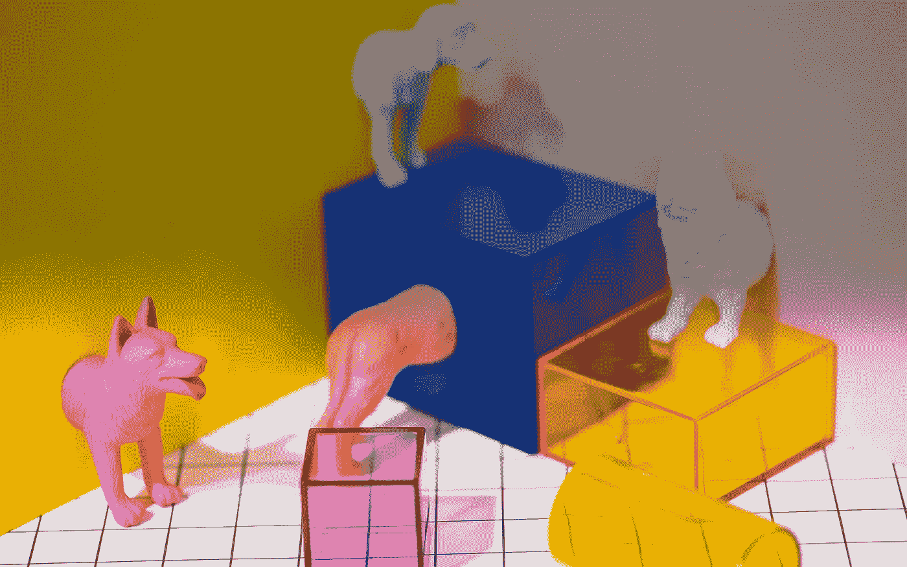

# 我们的非人类同事——为人工智能和机器人设计

> 原文：<https://medium.datadriveninvestor.com/our-non-human-colleagues-designing-for-ai-and-cobots-b91be0d2dfff?source=collection_archive---------11----------------------->

当我还是个孩子的时候，我是艾玛的超级粉丝。她是一个凶猛、有趣、热爱冒险的朋友……她是一辆蒸汽机车。

虽然艾玛只是儿童读物《T1》中的一个虚构道具，但成年人也很容易将友好的个性投射到《T2》中的动物身上。你没见过水龙头里的脸吗？另一方面，机器有时也会令人生畏:波士顿动力公司的机器人 [Atlas](https://www.youtube.com/watch?v=LikxFZZO2sk) 会跑、会跳，还会后空翻。而且他并不局限于某个封闭的工厂，而是打算和我们人类打成一片！

据《福布斯》杂志报道，协作机器人(简称 cobots)是“最新一代的机器人系统，它们旨在与人类并肩工作。”在艾玛和阿特拉斯之间，有一个从乌托邦到反乌托邦的大范围的可能的未来。正是这种紧张感让 cobots 对设计师来说如此有趣。

 [## 对话式营销是文字数据驱动的投资者

### 在购买之前，先谈一谈。这样做的营销人员将走在游戏的前面。这是保罗·因斯的前提…

www.datadriveninvestor.com](https://www.datadriveninvestor.com/2019/01/31/conversational-marketing-is-the-word/) 

这些年来，我有幸研究了一些机器人的个性。接下来，我想分享帮助我更好地设计机器人的五个原则。仍然很少有成功的机器人。因此，为了说明这些设计原则，我们需要把我们的网撒得更宽一点(从无人机到虚拟助手，从游戏角色到伴侣动物)。

所以，我们遵循原则 1！

# 不要只是看起来可爱，要可爱！

*让 cobot 感觉温柔或柔弱，给用户一种优越感。*

首先，你的机器人不应该看起来有威胁。例如，一辆汽车是一大块快速移动的金属。如果它们能独立行动，那就更可怕了。(我猜这就是为什么斯蒂芬·金写了关于一辆杀人车的“ [C 克里斯汀](https://www.goodreads.com/book/show/10629.Christine)”。)难怪谷歌将他们早期的无人驾驶汽车 Waymo 设计得如此贫穷。事实上，它是如此丑陋、简单和无害，以至于看起来根本不像一辆汽车。对了，宠物不是有“丑-可爱”这个词吗？

但是外表并不代表一切；这也是关于你的 cobot 的行为。当 Anki 发布一款古怪的小型机器人玩具 Cosmo 时，他们确保将它漆成非常亮的白色。大概是在 Cosmo 取得巨大成功之后，他们才敢让它的继任者 [Vector](https://www.anki.com/en-us/vector) 成为一个不那么友好的黑人。此外，温和的动作造就温和的性格。Frank Emika 设计的[熊猫](https://www.youtube.com/watch?v=DK74-otUKZM)是一个对触摸反应非常柔和的机器人手臂，保护它的同事……但也给人以体贴和仁慈的印象。

说到行为，最大的问题仍然是“谁是老板”？用户可以通过对 cobot 的物理控制来获得一种权力感。当 cobot 小到足以携带时，这很容易。但这也延伸到了亚马逊 Echo 的[相机盖](https://www.amazon.com/Amazon-Echo-Spot-Webcam-Cover/dp/B07C29GJPW):当你可以手动覆盖任何软件时，你绝对是主宰。(吃这个，[《监视芭比》](https://www.independent.co.uk/news/business/news/mattels-wifi-barbie-could-be-used-to-spy-on-children-10115724.html)！)

但是除了可爱的外表——你的机器人最好注意它的核心产品……进入原则 2。

# 坚持你的主场！

*使 cobot 成为功能清晰的服务生态系统的一部分，满足用户的基本需求。*

当 [Jibo](https://www.jibo.com) 出来的时候我非常激动。这是我家的一个可爱的、设计精美的机器人，几乎可以做任何事情。但是几年后，它的制造商倒闭了。很明显，Jibo 承诺的太多，实现的太少。根据 Gartner 的炒作周期(T13)，"智能机器人"离生产力还有 5 到 10 年的时间。但即使在今天，如果你明智地选择战斗，也有很大的机会。

Qoobo 的价格只是 Jibo 的一小部分；这并不奇怪，因为这是一个能摆动电动尾巴的枕头。(你没听错。)显然，用户发现把一只半睡半醒的“宠物”抱在腿上很放松，不用去遛它，也不用收拾它的烂摊子。这很小众，但也很实惠，很成功。

你的 cobot 可能会提供比福祉更硬的功能价值，就像 NIO 的 [Nomi](http://www.autodevot.com/2018/07/nio-starts-delivering-es8-electric-suvs-nomi-ai/) 。Nomi 是一个小型机器人，位于汽车的仪表板上，帮助和鼓励司机。生活在 NIO 的车内使 Nomi 成为无可争议的 it 数字大师，没有竞争对手可以进入。同样，亚马逊的 [Alexa](https://www.wired.com/story/amazon-alexa-search-for-the-one-perfect-answer/) 仅仅是购物和娱乐服务的冰山一角。

很容易被这么多功能冲昏头脑。但是你的机器人最好保持谦逊……这就引出了第三条原则。

# 展示它只是一台机器！

*让技术显而易见，这样用户可以很容易地进出错觉。*

你听说过恐怖谷吗？这是一个令人不快的灰色地带，在那里你无法判断某样东西是否是人类，多年来，它一直是许多恐怖小丑或邪恶科幻机器人的家园。你的 cobot 应该比库卡的 iDo 概念绕那个地方弯得更宽。虽然它显然是一台机器，但它的比例和体格却出奇地像人类。

你也可以考虑透露一些你的 cobot 的内部工作方式。你的机器人的魅力和可信度不会受到影响，正如 Raven R 所展示的。本质上是百度用优美的肢体语言回复亚马逊 Echo。还有你没和迪士尼的 [W ALL-E](https://www.imdb.com/title/tt0910970/videoplayer/vi2192703769) 联系过吗？即使他只是一堆垃圾？最后，如果你对你的 cobot 内部透明，没有人可以声称它只是一个乔装打扮的演员，就像这个[所谓的俄罗斯工程壮举](https://www.theguardian.com/world/2018/dec/12/high-tech-robot-at-russia-forum-turns-out-to-be-man-in-robot-suit?CMP=Share_AndroidApp_Skype)。

还要想想用户会怎么跟你的 cobot 说话。例如，当许多父母听到他们的孩子对 Alexa 颐指气使时，他们很担心。这促使亚马逊发布了一种"[礼貌模式](https://www.technologyreview.com/the-download/611019/please-alexa-amazons-new-parental-controls-will-encourage-politeness/)"，这种模式只有在基本的友好行为得到遵守的情况下才有效。另一种避免污染人际交流的方法是发明一种初级语言。例如，一个传统的德国木工可能会用诸如 *hott* 或 *wüst* 之类的幻想词来指挥他们的[工作马](https://www.youtube.com/watch?v=7jd8od3Gu-s)，而不是 *rechts* 或*链接*。

所以你的机器人可能是一台机器，但这并不意味着它没有可信的个性……这就是原则 4 的全部。

# 呆在角色里！

*为所有情况寻找隐喻，这样用户可以对 cobot 有一个连贯的心理印象。*

不管怎样，你的机器人不会完美。为什么要假装不是呢？谷歌助手用幽默来回避缺点:当你让它打扫你的房间时，它可能会回答“让我试试……发生什么事了吗？对不起，我想我不能。”另一个限制可能是你的设备的能量水平: [P aro](https://www.kalw.org/post/robotic-seals-comfort-dementia-patients-raise-ethical-concerns#stream/0) 是一种机器人海豹，痴呆症患者可以抚摸和拥抱它来放松。当它的电池耗尽时，它通过嘴里的奶嘴充电，增加了它可爱的外表。

对你生命幻觉的另一个挑战可能是当你的机器人被重新编程时。(还记得《西部世界》里那个令人毛骨悚然的“[翻出你的脸颊](https://www.facebook.com/watch/?v=1778484609087591)”命令吗？)避免这种情况的一个方法是使用物理性作为输入。Sawyer 是最近重新启动的 Rethink Robotics 公司的[工业机器人手臂。当 Sawyer 被校准用于运动任务时，用户只需将它的手臂移动到任何需要的地方。谁需要电脑呢？](https://www.therobotreport.com/hahn-group-acquires-rethink-robotics-ip/)

尽管如此，你的 cobot 由软件和硬件组成，可以做我们不能做的事情:离开它的身体。所以问问你自己，当你的 cobot 迁移到屏幕上时，它的“精神”会是什么样子。Siri 看起来总是很像 Siri——无论是在你的手机上、手表上还是在 Home Pod 上。虽然她的非机械表现形式存在(尽管宝马的[重型动态雕塑](https://www.youtube.com/watch?v=6ZFHAZAkL2E)可能就在附近)，但我迫不及待地想看到她漂浮在虚拟空间或 AR 中，成为一个有意识的薄雾。

一旦你有了一个可识别的角色，是时候去摘星了…所以，最后但同样重要的是，第五条原则来了。

# 培养情感纽带！

*让用户与 cobot 建立长期关系，这样他们对它更满意。*

Robokind 帮助被诊断患有自闭症的儿童提高他们的人际交流技能。有些人可能会把这个 cobot 的面部设计放在恐怖谷(见上文)，甚至会发现它与杀手娃娃 Chucky 有相似之处。但是无论发生什么，Robokind 都保持乐观(并且非常成功)。人们不也是因为这种无条件的关注才喜欢他们的狗吗？

E.T .是外星人，不是机器，但我就是喜欢他非常情绪化时他的心发光的样子。这也是(现已倒闭的) [Kuri](https://www.heykuri.com) 的制造商在他半透明的胸部植入 LED 时一定会想到的。这创造了一种脆弱和亲密的效果，可以保留给特别的时刻。相比之下，当用户告诉 Siri、Alexa 或谷歌助手“我爱你”时，他们都不愿回答“我也爱你”。看来机器的爱最好不要用语言来表达。

尽管如此，我们对虚拟角色的热爱可以走得很远。索尼在 2006 年停止生产第一只艾博机器狗。所以当它坏掉的时候，它的主人不得不永远说再见。这催生了东京附近的专用机器人墓地。如果你认为这是远东独有的现象，请通读这位游戏玩家在他的虚拟马被杀时的[失落感](https://www.keengamer.com/article/20464_red-dead-redemption-2-makes-you-love-your-horse)。但是哪里有葬礼，哪里就有婚礼:早在 2009 年，一名游戏玩家与虚拟约会游戏 [L oveplus](http://edition.cnn.com/2009/WORLD/asiapcf/12/16/japan.virtual.wedding/index.html) 中的一个角色“结婚”，随后还有更多类似的仪式。考虑为一段关系的整个生命周期准备好你的 cobot。

所以，这就是我的五个原则。正如我在开始所说的，他们依赖于不同的例子。但是如果你有机会设计你自己的机器人，我鼓励你去寻找更牵强的灵感。正是这些古怪的刺激和隐喻将帮助我们探索这个令人兴奋的新领域。

最后，机器人可能会在很多方面对人类不利。但是我怀疑如果我们友好地对待 cobots，我们就注定要失败。事实上，今天我们把我们环境的许多部分当作没有灵魂的物体——动物、生态系统，甚至其他人类……相反，如果我们能在我们周围的一切中找到一些相关的东西，不是更健康吗？

我也这么认为我想友好的蒸汽机车艾玛也是。