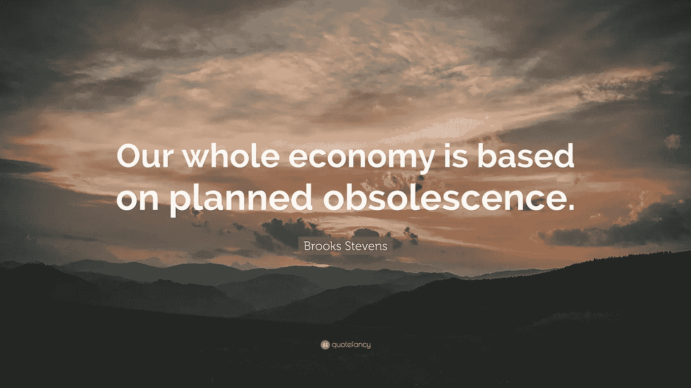
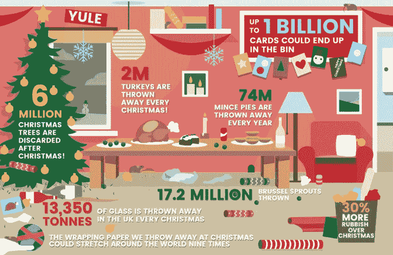
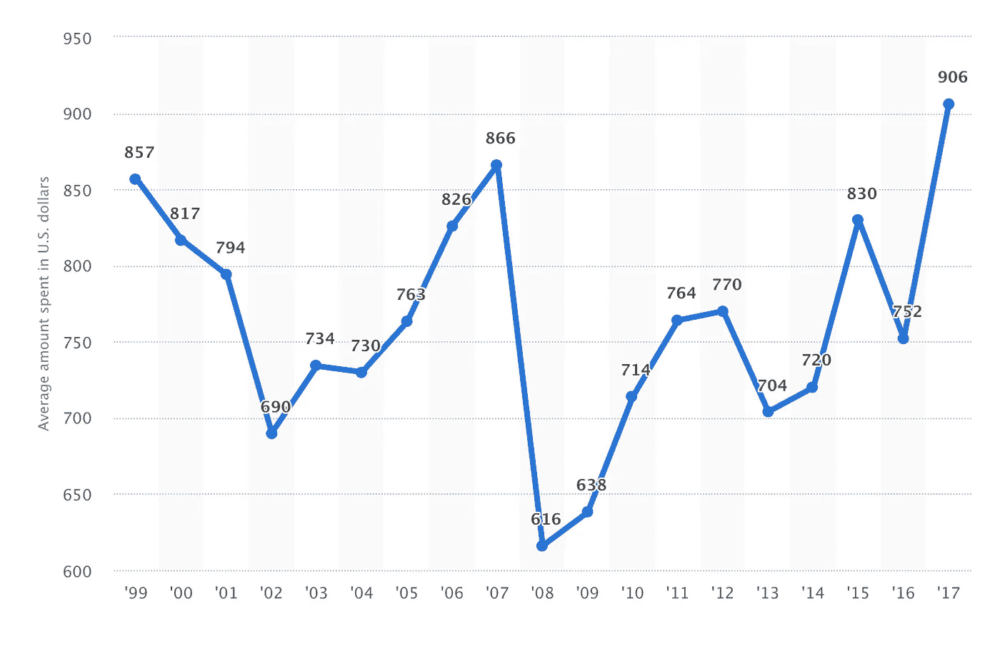

# 我们的废弃经济:购买还是扔掉？

> 原文：<https://medium.datadriveninvestor.com/our-obsolescent-economy-a92f58aa1d7b?source=collection_archive---------6----------------------->

拥有用于工作、学习和休闲的笔记本电脑，使用了 5 年，现在迫切需要一台新的，不是因为它不工作或它有技术困难，而是因为它无法处理所有的工作流程。我是计划淘汰的一部分吗？根据物联网(IoT)的[统计](https://www.statista.com/statistics/471264/iot-number-of-connected-devices-worldwide/)全球联网设备安装预计将增长到**310 亿**。

> [**尽管有回收利用的努力，估计每年仍有 1.4 亿部手机——包含价值 6000 万美元的贵金属——被丢弃在美国的垃圾填埋场。**](https://theecologist.org/2017/sep/26/our-obsolescent-economy-modern-capitalism-and-throwaway-culture)

“如果真的有过时的东西，那就是科技，”连续创业者、数字创业孵化器 1871 的首席执行官霍华德·塔尔曼说。“这几乎就像是技术会自己照顾自己——无论你喜欢与否，它都会自己过时。”

过时是资本主义的物质和文化范式。正如 Webbs 在 80 多年前争论的那样，

*……从玻璃工对冰雹的兴趣，到路边车库对汽车事故的兴趣，以及大型铁路车辆商店对最浪费的运输方式的兴趣，我们手头上有太多的例子来说明这样一个事实，即在资本主义下，不可能创造出对生产的兴趣，而不是对腐烂和毁灭的兴趣(1923:71-72)。*

> **过时主要解释流程变得不再有用或“过时”。**

有一些关键类型的过时或缺陷会导致任何类型的财产失去价值:

*:
当一项技术产品或服务不再被需要或需要时，即使它仍能正常工作。技术过时通常发生在新产品被创造出来取代旧版本的时候。*

****功能性过时*** :
功能性过时(Functional obsolution)是房地产中常用的一个术语，是指由于过时的设计特征而无法轻易改变，导致物体的有用性或合意性降低。该术语的应用因行业而异。*

****建筑过时*** :
在创新和广泛的*过时*，[丹尼尔·m·艾布拉姆森](https://www.press.uchicago.edu/ucp/books/book/chicago/O/bo22340661.html)研究了建筑可消费性的概念以及建筑失去其价值和效用的逻辑。艾布拉姆森认为，新事物必然胜过旧事物并使其变得多余的观点，有助于人们适应现代性和资本主义的快速变化。*

****款式过时*** :
当一个产品因为已经不流行而不再受欢迎时，它的款式就过时了。*

**

*Resource: [https://applenovinky.cz/2017/10/test-vykonu-srovnani-vsech-iphonu/](https://applenovinky.cz/2017/10/test-vykonu-srovnani-vsech-iphonu/)*

****计划报废*** :
指生产使用寿命很短的商品，因此客户不得不重复购买。然而，理性的消费者只会为产品未来服务的现值买单。因此，利润最大化似乎意味着以尽可能低的成本生产任何给定的服务流，生产涉及有效的使用寿命。*

*虽然 Brooks Steven(1911-1995)经常被认为是发明了有计划淘汰的概念(人为缩短产品生命周期以影响消费者的购买模式使其有利于制造商的做法)，但他并没有发明这个概念，而是推广了这个术语。*

*有计划的过时继续被精心制作，并破坏消费者的选择，特别是在全世界的年度会期庆祝活动、节日和活动中。这是一个广为人知的现象，尽管很少讨论。*

*例如，已经在 1870 年的圣诞节，在《插图评论杂志》中提到，庆祝不再是关于庆祝:*“当然，习俗有好有坏，无动于衷，我们不会为家庭中抱歉的成员举行辩护；然而，我们不能自满地看待美好、简单、无论如何无害的习俗的逐渐过时，这些习俗曾在特定的季节增强了欢乐的英格兰的诗歌和图画的魅力**

*现在圣诞节不再是纪念耶稣基督诞生的节日，而是消费礼物和“创造庆祝的感觉”。特别是这种消费正在辩论，并称之为"*道德消费主义"*，由[迈克尔·布克与迈克尔·波蒂洛、安妮·麦克埃尔沃伊、马修·泰勒和克莱尔·福克斯](https://www.bbc.co.uk/programmes/b01p424r)在[道德迷宫](https://www.bbc.co.uk/programmes/b006qk11/episodes/guide?page=8)主持的好斗、挑衅和引人入胜的辩论。*

**

*LONDON CLEANING SYSTEM*

*以下是统计数据，描述了 1999 年至 2017 年美国消费者预计圣诞节支出的调查结果。最近的调查显示，美国消费者预计在圣诞礼物上平均花费约 906 美元。*

*我们真的能买到圣诞精神吗？*

**

*Resource: [https://www.statista.com/statistics/246963/christmas-spending-in-the-us-during-november/](https://www.statista.com/statistics/246963/christmas-spending-in-the-us-during-november/)*

*每年都有数十亿的联网设备、产品、包装、年度庆典产生的所有废物等变得过时，这一想法令人担忧，市场力量也不支持，显然需要做一些工作来如何将这种影响的影响降至最低。*

> *2017 年 7 月 4 日，为了对抗**计划淘汰** *欧洲议会*批准了其关于**延长产品寿命的[决议:消费者和公司的利益。](http://www.europarl.europa.eu/sides/getDoc.do?pubRef=-//EP//TEXT+TA+P8-TA-2017-0315+0+DOC+XML+V0//EN)***

*早在 2011 年的黑色星期五，巴塔哥尼亚在《纽约时报》上刊登了一则广告，告诉人们，“[不要买这件夹克](https://www.patagonia.com/blog/2011/11/dont-buy-this-jacket-black-friday-and-the-new-york-times/)”——要求消费者在花一分钱买夹克或其他东西之前，少买一点，好好想想。因此，巴塔哥尼亚发起了“共同线程倡议”( Common Threads initiative )( T23 ),要求人们减少、修复、再利用、回收和重塑形象。*

*有希望。公司、企业、政府、人们开始更加关注他们的消费。许多组织试图提高业务的可持续性，一个很好的例子是 FENISS(无计划淘汰的能源和可持续创新基金会)认证公司生产环保的商品和服务。*

**

*[https://eu.patagonia.com/eu/worn-wear-tour-dates.html](https://eu.patagonia.com/eu/worn-wear-tour-dates.html)*

**参考文献:**

1.  *过时(1870 年 12 月)*“过时”*，第 1 卷，Iss。6、
    《插图评论》:一份文学、科学和艺术的双周刊；伦敦:霍斯顿父子公司，206-209 页*
2.  *保罗·m·格雷戈里(1947 年 7 月)*《有目的废弃理论》，*第 14 卷第 1 期，《南方经济杂志》；南方经济协会，第 24-25 页*
3.  *杰瑞米·布洛(1986 年 11 月)*‘计划淘汰的经济理论’，*第 101 卷。№4.《经济学季刊》;牛津大学出版社，第 729-750 页*
4.  *Matteo zall io & Damon Berry(2017 年 9 月)[*‘设计和计划淘汰’。设计使能技术的理论和方法'*](https://www.tandfonline.com/doi/pdf/10.1080/14606925.2017.1352879)*；*英国信息有限公司，以泰勒&弗朗西斯集团的名义进行交易，第 1–6 页*
5.  *Neil may croft(2009)*‘消费、有计划的淘汰和浪费’，*艺术史&物质文化；林肯大学，第 1-5 页*
6.  *韦伯。S & Webb。B (1923) *《资本主义文明的腐朽》*；伦敦，费边社。*
7.  *主动可持续性(未知)*‘防止计划淘汰’，*Acciona；访问时间:05.10.18，来源:"[https://www . activesustainability . com/sustainable-development/battle-against-planned-obsolution/](https://www.activesustainability.com/sustainable-development/battle-against-planned-obsolescence/)"*
8.  *Wear Wear Tour Dates(2011)*‘不要买这件夹克，黑色星期五和纽约时报’；*巴塔哥尼亚*，*访问时间:2018 年 10 月 5 日，来源:[https://www . Patagonia . com/blog/2011/11/don-buy-this-jacket-black-Friday-and-the-new-York-times/](https://www.patagonia.com/blog/2011/11/dont-buy-this-jacket-black-friday-and-the-new-york-times/)*
9.  *欧洲议会(2017)*‘欧洲议会决议’；欧洲议会；访问时间:05.10.18，来源:*[http://www.europarl.europa.eu/sides/getDoc.do?pub ref =-//EP//TEXT+TA+P8-TA-2017-0315+0+DOC+XML+v 0//EN](http://www.europarl.europa.eu/sides/getDoc.do?pubRef=-//EP//TEXT+TA+P8-TA-2017-0315+0+DOC+XML+V0//EN)*
10.  *Adam had hazy(2016)*‘这是关于技术‘计划淘汰’的真相’；BBC future，访问时间:2018 年 10 月 5 日，来源:*[http://www . BBC . com/future/story/2016 06 12-heres-the-truth of the-planned-obsolution-of-tech](http://www.bbc.com/future/story/20160612-heres-the-truth-about-the-planned-obsolescence-of-tech)*