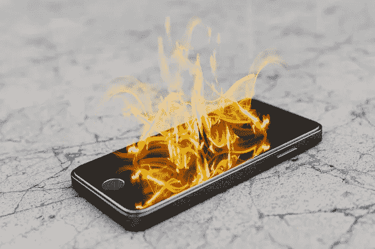

# 我们的手机已经把我们变成了金鱼——拯救我们大脑的 6 个步骤

> 原文：<https://medium.datadriveninvestor.com/our-phones-have-turned-us-into-goldfish-6-steps-to-rescue-our-brains-8c3e4af243ec?source=collection_archive---------36----------------------->

How to escape from our phones

在人类历史上，智能手机是发展最快的技术。无线网络花了几十年才渗透进来，电视也是如此。家用电脑 30-40 年，手机 20-30 年。2008 年，17%的英国人拥有智能手机。这一比例现已达到 78%，在 16-24 岁的人群中达到 95%。我们的道德、法律和智力能力根本跟不上。更糟糕的是，我们的大脑被绑架了。在这篇文章中，我探讨了这是如何发生的，并提供了具体的想法，以帮助认识和减少我们的依赖。平均每个美国成年人每天都会浏览一个比自由女神像高三倍的垂直数字带。更令人吃惊的是，美国智能手机用户平均每天消费 12 小时的媒体。每年，超过 182 天不间断的数字材料，通过每个人的眼睛和耳朵传递。

在英国，我们每 12 分钟查看一次手机，80%的人在起床后 15 分钟内查看手机。37%的人会在入睡前 5 分钟内检查，如果你不到 35 岁，这个比例会上升到 60%。

让我们考虑一下是什么驱动了这种用法；新闻、社交媒体、电子邮件、购物、消息传递、游戏和消费媒体。看看这份清单——你的内心是否欢欣鼓舞？不，这是一个与焦虑、抑郁和注意力不集中程度相关的列表。这对我们的健康有严重的影响。心理学家乔纳森·海特讲述了自 2011 年以来，社交媒体如何促使因自残而住院的女孩增加了 189%。它还会影响我们完成工作的日常能力。根据微软的说法，我们的注意力持续时间比金鱼还长。我们无穷无尽的个性化内容是由算法选择的，这些算法旨在最大化消费时间。为什么？因为钱是在广告中赚的，我们停留的时间越长，我们消耗的广告就越多。那么他们如何最大限度地利用这些时间呢？我们的大脑是如何被绑架的？通过煽动和促进愤怒。关于夸张和/或罕见事件的极端故事，主要是负面的。愤怒作为一种销售媒体的手段并不新鲜，然而在过去，我们可以选择何时阅读报纸头条或收听广播新闻。有一层透明的膜。现在内容 24/7 都粘在我们手上。哔哔声让我们知道另一个“可能发生在你身上的真正令人惊叹的不容错过的故事”已经登陆。智能手机已经将低级腐蚀性物质武器化。

罗马皇帝和哲学家，马可·奥勒留写道；

*“灵魂染上了思想的色彩”*

想象一下我们正在消费的媒体和内容的现代饮食对我们的灵魂造成了什么影响。

还不服气？克里斯汀·杜克在《哈佛商业评论》上发表的研究，要求参与者将手机放在桌子上、口袋里或不同的房间里，完成认知任务。结果是惊人的:当手机在另一个房间时完成这些任务的人表现最好，其次是那些把手机放在口袋里的人。最后，是那些把手机放在桌子上的人。令人惊讶的结果是，即使手机关机，这一点也能显示出来。认知能力的损伤与睡眠不足引起的损伤相似。如果你现在决心要为此做些什么，这里有 6 种方法可以永久减少你对数字的依赖:1)家里的充电站。在你回家的门边放一个插有充电器的盒子。当你走进门时，手机会在盒子里继续充电，直到你走出门。这有一个额外的好处，那就是减少手机丢失。(如果你容易丢钥匙和钱包，找一个大一点的盒子！)

智能手机上的电子邮件和社交媒体。这是艰难的，但无疑具有最大的影响。如果你工作需要，没问题。坐在办公室或家里，用电脑或平板电脑处理电子邮件或社交媒体。仅仅增加这个额外的障碍就能保证大大减少你花在手机上的时间，甚至是这些活动上的时间。电子邮件大师们谈到每天在中午 12 点和下午 4 点处理两次电子邮件，手机上没有电子邮件会让你离实现这种解放技巧更近一步。

**3)改变你的新闻习惯。每天/每小时/每分钟消费新闻对我们没有好处。它让我们保持高度警惕，我之前已经写过关于这种危险的文章。客户发现，转向每周一次的长篇新闻消费，可以在一天中腾出大量时间，并迅速减轻焦虑。在与他人交谈时，关掉手机和平板电脑并放好。即使关机，你的手机也会吸引你的注意力。更糟糕的是，它在潜意识里向其他人发出信号，在你的生活中有比这种互动更重要的事情正在发生。正如一些学校大门外的标语所说:用微笑而不是电话问候你的孩子。

**5)手机黑白模式。**这隐藏在 iPhone 的子菜单中。红色的通知点是特意选择的——红色是自然界中显示危险和劫持我们古老的爬行动物大脑的颜色。即使是佛教禅宗信徒也很难忽略红点。让你的手机黑白运行只会让花时间在手机上变得不那么吸引人。

**6)所有通知关闭。如果有人真的需要找到你，他们会的。你真的需要从你有意义的活动中被打扰才能知道最新版的《愤怒的小鸟》已经上市了吗？关闭振动也有助于这一点。更好的是。彻底关掉手机！

我不会假装这些很容易。我经常失误，我的许多客户都取得了 0 分、1 分或 6 分中的 2 分。我所知道的是，当我控制了所有 6 种情绪时，我的焦虑水平会降低，我会以一种深刻的方式呈现，我的产出会飙升。也许一次试一个。iPhone 上的新屏幕时间应用程序将帮助你跟踪你的进展，就像一个戒烟者发现自己每周都有奖金一样，当你放松并真正享受你有意选择的活动时，你会发现自己有奖金时间。****

爱德华