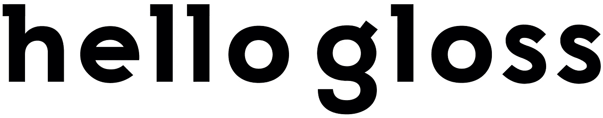
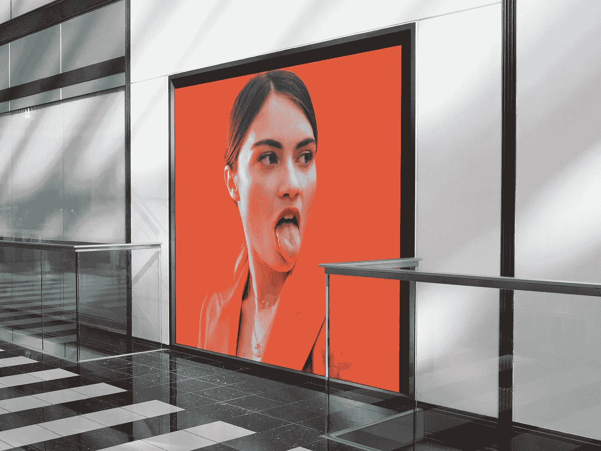
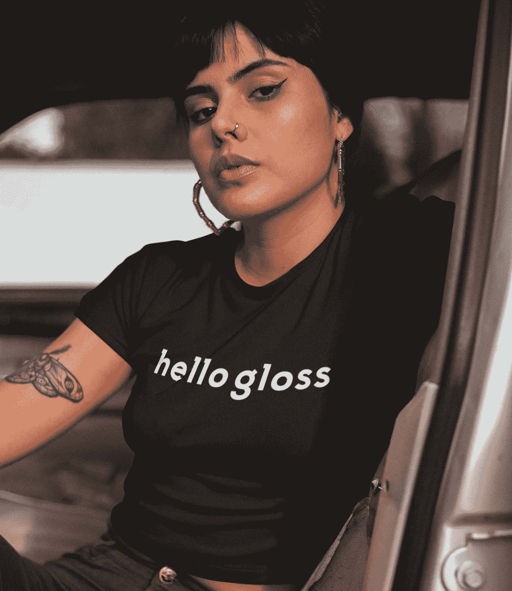
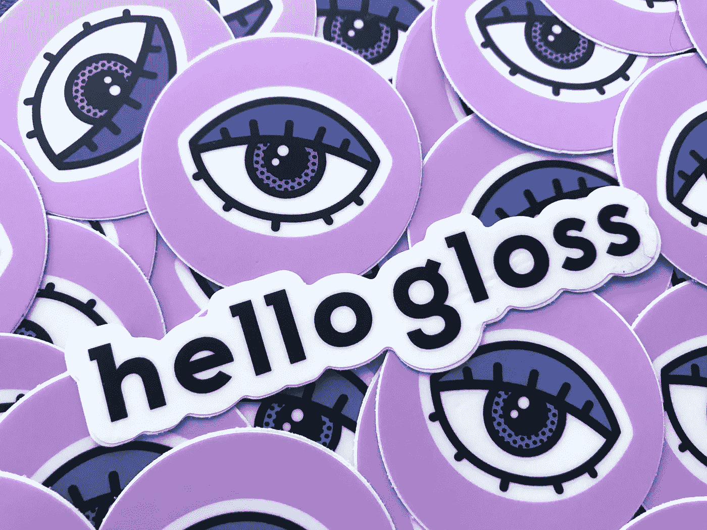
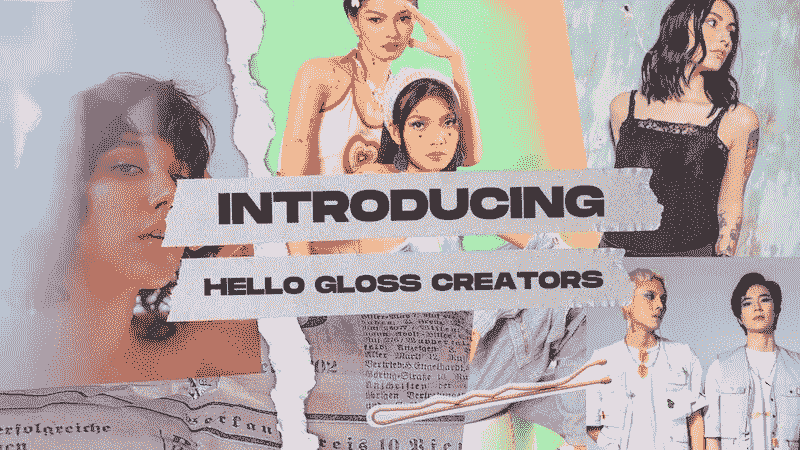
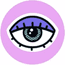

# 我们的创业是在感恩节晚餐上完成的

> 原文：<https://medium.datadriveninvestor.com/our-startup-was-cooked-up-over-thanksgiving-dinner-6aab296bac65?source=collection_archive---------25----------------------->

## Hello Gloss 的诞生

[Unsplash](https://unsplash.com?utm_source=medium&utm_medium=referral)

一次又一次，最好的个人关系和产品想法似乎总是突然冒出来；在你最不经意的时候。

这是我们新成立的美容公司 [**Hello Gloss**](https://www.hellogloss.com) 背后的故事。

虽然我们正在做的大部分工作仍在进行中，因为我们努力推出并看到一些牵引力，但我想分享这个温暖人心的灵感故事，以及我们公司背后的动机是如何在与我杰出的联合创始人亚历克斯和几个有着共同问题的亲密朋友的晚餐中自发演变的。

这篇文章的前半部分写于 2018 年，当时事情仍然是概念多于现实。亚历克斯和我都有真正的工作和真正的生活责任。一路上生活事件也起了作用，然后当然是 COVID。尽管如此，创办这家公司的梦想从未消退——它只是被推迟了一点点。如果说有什么不同的话，那就是推迟给了我们更多的时间来思考我们到底想要完成什么，并迫使我们磨练自己的思维。

这篇文章的后半部分是在 2021 年 7 月我们试发布之前添加的。仍然有相当多的工作要做，但是我们现在更加清楚我们的方向，事情终于变得真实——非常真实！

# 感恩节的教训

感恩节到了，在耐心等待晚餐上菜的时候，我突然发现自己被卷入了一场关于 YouTube 美妆教程和在丝芙兰买口红的慷慨激昂的讨论中。

我一生中从未看过美容教程，我最接近丝芙兰的经历是坐在外面的木凳上，拿着一杯星巴克咖啡，浏览推特，想着我的另一半什么时候会出现；想到这要等一会儿，也许我应该点大杯的咖啡。

> 我正要去一个神秘的世界上上第一课，我一直知道这个世界的存在，但从未想过我会对此感兴趣。

不用说，我完全一无所知，但我一直注意到我所了解的所有问题的一个共同主题。肤色。这真的是个问题吗？化妆品有一百万种颜色。说真的，有什么问题？

我很快开始觉得我是房间里唯一一个没有开玩笑的人。我正要去一个神秘的世界上上第一课，我一直知道这个世界的存在，但从未想过我会对此感兴趣。

接下来我知道的是，我在 Instagram 上看到了数百张照片，前臂上画着一排排各种想象得到的颜色的口红样本。当我问你们女孩子在丝芙兰是不是都这样的时候，大家都笑了；好像这是一个男人永远不会理解的秘密仪式——就像女人似乎总是成对去洗手间一样。

我的下一课是在 YouTube 上搜索教程——针对有色人种女性。好吧。我在搜索栏中随机输入了一些关于口红的短语。就在那时，我突然意识到这是一个骗局。肤色涵盖了所有的色调值。我当然知道，但我从未从搜索和发现的角度考虑过这个问题。几乎不可能找到特定肤色的视频。没有任何东西支持这种搜索；每个女人似乎都知道，尤其是有色人种的女人。

火鸡还没完全准备好，所以还有时间再上一节课。这一次是关于赝品——你可以在附近的药店买到便宜的仿制品，看起来和百货商店里的大牌正品几乎一样。

同样，这对我来说是全新的，但我很容易理解，世界上有一半人买不起高价的原件。这并不是说我完全忘记了复制猫，这更像是我从来没有想到它是如此之大的一件事，以至于 Instagram 会有数百万的 dupe 推荐，我看到一个专门针对 dupe 的帐户有超过一百万的粉丝。谁知道呢？

现在火鸡已经准备好了，我的思维已经切换到程序员模式。我喜欢解决问题。那是我的事。我是开发商。

晚餐时的谈话从问题转变为解决方案。这是一个直接来自鲨鱼池的场景，每个人都扮演了自己的角色。请把红薯递给我，嘿，你能不能查一下去年 YouTube 上有多少美容教程被观看了？

我想当我们吃完南瓜派的时候，我们已经知道我们要做些什么了。

> 我们的核心愿景是为美容爱好者创建一个新的社交社区。

我和我的联合创始人亚历克斯(Alex)离开了感恩节晚餐，当时我们晕头转向。我们肯定有所发现，但是是什么呢？我们确定的一件事是我们无法停止思考它。

在接下来的几个月里，我们会不停地打电话和发短信，交流关于美容领域的想法、有趣的事实和统计数据。毫无疑问，我们都被作为父女团队一起建立一个有趣的企业的前景迷住了。

是的，亚历克斯是我的女儿。想象一下。

有趣的是，尽管我们相差一代，拥有完全不同的技能和个性，但这却是我们最大的优势之一。

在这里，我是一名经验丰富的开发人员和业务经理，亚历克斯从有色人种女性的角度对美非常熟悉，加上她对社区建设和品牌建设的惊人直觉，我们设法覆盖了两个人的许多领域——这一切都神奇地发生了！

## 开始创业

像任何新的创业公司一样，我们首先需要一个名字和一个使命。老实说，这两件事都不是很快就能完成的。我们花了很多时间进行头脑风暴、研究和错误的开始，才锁定了一个我们认为值得追求并在我们能力范围内实现的模式。

我们希望与众不同，更重要的是，我们希望解决 Instagram、YouTube 和社交世界中其他常见的美容领域的不足。最重要的是，我们下定决心让有色人种女性更容易使用我们的平台，将多元化解决方案直接构建到搜索和发现的框架中。

我们还从一开始就决定，我们将专注于灵感，而不是购物，我们的名字需要反映这种精神。但是试着找一个新的名字，一个独特美丽的名字——这几乎是不可能的。

后来有一天，在一次漫长的头脑风暴会议上，我说“你好”，她说“光泽”——就这样。没有任何犹豫，亚历克斯和我都立即知道这个名字有我们一直在寻找的魔力。令人惊讶的是，这个域名仅售 12 美元。然后我们做了一些疯狂的谷歌搜索，看看我们是否有机会获得商标，它看起来很有希望。

我们按下购买键，名字就是我们的了。我们的写作障碍立刻消失了，更多的拼图开始变得清晰起来。

最后，我们认识到，在某些方面，我们比社交巨头更有优势，因为我们只关注美。我们不需要成为每个人的一切。我们的产品功能和营销可以针对我们的特定受众进行调整。此外，我们可以围绕它建立一个时尚的生活方式品牌，用激光瞄准我们的核心人群。

但是我们仍然有一个更重要的概念障碍要克服，那就是弄清楚如何在我们的社区中激发兴趣并找到早期的采纳者。具体来说，在这个世界上谁是第一位的，影响者还是消费者？我们只能选一个，还是两个都选？我们在这个问题上争论了很长时间。我们最终找到了兼顾这两者的方法，只是对我们的产品做了一些调整，并给创作者一个非常小的开端。

我们还必须找到一种方法，在很早的阶段将美容品牌融入进来，这样我们就可以从第一天开始赚钱。在对我们的模型做了一些简单的调整后，这个问题也有了解决方案。

最后，我们有了一个名字，一个氛围和一个感觉都不错的模型。是时候开始工作，开始建造一些东西了。

# 美容产品作为服务推出

我们决定，我们的出发点将是提供化妆和美容产品发布服务，但不是以任何普通的方式。我们的方法将是完全重新想象新的美容产品如何被分配给社会影响者，然后被消费者发现；这一切都充满了乐趣和创造性，关注社交活动的每一步。

诚然，我们从“即服务”的角度对我们的模型进行了一些创造性的许可，因为我们绝对不仅仅是一个典型的 SaaS(软件即服务)平台。不过，从概念上讲，它很好地描述了我们正在做的事情，让人们很容易理解。

我们模式的核心是我们的创作者社区，它连接品牌和影响者，我们帮助有抱负的创作者发展他们的个人品牌。这使得新产品以及他们发布评论、创建教程和展示新外观所需的所有信息到达正确的人手中。

Hello Gloss 的消费者方面由我们前卫的生活方式品牌和在线社区提供支持，该社区提供了一个新的家园和引人入胜的平台，用于发布消息、发布评论和教程、获得灵感和反馈；重要的是，把旁观者变成购物者。

美容品牌已经全力投入数字营销和影响者活动，为他们的产品赢得牵引力。现在，有了 Hello Gloss，品牌终于可以像购买脸书广告一样轻松和熟悉地发起以影响者为中心的强大宣传活动。此外，我们能够推动社会参与，并以以前不可能的方式提供分析和有价值的见解。

最棒的是，我们毫不费力地做到了这一点，而且是大规模的。

# 我们的生活方式品牌

**Hello Gloss** 被宣传为一个*生活方式品牌*，旨在吸引美容品牌最渴望触及的消费者。消费者将会知道，我们的网站和社区是一个一站式的地方，可以从他们最喜欢的影响者那里了解新的东西，然后获得折扣代码和样品，亲自试用。

# 我们的社会群体

**Hello Gloss** 也将举办一流的社区和*社交平台*建立在我们的时尚品牌之上。在这里，我们将为创作者提供新的和令人兴奋的方式来吸引他们众多忠实的追随者，同时也为消费者提供轻松发现影响者来追随和探索新趋势的方式。

社区成员创建个人资料，并以所有熟悉的方式关注其他成员。他们可以很容易地发现什么是新的，寻找灵感，阅读评论并发布自己的反馈。

# 你好光泽创造者

我们从一开始就明白，与基层的创作者和影响者密切合作是将我们的想法变为现实的重要组成部分，这也是我们的创作者社区的起源。

> 我们将来自世界各地的美容创作者聚集在一起，提供联系、内容和产品，将他们的个人品牌发展成为蓬勃发展的企业，这样他们就可以做自己喜欢的事情来谋生，同时在行业中留下持久的印记。

我们很早就认识到，有前途的影响者面临的最大障碍之一是接触品牌，了解新产品并合作开展营销活动。品牌也从另一个方向面临同样的问题，希望找到新的有影响力的人来帮助在各种市场推广他们的产品。

为了以一种符合我们使命的方式解决这个问题，我们创建了 Hello Gloss Creators 一个致力于帮助有抱负的美容影响者的私人论坛。

重要的是，我们的 Creators 社区将品牌与有影响力的人联系起来，然后简化将新产品和公关套件一起送到他们手中的流程，以启动评论和进一步的合作。

## 免费课程和工具

在我们的社区内，创作者可以利用我们的许多课程和工具，帮助他们发展和货币化他们的品牌；其中许多对每个人都是免费的。这也是一个认识其他创作者、讨论共同问题和为有趣的合作而组队的地方。

## 行业领袖参与的活动

我们还定期与美容品牌、业内人士和成功人士进行聊天和座谈，帮助我们的创作者学习如何在这个行业取得成功。

## 专为创作者打造的精英美妆盒

最后，我们 Creators 社区的标志是，品牌会寻找成员来接收我们设计精美、久负盛名的美容盒子。这些精英*智能盒子*装满了新产品，包括互动内容，直接访问品牌的合作团队，会员代码，酷礼品，讨论论坛，更重要的是，与 Hello Gloss 的消费者端进行了必要的集成，这在发布评论时起到了不可或缺的作用。

# 下一步是什么

最初，大部分工作是建立我们的创作者社区，并为品牌提供物流，为我们的成员提供新产品。这让内容流动起来，最终将填充我们在 hellogloss.com[的主网站。](https://www.hellogloss.com)

接下来，我们将构建我们的搜索和发现平台，使消费者能够轻松地探索他们最喜欢的影响者的评论和教程。

从那开始，我们就一直往兔子洞走。

我们知道我们有许多工作要做。而且我们已经有了比我们之前可能实现的更多的想法。然而，最重要的是，我们在发布新的令人兴奋的东西时获得了巨大的乐趣。我唯一能确定的是，这将是一次不可思议的旅程。

让我们看看这一切将走向何方。在 hellogloss.com[找我们](https://www.hellogloss.com)。

We’re a community designed to inspire connection and collaboration between creators and brands.

# 更新:我们已经推出 Hello Gloss Creators

*2021 年 9 月 13 日*。我很高兴地宣布，我们刚刚在 creators.hellogloss.com[的](https://creators.hellogloss.com)推出了我们的创作者社区，最初的吸引力和兴奋度是前所未有的。来参观一下吧！

参见[美容品牌挖掘新一代创造者](/beauty-brands-tap-into-a-new-generation-of-creators-5f8f54a60ad0)的故事。

## 感谢阅读。如果你喜欢这篇文章，请随意点击那个按钮👏帮助其他人找到它。