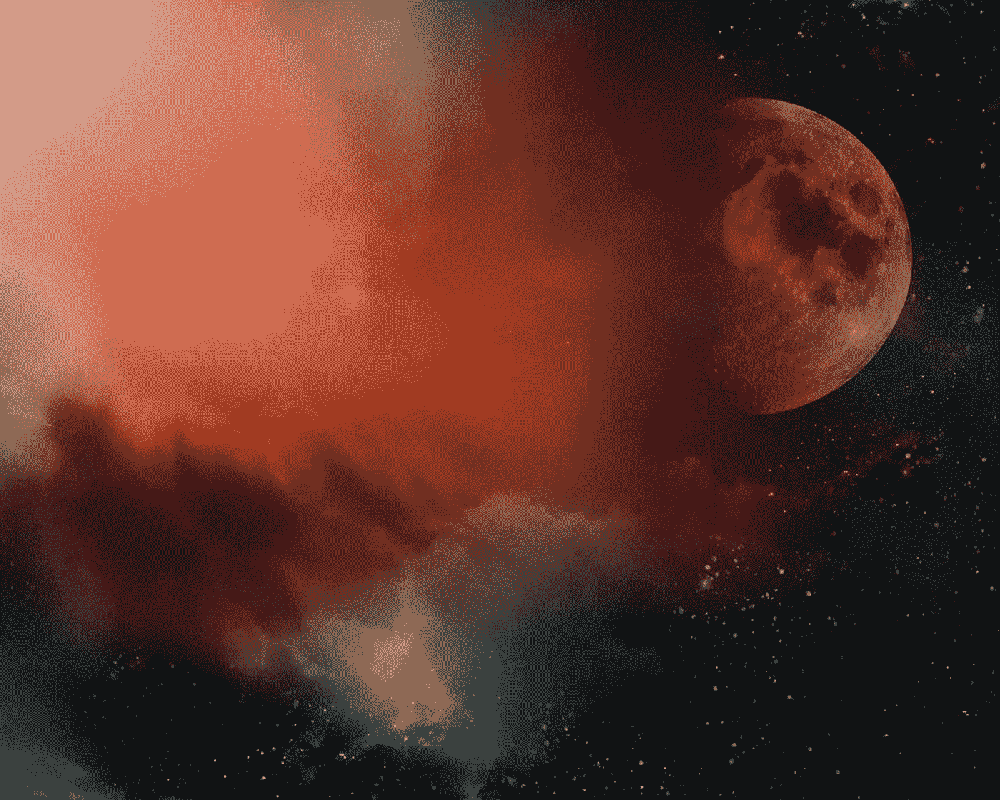

# 体外小说

> 原文：<https://medium.datadriveninvestor.com/out-of-body-fiction-7a0996b06f1b?source=collection_archive---------21----------------------->

originally posted to [**Flickr**](https://en.wikipedia.org/wiki/Flickr) by yumikrum at [https://flickr.com/photos/94725359@N06/14409814222](https://flickr.com/photos/94725359@N06/14409814222).

在我们所有的故事中，最大的玻璃天花板是他们需要一个人类的镜头。

让我们感谢文字，因为它们架起了我们之间的桥梁。想象一下我们灵长类祖先的土地，一个没有语言的生活，在那里咕噜声和信息素只表达最粗略的需求，我们在世界上看到的所有细微差别都被困在我们思维的笼子里。相比之下，即使有缺陷，文字的世界也是天堂。但同时，因为我们的头脑是解释的锚，我们无法理解超越我们存在的东西。所有的解释都需要语境，而我们只有自己的语境:充其量是作为一个人活着是什么样子。

背景的阴险锚定使雕刻科幻小说成为一种微妙的舞蹈，受益于一点恶作剧。

甚至基本现实就是一个恰当的例子。目前的科学标准认为存在可能至少有十个维度。然而，我们很难想象四个以上随时间变化的三维空间，更不用说折叠超平面和平行宇宙了。包括我们在内的所有事物的大部分组成部分只能用数学来表达，以便聪明的人进行抽象量化。

生命的概念本身是另一套人为的精神锁链。我们以自己为模子，视我们的动态存在为至关重要的，并给予所有碳基生物以延伸，它们的存在与我们产生共鸣。我们规定，所有的生命都是细胞性的，新陈代谢并能保持体内平衡，并以遗传密码繁衍后代。生物学家最近[彻底检查了系统进化树](https://www.wired.com/2013/06/algorithms-revise-tree-of-lif/)，基因测序揭示了物种之间的真正联系，这表明我们对生命的概念是多么有限和重复。

因此，不管它有多酷，你的阿奇的生物照片，友好的七维不朽的变形，可能是一个艰难的销售基本有线电视。除非你能在小狗身上写字。

然后是智能。

令人惊讶的是，尽管围绕着通用人工智能的风险和承诺进行了所有的辩论，以及当机器将能够指数级自我改进时奇点的伟大书呆子预言，人工智能最常见的定义似乎仍然是古老的图灵测试:如果一个合成体让人类相信它是人类，它就是人工智能。在它最初被提出的几十年后，似乎很少有比“当我们看到它时，我们会知道它”更好的定义了。图灵的功劳在于，他将人工智能塑造成一种我们可以凭经验识别的特性，然后我们才可以用我们狭隘的词汇对其进行分类。但事实上，我们对人工智能最推崇的定义是照照镜子，这对于预测新奇的未来并没有太大帮助。

也许我们的定义是有偏差的，因为它们可能是有偏差的，因为我们的需求并没有强迫一个更大的光圈。正如生物自然选择促进与生存和繁殖相关的基因，或许我们的概念世界也只需要大到足以传递我们的迷因。

但这感觉不对，是吗？生存主义的讲故事理论无法解释为什么我们为了娱乐而创造新词，或者为了艺术而创造艺术。

让我们自己停驻一会儿，说人们喜欢超越自身经历的故事似乎是没有争议的。我们乐于倾听移民的经历，探险者的旅程，企业家的冒险游戏。如果那些与我们不同的人的故事可以在我们本能中如此根深蒂固的嫉妒和仇外心理中逆流而上，也许我们可以运用一些技巧来描绘智慧、生命甚至宇宙物理轮廓的新观点。

显然，如果文学最终是为了阅读，视觉需要在人类世界中发挥作用。即使在角色发展的前沿，如汤姆·鲁宾斯的*瘦腿和所有，*玩无生命物体的隐藏冒险，挑战极限也发生在人类故事的背景下。我是说，很难对一只脏袜子投入感情，即使这只是个比喻。

然而，对于我们人类环境中的所有锚来说，保持有价值的故事不被讲述——甚至可能使它们无法被讲述——我们似乎确实喜欢想象超越我们自己的智慧。我不确定是谁保存了这些数据，但我敢打赌，基于科幻小说的绝对数量，人工智能对外星人一无所知。

太阳系外的文明是一个文学圣杯，因为它挖掘了我们内心深处的渴望，通过重新定义我们在宇宙中的位置来诱惑我们。它是我们父母的宇宙转世，也许是防止我们自我毁灭的安全毯。或者也许我们对外星智慧着迷是因为我们渴望超越自我。我们寻求去遥远的世界旅行，用如何操纵时空结构的先进知识来唤醒我们的潜能。

不管我们喜欢外星智慧的故事的原因是什么，用一种引人注目的方式而不是拟人化来刻画一个人是少数作家已经做到的。以下是我观察到的伟大作家在创造引人注目的外星人时使用的一些错觉:

①**处理好这件事，抛下锚。让我们接受这样一个事实:我们都与大脑的血管相连，我们从感知周围的世界开始。所以我们需要找到一个人类参照点:街头顽童、不受赏识的科学家、还不会说话的狗。通常，背景中的参考文献越平凡，就越能更好地将主人公进入未知世界的旅程的转变并置在一起。**

2) **现在的趋势。**一旦一个画框被设定，我们就可以根据今天来外推，描绘出一幅明天的画面。当然，我们预测的越远，我们可能就越不准确。对有知觉的外星人的任何描绘都不可避免地会大错特错。

为了对冲这种不准确性，一个有效的文学佯攻是突出这些非人力量的废弃外骨骼，例如，在其所有者神秘毁灭后自动驾驶的外星技术。这种选择可能很有说服力，但它确实强化了一种观念，即人类以外的东西很难捕捉，因此最好不要知道。

另一种选择是，在构思任何假设时，担心准确性是一个限制我们能力的大恶魔。我们可以确信，无论我们写什么，都将是令人瞠目结舌、极其虚假的。在 CRISPR 或 3D 打印等技术能够实现我们梦想的奇迹之前，我们将错过人类首次在火星上定居的时机，或者大肆宣传这些技术。

由于科幻小说是一个注定有缺陷的预测，重要的不是它的完美，而是超越我们自己的尝试。潜艇和原子弹、互联网、太空旅行和基因工程都在它们成为科学现实之前很久就被预言了。真正的心灵之旅是想知道它们是否曾经存在过，如果没有首先受到数学和疯狂之间的正确平衡的想法的启发，人们是否会被驱使去实现它们。

3) **逗它痒痒。套用一位伟大作家的话，我们请读者去爬山。旅程越迷人，就有越多的人会到达终点。因此，沉浸式外星人体验的最佳设备是让它变得有趣。谁不想阅读那些可以传送或创作邪恶打油诗的英雄，或者更好的是，谁*必须*写生动的打油诗才能传送？尤其是如果那件肮脏的毛衣也是一只脏袜子的话。**

所以让我们想象一下，我们不受限制，我们的思想可以思考未知。想象一下，我们第一次遇到了一个非人类的智能，我们是进行第一次接触的先驱，工程师最终遇到了一个真正的，图灵测试，突破奇点的广义人工智能。

想象一下，我们感激那个时刻，我们理解它对人类的意义，并且敬畏我们的手是触摸未知的那只手。想象一下，我们的舞伴，这个外星思维，向我们展示了他们的视角，因为也许这种交流的需要是所有智慧的标志。我们听到的话一定是咒语的一部分，因为它们把我们的两个头脑结合成一个。

突然我们盘旋而出，在平流层下面的某个地方失去了我们的身体。地球在我们无所不知的眼睛下变得暗淡，比电子还小。我们缩小镜头，看星系的诞生，触摸暗物质的空洞，听反弹的重力揭开恒星古老的幽会。由于我们的自由思想没有质量，它可以毫无畏惧地飞越黑洞，见证遥远的环状泰坦的椭圆形舞蹈，星云的棱柱状气体场景，存在的最远超平面。

或者至少，这些基于感觉的隐喻是我们在返回到我们的身体后，用来描述我们的照明的最好工具。但也许我们很幸运，我们记得我们短暂的神性，认识到同样神圣的几何图形渗透到现实的每一个角落。

在这个清晰的空间里，每一个可能的故事怎么可能不来自同一个生活幻想的图腾池，变幻莫测但却异常熟悉，就好像它们都是由相同的潜在超材料构成的一样？我们应该用这种新的视野创造一个什么样的世界，与我们日常奋斗的短视如此无关？

我投票支持枕头的秘密生活。他们对巅峰舒适的追求显然是一场无名的戏剧，从他们刚刚蓬松的时候开始，直到他们变成老化发黄的外壳，对狗来说几乎不够好。对于门外汉来说，它们可能看起来很平凡，但它们记录了我们的梦，这是一个严格保守的秘密。在第六维度，他们共享一个蜂巢思维，这些混蛋举办史诗比赛，赌我们真正醒来的几率。

当然，对于基础有线电视来说，这可能是一个艰难的销售，但谁在乎呢？为了走向我们无限的未来，我们必须首先超越自己。

山姆·亚伯拉罕是《玉先知**的作者，这是一部科幻小说，故事发生在 22 世纪的中国，一个女人的启示拯救了一个光明帝国。**