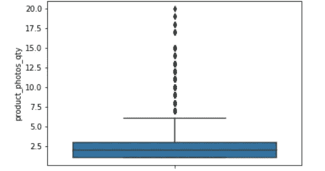
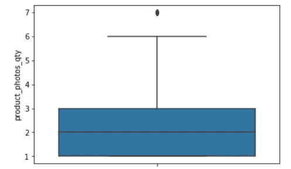

# 不再有离群值！用 Z 分数的力量对抗邪恶。

> 原文：<https://medium.datadriveninvestor.com/outliers-no-more-using-the-power-of-z-score-against-the-evil-eb50fd914b29?source=collection_archive---------9----------------------->

Source: [https://theverybesttop10.com/cats-in-disguise/](https://theverybesttop10.com/cats-in-disguise/)

在这篇短文中，我将向您展示如何处理每个人在清理数据时都讨厌的事情之一:离群值。它们很无聊，很臭，而且到处都是，所以牵着我的手，让我告诉你我是如何去除它们的。

这些数据是关于巴西一家网店的顾客评论。你可以在我的 [github](https://github.com/lucasmoratof/customers_review_project/blob/master/reviews_for_cleaning.csv) 上找到[完整代码](https://github.com/lucasmoratof/customers_review_project/blob/master/Removing_Outliers_with_Z_Score.ipynb)并将其数据集化。我使用[的原始数据](https://github.com/olist/work-at-olist-data/tree/master/datasets)创建了几个关于分类和 NLP 技术的项目，我打算稍后发布。

首先，让我们看一下其中一个特征的方框图:

It looks like one of the Arcade games from the 80’s, doesn’t it?

我们可以看到，我们的 75%四分位数略低于 7.5，但我们的值一直上升到 20，那么我们如何确定哪些值要保留，哪些要删除呢？

这时候 z-score 就来帮我们大家了！但首先，让我们快速回顾一下什么是标准差:

基本上，在高斯分布中，我们可以使用标准差来衡量数据点与平均值的距离。在上图中，您可以看到 99.7%的数据点都在平均值的 3 个标准差以内。

 [## 成为数据科学家所需的 8 项技能|数据驱动型投资者

### 数字吓不倒你？没有什么比一张漂亮的 excel 表更令人满意的了？你会说几种语言…

www.datadriveninvestor.com](https://www.datadriveninvestor.com/2019/02/07/8-skills-you-need-to-become-a-data-scientist/) 

z 分数恰恰代表了这一点，数据点偏离组均值的标准偏差数**。**

我们将在使用 pandas、numpy 和包 stats 的数据中使用这种度量，这些数据来自于辣味库。

在下面的代码中，我的方法是:

1.  将数字数据分组到单独的数据帧中；
2.  计算所有观测值的 z 值；
3.  过滤列，只保留值小于 3 的观察值**。**

让我们通过绘制相同特征的另一个箱线图 *product_photo_qty* 来检查是否有效:

After change, the outliers are like a sad and alone eye drop

哇！现在看起来好多了，这是肯定的。我们仍然有一些异常值，但现在它是一个更好的数据集，我们可以用它来建模。

你怎么想呢?你还有其他处理异常值的方法吗？请在这里留下你的评论，让我们一起玩得开心！