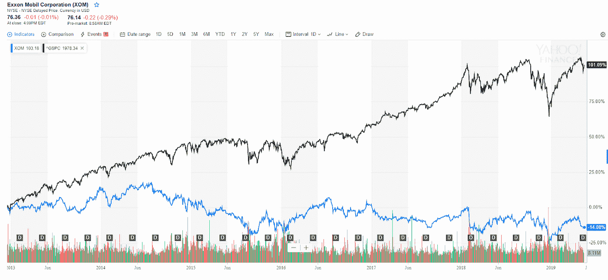
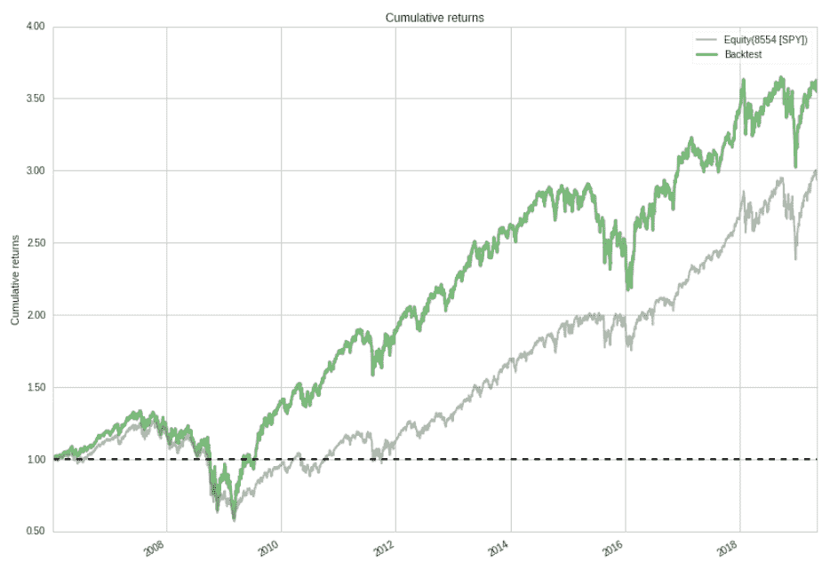
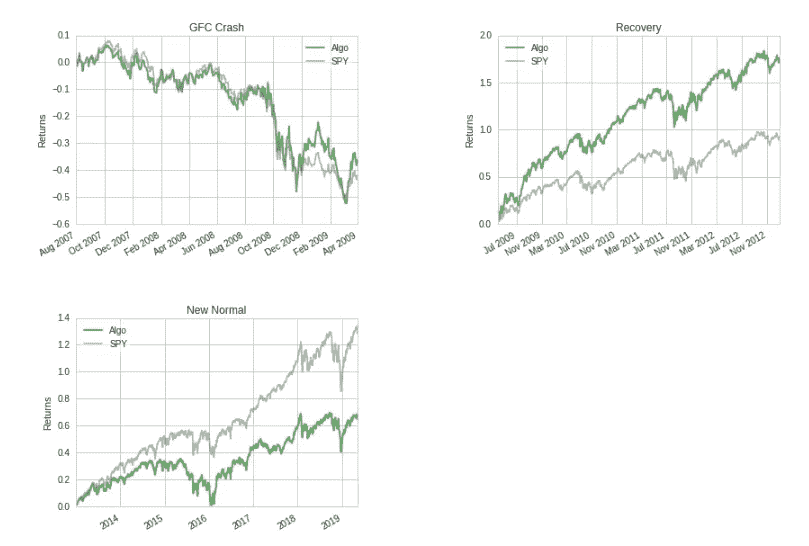

# 用高股息率股票跑赢市场

> 原文：<https://medium.datadriveninvestor.com/outperforming-the-market-with-high-dividend-yield-stocks-9571b3daaee4?source=collection_archive---------2----------------------->

A dividend is a reward that a company pays to its investors

大多数投资者在购买股票时关注的一个关键因素是股票支付多少股息。股息是公司付给投资者的报酬，通常来自净利润。

当公司支付高股息时，通常表明公司经营良好，能够将部分收益分配给投资者。这些公司往往是大型、成熟的公司，拥有强劲且可预测的现金流。

 [## 投资算法快速指南-数据驱动投资者

### 让我们想象一下 30 年前的股票市场:让我们想象一下现在:像现在的许多其他领域一样，投资市场已经…

www.datadriveninvestor.com](https://www.datadriveninvestor.com/2019/01/31/a-quick-guide-to-investment-algorithms/) 

然而，并不是所有支付高股息的公司都进行了良好的投资。一些公司甚至在不盈利的时候也继续支付股息。这是为了保持他们定期支付股息的记录。

一个例子包括埃克森美孚，一个巨大的石油和天然气公司。自 2013 年以来，埃克森美孚一直保持着每个季度支付股息的记录。然而，自 2013 年以来购买该公司股票的投资者将损失 14%，而同期标准普尔 500 指数(S & P 500)收益 101%。

Yahoo Finance

# 高股息率股票跑赢大盘吗？

从 500 只股票的投资宇宙中，我选择了 50 只具有最高股息收益率的股票。跟踪股息收益率是过去 12 个月的每股股息除以股价。这是一个衡量你在股票上投资的每一美元能获得多少现金流的指标。

为了选择股票，我根据它们的跟踪股息收益率对宇宙中的每只股票进行了排名。我将投资组合中 50 只股票的[权重](https://www.datadriveninvestor.com/glossary/weight/)设为相等，以降低投资组合的集中风险。这将防止我的投资组合在任何一只股票崩盘时遭受重大打击。

此外，选择每个部门中信号最强的股票，使得没有一个部门的权重超过投资组合的 20%。这降低了行业风险，并使我们能够隔离由于高股息收益率信号导致的优异表现的来源。

# 表演

High dividend yield strategy vs S&P 500 benchmark

回测结果显示，高股息率策略的年化收益率为 10%，波动率为 20.7%。该策略的累计回报率为 255%，自 2006 年以来超过标准普尔 500 基准近 55%。

High dividend yield strategy’s performance over different periods

我们还可以分析不同时期高股息率策略的表现。上述图表显示，在金融危机期间，该策略的表现几乎与标准普尔 500 基准一致。

在 2009 年至 2012 年的危机恢复期，该策略大幅跑赢基准 80%。然而，从 2013 年到 2019 年，该策略放弃了部分收益，表现落后于基准 60%。

# 结论

通过选择每个部门中股息收益率最高的股票组合，我们能够制定一个跑赢市场的策略。

模拟还显示，该策略在危机恢复期表现良好，但在 2013 年至 2019 年的新常态期间放弃了很大一部分收益。

在下一篇文章中，我将讨论如何通过将高股息率策略与质量因素相结合来提高其绩效。

# 我们连线吧！

如果您觉得这个故事对您有所帮助，并且您希望收到未来的更新，请考虑之后的[。](https://medium.com/@ivannfok)

感谢阅读，我们下次再见！

*原载于 2019 年 5 月 24 日*[*【https://www.datadriveninvestor.com*](https://www.datadriveninvestor.com/2019/05/24/outperforming-the-market-with-high-dividend-yield-stocks/)*。*