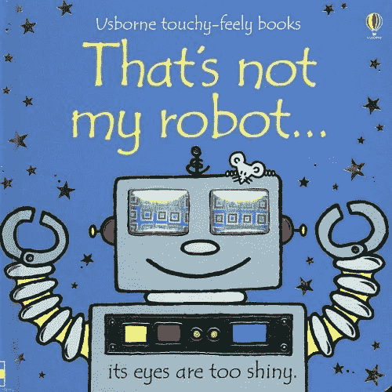
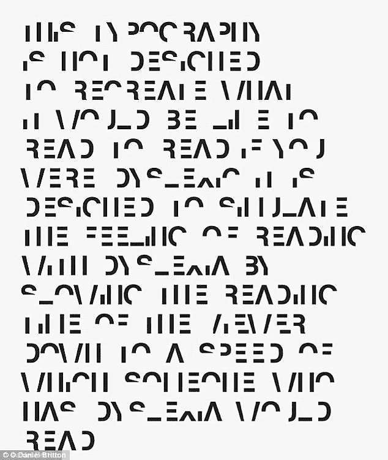
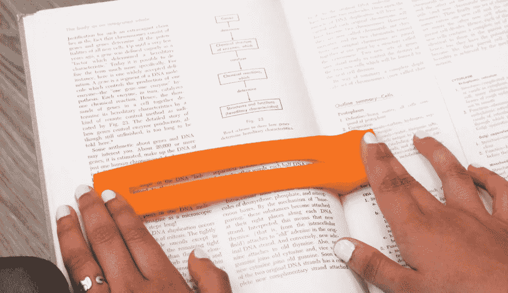
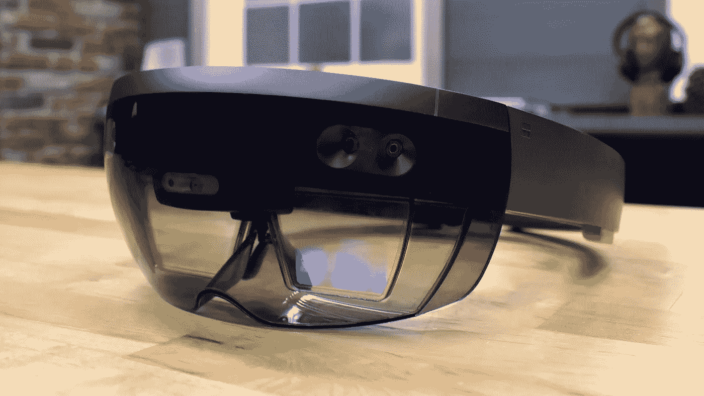
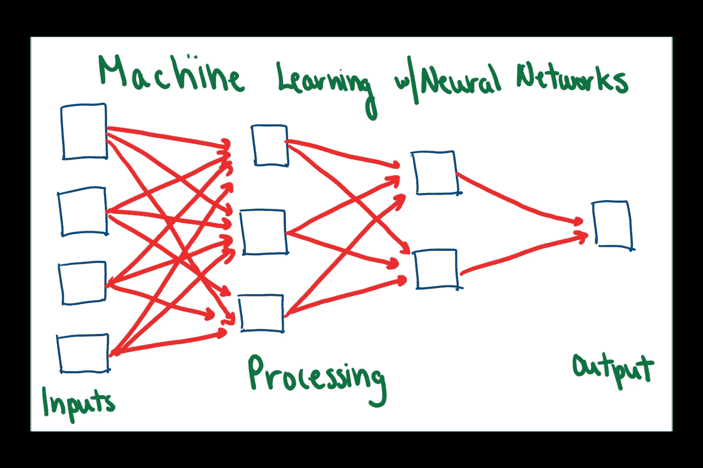
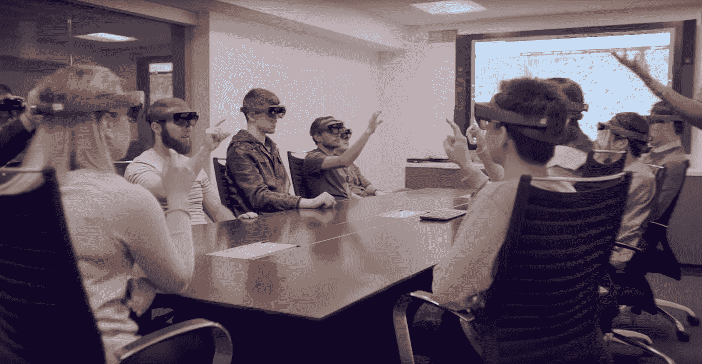

# 用增强现实克服阅读障碍

> 原文：<https://medium.datadriveninvestor.com/overcoming-dyslexia-with-augmented-reality-d9da5458f73a?source=collection_archive---------0----------------------->

## 使用 AR 进行更好的诊断和治疗。

阅读是我们早期学习阶段的基础部分，也是我们获取新知识的主要途径之一。

我读书是为了了解并不真正存在的世界、人和地方。

 [## 人工智能和虚拟现实的融合-你能期待什么-数据驱动的投资者

### 在技术领域，融合是合乎逻辑的一步。就在几十年前，你可能需要一个专门的…

www.datadriveninvestor.com](https://www.datadriveninvestor.com/2018/08/30/the-convergence-of-ai-rv-what-you-can-expect/) 

当我大约两三岁的时候，我的父母给我读简短的儿童读物，然后当我学会自己阅读时，我开始给我的妹妹读。

`This was one of the first books I read.

**《那不是我的机器人》**是我读的第一批书之一。它是交互式的，可视化的，最棒的是它有机器人！🤖

我很幸运，从很小的时候就能够阅读，正因为如此，我能够吸收新知识，质疑我周围的世界，并从一开始就在学校表现出色。

对于很多孩子来说，情况并非如此，因为阅读对我的童年和现在的生活产生了如此重大的影响，我想强调一种我们可以改变这个故事的酷方式。

但首先，我们需要理解这个问题。

# 什么是阅读障碍？

诵读困难是一种学习障碍**。**

当您有阅读障碍时，您可能会有以下一种或多种情况:

1.  **阅读困难**
2.  **说话困难**
3.  **写作难度**

由于**识别语音**和**解码**的问题:将字母与单词相关联。

总之，任何与单词和字母有关的东西都很难。

How Dyslexia feels

# 十分之一的人有学习障碍(梅奥诊所)。其中最常见的是诵读困难。

这影响了很多人，大约 **7 亿！这比北美(加拿大和美国)的人口总和还要多。因此，这是一个需要新的创新解决方案的大问题。此外，**有学习障碍的人辍学的可能性是其他人的 3 倍:(****

# 阅读障碍诊断和治疗效率低下。

目前，阅读障碍(和其他学习障碍)的诊断是来自父母和老师的故事、心理、阅读和写作测试以及其他一些因素的混合物。这并不完全准确，而且是一个缓慢的过程。

## 目前的治疗包括:

*   **阅读更多**
*   **暴露于语音环境**
*   **“阅读障碍条”→一次显示一行字的条。旨在帮助那些有阅读障碍的人。**
*   **IEP 的或个人的教育计划**
*   **其他低效解决方案**

This needs an update.

# 增强现实将改变我们诊断和治疗阅读障碍的方式。🎉

我认为**增强现实将改变世界**最近我了解到**它可以帮助我们更快更有效地诊断和治疗阅读障碍。**

它还不完美，但研究人员目前正在 6-10 岁的学生身上测试 **AR 界面**(他们正处于学习如何读写至关重要的年龄)**以提高读写障碍的识别能力。**

Microsoft Hololens

像**微软 Hololens、**这样的界面，结合用于阅读障碍诊断&治疗的 AR 应用，将改变我们目前处理学习障碍的方式。

# 用于诊断的 AR

为了诊断患有阅读障碍的青少年，研究人员开发了一个移动 AR 集成应用程序，用于测试 **TEDE(特定阅读障碍解释性测试)**的两个错误。他们在厄瓜多尔基多的年轻人身上测试了该应用程序，并能够证明他们的假设，即**增强现实比人工检查更能检测读写障碍。**总的来说，它在阅读障碍和其他障碍的早期发现中发挥了巨大的作用！

I’m as excited as Anna & Elsa are about chocolate about early Dyslexia detection using AR :)

# AR 治疗

最近，几个组织一直在研究 AR 应用程序，以加快阅读障碍的治疗过程。

在 2018 年的一次黑客马拉松上，一群名为“**ART”**的本科生研究人员开发了一个应用程序，其中**使用**机器学习识别写在页面**上的单词，**(另一项很酷的技术)**突出显示** **错误，并预测此人打算写什么，**使用 **AR 界面**。

Diagram of an ML model from ART.

这款应用还没有达到它需要的水平，但是研究表明像这样的应用比普通治疗更有效。

我认为，一旦找出错误，并将应用程序游戏化(这对有学习障碍的儿童和成人来说很重要，因为他们经常需要更多的视觉/交互式学习选项)，这款 AR 应用程序将帮助各地有学习障碍的人。

# TL；博士:

*   诵读困难和其他学习障碍影响了很多人，这抑制了他们有效学习的能力，限制了他们的潜力。
*   当前对阅读障碍的诊断和治疗效率极低。
*   **增强现实(AR)已被证明在早期诊断和治疗方面更好。**

If we use AR to diagnose dyslexia, the need for manual inspection is no longer needed and large groups can be tested at the same time.

**在增强现实应用的帮助下，我们可以改善诊断和治疗阅读障碍和其他学习障碍患者的方式。我们越早诊断和治疗这些疾病，这些人就有越多的时间阅读和写作他们热衷的东西。**

这个项目是我热衷的项目，通过我对 AR 应用的研究，我深受启发！我挑战那些阅读这篇文章的人，把他们独特的知识应用到你所关心的大问题上。

**超过 7 亿人的生活将随着 AR 和 ART 等应用的进步而改变。**我对这个项目的未来以及下一代学习如何使用 AR 阅读的未来感到兴奋。我希望每个孩子都能像我一样体验阅读的快乐，并且今天仍然如此。

如果你喜欢这篇文章:

*   与您的网络共享🙏
*   在评论中给它一些掌声和反馈
*   关注我的媒体博客，获取更多类似的文章。
*   在 [Linkedin](https://www.linkedin.com/in/adara-hagman-78a563171/) 上与我联系，了解我的虚拟&增强现实之旅的最新进展，并给我发消息(我喜欢结识新朋友)。
*   在[推特](https://twitter.com/astro_adara)上关注我。
*   查看我的 TKS 生活[作品集](https://tks.life/profile/adara.hagman)，了解我所有过去的时事通讯&项目。
*   订阅我的[时事通讯](https://adara2.typeform.com/to/xbuEok)，每月更新我正在做的事情！

感谢阅读！现在去改变世界吧！❤