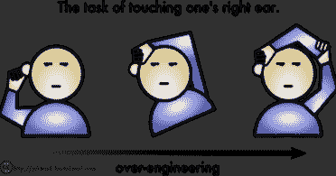
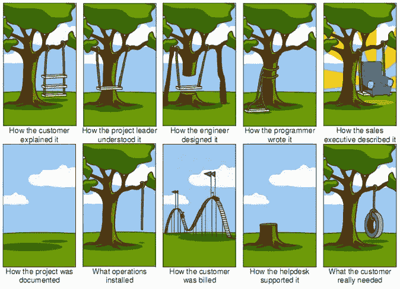
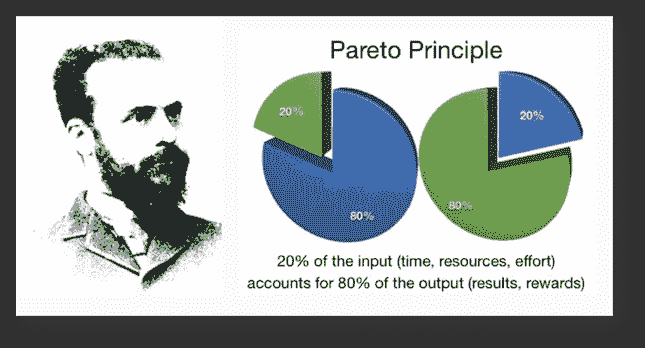

# 过度工程

> 原文：<https://medium.datadriveninvestor.com/overengineering-37a064768042?source=collection_archive---------9----------------------->

在我 6 年的软件工程师职业生涯中，我有幸与各种参与经营科技公司或开发科技产品的人一起工作。谈论我遇到的不同类型的人是另外一个故事，所以我现在不会这样做(阅读这篇文章作为[经理](https://medium.com/@caleb.mbakwe/the-nigerian-manager-865fe782480f)的开始)。
然而，我观察到有经验的优秀软件开发人员有一个趋势。这被普遍称为**过度工程**。

我写这篇文章并不是暗示人们不应该写好的代码，开发好的框架，为产品创建好的文档或者一起处理复杂的问题，不…

[https://twitter.com/jerome_etienne/status/578591043093835776](https://twitter.com/jerome_etienne/status/578591043093835776)

我想说的是:

> 不要过度工程化
> 
> …

# 那么过度工程是什么意思呢？

让我们从一个更大的范围来分析它，然后再往下看编码。
考虑这个场景:客户给软件开发公司带来了一个问题，公司开始了他们典型的开发周期，为客户构建产品。

Overengineering by all (Image source: [https://hackernoon.com/how-to-accept-over-engineering-for-what-it-really-is-6fca9a919263](https://hackernoon.com/how-to-accept-over-engineering-for-what-it-really-is-6fca9a919263))

你会发现，从第一个听到顾客解释的人开始，简单的挂轮胎任务(顾客想要的)就变得复杂了。

好吧，让我们把它带到编程的细节上。想象一下，一家初创公司仍在制定其商业模式，或者既没有形成规模，也没有创造足够的收入。如果一个刚被这样的初创公司雇佣的开发人员试图使用 React 从头开始构建公司的网站(网站，而不是 web 应用程序)，或者如果该开发人员试图使用测试驱动开发(TDD)来创建公司核心平台的最小可行产品(MVP )(还没有人使用它，因此没有证据表明该解决方案会被接受),那么你已经可以闻到过度工程的味道了。这位开发人员正在将一个非常简单的任务复杂化，即(分别)建立一个网站或准备好 MVP。

如果你仔细观察，你会发现过度工程的症结源于我观察到的一个关于人的普遍问题。人们试图把简单的事情复杂化，因为他们可以。

# 为什么你不应该过度工程？

我认识一个开发人员，他用了一个月的时间为我们正在开发的软件产品建立了一个部署管道。平心而论，他试图建立的东西本来是非常好的，但我恳求他先专注于主要产品，然后我们可以稍后优化部署流程，但他不听。最终，我们错过了最后期限，开发者不得不离开团队。
如果我们专注于解决问题和开发产品，也许，仅仅是也许，我们就能在已经很紧的截止日期前完成……

所以这里有一个你不应该过度工作的理由。除了任务**失败的可能性**之外，当你过度工程化时，你最终会**制造你从未有过的问题** …

# 如何识别过度工程？

很难判断一个解决方案何时被过度工程化，但是有一些简单的石蕊测试可以让你知道自己何时被过度工程化。

有一个被称为[帕累托 80:20 原则](https://en.wikipedia.org/wiki/Pareto_principle)的基本原则，它意味着你 80%的产出来自你 20%的投入。这意味着，在你为实现目标所做的一切中，20%的努力实际上占了实现目标的 80%的结果。这意味着，如果你更多地关注起作用的 20%，而不是真正占不了多少的 80%(我敢肯定过度工程就在馅饼的 80%那块)，你肯定会获得更高的成功几率，甚至更好的结果。
简单来说，由于这里的数学可能有些混乱，你会直觉地发现，你做了这么多却得到这么少，当这种情况发生时，你已经过度工程化了。

Image source ([http://www.phildarst.com/1700-2/](http://www.phildarst.com/1700-2/))

我把这个小金块留给你…

工程的本质是解决问题，但事实上，解决一个问题自然会带来其他问题。例如，在发明汽车之前，我们从未真正关心过全球变暖。

所以，请不要通过把简单的事情复杂化(过度工程化)来给自己制造过多的问题，而是要专注于创造解决方案。

被引导…

感谢 [Orjiewuru 王国](https://medium.com/u/4d4f589a7d72?source=post_page-----37a064768042--------------------------------)和 [Olaide Agboola](https://medium.com/u/2d4bd4e9d139?source=post_page-----37a064768042--------------------------------) 审阅本文。