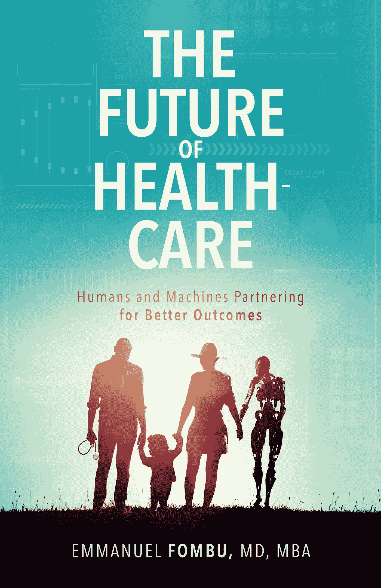

# 人口过剩和自我诊断是医疗保健的破坏者

> 原文：<https://medium.datadriveninvestor.com/overpopulation-and-self-diagnosis-as-healthcare-disruptors-1e0719c57e7a?source=collection_archive---------16----------------------->

> “民主无法承受人口过剩。人的尊严无法在人口过剩中生存。便利和体面无法在人口过剩中生存。随着越来越多的人来到这个世界，生命的价值不仅下降，甚至消失。”
> 
> *—艾萨克·阿西莫夫*

未来最大的挑战之一是人口过剩的威胁。[联合国预测](http://bit.ly/overpopulationstats)到 21 世纪末，世界人口将达到 110 亿，到 2050 年，66%的人将居住在城市。在 1999 年至 2011 年的 12 年间，超过 10 亿人出生。

 [## 医疗保健的未来正在被一场大型技术入侵所塑造|数据驱动型投资者

### 过去十年，全球经济的所有部门都经历了大规模的数字颠覆，而卫生部门现在…

www.datadriveninvestor.com](https://www.datadriveninvestor.com/2018/11/02/the-future-of-healthcare-is-being-shaped-by-a-big-tech-invasion/) 

最重要的是，像印度和中国这样的发展中国家代表了最大的增长，但同时，这些国家也是支持它们的资源最少的地方。这既是挑战也是机遇。毕竟，尽管医疗保健基础设施目前还没有到位，无法帮助这些国家迎来医疗保健的未来，但它们也没有像许多发达国家一样，被可能阻碍它们发展的遗留系统所拖累。

人口过剩是目前的一个热门话题，不仅因为它可能对我们的医疗保健产生影响。毕竟，当医院开始超负荷工作，人手不足和资金不足时，很容易看到随着人口的持续增长会有什么影响。当我们审视我们作为一个物种对环境的影响时，也要考虑巨大的影响。如果大规模的社会变革不能很快实现，我们可能没有多少星球留给未来不断增长的人口。

幸运的是，可能会有一个答案，这个答案依赖于人工智能技术和我们可以访问的巨大数据池。人工智能被吹捧为通过发现缺陷来减轻电网负担的一种方式，以及通过人工智能驱动的“机器人汽车”来减少道路拥堵的一种方式。

就医疗保健而言，随着人口的持续增长和越来越多的人与医疗保健系统互动，人工智能软件可以用来有效地管理和记录资源，并避免短缺。人工智能还可以与机器学习相结合，以分析人口数据，并在医疗保健问题成为更严重的问题之前加以阻止。

但这是一件好事吗？毕竟，如果人口继续增长，那么提供更好的医疗保健可能会降低死亡率，延长平均寿命，从而加剧这一问题。你很难找到人来证明这是一件坏事，但它也可能带来意想不到的后果。但好消息是，部署这些技术可能还有其他优势，比如提高我们的整体生活质量，而不是寿命。这就是医疗保健的未来。

也许这并不奇怪，著名物理学家斯蒂芬·霍金在去世前不久警告了人工智能的危险。据《每日镜报》报道，“霍金先生最近谈到‘地球对我们来说变得太小了’，并说它的指数增长不能再继续下去了。他说，如果人口继续以现在的方式增长，电力消耗将使我们的星球变得“炽热”。霍金还对强大的人工智能(AI)的崛起提出了警告，称这将是人类有史以来最好或最糟糕的事情。我们还不知道是哪一种。"

# 自我诊断

医疗保健行业的一些最大的破坏者是患者本身。根据 Future You 的一项新研究，70%的英国人现在使用谷歌自我诊断和治疗轻微的健康问题，考虑到它的快捷和方便，这个数字可能并不令人惊讶。然而，有趣的是，人们转向谷歌作为他们的第一道防线，在试图预约当地全科医生之前使用搜索引擎。典型的英国成年人一年只看两次医生。

但是事实和数据并没有就此结束。普通成年人现在认为，他们可以在没有专业医疗护理的情况下战胜三分之二的细菌、病毒和疾病。75%的英国人使用家庭疗法来预防疾病，十分之七的人相信在他们生活的某个阶段改变饮食有助于改善他们的总体健康状况。然而，尽管如此，只有三分之一的人让他们的家庭医生意识到他们在就诊前研究了自己的症状。

该研究背后的公司 Future You 的发言人说:“我知道很多人宁愿坚持下去，也不愿因咳嗽或感冒去看医生。许多症状不太严重的人都知道，休息一会儿、吃点健康食品、睡个好觉，就足以让你康复，重新振作起来。”

根据这项研究，最有可能在家治疗的 20 种疾病是:

1.感冒

2.喉咙痛

3.头痛

4.咳嗽

5.唇疱疹

6.腹泻

7.牙痛

8.疣

9.痤疮

10.发热

11.失眠

12.痔疮

13.耳痛

14.湿疹

15.结膜炎

16.过敏反应

17.关节炎和关节痛

18.肿胀的腺体

19.拇趾囊肿

20.胸部感染

# 想了解更多？

我在我的书《医疗保健的未来:人类和机器合作获得更好的结果》中更多地谈到了新技术及其对医疗保健行业的影响。点击此处为自己购买一份。