# 神经网络不同优化器综述

> 原文：<https://medium.datadriveninvestor.com/overview-of-different-optimizers-for-neural-networks-e0ed119440c3?source=collection_archive---------0----------------------->

***在本帖中，我们将开始了解机器学习算法的目标。梯度下降如何帮助实现机器学习的目标。理解优化器在神经网络中的作用。探索不同的优化像动量，内斯特罗夫，阿达格拉德，阿达德尔塔，RMSProp，亚当和那达慕。***

# 机器学习算法的目标

机器学习和深度学习的目标是**减少预测输出和实际输出的差异**。这也被称为**成本函数(C)或损失函数**。成本函数是凸函数。

因为我们的目标是通过找到权重的优化值来最小化成本函数。我们还需要确保算法具有良好的通用性。这将有助于对以前没有看到的数据做出更好的预测

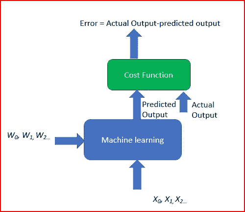

Gradient based learning

为了实现这一点，我们使用不同的权重运行多次迭代。这有助于找到最小成本。这是梯度下降。

# 梯度下降

**梯度下降是一种** **迭代机器学习优化算法，以降低代价函数。**这将有助于模型做出准确的预测。

梯度表示增加的方向。因为我们想找到山谷中的最小点，所以我们需要沿着梯度的相反方向前进。**我们在负梯度方向更新参数，以最小化损失**。

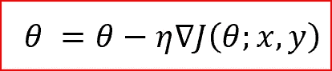

θ is the weight parameter, η is the learning rate and ∇J(θ;x,y) is the gradient of weight parameter θ

# 梯度下降的类型

不同类型的梯度下降有

*   **批量梯度下降或普通梯度下降**
*   **随机梯度下降**
*   **小批量梯度下降**

点击阅读不同类型梯度下降的详情

# **优化程序的作用**

优化器更新权重参数以最小化损失函数。损失函数充当地形的向导，告诉优化器它是否正朝着正确的方向移动以到达谷底，即全局最小值。

# 优化器的类型

## **气势**

**气势如球滚下坡**。球滚下山时动量会增加。

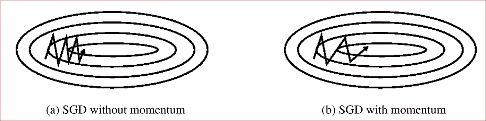

Source: Genevieve B. Orr

**当我们的表面在一个方向比在另一个方向弯曲得更陡时，动量有助于加速梯度下降(GD)**。如上所示，它还抑制了振荡

**为了更新权重，它采用当前步骤的梯度以及先前时间步骤的梯度**。这有助于我们更快地走向融合。

当我们对曲线曲面应用动量优化器时，收敛速度会更快。

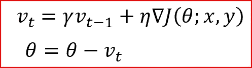

Momentum Gradient descent takes gradient of previous time steps into consideration

## **内斯特罗夫加速梯度(NAG)**

**内斯特罗夫加速优化就像一个滚下山坡的球，但却知道在山坡坡度再次增加之前何时减速。**

**我们计算的不是当前步骤的梯度，而是未来步骤**的梯度。我们评估预测的梯度，并基于重要性更新权重。

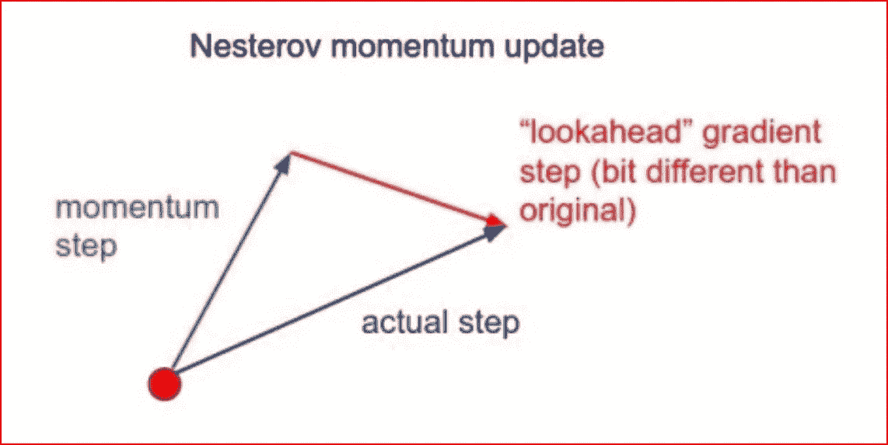

source:[http://cs231n.github.io/neural-networks-3/](http://cs231n.github.io/neural-networks-3/)

唠叨就像你走在我们可以展望未来的山下。这样我们可以更快地优化我们的下降。比标准动量稍好。

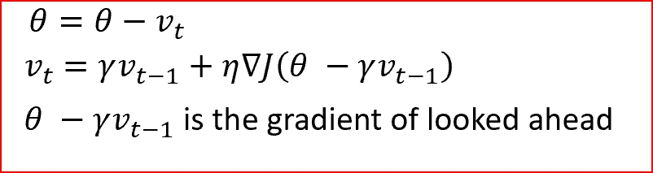

Nesterov Accelerated Gradient

## Adagrad —自适应梯度算法

我们需要调整动量和 NAG 的学习速率，这是一个昂贵的过程。

**Adagrad 是一种自适应学习率方法**。在 Adagrad 中，我们采用学习率作为参数。**我们对不频繁的参数执行较大的更新，对频繁的参数执行较小的更新。**

当我们在大规模神经网络中有稀疏数据时，它非常适合。手套单词嵌入使用 adagrad，其中不常用单词需要更大的更新，常用单词需要更小的更新。

对于 SGD、Momentum 和 NAG，我们一次更新所有参数 *θ* 。我们也用同样的学习率η。在 Adagrad 中，我们对每个时间步 *t* 的每个参数 *θ* 使用不同的学习率

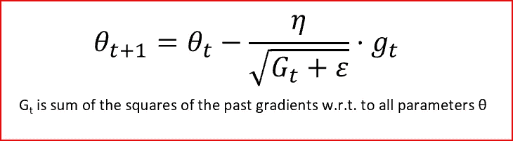

Adagrad

**Adagrad 消除了手动调整学习率的需要。**

在分母中，我们累加过去梯度的平方和。每一项都是正项，因此它不断增长，使得学习速率η无穷小，直到算法不再能够学习。阿达德尔塔、RMSProp 和亚当试图解决阿达格拉德的学习率急剧下降的问题。

## 阿达德尔塔

*   Adadelta 是 Adagrad 的扩展，它也试图减少 Adagrad 的攻击性，单调地降低学习速率
*   这是通过**将过去累积梯度的窗口限制为 w 的某个固定大小来实现的。然后，在时间 *t* 的运行平均值取决于先前平均值和当前梯度**
*   在 Adadelta 中，我们不需要设置默认的学习速率，因为我们采用先前时间步长的移动平均值与当前梯度的比值

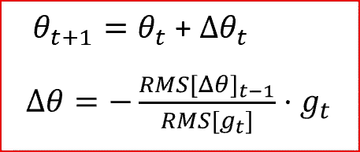

## RMSProp

*   RMSProp 是均方根传播。它是由杰弗里·辛顿设计的。
*   RMSProp 试图通过使用平方梯度的移动平均值来解决 Adagrad 的学习率急剧下降的问题。它利用最近梯度下降的幅度来归一化梯度。
*   在 RMSProp 中，学习率会自动调整，并为每个参数选择不同的学习率。
*   RMSProp 将学习率除以平方梯度指数衰减的平均值

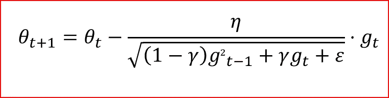

γ is the decay term that takes value from 0 to 1\. gt is moving average of squared gradients

## Adam —自适应矩估计

*   另一种方法是**根据梯度的一阶和二阶矩的估计值计算每个参数的个体自适应学习率。**
*   这也降低了阿达格拉德的学习率急剧下降
*   Adam 可以被视为 Adagrad 和 RMSprop 的**组合，Adagrad 在稀疏梯度上工作良好，rms prop 在在线和非静态设置中工作良好**。
*   **Adam 实现了梯度的指数移动平均来缩放学习速率，而不是像 Adagrad 中的简单平均。它保持过去梯度的指数衰减平均值**
*   Adam 的计算效率很高，内存需求很小
*   **Adam optimizer 是最流行的梯度下降优化算法之一**

Adam 算法首先更新梯度(mt)和平方梯度(vt)的指数移动平均值，平方梯度是一阶和二阶矩的估计。

超参数β1，β2 ∈ [0，1]控制这些移动平均线的指数衰减率，如下所示

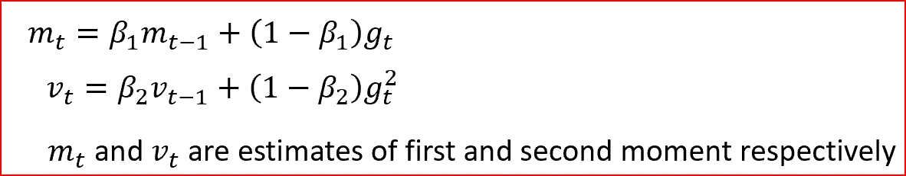

移动平均被初始化为 0，导致矩估计值偏向 0 附近，尤其是在初始时间步长期间。这种初始化偏差可以很容易地抵消，从而产生偏差校正的估计值

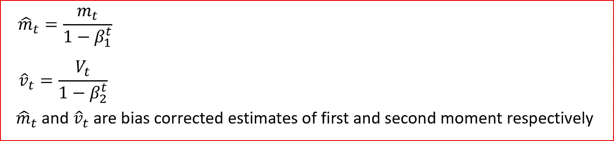

最后，我们更新参数，如下所示

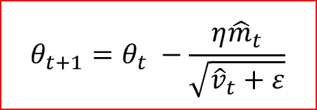

## 那达慕-内斯特罗夫加速的自适应矩估计

*   那达慕结合了纳格和亚当
*   Nadam 用于噪声梯度或具有高曲率的梯度
*   通过对先前和当前梯度的移动平均值的指数衰减求和来加速学习过程

在下面的图表中我们可以看到不同的优化器将如何收敛到最小值。阿达格拉德、阿达德尔塔和 RMSprop 立即朝正确的方向前进并汇合。动量和唠叨被带离轨道，唤起一个球滚下山的形象。NAG 很快纠正了自己

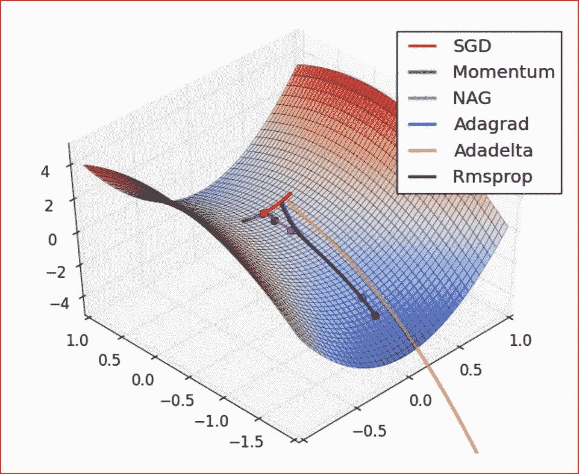

Source Source and full animations: Alec Radford

## 如果你喜欢这篇文章，请鼓掌

## 参考资料:

[亚当:一种随机优化方法，作者 Diederik P. Kingma，Jimmy Ba](https://arxiv.org/pdf/1412.6980.pdf)

[http://cs231n.github.io/neural-networks-3/](http://cs231n.github.io/neural-networks-3/)

[https://arxiv.org/pdf/1609.04747.pdf](https://arxiv.org/pdf/1609.04747.pdf)

[http://yann.lecun.com/exdb/publis/pdf/lecun-98b.pdf](http://yann.lecun.com/exdb/publis/pdf/lecun-98b.pdf)

## 来自 DDI 的相关故事:

 [## 用 7 个步骤解释深度学习

### 和猫一起

medium.com](https://medium.com/datadriveninvestor/deep-learning-explained-in-7-steps-9ae09471721a)  [## 股票市场投资的机器学习

### 当你的一个朋友在脸书上传你的新海滩照，平台建议给你的脸加上标签，这是…

medium.com](https://medium.com/datadriveninvestor/machine-learning-for-stock-market-investing-f90ad3478b64)