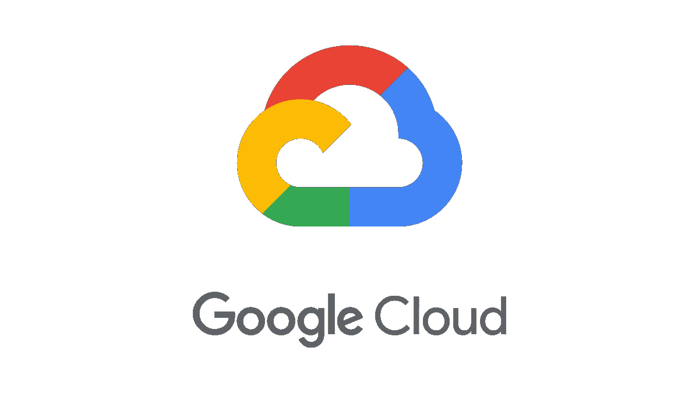
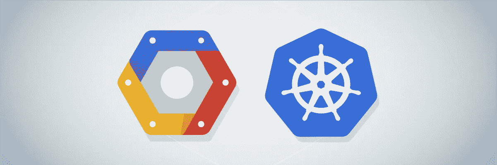
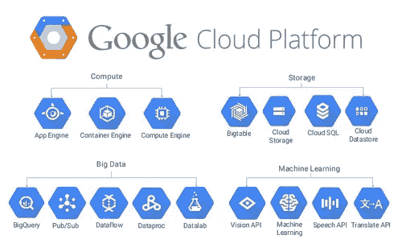

# 概述:谷歌 Kuberenetes 引擎 3 分钟

> 原文：<https://medium.datadriveninvestor.com/overview-the-google-kuberenetes-engine-4c849c851da7?source=collection_archive---------0----------------------->

[https://cloud.google.com/migrate/compute-engine/](https://cloud.google.com/migrate/compute-engine/)

GKE(Google kubernetes 引擎)是一个由 Google 提供的完全托管的 kubernetes 服务，**不需要任何底层资源供应。**

对于那些不知道 Kubernetes 用途的人来说，它**自动化了大部分部署、扩展、记录、监控和负载平衡的过程**。Google Cloud Platform 是一个全面管理的 kubernetes 服务，它提供了增强的功能，消除了大量手动管理和配置资源的负担。

[https://buddy.works/blog/thumbnails/gke-authentication.png](https://buddy.works/blog/thumbnails/gke-authentication.png)

在谷歌云上有 5 个主要类别:

*   计算引擎
*   库伯内特发动机
*   应用引擎
*   云功能(无服务器)
*   托管服务(自动化服务)

 [## 敏捷管理:好的、坏的、丑陋的|数据驱动的投资者

### 公司不断重塑自己，以获得或保持竞争优势和市场份额。这是…

www.datadriveninvestor.com](https://www.datadriveninvestor.com/2019/03/26/agile-management-the-good-the-bad-and-the-downright-ugly/) 

现在让我们来理解 GKE 的确切位置。计算引擎是 IaaS(基础设施即服务)产品。计算引擎通过根据需求生成虚拟机来提供所需的原始计算能力。另一方面，App Engine 是 PaaS(平台即服务)产品。这意味着这里的重点在于代码和应用程序，而不是它应该运行的基础设施。

现在，为了理解这在真实意义上意味着什么，让我们假设我们有不同的机器(或虚拟机)运行应用程序所需的部分。没有允许这些机器相互通信和查找的网络结构。我们该怎么办？嗯，你猜对了！这就是 GKE 天衣无缝的做法。

[https://www.gonnasolutions.com/wp-content/uploads/2019/01/google-cloud-platform.jpg](https://www.gonnasolutions.com/wp-content/uploads/2019/01/google-cloud-platform.jpg)

GKE 正好处于计算引擎和应用引擎之间，作为一种混合产品，提供增强的功能，这些功能与 IaaS 不同，可以提取细节，但同时可以更好地控制资源以及如何管理资源，这与 PaaS 不同。

到目前为止，你应该很容易理解 GKE 甚至是库伯内特斯的由来以及为什么需要它。

在最高级别上，Kuberenetes 是一组 API，因此可以使用它在一组称为集群的节点上部署容器。现在，如果您不知道什么是容器、节点或集群，请不要担心，我将很快解释它。

什么是容器，我为什么需要它？

答:**容器**基本上是一种操作系统虚拟化的方法。一个集装箱被用来建造积木，这有助于生产效率、环境一致性和提高生产率。其理念是提供工作负载的独立可扩展性以及操作系统和硬件的抽象层。容器是一个映像的运行实例(这类似于系统的 ISO 映像，但是在云上)。简单地说，它们就像是“应用程序代码的交付工具”。如果你听说过 Docker，那就是运行这些操作系统映像的基本工具。容器用于消除传统虚拟机中出现的内核冗余。他们通过创建用户空间抽象和容器运行时来做到这一点。

什么是节点？

答:根据集群的不同，**节点**可以是虚拟机或物理机。

什么是集群？

答:**集群**是一组节点。默认情况下，GKE 配置一个包含 3 个相同节点的分区群集。

现在，所有最初的困惑都一扫而光，你可以开始学习谷歌 Kubernetes 引擎(GKE)的基础知识了。在下一篇文章中，我们将尝试理解 GKE 的特性和组成部分。