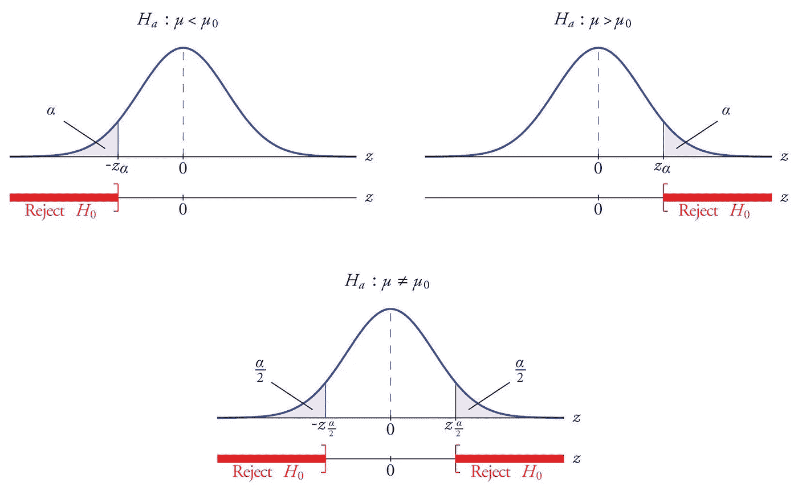
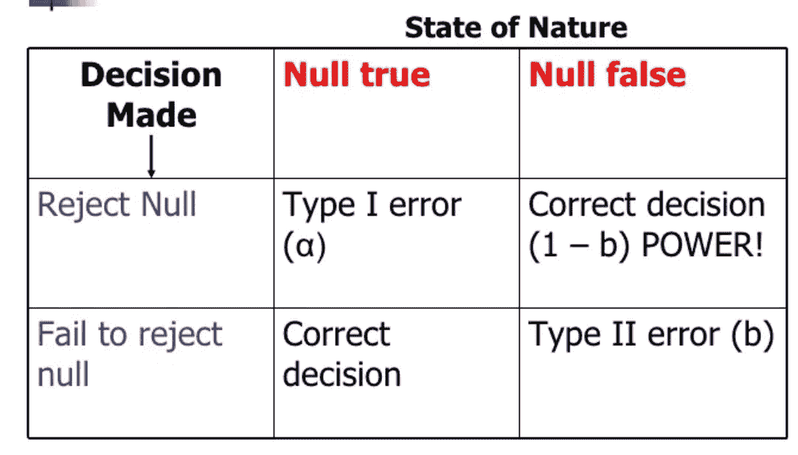
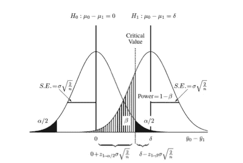

# p 值、显著水平、功效和假设检验

> 原文：<https://medium.datadriveninvestor.com/p-value-significant-level-and-hypothesis-testing-4895524ec3f3?source=collection_archive---------2----------------------->

[https://www.statisticssolutions.com/to-err-is-human-what-are-type-i-and-ii-errors/](https://www.statisticssolutions.com/to-err-is-human-what-are-type-i-and-ii-errors/)

**P 值**在假设检验中有助于确定统计显著性。

**假设检验**是基于两个假设的统计检验:原假设( **H0** )和备择假设( **H1** )。

**零假设(H0)** : H0 总是假设在特定人群中没有显著影响/差异。

**另类假设(H1)** : H1 总是与 H0 意见相左。

# **假设检验的目的**

即使结果显示了特定人群中的差异/影响，我们仍然需要从统计学上证明这种差异/影响不是由随机变化引起的，而是具有真正的统计学意义。

# p 值

p 值是计算出的 H0 为真的概率。p 值是在 H0 为真的情况下，获得至少是极端结果的概率。

假设 H0 是真的，利用统计假设，执行一组数学/统计计算来估计我们观察到的情况的概率。

如果 P 值低于预定义的显著性水平(**α显著性水平**，那么我们拒绝 H0 而支持 H1，因为有足够的证据证明 H0 是错误的。

# 显著水平(α)

α是预定义的拒绝 H0 的概率，假设 H0 为真(I 类误差)。换句话说，如果 P 值低于α，这意味着:在观测中，拒绝真实 H0 的几率很低，所以我们支持 H1。

# 电源(1-b)

统计功效是假设检验中的一个重要术语，因为它是评估**样本量**的一个指标。高功效表明样本大小适合假设检验；如果没有，这意味着，我们可能需要增加更多的样本量来实现假设检验，或者尝试进行自举或重采样。

# **一类和二类权衡**

修改 I 型误差或 II 型误差的比例需要权衡。因此，我们需要根据具体假设检验的事实来决定 I 型和 II 型误差的变化。

[http://www.columbia.edu/~cjd11/charles_dimaggio/DIRE/styled-4/code-12/](http://www.columbia.edu/~cjd11/charles_dimaggio/DIRE/styled-4/code-12/)

引自[http://faculty . arts . UBC . ca/hkasahara/econ 325/notes _ power . pdf](http://faculty.arts.ubc.ca/hkasahara/Econ325/notes_power.pdf)

> *“为了理解 I 型误差和 II 型误差之间的权衡，考虑下面的例子。在我们的司法系统中，一个受审的人在被证明有罪之前都被认为是无辜的。所以，我们设定零假设，假设一个人是无辜的。然后，在审判中，我们评估证据，并询问是否有足够有力的证据来推翻一个人无罪的推定。但是，要做出有罪判决，证据必须有多强呢？在假设检验中，我们把一个无辜的人投入监狱的概率(I 型错误)设得很小:这个概率称为显著性水平α。如果被审判的人事实上是无辜的，通过要求更有力的证据来降低α值是一件好事(降低 I 型错误的概率)。然而，要求更强有力的有罪判决证据可能会增加给有罪的人无罪判决的概率(增加 II 型错误的概率)。”*

***如果有人发现我的错误，并在私信或评论区为我评论出来就好了！如果你认为我的工作很好，请给我轻轻的掌声。:)***

***感谢阅读，快乐阅读！***