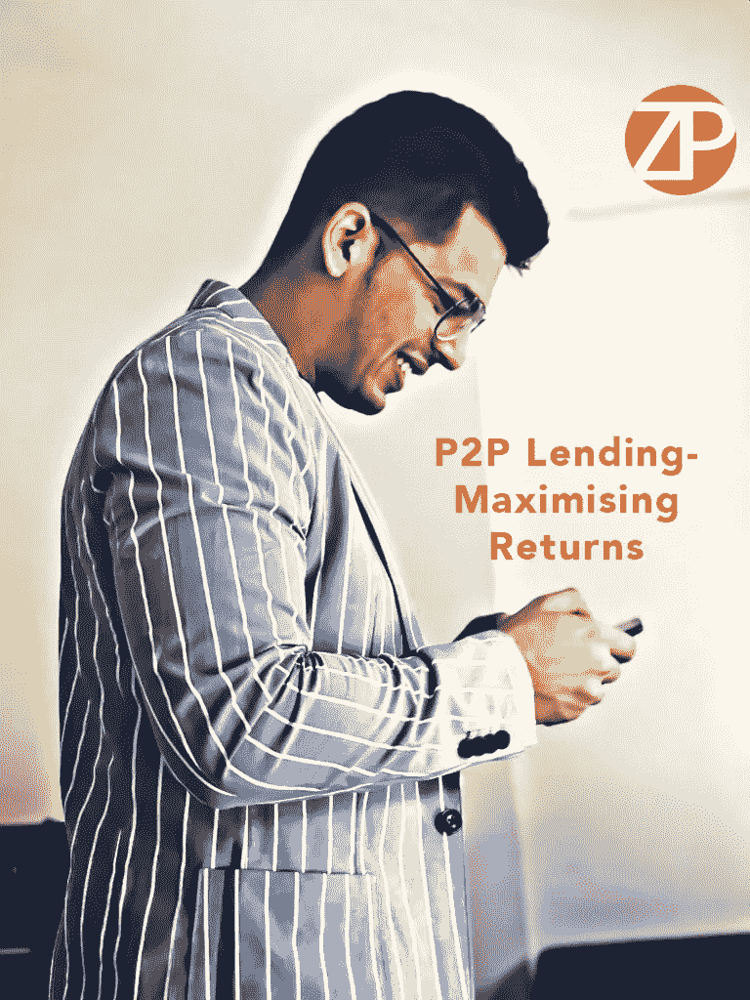

# P2P 贷款——回报最大化！

> 原文：<https://medium.datadriveninvestor.com/p2p-lending-maximising-returns-e8431e75e9bb?source=collection_archive---------29----------------------->

我个人是 P2P 借贷领域的积极投资者，不仅投资了我自己的公司 Z2P，还投资了其他公司。过去，我在各种平台上投资了 20 多亿印度卢比，以赚取高回报并接受违约，这一切我都看到了。我确实相信，目前，P2P 贷款是让你的财富快速增长的最有效的工具。

在这里，我将给出季节性贷款人如何通过 P2P 贷款成倍增加财富的证明方法。季节性放贷者和临时放贷者的主要区别在于，临时放贷者在短时间内贷出少量资金，然后比较回报。结果是，他们害怕延期和违约。另一方面，季节性贷款人很有耐心，在很长一段时间内投入大量资金，以获得更大的累计回报。这反过来转移了人们对拖延和违约的注意力，因为他们现在能够看到更大的图景。

但是，我不会建议盲目进入 P2P 市场。这是一个动荡的市场，在通过它放贷之前，你必须仔细关注该公司的信用评级和复苏政策。在选择阶段变得聪明会大大增加你指数增长的机会。
另一个重要方面是分散投资组合。在一个较大的投资组合中投资较小的金额，而不是在一小群人中大量投资，这总是明智的。

让我给你几个场景，涵盖不同类型的贷款人

考虑一下 Z2P 的情况，我们给出 5%的月收益率。

**贷款人:1(临时贷款人)** 投资 5 万卢比 12 个月。
12 个月的利息收入:3 万卢比
，违约率为 1%，总违约金额:6000 卢比
全年实际回报:24000 卢比= 2000 卢比/月(相当低)
*净年回报率:48%*

**贷款人:2(新贷款人——成为季节性贷款人)** 每月递增投资 50，000 卢比，为期一年。
12 个月结束时的总投资组合:600，000 卢比
12 个月的利息收入:195，000 卢比
按 1%的违约率，总违约金额:39，000 卢比
12 个月的实际回报:156，000 卢比= 13，000 卢比/月(非常高，相当于一个独立的收入来源！)
*净年回报率:48%*

**贷款人:3(到期季节性贷款人)** 投资 5 lac 12 个月。
超过 12 个月的利息收入:3，000，000 卢比
按 1%的违约率计算，总违约金额:60，000 卢比
超过 12 个月的实际回报:2，40，000 卢比= 20，000 卢比/月(高得吓人，不亚于一个独立的收入来源！)
*净年回报率:48%*

要证明的一点是，P2P 贷款是一个长期高投资的游戏——这反过来会以巨大的利润压倒你的违约和逾期付款，并给你一个更广阔的前景。