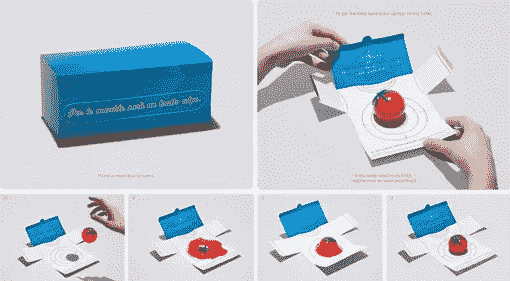

# 在信息经济中，痛苦就是收获

> 原文：<https://medium.datadriveninvestor.com/pain-is-gain-in-the-information-economy-23d7a2c2e1cc?source=collection_archive---------21----------------------->

## 如果它让你痛苦，人工智能可以做得更好。

我曾经和一家矿产租赁控股公司的首席软件工程师一起训练柔术，这家公司每年有数百万美元的业务。肩负如此重大的责任，当他缺席训练时，我并不感到惊讶。尽管如此，我还是取笑他，他工作到很晚的借口让我震惊。他在周五晚上“装信封”寄给承租人！

Susan was an NBC executive. She died licking envelopes.

多么鼓舞人心！在花了一整天时间编写计算机代码，以最佳方式买卖价值数百万美元的租约后，这个可怜的家伙开始打印聘书，并手动邮寄出去。这似乎是对他才能的无聊浪费。更糟的是，他的柔术落后了！我感觉很糟糕，我提出周末来帮他，如果他答应之后训练的话。幸运的是，他拒绝了。

How much you mail depends on what you’re sending.

尽管他愚蠢地放弃了格斗，但我们仍然是朋友，有时会一起吃午饭，讨论一些重要的问题，比如基本的注意力令牌和函数式编程。在我们上次的讨论中，我碰巧提到我参与了一个优化直邮的机器学习项目。我甚至不记得他的信封故事，直到我提到了直邮这个词。他听天由命的态度再一次让我震惊。显然，他认为机器学习的最佳用例是节省邮资。

> “是的，我们试图在内部做类似的事情，但并没有真正奏效。我们从积极的回应中获益良多，因此给每个人发邮件是有意义的……我们每六个月给每个潜在客户发一次邮件。”

我忍住尖叫，同情地点点头，问道:

> “您是否做过任何研究，以确定每六个月向潜在客户发送邮件的最佳次数是“一次？”

他停顿了一会儿，说:“不，不是真的。这是一个有趣的观点。你终究不想给人寄太多。”我再次同情地点点头，喝完我的咖啡，然后跑到最近的电脑前联系这个行业的每一个主要参与者。租赁交易世界竞争激烈。如果像我朋友的公司这样的公司能够通过这种 90 年代的直邮方式生存下来，那么利用机器学习和先进的数据科学进行颠覆性变革的空间就大开了。当我把这个问题作为创新的机会提出来时，反响非常热烈。没有人愿意周五下班后留下来，整个周末都带着剪纸。

Direct Mail is a great way to build trust.

无聊的 IT 工作者是一个危险信号，你没有使用足够的人工智能。填充信封很无聊，但寻找优化流程的方法很有趣。没有什么比在更短的时间内获得更好的结果更令人满意的了，简单地改变一个问题。当你将数据科学或人工智能应用于一个问题时，在你伸手拿订书机或钱包之前，先来一场头脑风暴。

这是一个我如何将一个失败的用例变成一个改变游戏规则的机器学习应用的例子。

1.  如果你不能少寄邮件，那么你必须多寄:**使用神经网络来预测每个潜在客户的最佳发送次数。**
2.  不要满足于仅仅是“相关”的信息:**机器学习扩大了相关信息的范围，让以前无用的数据变得极具价值。**
3.  你控制的变量比你想象的要多:**一个完全人工智能优化的系统调整发送的时间和顺序。您可以在最佳时机联系潜在客户，以提高转化率，并以最划算的方式获得客户。**
4.  邮件服务于多种目的:**使用人工智能优化的邮件来提高转化率，为未来的报价创造潜在客户，并保持你的品牌在潜在客户心目中的位置。**
5.  流程服务于目标:**如果成本效益分析是正确的，流程的每个方面都应该进行更改。期待人工智能理解你业务的范围和细节，让科学打开瓶颈。**

人类的大脑喜欢做它擅长的事情。我们喜欢表达自己，寻找模式，寻找答案，解决复杂的问题。没有人喜欢猜随机数，舔信封，或者做长除法。痛苦和无聊是我们的才能被浪费的信号。与其痛苦，不如相信你的创造力，找到更有效的方法来完成每一项任务。在当前的信息经济中，如果你付钱让某人做他们讨厌的事情，你就是在浪费钱。

AI expands the power of creativity by allowing us to focus on questions.