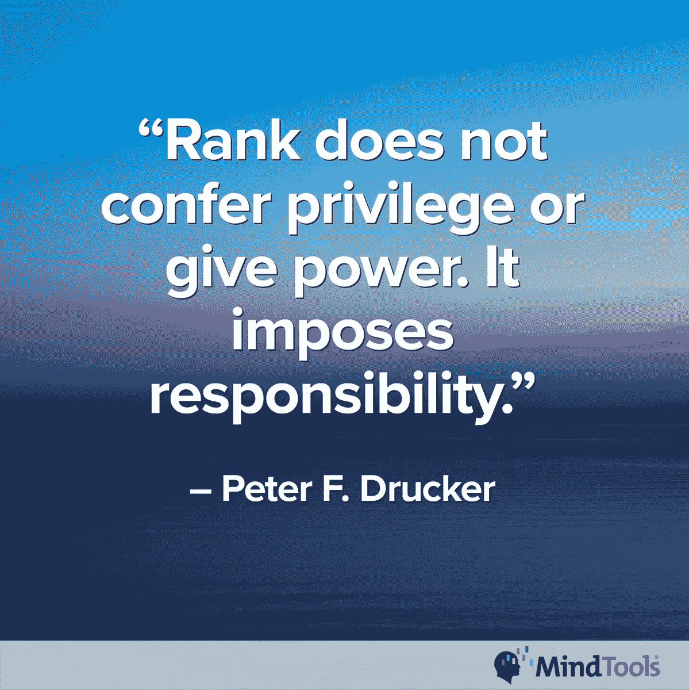
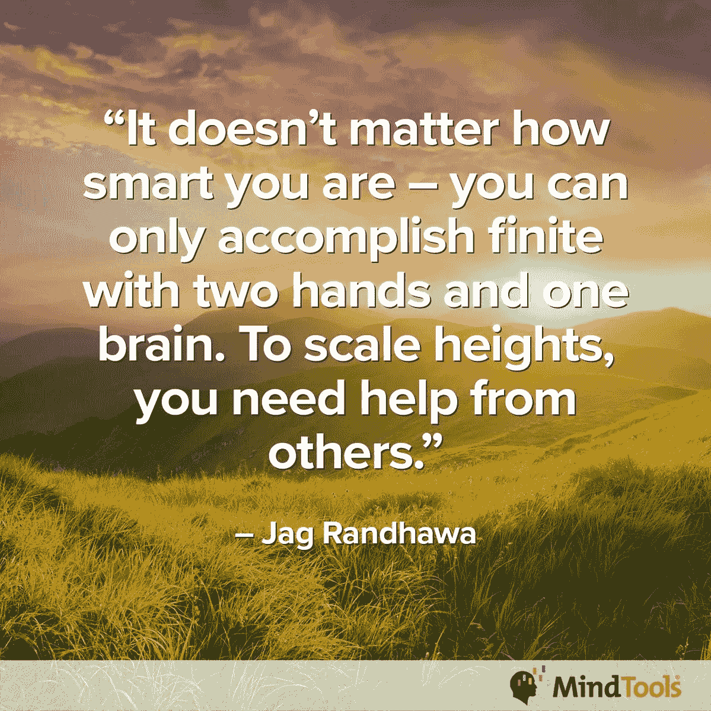
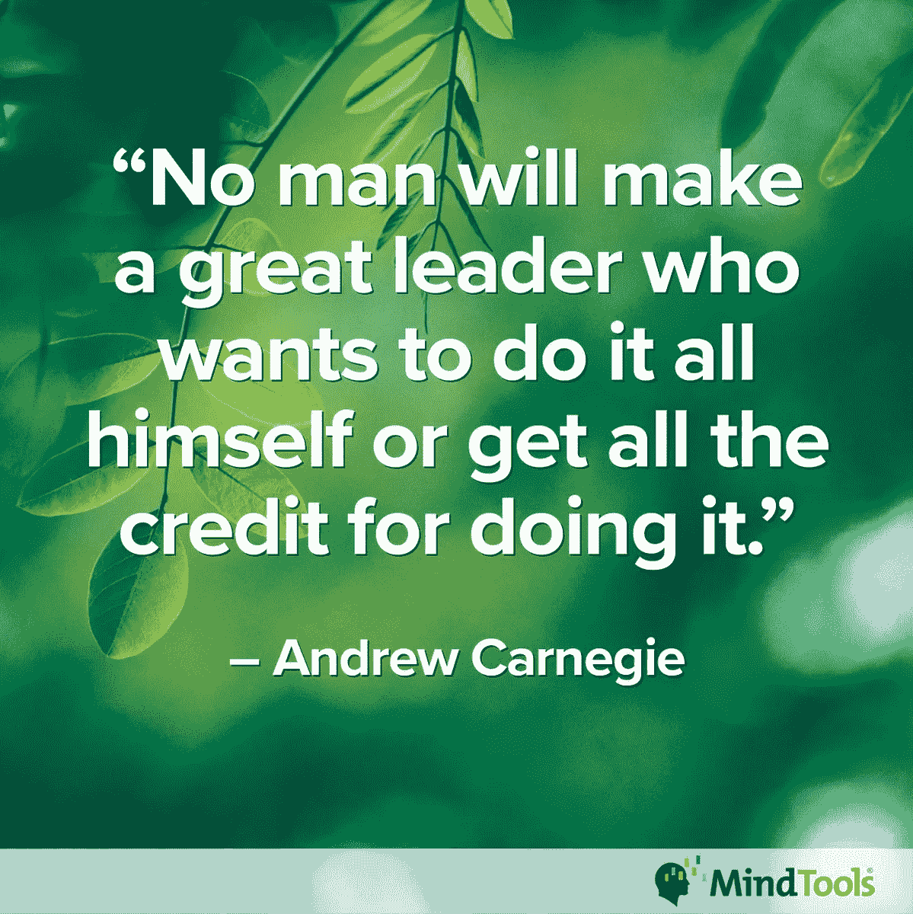
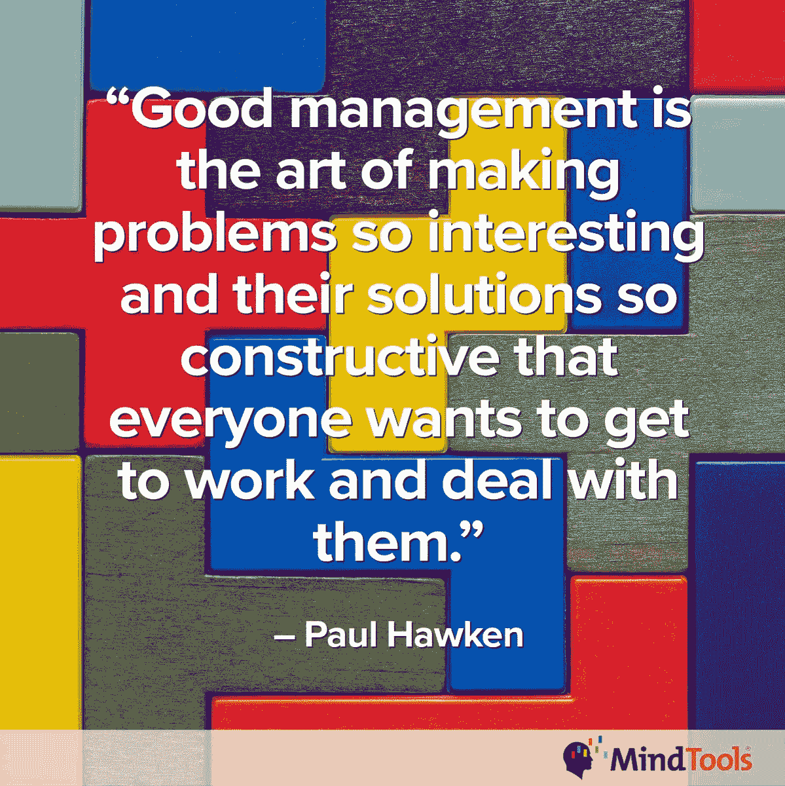
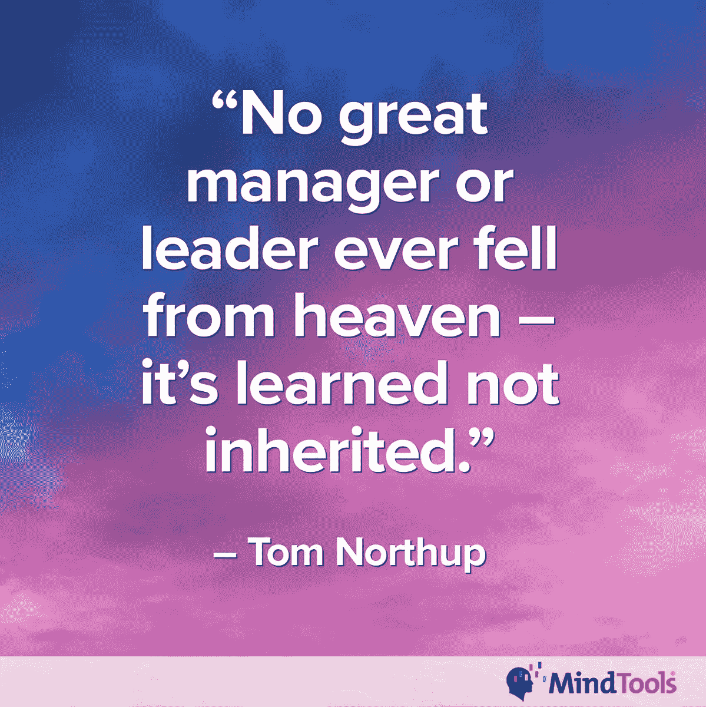

# 痛点可以成就或摧毁领导者

> 原文：<https://medium.datadriveninvestor.com/pain-points-can-make-or-break-leaders-396f916daecd?source=collection_archive---------3----------------------->

## 经理们面临挑战，比如与难相处的人打交道

尽你所能，管理一个团队可能是一件痛苦的事。

全球最受欢迎的按需职业和管理学习解决方案之一 MindTools 列举了最常见的团队管理痛点:

*   成为一名新经理
*   与难相处的人打交道
*   应对相互冲突的需求

[Narmadhaa Sivaraja](https://twitter.com/s_narmadhaa) “职业是文案，激情是博客作者” [Ashley Murray](https://twitter.com/MurrayAshley) ，法律和税务服务分支经理，加入了 MindTools 专家的行列，谈论管理团队的日常痛点。

根据不同的个性，让人们保持快乐和高效可能是一件苦差事。工人可以把行李从家里拖进来。

“你必须解决团队之间的小分歧，他们应该有意识地自己处理，”西瓦拉贾说。“做老师。

“有时候经理们从来没有休假，”她说。“就好像他们每次都必须在周围为每个人谈判和解决问题。也缺乏参与。”

 [## 工人和技术就不能做朋友吗？

### 人员和技术的差距是一个棘手且昂贵的问题

medium.com](https://medium.com/datadriveninvestor/cant-workers-and-tech-just-be-friends-3d1f7175a039) 

Mind Tools 还注意到了技术过载，在某些情况下，甚至需要在下班后在线。

“你需要平等公正地平衡流程、任务和人员，”默里说。“人们需要管理自己，才能真正有效和投入。其他任何事情，我们都在欺骗自己。令人兴奋的是让那些有潜力的人达到那个程度。

“我知道没有权力就有责任，”她说。“这是公司对经理做的最糟糕的事情。”

# 挥之不去的危险

你越是让问题拖延，痛点就变得越痛苦。

“他们永远不会结束，”西瓦拉贾说。“一件事导致另一件事…

“痛点让人分心，”她说。“它们让我们频繁地改变我们的优先事项，这只会让我们效率更低。”

根据 MindTools 的说法，痛点不可能一劳永逸地解决——它们是连续的。棘手问题很复杂，会占用经理大量的时间和精力。

有很多管理上的误区。MindTools 的一篇文章强调了新经理的七大惊喜。

对于一个新经理来说，一个棘手的问题是什么时候可以向他人寻求帮助。首先，承认你需要帮助。骄傲很难克服。

“当你需要帮助时，学会如何寻求帮助至关重要——特别是当涉及风险时，比如错过了一个关键的最后期限，”MindTools 专家说。“如果你因工作量大或缺乏技能而面临工作质量低下的风险，寻求帮助。”

西瓦拉贾判断何时寻求帮助:

*   当你知道自己不擅长严厉时。
*   当你工作过度需要休息时。
*   当你不确定如何处理一种情况，但知道其他人可以帮助你。

“如果你是一名新经理，你可能会想要思想开放，”西瓦拉贾说。“队里可能有学长，有很多可以分享的。等级制度并不总是经验的标志。

 [## 你发自内心的感激表明你真的在乎

### 给予感激必须是每天的事情

medium.com](https://medium.com/an-idea/your-heartfelt-gratitude-shows-you-really-do-care-eeed3dbd56fe) 

对以前的同龄人保持开放和接受的态度，但不要指望改变根深蒂固的态度。尽可能保持新关系的专业性。

“要明白，人们很难让自己的同龄人在职业生涯中超越他们，”西瓦拉贾说。“不要因为你得到了提升，就改变你对他们的态度。不要当老大。”

领先于同事升职时保持专业可能很难，但这是必须的。

“别往心里去，”默里说。“保持包容性，让他们对自己擅长的领域负责。认可他们的意见。

“如果疼痛持续并影响团队或表现，与他们进行一次重要的谈话，”她说。

MindTools 建议保持谦逊:“让人们知道你尊重他们的知识和专长，以及他们给团队带来的价值。”

# 支配和批判

当团队中的一名成员主导团队讨论并迅速批评他人的想法时，可能会出现与难相处的人打交道的情况。

旧的标准规则是:公开表扬，私下解决问题。当问题继续得不到解决时，与年度反馈相比，频繁的沟通也是有帮助的。

“在分散讨论之前，试着让每个人都贡献出自己的想法，”Sivaraja 说。“听别人说话。鼓励其他人也这样做。”

 [## 慷慨的礼物不断给予

### 注意并尊重彼此的贡献

medium.com](https://medium.com/datadriveninvestor/generositys-gift-keeps-giving-155adfc5dd54) 

不要假设其他人了解他们行为的影响。

“问他们是否意识到他们这样做，”默里说。“通常，为了让自己‘被倾听’或与他人相关，人们会过度补偿，甚至没有意识到这一点。”

MindTools 补充道，经理们应该“明确表示，你欣赏每一个声音和每一个想法，你希望听到每个人的意见。如果对方插话，礼貌地请他们等对方说完或者轮到他们说话。

如果一个团队成员看到了所有事情的消极面，这降低了团队的士气，鼓励这个沮丧的团队成员——再一次在私下——更有团队精神。找出导致这种态度的潜在问题。

“也许考虑最坏的情况是好的，”西瓦拉贾说。“这有助于我们做好准备。也就是说，如果这就是团队成员所做的全部工作，我们可能需要让他们尝试为相同的场景列出一系列积极因素。见两面。

“我喜欢换挡的想法，”她说。“即使是最悲观的团队成员也会希望有好的一面。我们只需要帮他们找到它。管理一个由不同人员组成的团队，很大程度上是为了在敏感的情况下找到平衡。”

 [## 每个人都想被听到

### 双向对话有助于沟通和建立友谊

medium.com](https://medium.com/datadriveninvestor/everyone-just-wants-to-be-heard-a1c82c56dc4c) 

MindTools 倾向于使用积极的倾听技巧，给“悲观主义者时间解释他们的想法。保持开放的心态，试着对他们所说的保持客观。

“和悲观主义者一对一坐下来，解释他们的消极态度是如何影响他人的，”MindTools 说。"举出具体的例子，让他们明白自己行为的影响."

默里提醒经理们不要太苛刻。

“首先使用柔和的方法来影响积极的行为，”她说。“问一些问题，让他们了解这是如何影响整体团队道德的。

“如果没有改善，就采取零容忍的方法，”默里说。"毒性扩散得太快，不能作为当务之急加以抑制."

作为一名经理，在你的团队中有一个悲观主义者是令人沮丧的。MindTools 有一篇关于如何用四种简单策略管理悲观主义者的文章。

# 冲突的需求

第三个痛点——应对相互冲突的需求——当你被上级要求不要透露信息时，如何回答团队提出的问题。

在这种情况下，倾听团队的问题，告诉他们你会转达他们的担忧。此外，诚实地告诉他们，你现在没有关于这个问题的信息。

“我建议透明度，”西瓦拉贾说。“在大多数情况下，团队成员都明白每个公司都有应该保密的事情。如果他们不理解，那是他们应该学习的一件事。秘密和保密是有区别的。

“如果你对你的团队很满意，就开个你自己都不知道一半的玩笑，”她说。

MindTools 也采取了谨慎的路线。

“尽你所能告诉他们，”专家说。“让他们知道你会尽可能地让他们了解最新情况。

“让团队知道你站在他们一边，即使有时你不能告诉他们细节，你也会为他们而战，尽你所能为他们出头，”他们说。

走动练习[管理。这有助于你与你的团队保持联系，并让你从办公室的局限和孤立中解脱出来。](https://medium.com/@JKatzaman/walk-in-the-footsteps-of-leaders-6ca0b8dc7b49)

“使用良好的时间管理和适当的任务管理，”西瓦拉贾说。“团队领导应该接受这样的事实，有时他们会整天和团队在一起，这没关系。最好不要为此自责。毕竟，领导者工作的主要部分是确保团队有动力。

“领导力不是对团队进行微观管理，”她说。“你应该相信你的团队是负责任的。尊重彼此的隐私，给他们自己的空间，这对一个好团队来说至关重要。”

根据 MindTools 的说法，要学会分清主次。“也要以一种人们知道他们可以相信你的话的方式行事。如果你承诺在一小时内回复某人，那就在一小时内回复他们。”

界限，就像栅栏，让你保护对你有价值的东西。他们也允许你控制谁和什么进入你的空间。

MindTools 有一篇关于如何管理你的界限的文章。

 [## 合作:我们将一起度过难关

### "竞争没有过时，但不惜一切代价赢得比赛才应该过时."

medium.com](https://medium.com/datadriveninvestor/collaboration-were-going-to-through-it-together-d630dcf6524f) 

协作始于沟通，包括积极倾听。保持联系和倾听理解可以带来富有成效的合作。

默里说:“通过在团队会议上安排同行认可时间，灌输团队精神、共同目标和协作工作风格。”“说包容性的语言。让它成为公司文化的一部分。”

西瓦拉贾强调，大家都在一起。

“要有团队精神，”她说。“愿意接受反馈并进行合作。当领导者思想开放时，也会对团队产生连锁反应。”

MindTools 建议“不要在小问题上大惊小怪。也允许人们在一定限度内犯错误，并把它当作学习的机会。

“对每个人都一视同仁，”专家说。“对所有人表现出同样的尊重。榜样的优雅行为。经常谈论团队的愿景和目的。从您的团队成员那里获得信息。”

尽早解决棘手问题，这样你就不必经常去解决它们。了解你的团队，这从一开始就可以追溯到良好的沟通实践。小问题不会自己解决，如果不在一开始就解决，问题会迅速扩大，而且是永久性的。

“从痛点中，我们了解到领导者不是天生的，”西瓦拉贾说。"随着时间的推移，我们通过领导、学习和实践我们所学的东西来培养领导技能."

MindTools 专家解释说，痛点“有时会教会我们不要做什么，以及如何不去行动。保持敏锐的观察力和开放的心态。你的痛点可能会揭示你需要更多了解的领域，或者你可能需要辅导或指导的地方。”

MindTools 的一篇文章解释了如何使用策略和工具来了解你当前的情况，并为接下来的事情做计划。

**关于作者**

吉姆·卡扎曼是[拉戈金融服务公司](http://largofinancialservices.com)的经理，曾在空军和联邦政府的公共事务部门工作。你可以在[推特](https://twitter.com/JKatzaman)、[脸书](https://www.facebook.com/jim.katzaman)和 [LinkedIn](https://www.linkedin.com/in/jim-katzaman-33641b21/) 上和他联系。