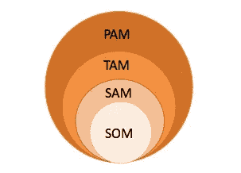

# 帕姆，塔姆，萨姆，索姆

> 原文：<https://medium.datadriveninvestor.com/pam-tam-sam-som-what-are-they-3526cecb0b04?source=collection_archive---------1----------------------->

# 4 业务评价的主要指标

这些缩写，乍一看令人费解，让你了解你的商品或服务的市场容量。

它们的解释如下:

1. **PAM —** 潜在的可用市场

2.**TAM**——目标/可用市场总量

3.**SAM**–可服务的可用市场

4.**SOM**–可服务和可获得的市场

下图显示了它们之间的相关性:

让我们更详细地考虑一下每个索引。

**TAM(总目标市场/可用市场)**–显示核心市场中有多少客户需要您销售的同类商品和服务中的商品或服务(他们不一定买得起这些产品，但有需求)。

换句话说，如果你需要估算 TAM，回答以下问题是必不可少的:什么类型的客户会对你的产品感兴趣(有需求)以及有多大的量？

**举例:**你为全俄罗斯的企业销售网站。让我们假设俄罗斯有 500 万家公司，其中 50%想创建一个网站。在这种情况下，TAM 量相当于 250 万个网站。如果一个网站的平均价格是₽30'000，那么总的可用市场将估计为₽75 数十亿美元。

**SAM(可服务的可用市场)**–是实际可达到的总目标市场(TAM)中的“客户”部分；这意味着该指数显示了准备购买与您的产品或服务类别相同的产品或服务的客户数量。

想想谁愿意购买你的产品，购买量有多大？

**举例:**你为零售商销售网站。假设市场上有 800，000 家这种类型的公司，其中 80%想要创建网站，那么，SAM 估计为 640，000 家公司。

**SOM(可服务和可获得的市场)** —是 SAM 的一部分，考虑到该市场的战略发展和竞争对手的行动，贵公司渴望并能够占据该市场。

对以下问题的回答可以帮助你理解 SOM:谁会购买你的产品，购买量是多少？

**举例:**你是卖网站的商家，你公司有 10 个设计师，10 个程序员。它允许你每月创建 100 个网站。这意味着 SOM 估计每年有 1200 个网站。

**PAM(潜在可用市场)** —代表这些商品和服务的全球市场，不受任何地理和其他因素的限制。

**示例:**对于网站，PAM 将代表全球网络开发市场。

强烈建议您的企业清楚了解这些指标。对你的公司来说，估算它们中的每一个并研究市场以了解更多关于类似项目和竞争对手的信息将是有用的，这将使你的估算更加精确。