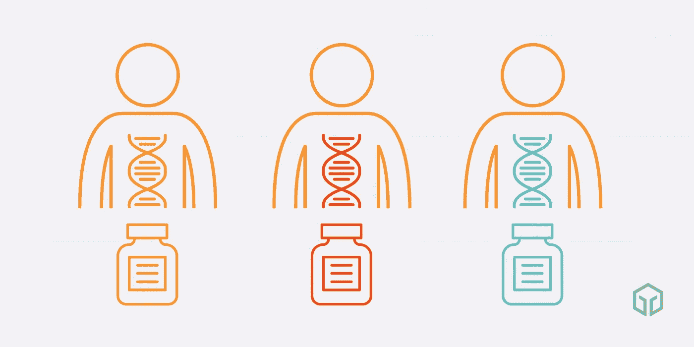
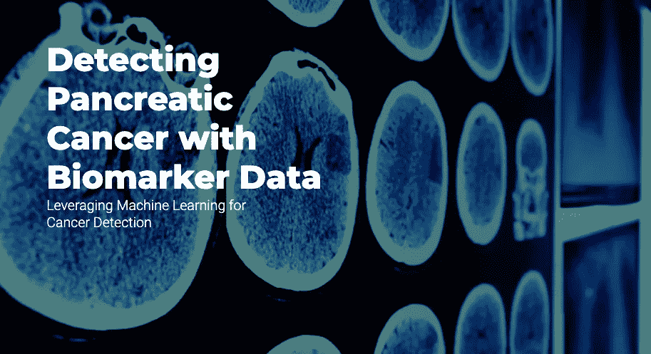
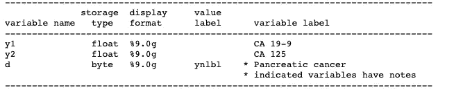
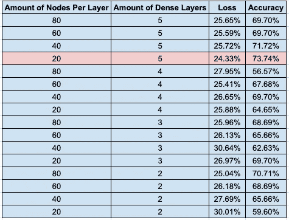

# 基于机器学习的生物特征胰腺癌检测

> 原文：<https://medium.datadriveninvestor.com/pancreatic-cancer-detection-with-biometrics-through-machine-learning-42f3585db8ff?source=collection_archive---------2----------------------->

> 答:本文假设对神经网络有很好的理解。关于背景，[看看这个](https://medium.com/@joshua.payne/neural-networks-demystified-34bee0c45fb7)。

在几周前的一次黑客马拉松上，我和我的搭档刚刚到达。我们对人工智能充满热情，并立即意识到我们希望围绕它开展一个项目。

作为月球发射思想家，我们立即开始头脑风暴的想法，我们可以处理这一新兴技术。从碳捕获到偏见和监督，我们在互联网上搜寻需要解决的全球性问题**。**

****

**World problems**

**最后，我们讨论了一个有趣的话题——两种指数级技术之间的**交集。**精准医疗与人工智能。本质上，使用机器学习算法来分析患者数据，以通知医生开出合适的药物。相同的药物不会对每个病人都非常有效，这有助于解决这个问题。**

****

**Different medicine for different people!**

**对我们来说，这听起来棒极了！*如果我们可以用人工智能构建一些东西来帮助解决医疗领域的问题，会怎么样？*经过惊人的统计，我们最终决定采用**胰腺癌检测**。**

****

# **胰腺癌的现状令人恐惧。**

**顾名思义，胰腺癌始于胰腺组织，通常会迅速扩散到附近的器官。后一个过程被称为转移，并使癌症难以有效治疗。**

**[](https://www.datadriveninvestor.com/2019/03/03/editors-pick-5-machine-learning-books/) [## DDI 编辑推荐:5 本让你从新手变成专家的机器学习书籍|数据驱动…

### 机器学习行业的蓬勃发展重新引起了人们对人工智能的兴趣

www.datadriveninvestor.com](https://www.datadriveninvestor.com/2019/03/03/editors-pick-5-machine-learning-books/) 

胰腺癌在早期很少被检测出来，但是在后期通常是致命的。五年生存率是惊人的 **9%。**

想象一下，你在世界上最大的足球场——龙格拉多五一体育场。


Rungrado May Day stadium, located in North Korea

它有 114 000 个座位。如果它挤满了人，里面的每个人都得了胰腺癌，大约只有 10 000 人能活下来。

# 胰腺癌的早期检测

那些早期诊断出患有这种癌症的人有更好的手术机会和生存机会。事实上，胰腺癌早期发现的人的存活率是 **34%。确诊较晚的患者通常不适合手术，死亡风险明显较高。**

## 没有当前解决方案

胰腺癌很难早期诊断。目前还没有胰腺癌的标准诊断工具或早期检测方法。

## 不可靠的症状

迫切需要在最早阶段发现胰腺癌的方法。症状并不总是显而易见的，并随着时间的推移而发展。

## 时间是宝贵的

大多数胰腺癌患者在第四期被诊断出来，此时五年生存率为百分之 **3** 。

## 通知手术

及时诊断胰腺癌并进行手术可以将患者的存活率提高十倍。手术是切除肿瘤的唯一可靠方法。

# 作为生物标记的癌症抗原

癌症抗原是在人体内产生免疫反应的物质，对检测肿瘤非常有帮助*。*

*我们偶然发现了有希望的数据，表明癌症抗原 CA 19–9 和 CA 125 之间的相关性。[数据集](https://research.fhcrc.org/content/dam/stripe/diagnostic-biomarkers-statistical-center/files/wiedat2b.csv)显示了接受这些抗原后，来自患有或未患有胰腺癌的患者的生物统计数据。*

**

# *利用机器学习*

*利用这个数据集，我们制作了一个*神经网络*来预测胰腺癌！在实践中，它需要患者对这两种抗原的反应，并使用这些数据点来预测他们是否患有胰腺癌。*

***使用 ML 作为癌症检测方法有几个好处**。通过用机器学习更早地诊断胰腺癌，我们降低了死亡的几率。通过用我们的模型更准确地诊断胰腺癌，我们避免了误诊。*

*由于我们使用的是数字的、带标签的数据，一个*前馈*神经网络在这里是最好的。*

## *我们的准则*

*我们首先导入 pandas，以数据帧的形式读入所有数据。*

```
*import pandas as pdurl = ‘https://raw.githubusercontent.com/arielycliu/PancreaticBiomarkers/master/wiedat2b.csv'df = pd.read_csv(url)# Dataset is stored in a Pandas Dataframe# [https://research.fhcrc.org/diagnostic-biomarkers-center/en/datasets.html](https://research.fhcrc.org/diagnostic-biomarkers-center/en/datasets.html)# [https://research.fhcrc.org/content/dam/stripe/diagnostic-biomarkers-statistical-center/files/wiedat2b_desc.txt](https://research.fhcrc.org/content/dam/stripe/diagnostic-biomarkers-statistical-center/files/wiedat2b_desc.txt)*
```

*之后，我们导入下面的库。*

```
*from google.colab import filesimport tensorflow as tffrom tensorflow.keras.models import Sequentialfrom tensorflow.keras.layers import Dropout, Dense, Activation, from tensorflow.keras.callbacks import TensorBoardfrom tensorflow.keras import lossesimport numpy as np*
```

*接下来，我们的特征和标签被分成 x 和 y 变量。*

```
*x = df[[“y1”, “y2”]].sample(frac=1).reset_index(drop=True)y = df[“d”].sample(frac=1).reset_index(drop=True)*
```

*然后，我们将这些数据帧分成测试和训练数据。*

```
*x_train = x[:99]y_train = y[:99]x_train = np.array(x_train)y_train = np.array(y_train)x_test = x[-42:]y_test = y[-42:]*
```

*这是我们的模型！*

```
*layer_sizes = [20]dense_layers = [5]for dense_layer in dense_layers: for layer_size in layer_sizes: model = Sequential() model.add(Flatten(input_shape = x_train[0].shape)) for l in range(dense_layer): model.add(Dense(layer_size)) model.add(Activation(‘relu’)) model.add(Dense(1)) model.add(Activation(‘sigmoid’)) model.compile(optimizer=’adam’, loss=”binary_crossentropy”,       metrics=[‘accuracy’]) model.fit(x_train, y_train, epochs=35)*
```

*在优化和迭代变体之后，我们采用了这种架构。记录该过程中的准确性和损失指标。*

**

*20 nodes and 5 dense layers had the highest accuracy and lowest loss*

*然后保存该模型，以便它可以用于单独的样本预测。*

```
*model.save(‘final_neural_network.model’)*
```

*就是这样！借助机器学习的力量，**我们为胰腺癌检测任务创建了一个准确率为 74%的模型**。如果付诸实施，影响将是巨大的——通过更好的早期诊断方法，我们可以拯救生命。*** 

# ***关键要点***

*   ***尽管有巨大的生存优势，胰腺癌很少被早期发现***
*   ***癌症抗原产生可以指示肿瘤存在的生物统计学数据***
*   ***神经网络可以将 CA 19–9 和 125 数字映射到胰腺癌的几率！***

***我们最终赢得了**最佳数据黑客**！有关我们项目的更多信息，[请查看](https://devpost.com/software/machine-learning-to-detect-pancreatic-cancer-with-biomarkers)。***

****如果你喜欢这篇文章，请随时在 joshuapayne1275@gmail.com 的* [*LinkedIn*](https://www.linkedin.com/in/joshua-payne-0bb2a7194/) *联系我。感谢阅读！****