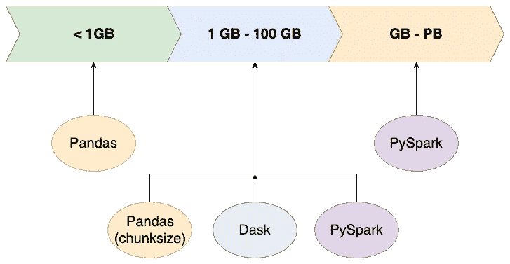

# 熊猫，Dask 还是 PySpark？您应该为数据集选择什么？

> 原文：<https://medium.datadriveninvestor.com/pandas-dask-or-pyspark-what-should-you-choose-for-your-dataset-c0f67e1b1d36?source=collection_archive---------1----------------------->

您需要处理大于 100GB 的数据集吗？

假设您在个人笔记本电脑上运行代码，例如，有 32GB 的 RAM，您应该选择哪个数据帧？熊猫，Dask 还是 PySpark？它们的扩展限制是什么？

本文的目的是建议一种方法，您可以在日常工作中应用这种方法来为您的数据集选择合适的工具。

Pandas or Dask or PySpark

# < 1GB

If the size of a dataset is less than 1 GB, Pandas would be the best choice with no concern about the performance.

# 1GB to 100 GB

If the data file is in the range of 1GB to 100 GB, there are 3 options:

*   Use parameter “chunksize” to load the file into Pandas dataframe
*   Import data into Dask dataframe
*   Ingest data into PySpark dataframe

# > 100GB

数据集大于 100 GB 怎么办？

由于本地内存限制，Pandas 立即退出。达斯克怎么样？它可能能够将数据加载到 Dask 数据帧中，具体取决于数据集。但是，当您调用 API 时，代码会挂起。

PySpark 可以高效地处理 Pb 级的数据，这是因为它的分布机制。类似 SQL 的操作对数据科学家来说很直观，可以在 Spark DataFrame 上创建一个临时视图后运行。Spark SQL 还允许用户通过在内存中缓存数据或配置一些实验选项来调整工作负载的性能。

那么，既然 PySpark 听起来超级棒，我们还需要熊猫吗？

答案是“可以，肯定可以！”

熊猫至少有两个优势是 PySpark 无法克服的:

*   更强的 API
*   更多库，例如用于数据可视化的 matplotlib

在实践中，我建议使用方法 toPandas()将 Spark 数据帧转换成 Pandas 数据帧，并使用 **Apache Arrow** 进行优化。例子可以在[链接](https://spark.apache.org/docs/latest/sql-pyspark-pandas-with-arrow.html)找到。

应该只在一小部分数据上进行。例如，您想要应用复杂方法的数据子集，或者您想要可视化的数据。

在本文中，我们根据数据量经历了 3 种场景，并为每种情况提供了解决方案。核心思想是对大型数据集使用 PySpark，并将数据子集转换成 Pandas 进行高级操作。

好奇。您如何在工作中的笔记本电脑上处理大型数据集(> 100GB)？

# 报名参加🦞:的 Udemy 课程

## [具有机器学习和统计的推荐系统](https://www.udemy.com/course/recommender-system-with-machine-learning-and-statistics/?referralCode=178D030EF728F966D62D)

[https://www.udemy.com/course/recommender-system-with-machine-learning-and-statistics/?referralCode=178D030EF728F966D62D](https://www.udemy.com/course/recommender-system-with-machine-learning-and-statistics/?referralCode=178D030EF728F966D62D)