# Pandas:用于数据操作和分析的 Python 库

> 原文：<https://medium.datadriveninvestor.com/pandas-python-library-for-data-manipulation-and-analysis-9035f33c253c?source=collection_archive---------16----------------------->


Photo by [chuttersnap](https://unsplash.com/@chuttersnap?utm_source=medium&utm_medium=referral) on [Unsplash](https://unsplash.com?utm_source=medium&utm_medium=referral)

*   [Pandas](https://pandas.pydata.org/pandas-docs/stabl) 是一个 python 模块，使数据科学变得简单而有效
*   Python 和熊猫被广泛应用于学术和商业领域，包括金融、神经科学、经济学、统计学、广告、网络分析等等。
*   用于在内存数据结构和不同格式之间读写数据的 It 工具:CSV 和文本文件、Microsoft Excel、SQL 数据库。
*   数据集的高性能合并和连接。
*   [笔记本](https://github.com/namratesh/Machine-Learning/blob/master/17_Dec_Pandas.ipynb)链接。

安装熊猫命令

```
**pip install pandas**
```

**进口熊猫**

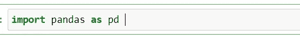

**Series** :是一个一维标签数组，能够保存任意数据类型(int、float、number、python 对象)。轴标签统称为索引。

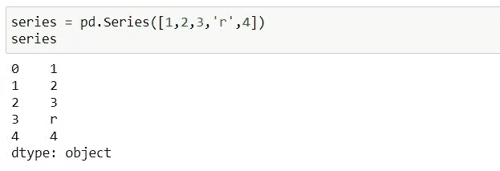

*   pd.series 用于创建系列。

[](https://www.datadriveninvestor.com/2019/02/21/best-coding-languages-to-learn-in-2019/) [## 2019 年最值得学习的编码语言|数据驱动的投资者

### 在我读大学的那几年，我跳过了很多次夜游去学习 Java，希望有一天它能帮助我在…

www.datadriveninvestor.com](https://www.datadriveninvestor.com/2019/02/21/best-coding-languages-to-learn-in-2019/) 

**DataFrame** :是二维或多维数组标记的数据结构，具有不同类型的列。

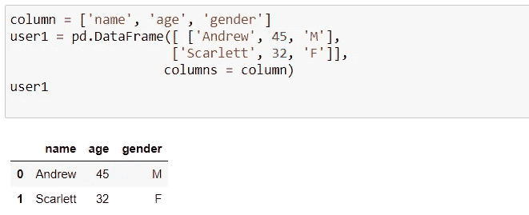

*   警察。DataFrame 用于创建 dataframe。

**序列和数据帧**有什么区别？

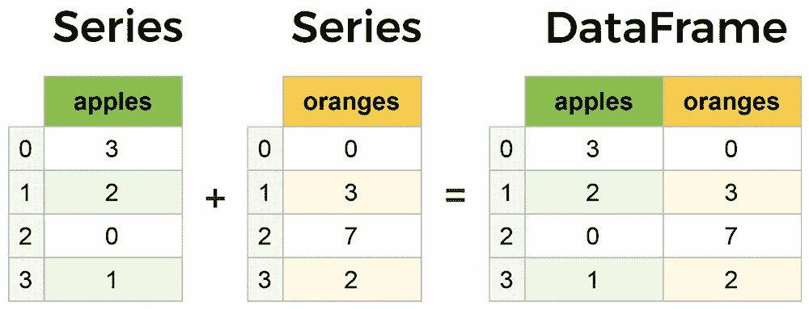

*   Series 是一维数组，其中数组是系列的集合。可以是两个或者更多。

让我们再创建一个数据帧

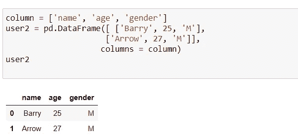

**连接数据帧**

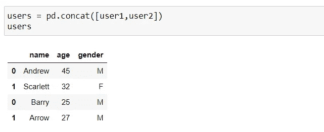

我们正在使用 iris 数据集来了解更多关于熊猫的信息。

**加载数据集**

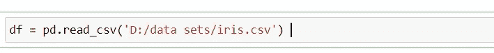

*   *pd.read_csv 用于加载数据集。*

**前 5 行**

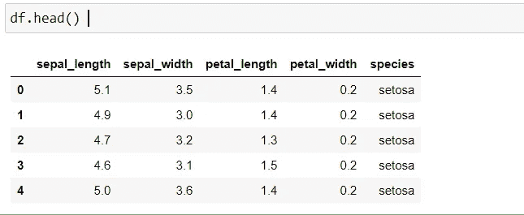

**最后 5 排**

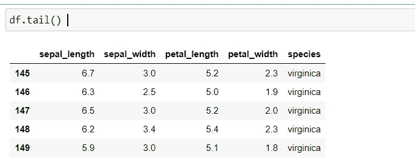

**标签:**从头到尾给出范围索引。

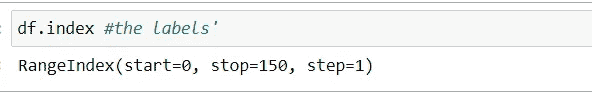

**列:**它给出了列名。

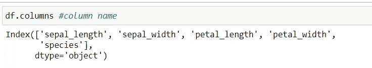

**数据集的类型:**它给出了每一列的数据类型。

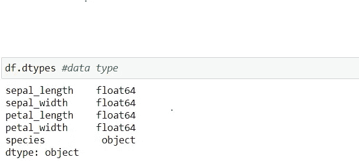

**数据形状:**给出行数和列数，

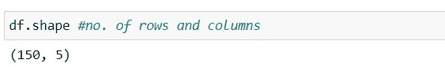

**信息数据集:**它给出数据类型和非空值计数。

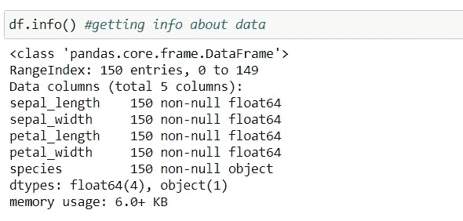

**开始 10 行的选择**

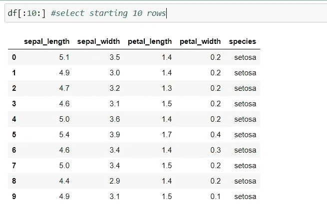

**选择除前 10 行之外的所有行**

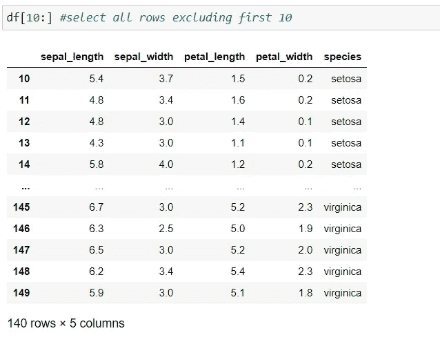

**最后 10 行的选择**


**每第 10 行的选择**

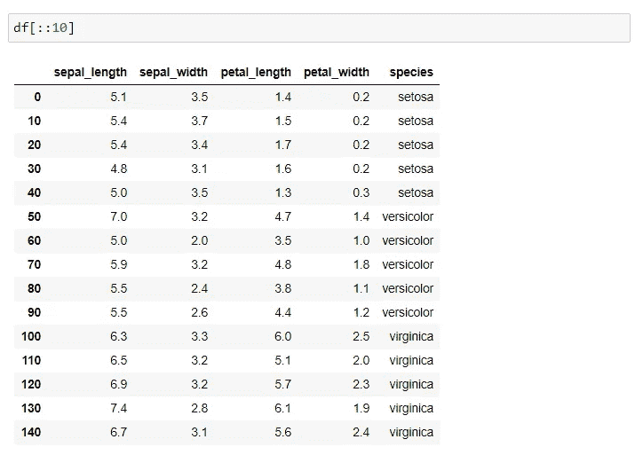

**选择列**

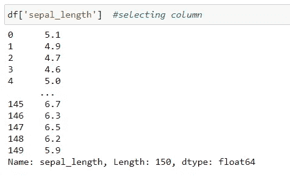

**列的含义**

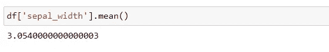

**列的标准偏差**

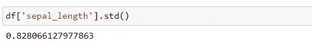

**列的中间值**

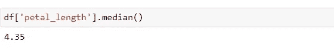

**数据集的统计汇总**

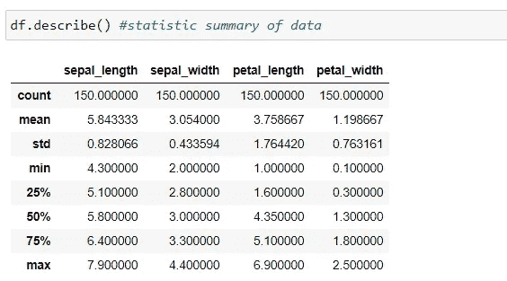

**数据转置**

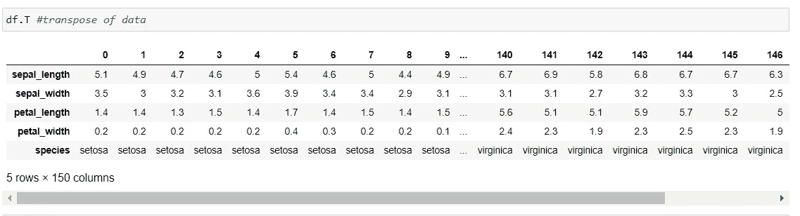

**检查重复值**

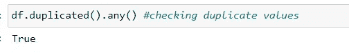

**按轴分类数据**


**按值排序数据**

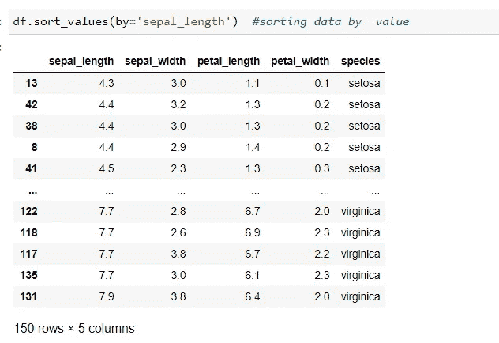

**检查数据中的空值**

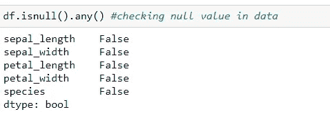

**如果缺少任何值，则删除一行**

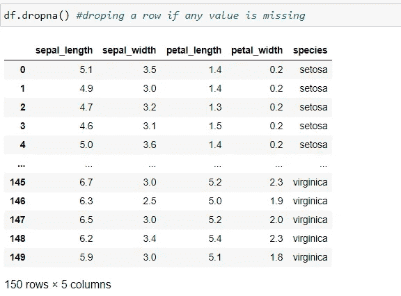

**如果行的所有值都丢失，则删除该行**

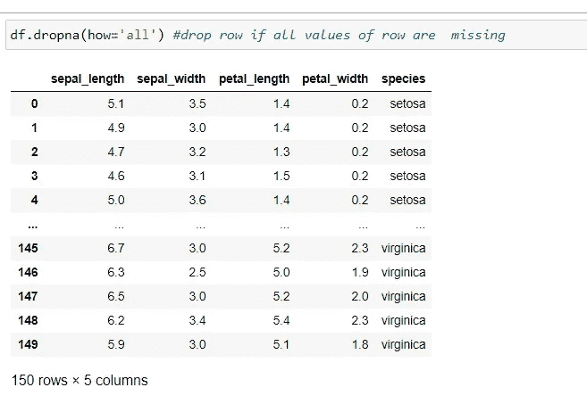

欢迎建议！！！