# 【论文综述】GANs 的凸对偶框架(NeurIPS 2018)

> 原文：<https://medium.datadriveninvestor.com/paper-review-a-convex-duality-framework-for-gans-neurips-2018-d2859ff5579e?source=collection_archive---------16----------------------->

Photo by [Samuel Ferrara](https://unsplash.com/photos/6dqCCs0vCcU?utm_source=unsplash&utm_medium=referral&utm_content=creditCopyText) on [Unsplash](https://unsplash.com/search/photos/curve?utm_source=unsplash&utm_medium=referral&utm_content=creditCopyText)

> 这篇文章是出于教育目的的论文综述。

生成对抗网络(GAN)是目前使用最多的深度学习方法之一。在 GAN 中，发生器和鉴别器之间的极小极大博弈导致相反性质的学习。

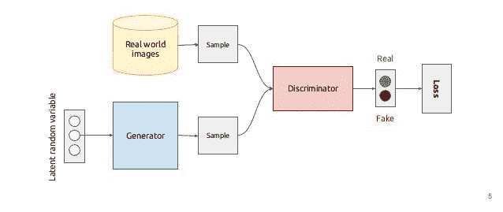

**Figure 1.** GAN framework from [https://becominghuman.ai/understanding-and-building-generative-adversarial-networks-gans-8de7c1dc0e25](https://becominghuman.ai/understanding-and-building-generative-adversarial-networks-gans-8de7c1dc0e25)

如上图所示，GAN 中的生成器学习欺骗真模型，鉴别器从生成器中学习区分真样本和假样本。
如果鉴别器没有约束，GAN 极小极大博弈可以认为是一个寻找最小化 Jensen-Shannon 散度的生成元的问题，Jensen-Shannon 散度是 *f* 散度族之一。

GAN 的方程式如下。

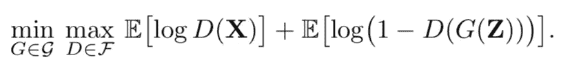

**Figure 2.** The equation of *vanilla* GAN

这里，Z 表示发生器的噪声输入，X 表示分布为 **P** x 的实际数据的分布，G 和 D 分别表示发生器和鉴别器。

同样，如前所述，如果鉴别器 D 是无约束的，则极大极小问题可以表示如下。

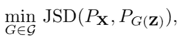

**Figure 3.** Minimax problem of figure 2.

这相当于 ***最小化*** 来自噪声输入的真样本分布和假样本分布的 JSD。

## 各种 GAN 的例子

应用 GAN 的纸张有很多种。以下示例总结了每个 GAN 中使用的度量距离。

*   ***f*-甘**:*f*-三岔口家族。
*   **Wasserstein GAN(WGAN)** :一阶 Wasserstein 距离(推土机的)。
*   **二次甘**:二次瓦瑟斯坦距离。
*   **能基甘**:全变差(TV)距离。
*   **MMD-甘**:最大均值差异。

## 各种度量标准的示例

在描述本文的本质之前，我们先来看看各种度量的定义。

1.  f-散度(来自[维基百科](https://en.wikipedia.org/wiki/F-divergence)

*   在[概率论](https://en.wikipedia.org/wiki/Probability_theory)中，一个***-散度****是一个函数*D _ f*(*P*|*Q*)衡量两个概率分布 *P* 和 *Q* 之差。*
*   *设 *P* 和 *Q* 是空间ω上的两个概率分布，使得 *P* 相对于 *Q* 绝对连续。那么，对于一个[凸函数](https://en.wikipedia.org/wiki/Convex_function) *f* 使得 *f* (1) = 0，则*f*-*P*与 *Q* 的散度定义为*

*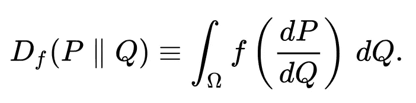*

*f-散度族的例子各不相同，如下所示。*

*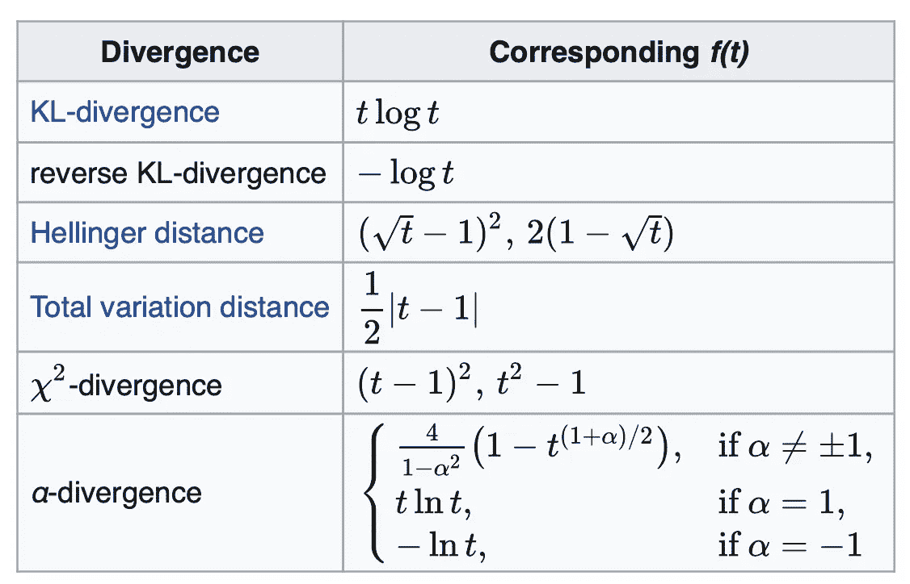*

*2.最优运输成本*

*   *最佳运输成本定义如下。*

*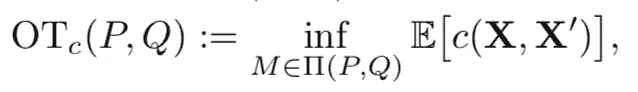*

*其中 Pi(P，Q)包含所有具有余量 P，Q 的耦合。*

*   *它还可以使用 Kantorovich 对偶来表示最优运输成本，如下所示。*

*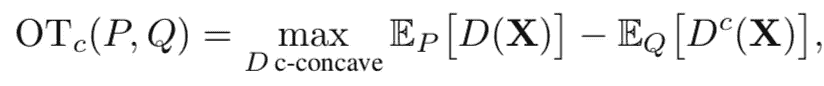*

*更详细的公式请参考论文。*

*   *因此，Wasserstein 距离可以通过使用下面的公式来扩展。*

*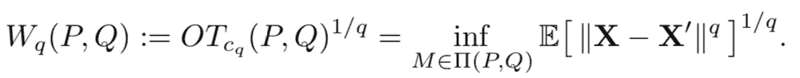*

*   *如果 p 为 1，一阶 Wasserstein 距离如下。*

*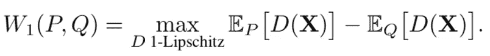*

*但真正的问题是 GAN 的*学习非常不稳定*，找到 minimax 博弈的*通解*也是一项非常困难的任务。为了解决这一问题，许多研究论文试图通过在鉴别器上使用各种约束如各种 ***lipschitz 约束*** 来寻找 GAN 的一般解。*

*在本文中，他们利用 ***凸对偶*** 的概念对 GAN 的鉴别器施加约束。概念很简单。如下图所示，通过 ***力矩匹配*** 的约束应用于鉴别器，帮助学习生成器。*

*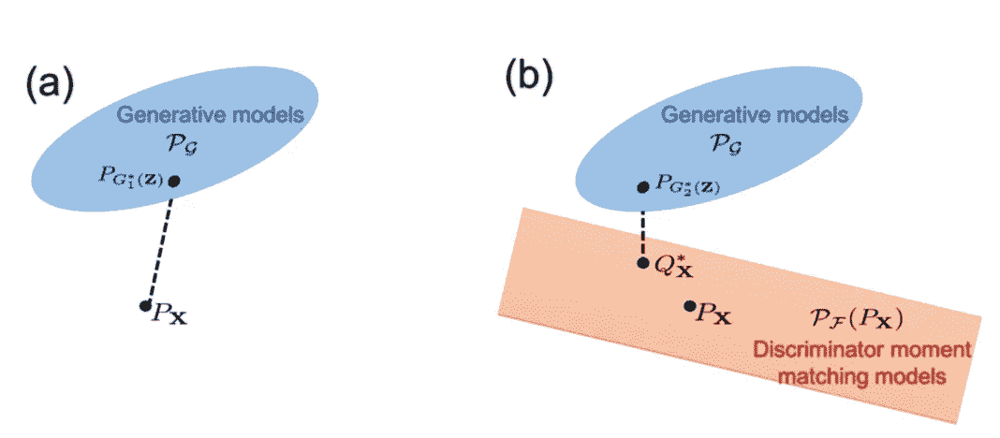*

***Figure 4.** Divergence minimization of generator.*

*左边是*香草* GAN，右边是拟建的 GAN 框架。所提出的 GAN 的公式如下。*

*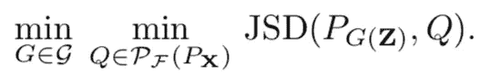*

****Figure 5.*** Optimization of minimax problem by using moment matching constraint.*

*这里 P_ *F* (P **x** )是所有 *F* 鉴相器 d 中满足矩匹配约束的一组值，因此，与其优化图 3，不如优化上述公式才是本文的重点。*

**

## *GANs 中散度最小化的证明*

*最后，我们将看看推导图 5 的过程。*

*首先，我们定义了分布 p 上的 d 的凸共轭公式。*

*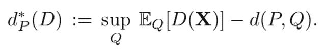*

*基于上面的等式，我们来看看下面的定理。*

*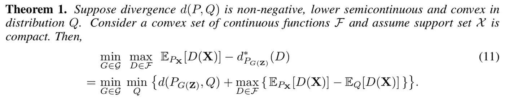*

***定理 1 的证明**省略。(具体细节可以查看原论文。)*

*因此，如果我们进一步假设 *F* 是线性空间，那么惩罚力矩不匹配的惩罚项可以移到约束中。*

*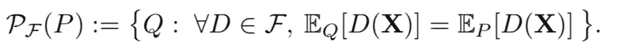*

*因此，定理 1 通过上述约束总结如下。*

*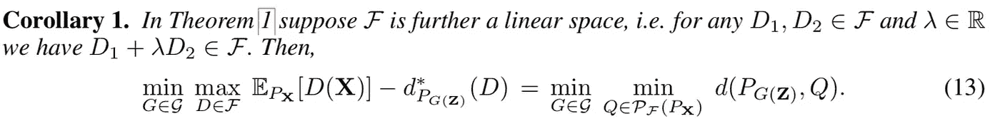*

*就是这样。推论 1 的结果与图 5 的等式相同。*

## *实验*

*在本文中，他们主要使用了两个数据集，CelebA 和 LSUN-bedroom。实验细节如下。*

*   *网络:DCGAN(卷积架构)*
*   *优化器:亚当*
*   *迭代:200，000 次迭代*
*   *更新比率(鉴别器/发生器):5*

*代表性结果如下。简单总结一下， **SN** 比通过 **BN** 尝试归一化要好，用*基于矩约束的约束*学习 JSD 比*香草* JSD 更稳定。*

*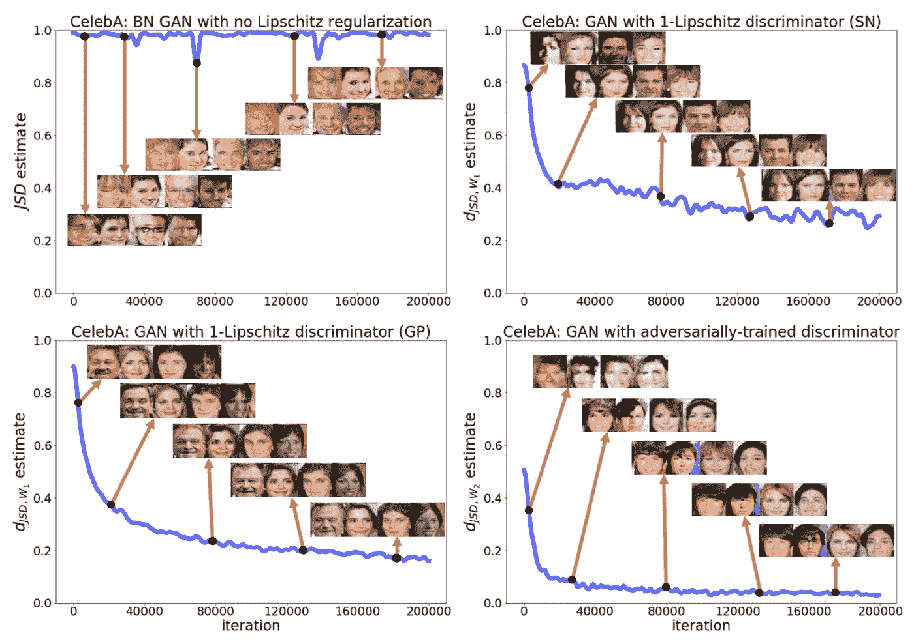*

***Figure 6.** Experimental results of CelebA dataset.*

*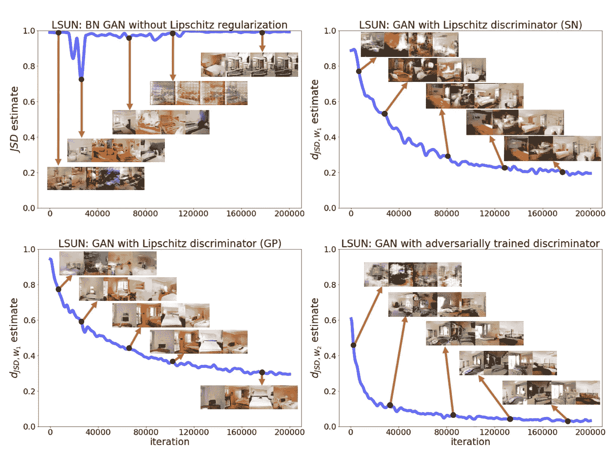*

***Figure 7.** Experimental results of LSUN-bedroom dataset.*

***参考***

1.  *I.J. Goodfellow 等人(2014 年)。生成对抗网络。来自[https://papers . nips . cc/paper/5423-generative-adversarial-nets . pdf](https://papers.nips.cc/paper/5423-generative-adversarial-nets.pdf)*
2.  *F.法尼亚和谢霆锋。(2018).GANs 的凸对偶框架。来自[https://papers . nips . cc/paper/7771-a-convex-duality-framework-for-gans](https://papers.nips.cc/paper/7771-a-convex-duality-framework-for-gans)*
3.  *南 Nowozin，B. Sceke 和 R. Tomioka。(2016).f-GAN:使用变分散度最小化训练生成神经采样器。来自[https://papers . nips . cc/paper/6066-f-gan-training-generative-neural-samplers-using-variation-divergence-minimization](https://papers.nips.cc/paper/6066-f-gan-training-generative-neural-samplers-using-variational-divergence-minimization)*
4.  *米（meter 的缩写））Arjovsky，S. Chintala 和 L. Bottoufrom。(2017).瓦瑟斯坦·甘。来自[https://arxiv.org/abs/1701.07875](https://arxiv.org/abs/1701.07875)*
5.  *A.拉德福德，l .梅斯和 s .钦塔拉。(2015).深度卷积生成对抗网络的无监督表示学习。来自[https://arxiv.org/abs/1511.06434](https://arxiv.org/abs/1511.06434)*