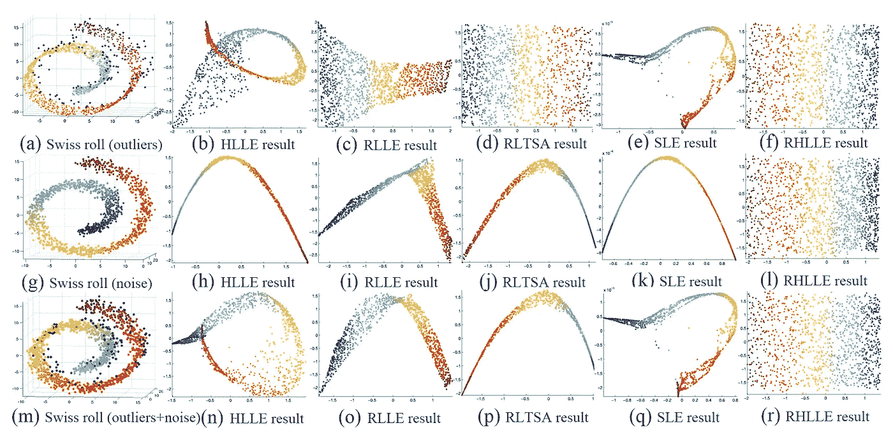
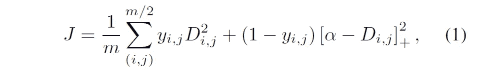
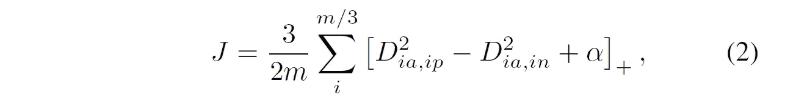
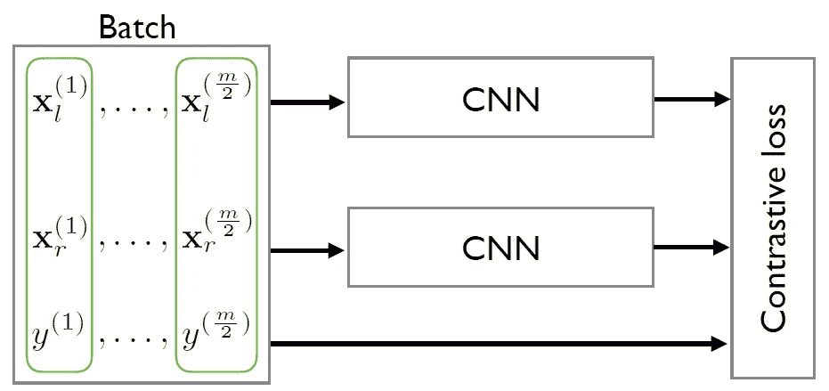
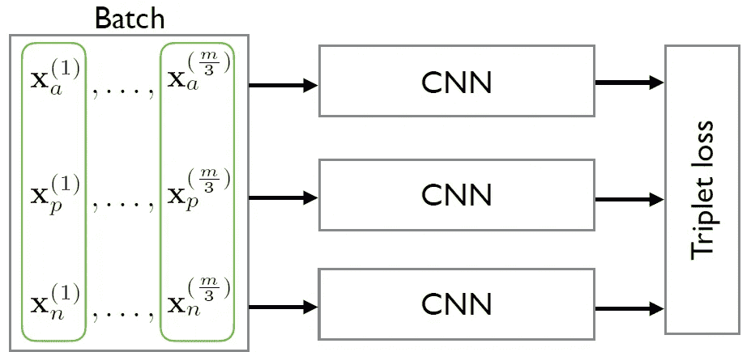
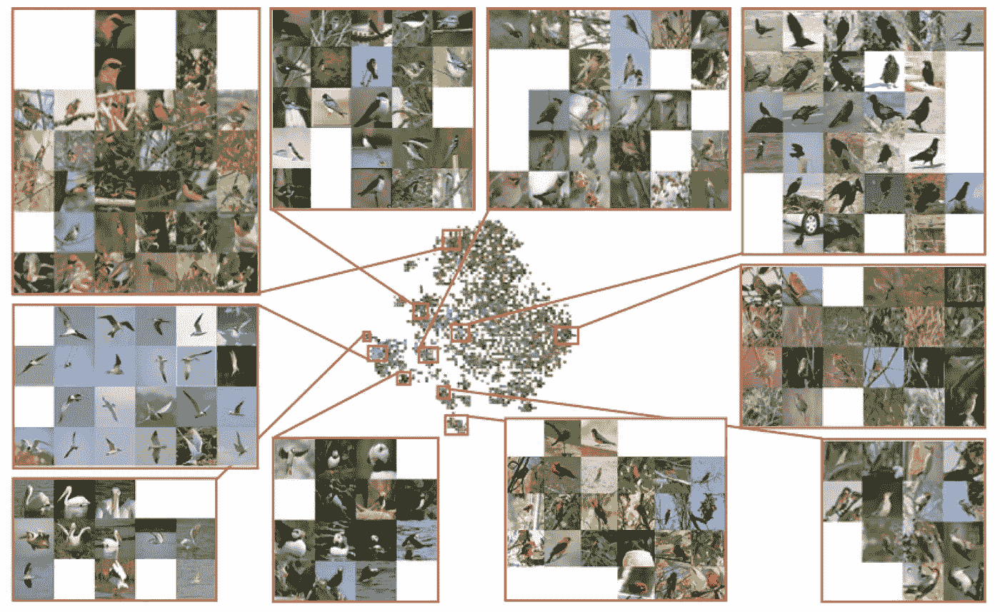

# [论文综述]学习深度解开嵌入与 F 统计损失(NeurIPS 2018)(第 1 部分)

> 原文：<https://medium.datadriveninvestor.com/paper-review-learning-deep-disentangled-embeddings-with-the-f-statistic-loss-neurips-2018-36374a25a2d2?source=collection_archive---------10----------------------->

Photo by [chuttersnap](https://unsplash.com/photos/WY70Ay0WHRg?utm_source=unsplash&utm_medium=referral&utm_content=creditCopyText) on [Unsplash](https://unsplash.com/search/photos/structure?utm_source=unsplash&utm_medium=referral&utm_content=creditCopyText)

> 这篇文章是出于教育目的的论文综述。

这是 NeurIPS 2018 上的一篇论文，提出了嵌入空间中新的*度量损失*。下面给不知道嵌入这个词含义的读者简单解释一下。

> 我们来看看什么是嵌入。

我们使用学习模型(例如，神经网络和支持向量机)的原因之一是回归或分类对象。如果首要目的是对物体进行分类，那么就要根据物体的标签信息很好地划分类别。

例如，假设要分类的对象是图像。但是，在这种情况下，原始图像信息的特征是高级信息，因此很难分析。因此，需要一种将这种高维信息压缩和分析成低维信息的方法。在过去，压缩过程主要与多维缩放(MDS)和局部线性嵌入(LLE)一起使用。

**Figure 1.** Examples of various compression methods for Swiss roll data

如上图所示，瑞士卷的数据点很难只用距离度量来分析。这是因为，从欧几里德距离的观点来看，存在不同类别的数据更接近的情况。因此，难以分析的瑞士卷数据集可以被“转换”,以允许使用基于线性嵌入的方法根据欧几里得距离进行解释。

> 嵌入的一个例子是创建一个反映高维数据信息的低维空间，如上图所示。

近年来，出现了通过卷积神经网络(CNN)来执行这一过程的方法。这是可能的，因为 CNN 也是执行数据压缩的强大工具，同时很好地反映了基向量的信息。从这个宏观角度出发，将数据压缩方法分为以下三类。(仅用于机器学习)

*   ML，MAP(或 w/拉格朗日乘数)
*   支持向量机(SVM)或相关向量机(RVM)
*   神经网络

> 那么什么是度量学习呢？

换句话说，基于 CNN 的神经网络通过卷积层提取“ ***嵌入向量*** ”，然后通过使用全连接(FC)层对该向量进行分类。也就是说，卷积层可以看作是一个*特征提取器*，全连通层可以看作是一个*特征分类器*。

另一方面，度量学习是一种基于嵌入空间中的向量信息使用各种度量来分类(或回归)对象类别的方法，而不使用完全连接的层。

> 让我们看看现有度量学习中使用的典型损失函数。

首先，**对比度损失**表现为通过学习不变映射嵌入的维数减少(由 R. Hadsell 等人在 *CVPR* 2006 年发表)。

**Figure 2.** Contrastive loss

*D* 定义为第 *i* 个嵌入向量和第 *j-* 个嵌入向量的欧氏距离。 *y* 是一个指示器，如果 *i* 和 *j* 的标签相等，则给出 1，否则给出 0，[]_+是铰链损耗。

对比损失表明，同一标签的嵌入向量在嵌入空间中相互吸引，而不同标签的嵌入向量相互推动。这受到铰链损耗的 *α* 的限制。

第二个是**三联体丢失**。它是在一篇名为 Face-net 的著名论文中介绍的。这也和对比损失有相同的概念。然而，*主播*的概念是新引入的。*锚*由标签与阳性样本相同的样本组成。因此，它显示了基于嵌入空间中的*锚*的正(嵌入)向量和负(嵌入)向量相互吸引的效果。方程式如下。

***Figure 3.*** Triplet loss

此外，在上面介绍的两个度量丢失的情况下，他们对每个样本对使用不同的 CNN。

**Figure 4.** Training network with contrastive embedding

**Figure 5.** Training network with triplet embedding

学习嵌入空间可以如下可视化。

**Figure 6.** Barnes-Hut t-SNE visualization of embedding of CUB-200–2011

图 6 是使用称为 t-SNE 的工具的学习嵌入空间的可视化。欧几里德距离越近，可以看到更多具有相似特征的新图像。

**Figure 7.** Query-Retrieval results on CUB-200–2011

此外，如图 7 所示，可以为单个查询(测试)图像列出最接近欧几里德距离的检索图像。

在第 1 部分中，我们研究了嵌入的概念，并研究了嵌入空间中使用的度量损失。

在第 2 部分中，我们将介绍一些度量损失和 F 统计损失的例子，这是一种最新的技术。

## 参考

基于提升结构特征嵌入的深度度量学习。在 *CVPR* 2016 年。([*https://arxiv.org/abs/1511.06452*](https://arxiv.org/abs/1511.06452))

R.Hadsell 等人通过学习不变映射进行维数约简。在 2006 年的 CVPR。([*http://yann . le Cun . com/exdb/publis/pdf/hadsell-Chopra-le Cun-06 . pdf*](http://yann.lecun.com/exdb/publis/pdf/hadsell-chopra-lecun-06.pdf))