# [论文综述]学习深度解开嵌入与 F 统计损失(NeurIPS 2018)(第二部分)

> 原文：<https://medium.datadriveninvestor.com/paper-review-learning-deep-disentangled-embeddings-with-the-f-statistic-loss-neurips-2018-b6a84828a24b?source=collection_archive---------3----------------------->

> 这篇文章是出于教育目的的论文综述。

Photo by [Jonathan Farber](https://unsplash.com/photos/6jpdeeA2GBU?utm_source=unsplash&utm_medium=referral&utm_content=creditCopyText) on [Unsplash](https://unsplash.com/search/photos/cum?utm_source=unsplash&utm_medium=referral&utm_content=creditCopyText)

在第 1 部分中，我们研究了现有的度量损失。这一次，我们来看看 NeurIPS 2018 上发布的新度量损失。(度量损失是指度量学习中使用的客观损失。)

简单地说，F-统计损失是一种度量损失，它导致基于**Fisher–Snedecor**(或 F)分布的类别分布差异。我们来看看什么是 f 分布损失。

一般来说，度量学习的目的是保持其他类的特征彼此远离，同时保持同一类的特征彼此靠近。例如，当我们想要分离两个类时，分布如下。

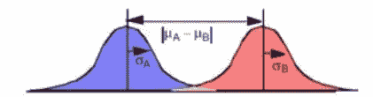

**Figure 1.** Representative picture of two class distribution (from [http://37steps.com/2202/non-metric-disreps/](http://37steps.com/2202/non-metric-disreps/))

我们这里的目标是学习保持两个分布的平均值，其中 *n* _1 和 *n* _2 个实例彼此远离。因此，降低下面的概率值是我们的主要目标。因为两个分布具有相同的均值，所以假设两个类的分布很难区分。

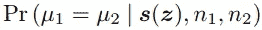

**Eq 1.** The probability of two class distribution

这里， *z* 可以看作是实例位于嵌入空间上的坐标， *z* 的定义如下。

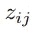

**Figure 2.** Definition of embedding coordinate of instance j of class i.

例如，第一个类的第二个实例表示 *z* _12。

由于这种后验分布很难直接计算(难以处理)，我们可以通过将其转换为似然来计算。(使用贝叶斯规则，并省略分母值，因为它是归一化常数。)

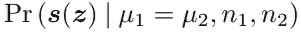

还有， *s* ( *z* )如下。

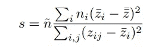

**Figure 3.** A ratio of between-class variability to within-class variability

s 仅仅是类间可变性与类内可变性的比值。换句话说，它是一个函数的形式，符合我们想要学习的目标函数。所以，学会增长 *s* ( *z* )的价值也将是我们的首要目标。实例的平均值为 hat *z* ，实例数为 tilde *n* 。

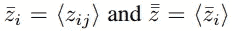

**Eq 2.** Mean of a class instance

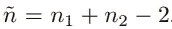

**Eq 3.** Number of a class instance

为了计算 *s* ( *z* )的值，我们可以根据 F 分布的 CDF 来度量不同类的分离度，如下所示。有关 f 分布的详细描述，请参考以下链接。([https://en.wikipedia.org/wiki/F-distribution](https://en.wikipedia.org/wiki/F-distribution))

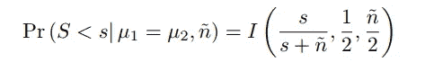

**Figure 4.** CDF of the F distribution

*I* 函数的第二项和第三项的值在自由度范围内，可以认为是从 1 到两个类的实例之和。由于 F 分布的 CDF 是正则化的β函数，因此 *I* 可以被建模为β函数。也可以与基于梯度优化学习的神经网络集成，因为该值是可微分的。

 [## DDI 编辑推荐:5 本机器学习书籍，让你从新手变成数据驱动专家…

### 机器学习行业的蓬勃发展重新引起了人们对人工智能的兴趣

www.datadriveninvestor.com](https://www.datadriveninvestor.com/2019/03/03/editors-pick-5-machine-learning-books/) 

*s* 值越大，阶层分离程度越大。所以我们需要把图 4 的概率设计的大一些。

最后，当我们把图 4 的概率扩展到多类时，方程如下。

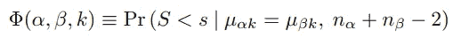

**Figure 5.** A probability of multi-class separation

Alpha 和 beta 可以看作是一组 class *C* 元素。另外， *k* 表示嵌入实例的维度。

因此，F-统计量损失的最终损失方程如下。

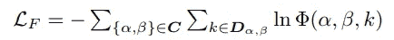

**Figure 6.** An equation of F-statistic loss

最终亏损为负的原因是它必须学会增加上面提到的贝塔函数建模的概率值。

基于下面的图片，我们可以更容易地理解所提出的方法的概念。我们根据数据 *x* 通过神经网络得到 *z* 。在这种情况下，当 *k* = 2 时，分离度具有最大值，并且在除 2 之外的剩余 *k* 中，损耗被学习为零。

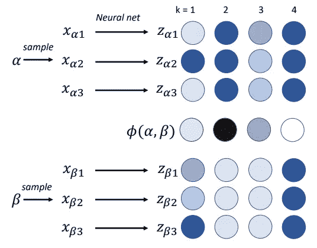

**Figure 7.** Illustration of the behavior of the F-statistic loss

定义了 4 个 F 统计损失特征。

1.即使在嵌入实例中学习了至少一些类别分离值，梯度也下降得非常快。(即，在学习过程中，准确和快速的学习是可能的。)

2.与其他度量损失不同，它对旋转是不变的。

3.只需几个超参数就可以轻松优化。

4.因为损失是基于概率值定义的，所以很容易与其他概率损失相结合，如 VAE 的库尔贝克-莱布勒散度(KLD)损失。

下表显示了在建议度量损失的论文中执行的检索任务的结果。如果你想了解更多关于测量的信息，那么你也可以参考下面的链接。([https://medium . com/@ m _ n _ malaeb/recall-and-precision-at-k-for-recommender-systems-618483226 c54](https://medium.com/@m_n_malaeb/recall-and-precision-at-k-for-recommender-systems-618483226c54))

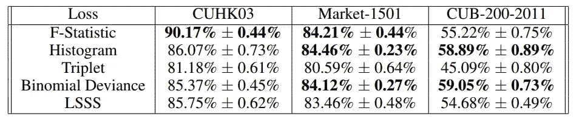

**Figure 8.** Recall@1 results for various metric losses

与其他度量损失相比，f 统计损失没有实现高性能。但他们坚持认为，这篇论文的主要贡献在于，定义这种度量损失的方式是有价值的。

在这篇论文中，他们尝试了其他实验，但我们没有包括他们。所以更多的实验结果请参考这篇论文。

## 参考

K.里奇韦和莫泽尔。基于 F 统计损失的深度解纠缠嵌入学习。NIPS 2018。([https://papers . nips . cc/paper/7303-learning-deep-dis angled-embedding-with-f-statistic-loss . pdf](https://papers.nips.cc/paper/7303-learning-deep-disentangled-embeddings-with-the-f-statistic-loss.pdf)