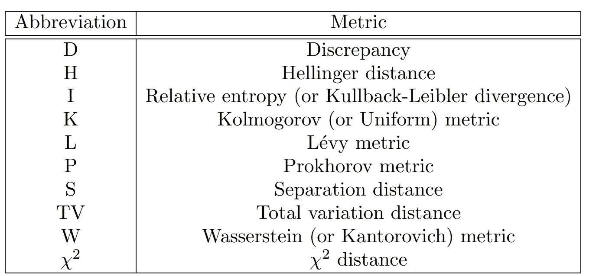
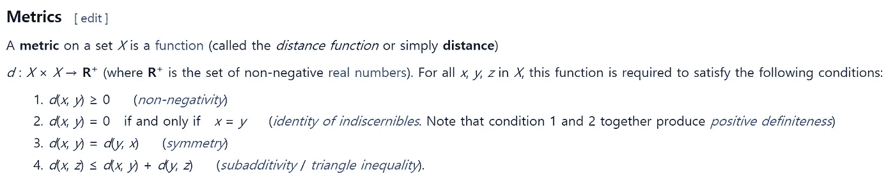
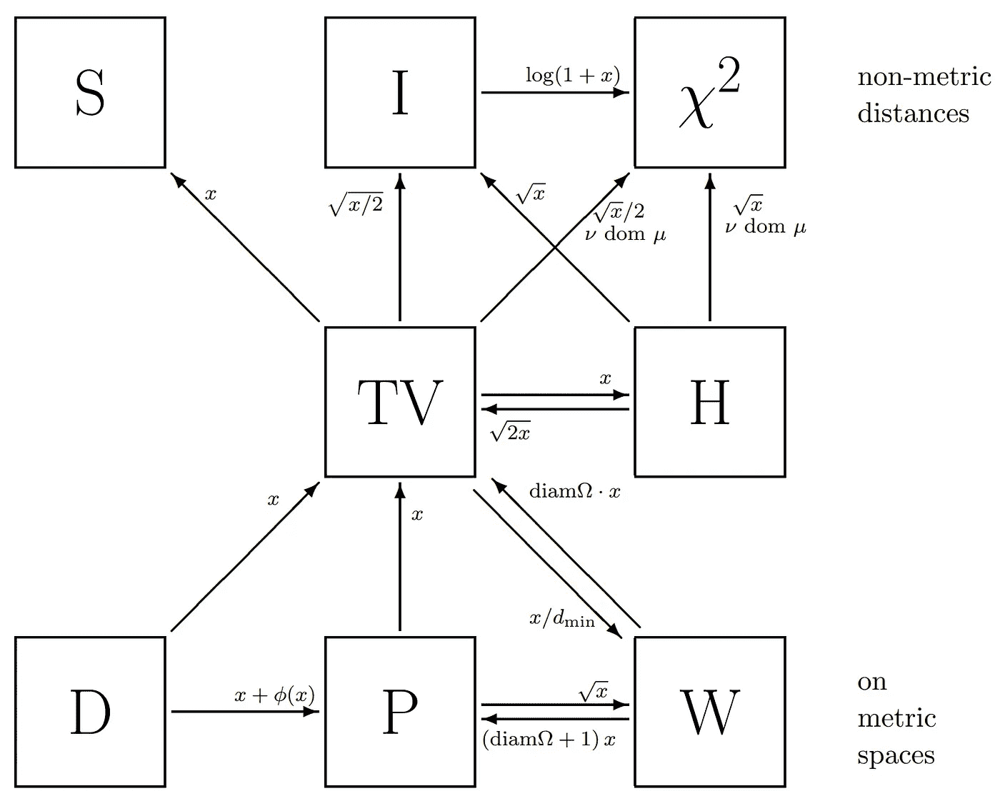
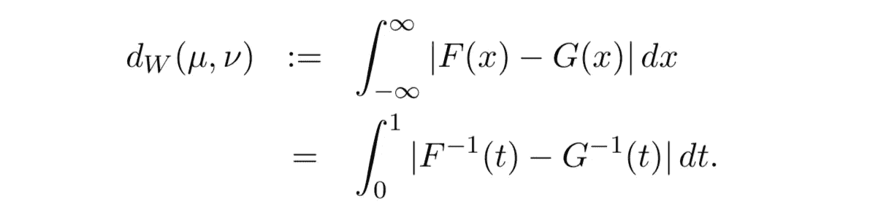
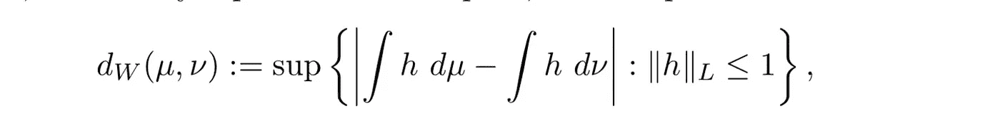
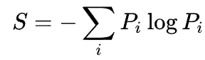

# 关于概率度量的选择和界定(上)

> 原文：<https://medium.datadriveninvestor.com/paper-review-on-choosing-and-bounding-probability-metrics-part-1-2dc2c2b459a2?source=collection_archive---------14----------------------->

[](http://www.track.datadriveninvestor.com/1B9E)

Photo by [Victoriano Izquierdo](https://unsplash.com/photos/HoevDVvxInw?utm_source=unsplash&utm_medium=referral&utm_content=creditCopyText) on [Unsplash](https://unsplash.com/search/photos/distance?utm_source=unsplash&utm_medium=referral&utm_content=creditCopyText)

> 这篇文章是出于教育目的的论文综述。

在过去的帖子里，在讲甘的技术的时候，我稍微提到了 f 发散。在这篇文章中，我将看看如何区分散度和度量。这一次它将被分成两部分，因为它很大。在第 1 部分中，我们将解释各种度量标准。在第 2 部分中，我们将研究各种度量标准之间的相互关系，以及收敛趋势之间的差异。

所以，这次要介绍的文章是一篇写于相当久远之前的论文(2002 年大约是 15 年前，但考虑到这几天技术的发展速度，这是一个非常长的时间)。是 2002 年发表的论文，不涉及 CNN 等最新技术。



**Table 1**. Summary of different metrics

可以看上表。表 1 列出了本文涵盖的各种指标。我在这里很好奇。

```
**"How can we distinguish between the words DIVERGENCE and METRIC?"**
```

我们可以在度量的定义中找到这个问题的答案。



**Figure 1**. Definition of metric

我们可以引用 Wiki 的信息来获得上述指标的定义。该度量满足四个属性。

> 1)非消极性
> 
> 2)不可分辨物的同一性
> 
> 3)对称性
> 
> 4)三角形不等式

基于这些基本性质，它与希尔伯特空间或巴拿赫空间有关，用于各种概率模型分析的概念是度量。

*“那么和发散有什么不同？”*

我所知道的这条线最重要的特点是发散是不对称的。因此，这违反了度量的第三个属性。也许不对称是区分度量和发散的一个关键特征。

因此，对于表 1 来说，在条目度量中包含单词 divergence 并不奇怪。



**Figure 2**. Relationships among probability metrics

现在，让我们分析图 2 中的各种指标。图 2 是帮助您理解各种指标的图示。从底部开始是 D ( **差异**)、P ( **普罗霍罗夫**)和 W ( **瓦瑟斯坦**)，它们在公制空间中定义。
中间是电视(**全变**)。从图中可以看出，电视具有*方向性*和所有其他指标。(具有方向性意味着 TV 可以被适当地修改以由其他度量来表示。)

还有，向上走，上一篇帖子提到的 *f* -divergence 族就出现了。通常，可以检查相对熵(Kullback-Leiblur 散度)和 Chi2。这通常表示非公制距离。
直观地说，图 2 可以被解释为对向右上方的距离收敛进行了强惩罚。(我们在第 2 部分讨论吧)。

现在，让我们看看每个指标的概念。

> 1.差异度量

定义的空间是任何度量空间，定义如下。


**Figure 3**. Definition of discrepancy metric

这表示封闭球中某个值的两个概率度量之间的差异。当然，这种差异受到上确界的限制。它还假定值在[0，1]中。

这个概念被用于分析 WGAN 和具有最大平均差异(MMD)概念的特征空间。

> 2.瓦瑟斯坦(或康托洛维奇)度规

定义空间是实空间或任何度量空间，定义如下。



**Figure 4**. Definition of Wasserstein metric

在任何可分度量空间的条件下，它也等价于下面的方程。



**Figure 5**. Alternative representation of Wasserstein metric

这可以通过基于满足 RHS 的 Lipschitz 条件的所有函数 *h* 的上确界来计算。与前面的差异最大的不同是定义度量的值的区域。对于 Wasserstein，[0，diam(ω)]，其中 diam(ω)是度量空间的直径(ω， *d* )。还有一个区别就是你要自己找:)

> 3.相对熵(或库尔巴克-莱布勒散度)

下一个指标是相对熵。这在任何可测空间都有定义，定义如下。


**Figure 6**. Definition of KLD

还有，如果我们假设可数空间，可以表示如下。


**Figure 7**. Alternative representation of KLD

相对熵也称为*信息距离*，因为它是信息论中首次引入的。例如，假设有一个你不知道的答案 *p* 分布。为了预测这一点，我们定义了 *q* 分布，并计算了 *p* 分布和 *q* 分布之间的差异。这被称为*相对熵*因为它使用了香农的熵概念来计算分布的差异。香农的熵方程是这样的。



***Figure 8***. Definition of entropy

因此，当对数中的值的比率在 KL 散度中相等时，KL 散度被最小化。此外，因为 KLD 有一个对数的小数部分，它可以有一个无穷大的值。所以相对熵假设值在[0，∞](在*香草甘*学习过程中模式崩溃的原因之一是损失函数的方差非常大。GAN 使用基于 JSD 的损失函数。)

但是 KL 散度不是一个度量。因为它不能满足对称性，对称性是度规的性质之一。然而，KL 散度具有重要的性质，包括在乘积测度的边际上的可加性。(盖和托马斯 1991，赖斯 1989，第 100 页)


**Figure 9**. Additivity of KL divergence

> 4.分离距离

下一个度量是最广泛使用的相对熵。这是在可数空间中定义的，定义如下。


**Figure 10**. Definition of separation distance

这也不是一个度量，因为这个距离也不满足对称性。它的取值范围是[0，1]。这通常用于分析均匀时间序列中的马尔可夫链。

到目前为止，我将完成第 1 部分。在第 2 部分中，我们将查看其他概率距离之间的*关系*。

## 参考

A.吉布斯和苏。(2002).概率度量的选择和界定。[https://www.math.hmc.edu/~su/papers.dir/metrics.pdf](https://www.math.hmc.edu/~su/papers.dir/metrics.pdf)

## 来自 DDI 的相关故事:

[](https://medium.com/datadriveninvestor/deep-learning-explained-in-7-steps-9ae09471721a) [## 用 7 个步骤解释深度学习

### 和猫一起

medium.com](https://medium.com/datadriveninvestor/deep-learning-explained-in-7-steps-9ae09471721a) [](https://medium.com/datadriveninvestor/which-is-more-promising-data-science-or-software-engineering-7e425e9ec4f4) [## 数据科学和软件工程哪个更有前途？

### 大约一个月前，当我坐在咖啡馆里为一个客户开发网站时，我发现了这个女人…

medium.com](https://medium.com/datadriveninvestor/which-is-more-promising-data-science-or-software-engineering-7e425e9ec4f4)