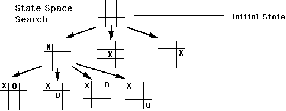
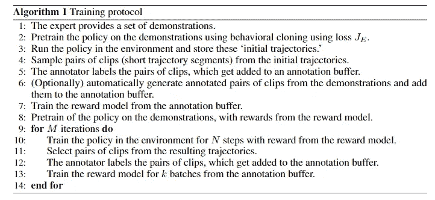

# 论文简化:从人类偏好和 Atari 演示中奖励学习

> 原文：<https://medium.datadriveninvestor.com/papers-simplified-reward-learning-from-human-preferences-and-demonstrations-in-atari-ff1fa17fb63a?source=collection_archive---------13----------------------->

Spoiler alert: breakout was actually one of the games that were experimented with in this paper!

据福布斯报道，强化学习将成为 2019 年数据科学的最大趋势之一。话虽如此，我最近看到一篇论文，谈到在没有手动指定奖励函数的情况下，通过让人类直接通过专家演示、轨迹偏好和政策反馈向代理传达目标，来试验强化学习。对于这个强化学习问题，他们已经训练了一个深度神经网络来对奖励函数进行建模。

# 背景

强化学习基本上是当你有一个代理，当它执行动作时，通过交互从环境中学习。如果它的行动是有利的，那么它就得到奖励，反之亦然。使用 Atari 游戏解决 RL 问题是非常好的，因为它们有明确的奖励函数，因此很容易评估代理的性能。

专家演示基本上是反向 RL，其中演示推断未来的奖励函数。专家可以是为代理做演示的人，也可以是合成的(模拟人类偏好)，本文稍后将继续证明合成偏好反馈如何优于人类偏好反馈。

政策反馈，也称为政策形成，依赖于人的信息来产生奖励和价值信号，以便它可以开始建立偏好，这有助于它的学习过程。

轨迹偏好是当你给一个代理人大量的反馈时，你训练它的政策(在给定时间的行为方式),这样他们可以开始做出类似于轨迹的偏好，因为偏好是代理人对你希望它为你做什么的最佳猜测。

# 问题

本文试图解决当人类硬编码轨迹偏好时出现的两个问题，其目的是让代理学习奖励函数:

1.  如果伴随着随机探索，则很难获得良好的状态空间覆盖(对称为状态空间的问题的最大量的可能解决方案，并且状态空间覆盖是对该解决方案的搜索)。这将意味着我们无法向我们的代理传达有意义的信息。

This is a common example of a search to optimize ones’ performance in tic-tac-toe

2.效率很低，很费时间。

# 解决办法

他们的代理的目标是模仿人类的示范行为，并试图最大化从人类或综合呈现的示范和偏好中推断出的奖励函数。回到问题，他们解决问题的两种方法是:

1.  使用来自专家演示的深度 Q 学习(使用少量的演示数据来加速代理的学习过程，并且能够估计需要多少数据，因为它能够回头查看其“学习优先级”)算法来初始化具有模仿学习的代理的策略。
2.  训练一个奖励模型，让我们改进从模仿学习中学习到的政策。

# 方法

This is the pseudo-code for training our RL algorithm.

在 agent 的训练过程中涉及到四个重要的组成部分:专家、注释者、奖励模型、政策。专家提供示范，注释者给出偏好反馈，奖励模型从注释者的反馈和由示范和奖励训练的策略中估计一个奖励函数。为了训练策略，他们使用了来自演示的深度 Q 学习。他们的奖励模型是一个卷积神经网络(类似于神经网络，唯一的区别是它假设输入是一幅图像)，它将观察结果作为输入，并输出如果代理做他们观察到的事情会产生的结果。要注释的视频剪辑是随机选择的，他们使用了一个提供合成反馈的合成预言。因此，他们能够运行大量的模拟并评估模型的性能。

# 结果

这篇论文的目的是探索如果你试图训练一个代理人在没有任何奖励功能的情况下玩 Atari 游戏会发生什么，这是我们一直在等待的。测试了四种设置，它们是:模仿学习(仅演示)、无演示(仅偏好)、演示+偏好和演示+偏好+自动标记(用于标记偏好视频剪辑的初始轨迹)。

演示+偏好与模仿学习

获胜者:演示+偏好

演示+偏好与无演示

获胜者:演示+偏好

演示+首选项与演示+首选项+自动标签

获胜者:演示+首选项+自动标签(从演示中自动生成的首选项标签给了它优势)

奖励模型质量差的一些原因可能是奖励模型未能适应数据，以及代理未能最大化它迄今为止所学到的来获得它的奖励。

# 结论

当首选项和演示同时一起使用时，它们比单独使用时性能更好。当没有奖励时，这是一个有效的方法。合成偏好反馈优于人类偏好反馈。在训练循环中有一个提供在线反馈的人可以确保没有奖励黑客行为(当代理人想出一个聪明的方法，通过做你通常不想让它做的事情来最大化奖励信号)。

非常感谢您的阅读！如果你喜欢这个，请鼓掌，如果你想提出建议，请随时留下评论。

请关注我的 Instagram 账户，了解即将发布的文章的更新[https://www.instagram.com/datasciencewith_adib/?hl=en](https://www.instagram.com/datasciencewith_adib/?hl=en)