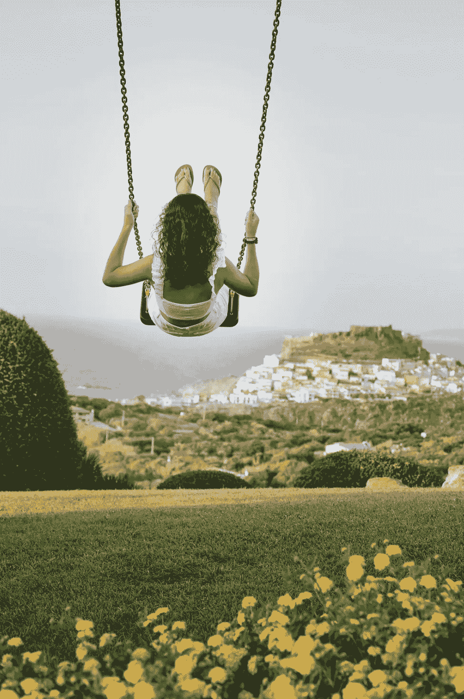

# 在那儿

> 原文：<https://medium.datadriveninvestor.com/para-bellum-3787ede11a47?source=collection_archive---------4----------------------->

这一刻已经过去了。旧事物的终结是为了给新事物让路吗？
一朵干花会为一朵花蕾让路吗？
时间是过眼云烟还是只有当下？

Freepik

没关系，重要的是只有在我们停止收取如此多的费用和强加如此荒谬的规则的时候，真相才会被揭示。人类发明了一种解释时间的方法。我们用数字来衡量。我们总是希望下一个周期会比上一个周期更好。但是，有一种感觉，一些事情会准备好。我们最终想要一个神奇的解决方案，一个神的回应，让一切变得更好，从无到有。我们很少为我们想要的做些什么。

你能干涉即将发生的事情吗？

This is my new book, spare some time to know more about creativity.

在很多方面，是的。但是在那里等待是不健康的。回顾只存在于我们脑海中的舒适、温暖的过去，或者展望不确定的未来，都是导致孤独和焦虑的陷阱。

有一个礼物，我们都在同一条船上。

没有紧急出口，除非你用你的想象力假装你在别的地方。但这并不能改变你的身体仍然被困在当下的事实，即使你的思想在虚拟的地方旅行。

活在当下是很难的，因为他用自己的规则来约束我们，并不断提出大多数人无法应对的要求。

这就是为什么我们更喜欢跳跃到我们的时间旅行，去其他地方，在那里我们可以创造自己的规则。似乎现在一直在用某种武器指着我们的脸。打架还是逃跑？！

活在当下并集中注意力是找到平静的唯一途径。

与已经发生或将要发生的事情抗争，是一种寻找大多数人所谓幸福的人为方式。活在当下减轻了负担，并证明了生命只发生在看到并作为你自己战斗的代理人的那一刻。我们都在寻求的和平取决于我们有多愿意面对当下发生的真正斗争。

永远要准时！

— -

*非常感谢您的阅读。如果你喜欢我的工作并想支持我，你可以 r* [*给我买杯咖啡*](https://www.buymeacoffee.com/barterwilliam) *☕️
或者使用* [*这个链接*](https://williambarter-br.medium.com/membership) *成为中等会员。继续关注更多这样的故事！*

点击下面的链接，安排与 [**威廉·巴特**](https://app.ddichat.com/experts/william-barter) 的对话。

 [## 威廉·巴特-迪查特

### 我是一名生活在巴西的创意顾问，在营销领域有 20 多年的经验。我有一些…

app.ddichat.com](https://app.ddichat.com/experts/william-barter) 

在此申请成为 DDIChat 专家[。
与 DDI 合作:](https://app.ddichat.com/expertsignup)[https://datadriveninvestor.com/collaborate](https://datadriveninvestor.com/collaborate)在此订阅 DDIntel [。](https://ddintel.datadriveninvestor.com/)