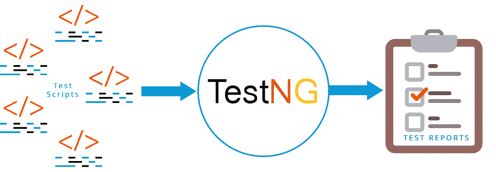
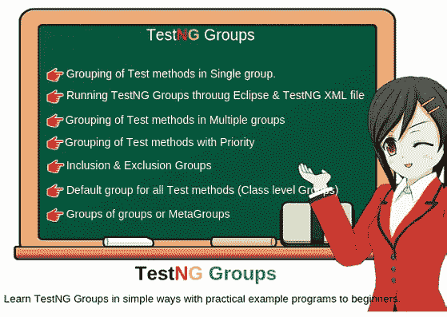

# 测试组的并行测试

> 原文：<https://medium.datadriveninvestor.com/parallelize-test-for-test-ng-groups-9fcbab363ef8?source=collection_archive---------0----------------------->

## 测试

## 质量不是一种行为；这是一种习惯


source: [https://www.simplilearn.com/how-to-build-successful-quality-management-career-article](https://www.simplilearn.com/how-to-build-successful-quality-management-career-article)

质量管理是软件过程的重要组成部分。质量管理关注的是确保软件产品达到所需的质量水平。它提供了对软件开发过程的独立检查。质量管理过程检查项目可交付成果，以确保它们与组织标准和目标一致。这是我在 Medium 的第 20 篇文章。

TestNG 是一个开源的自动化测试框架；其中 **NG** 表示 **N** ext **G** 代。TestNG 的灵感来源于 JUnit 和 NUnit。但是 TestNG 引入了一些新的功能，使它更加强大和易于使用。这些新功能是注释，在任意大的线程池中运行测试，提供各种策略，测试您的代码是多线程安全的，灵活的测试配置和对数据驱动测试的支持。TestNG 的设计涵盖了所有类别的测试:单元测试、功能测试、端到端测试、集成测试等等。



Source: [https://www.edureka.co/blog/selenium-webdriver-tutorial/](https://www.edureka.co/blog/selenium-webdriver-tutorial/)

“Groups”是 TestNG 的一个注释，可用于多个测试的执行。当我们不想在不同的类中(取决于功能)同时单独定义测试方法时，我们在 TestNG 中使用组。我们将忽略(不执行)一些测试用例，就好像它们不存在于代码中一样。



Source: [https://www.scientecheasy.com/2019/05/testng-groups.html](https://www.scientecheasy.com/2019/05/testng-groups.html)

我想你们大多数人都知道“*并行化*”这个词在测试中，并行化意味着同时运行测试用例。如果你是一名质量工程师，那么你有你的自动化测试用例、自动化框架和持续集成等等。让我们假设您的测试套件将花费大约 10 或 12 个小时或者更多的时间来运行。如果你的项目经理告诉我们需要在 3 或 4 小时内发布。你不能声称我们的测试框架需要 10 个小时来运行。随着测试次数的增长，时间会增加。因此，您需要并行化。我们可以通过硬件、软件和混合实现并行化。这里我想描述一下如何在软件方法中实现并行化。


Parallel test execution, Source: [https://www.udemy.com/parallel-test-execution/landing-page/](https://www.udemy.com/parallel-test-execution/landing-page/)

## 对测试组使用并行测试的优势。

*   与硬件并行化相比，成本更低
*   没有硬件管理效果
*   没有测试结果合并开销
*   减少测试时间
*   同时运行两组或多组测试

当我们进行软件并行化时，我们应该考虑以下因素:

*   测试框架的设计和实现应该支持并行执行
*   测试层应该支持并行执行
*   线程安全编码
*   使测试类/方法独立
*   执行环境配置

您已经知道 Test NG 已经具有并行化功能。现在我们可以看到如何在 XML suite 中实现测试 NG 组的并行测试，这是一种简单的方法。

在测试中，我们可以使用以下适合我们的注释之一。

```
@Test(groups = { "bind", "link" })
@Test(groups = { "bind" })
@Test(groups = { "link" })
```

TestNG 官方页面中建议了另一种实现并行化的方法:

```
@Test(groups = { "bind" },threadPoolSize = 3, invocationCount = 10,  timeOut = 10000)
```

但是上述两种方法并不完全符合分布式测试执行工具，例如 [ClusterRunner](http://www.clusterrunner.com/) 和 [Meissa](https://meissarunner.com/) 。因此，这里它将运行这些分配给线程的测试组。有一个定制的实现来实现测试 NG 组的并行测试。下面，我们可以看到如何实现这一点。但是现在处于 POC 级别。我们想改进它。这种方法是 SyscoLABS (PVT)有限公司的创新理念。这里我只分享关键的想法。

这里我们将创建一个 TestNG 并行执行器，它将从给定的测试套件中读取 XML，并创建一个线程池。我们可以配置线程数量，它会将这些组分配给 executor 服务。

因此，我们的测试线程如下所示。

这里我们正在传递测试组，该组将被构造并传递给 TestNGParallelRunner。从那里开始测试。创建一个像 Java 类一样的 Group.java 类，名为“Class.java”。

## 结论

在本文中，我主要关注 TestNG 组以及如何并行化 TestNG 组测试。有许多方法可以并行化 testNG 组测试。这里我只描述了两种方便的方法。

如果你想获得更多的知识，可以查看[官方文档页面](https://testng.org/doc/)或者一些有用的教程页面比如 [Guru99](https://www.guru99.com/all-about-testng-and-selenium.html) 和[教程点。](https://www.tutorialspoint.com/testng/index.htm)

***感谢您阅读至此。如果你喜欢这篇文章，请分享、评论并发表👏几次(最多 50 次)。。。也许会对某个人有帮助。***

***关注我的*** [***推特***](https://twitter.com/TheSabesan) ***和 Medium 如果你将来对这些更深入、更翔实的文章感兴趣的话！***