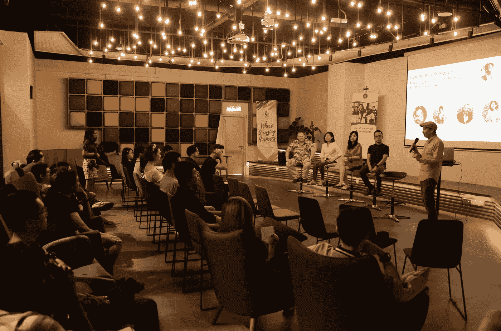

# 父母——路障还是盟友？

> 原文：<https://medium.datadriveninvestor.com/parents-roadblock-or-allies-864586c5eb24?source=collection_archive---------10----------------------->

当我们组织一次关于个人转变和职业转型的社区对话时，我没想到‘父母’会是许多参与者产生共鸣的一个重大挑战。

我们的一个小组成员有一个极端的例子，她向父母隐瞒了自己职业的变化达 6 个月之久；当她的父母发现这件事时，引发了一场激烈的争论，导致她父亲心脏病发作。

 [## 幸福的算法？数据驱动的投资者

### 从一开始，我们就认为技术正在使我们的生活变得更好、更快、更容易和更实用。社交媒体…

www.datadriveninvestor.com](https://www.datadriveninvestor.com/2019/03/08/an-algorithm-for-happiness/) 

我的父母是我今天的坚强支柱。

这让我想到，我们如何才能在实现一个人的全部潜力和满足父母的期望之间取得平衡？

# **我的故事**

“好的结果让我变得优秀”这一信念深深植根于我的内心，伴随着我的成长。作为一个叛逆的青少年，我在一种情况下打破了规则——没有人可以挑剔我的学习成绩。

在澳大利亚独立生活了 3 年后，当我告诉妈妈我辞去了在普华永道马来西亚的第一份工作时，她并不热情的反应让我大吃一惊。后来，我更加惊讶地发现，我的大多数同龄人在做出重大职业改变之前都会征求父母的同意。

在创业，在一线了解真实世界后，我学会了欣赏父母智慧的价值。在克服精神健康崩溃的过程中，我的父母给我空间，让我从空白的画布上开始新的生活。

尽管我们有分歧，但学会尊重和爱我的父母需要心痛和伤痕——我们都在尽我们生活的最大努力。

# **布伦布朗的育儿研究**

> 我们对自己的了解以及我们如何在孩童时期学会参与世界设定了一条路线，这条路线要么要求我们花费生命中的大部分时间来努力找回自我价值，要么给我们的旅程带来希望、勇气和韧性。“布伦·布朗

布伦·布朗在她的书《大胆尝试》中有一章叫做“全心全意的养育”，她说所有父母对孩子的期望就是他们对自己的期望——培养孩子全心全意地生活和爱，并相信他们的价值。

警告是，价值没有先决条件。

无论我们今天在哪里，我们不能改变我们的成长方式，但我们可以改变我们交流和反思自己生活的方式——我们的行为、思想、情感与强烈的价值感的需求有什么关系？

我们的父母如何影响我们的信仰？我们能打破它，建立一个新的吗？怎样才能和同桌的父母沟通？

# **成为我们自己旅途中的英雄**

当我第一次看到坎贝尔·约瑟夫的英雄之旅时，我惊讶地看到我的人生旅程被分为 12 个阶段，尤其是“死亡与重生”，这与我最黑暗的斗争产生了共鸣。

在英雄的旅程中，有 8 个原型组成了一个故事的角色——英雄、导师、盟友、门槛守护者、传令官、影子、变形人和魔术师。

用英雄的旅程作为人生故事的模板，我们是如何在自己的生活中扮演英雄角色的？我们现在在哪里？我们父母代表的原型是什么？

如果他们是阻止我们进入新冒险的门槛守护者，我们如何将他们变成盟友或导师？

> “拥有我们的故事的力量，即使是艰难的故事，也在于我们能够书写结局。”—布伦·布朗

《英雄之旅》告诉我们，生活就是采取行动，克服挑战，从一个阶段走向另一个阶段，最终目标是实现最真实的自我。

我们有责任管理内部和外部的力量，创造我们独特的足迹，让我们的生活有价值。

***大家好，我是《T*** [***他拥有你的故事的艺术***](https://mailchi.mp/89cd9c1503f3/56bmhw2mx6) ***》的作者伊莎贝，我写的是关于有意识的生活和个人成长，建立一个名为“*** [***拥有你的故事***](https://www.facebook.com/oyscommunity) ***的社区。可以跳上***[***www.isabellethye.com***](http://www.isabellethye.com)***阅读更多文章。***

如果你喜欢你所读的，你的掌声对我来说意义重大！谢谢:)