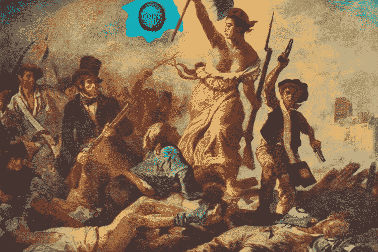

# 巴黎着火了:数字经济是摆脱旧习俗的象征

> 原文：<https://medium.datadriveninvestor.com/paris-is-on-fire-the-digital-economy-as-a-symbol-of-freedom-from-old-conventions-83d471bc2e7c?source=collection_archive---------17----------------------->

巴黎火了，有人怀疑这只是开始。根据动荡的根源，我们可以得出这样的结论:厌倦了税收的欧洲不想再遭受全球经济机构的暴政。当人们对某件事不满意时，他们用钱投票，似乎这一次——赞成数字经济。12 月 1 日至 3 日的比特币价格可能会间接证明这一假设。12 月 1 日周六中午，随着“黄背心”活动的开始，价格从 3980 美元飙升至 4300 美元，涨幅为 8%。它停留在 4000 多美元的水平，直到 12 月 3 日晚上，行动停止，市政府统计了损失。在这一行动一无所获之后，实际上，利率下降了同样的 8%,并且不再上升到 4000 美元以上。简单来说，虚拟资产市场支撑了法国的愤怒日，证实了它的社会性。同样，在 2017 年，比特币[支持了](https://bitnewstoday.com/news/regulation/brexit-effect-how-the-idea-of-sustainability-is-departing-to-the-digital-reality/)英国退出欧盟和加泰罗尼亚意见书。我们来试着分析一下这种现象的本质，理解一下为什么社会和加密货币关系如此密切。

**全球生存危机**

旧世界各种虚拟资产的普及程度很高。例如，2017 年，在法国，6%的公民拥有自己的电子钱包，在德国为 8%。就数字而言，这些数字看起来更有意义:400 多万法国人和 800 多万德国人相信数字未来。也许，在现在的时间里，没有更多，没有人可以相信。

著名的股票投机者**乔治·索罗斯**称现在全球经济中发生的情况为生存危机。科学将这种状态定义为一种焦虑和不适的感觉，同时在满足需求的背景下专注于存在的理由。根据这位金融家的说法，市场上所有可能出错的事情实际上都出错了:美元不合理地走强、资本从东南亚外逃、移民危机以及民粹主义者掌权。所有这些作为一个整体正在推动世界走向一个新的金融冲击，相比之下，2008 年将像一场感冒对瘟疫流行。

虽然，摩根士丹利的负责人，**詹姆斯·戈尔曼**立即对索罗斯的话提出了质疑，称不存在存在危机，类似于，不要让老 scamper 争辩。我们将不评价索罗斯的话，而是引用另一位经济学家的话；诺贝尔奖获得者**保罗·克鲁格曼**说了下面的话:*“现在，至少可以想象 1997-98 年的经典危机，当时新兴市场货币崩溃，导致公司债务急剧增加，这导致经济进一步紧张和货币崩溃。”和任何危机一样好。虽然不是存在主义。原因将是美元经济的压力。"我们正在观察一场全球危机的开端吗？"——克鲁格曼继续。“可能不会。但是，如果我早些时候说，甚至没有这种危机的迹象，现在我就不能这样做了。”*但还是有事情发生了。而这个“东西”有三个因素的特征。

**警卫累了**

第一个:长期以来(大约从 20 世纪 70 年代开始)，世界一直生活在美元金融体系中，美国的支付单位是跨国商品和服务积累储备和支付的主要手段。这种货币体系是建立在美国无可争议的军事政治和经济实力的基础上的。就连上世纪末的另一个超级大国苏联也采用了美国的游戏规则，因为在经济上，美国人控制了大部分的科技和制造公司，在军事上，他们控制了两大洋。然而最近，这种力量减弱了。

生产和技术部门在其他力量的控制下缓慢但稳定地发展:中国、日本、韩国和印度正在争夺新的霸权。这部作品离开了美国，在世界各地漫游。在军事上，美国的成功也有许多不足之处。在过去的 10 年里，美国参与了许多战争，但事实上，一场战争都没有打赢。伊拉克战争实际上以伊斯兰组织的繁荣而告终:美国人打碎了一个大“怪物”，诞生了许多小“怪物”。利比亚战争也以同样的方式结束，阿富汗战争也远未结束。

美国正迅速失去威望，美元也正在失去信任。但是，所有试图扭转这一趋势的努力都以非最佳结果告终。比如**唐纳德·特朗普**旨在让货币回流国民经济的税改，导致美元不合理的走强，市场压力过大，美元作为储备和结算资产的受欢迎程度又一轮下降。

**精英们的无能**

第二个:政治精英素质下降。近年来，世界各国的统治者似乎已经失去了他们的条约能力，不仅在外交政策上，在国内政策上也是如此。外交可能已经从艺术变成了一场不可能的斗争。欧洲国家，即使在一个单一的经济和政治空间内，也无法在移民问题上达成一致，并正式接受了让任何人都不舒服的协议。

美国不能在任何事情上与俄罗斯或中国达成一致。此外，已经达成的协议正在崩溃。事实上，反导协议已经被否定，下一个是短程和中程导弹条约。这是关于政治。在经济领域，在世贸组织内部，合同也不会持续很长时间。

美国进入对俄冷战、对华经济战状态。与此同时，在中东这个地球上主要的产油区，已经发生了一场激烈的所有人对所有人的战争。政客们显然缺乏化解矛盾的智力和沟通技巧。

**要还是不要**

第三:财产制度的危机。这种现象多见于欧洲。巴黎事件再次证实了这一事实。对持欧盟护照的人来说，拥有某些东西正变得越来越麻烦。所得税和财产税有时会飙升。例如，在比利时，公民缴纳 42%的所得税，48%的社会税，10%的工资留存；在法国，分别为 49%和 40%，因此，他们从劳动所得中获得 11%；在德国，税率为 43%和 40%，17%留给雇员。

现在让我们来计算财产税:在英国，每年是房产价值的 11.9%，在法国是 8.5%，在比利时是 7.5%。欧洲其他国家在这些指标上处于相同的水平。

但不仅旧世界用苛捐杂税沉重打击其居民。中国、印度和美国都有很高的税收。事实上，在各大洲，收费率每年都在增长，有时甚至超出了常识。例如，阿根廷企业的总税率为 137%。那就是，不管你付出多少，你还是欠国家的。

现在很多税收制度都很荒谬。但最重要的是，几十个欧洲国家的公民看到，他们的钱，他们国家的钱没有用于发展经济或社会结构，而是用于复制选票，归化前移民，这些人本质上操纵政府。事实证明，美国正忙于输出民主，而欧盟正忙于输入选民。

**烈塔尔的视力**

综上所述，这些因素导致了对传统经济的不信任，结果是焦虑和乔治·索罗斯所说的生存危机。而且很明显，出路就在入口所在的同一个地方，就是信任。换句话说，就是社会创造和采用新的价值载体、新的经济关系和新的货币，这就是数字经济所提供的。

顺便说一下，分散的加密货币并不是中本聪独有的愿景。今天，即使是著名的专家也很少记得“额外货币”这样的术语，尽管这种现象自上世纪末就已为人所知。1977 年，苏联在 Kohtla Jä rve 镇的爱沙尼亚面包店建立了第一个“时间银行”,在那里，工作时间单位被用作价值载体。(大约在同一时间，类似的结构出现在美国和日本；货币单位开始分别被称为“时间元”和“丹丹”。)

三年后，1980 年 2 月 18 日，一个有趣的实验在苏联举行，在此期间，发生了时间单位的周转，类比于货币流通，在三个组织之间:前面提到的面包店，黑人科学研究所，和当地的发电站。因此，前两个组织用时间向第三个组织支付电费。当然，交易的确认是模拟的，发生在纸面上。

这个想法并没有在苏联和后苏联时代的俄罗斯扎根。但是在一些国家，“时间银行”仍然有效。“时间美元”也很受欢迎，尽管更多是在志愿者圈子里。换句话说，Satoshi 只是数字化了在他之前很久就已经知道的东西。

比利时金融家和欧元的设计者 Bernard LIETAER 认为额外的(加密)货币是全球经济的稳定工具:*“在我看来，大多数现有的额外货币对社会层面有影响，而不是对整体经济有影响。“它们允许人们进行技能或经验的社会交流，”他在接受一家俄罗斯出版物采访时说，“我认为最成功的社区是，在一段时间后，这些钱将不再被使用，因为不再需要它们。”*

*我们不要谈论完全放弃金钱的乌托邦想法，但 Lietaer 也认为*同样的结构条件适用于经济和任何生态系统，即存在最小和最大的多样性。如果我们超过一定数量的多样性，就会出现停滞，当我们低于最小值时，崩溃就开始了。

经济是一个复杂的流动系统，货币在其中流通。因此，我们可以得出结论:在经济中，必须存在最低限度的多样性，一个国家一种货币无法确保现有金融体系的稳定，”— Lietaer 继续说道。"我们还可以创造一些利基市场，在崩盘后仍能生存下来."但显而易见的是，只要这些利基市场仍像现在这样小，它们就无法成为该体系的平衡力量。比如，在巴西，有额外的货币在流通，但它们只占该国货币供应总量的 1——1 . 5%。"

这位科学家对比特币持怀疑态度，认为它是一种投机工具，因为 99.7%的硬币不用于买卖任何东西。在他看来，持有比特币只是希望它的价格会上涨，这样它就只不过是一种投机工具。但总的来说，Lietaer 对数字资产的想法非常乐观。他相信它们可以帮助解决根本问题，比如贫困。

前几天，20 国集团(G20)领导人讨论了加密货币的命运。然而，沉重的官僚机器已经灾难性地落后于社会发展，这导致人们更加愤怒，他们更喜欢与任何政治或经济制度无关的资产。

总之，考虑另一种趋势会很有趣。巴黎的公众骚乱并不罕见，我们可以回忆起警察与消防员的史诗般的冲突(后者获胜)，被冒犯的移民点燃的几十辆汽车的火灾，以及对同性婚姻的反对。安排不同种类的革命是法国的民族传统。

然而，最近的演讲与以往所有的演讲不同，抗议者油漆了凯旋门，并分离了拿破仑雕像的头部——事实上是法国国家和法律的创始人。也许，这不仅仅是破坏行为，因为巴黎人以前从未损坏过他们的国宝。大概，法国的国民偶像拿破仑被斩首，就是传统国家逐渐没落的信号。未来即将来临的象征。

我们敢说，下一次比特币的飞跃将发生在传统国家体系再次表现出不一致性的时候。

在这里阅读最好的加密新闻分析！bitnewstoday.com[比特币、投资、监管和其他加密货币](https://bitnewstoday.com/)

【bitnewstoday.com】最初发表于**。**