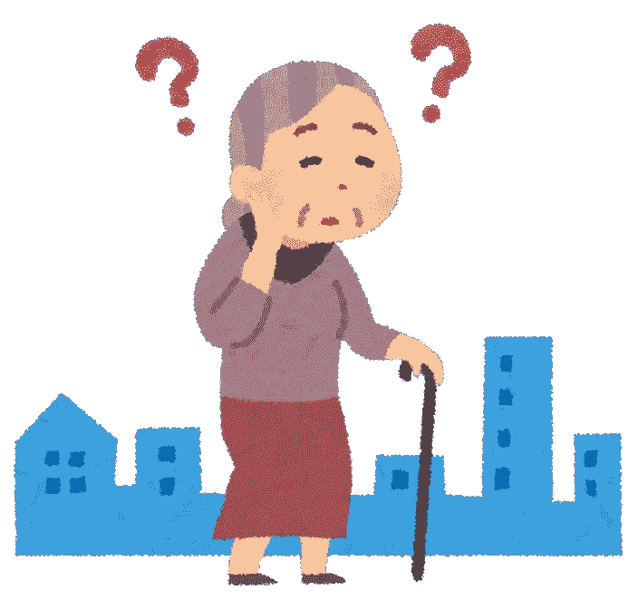
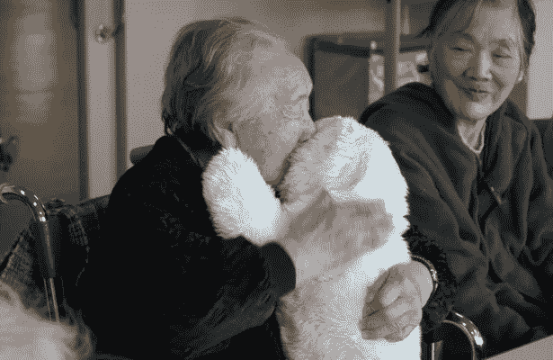
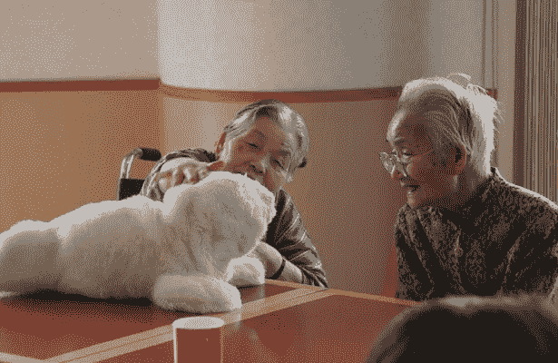

# 海豹 PARO:一个道德的电子看护者？

> 原文：<https://medium.datadriveninvestor.com/paro-the-seal-an-ethical-electronic-caregiver-e701ee82fa7c?source=collection_archive---------4----------------------->

有些东西太可爱了，无法用语言表达，对吧？我想我们都同意小海豹完全属于这一类。

当我很小的时候，我得到了一个巨大的白色长毛绒玩具。从那时起，我就喜欢上了这些小宝贝。

然而，我也认为机器人很可爱！

不管怎样，当我在一个编辑项目中听说一只可爱的机器人海豹时([一本关于机器人作为同伴的好书——以及更多！](https://www.amazon.com/dp/9082977907/))，我显然是全身心的投入。我想知道一切。

 [## 模式和机器人:复杂的现实|数据驱动的投资者

### 哈耶克的名著《复杂现象理论》(哈耶克，1964)深入探讨了复杂性的话题，并断言…

www.datadriveninvestor.com](https://www.datadriveninvestor.com/2019/03/04/patterns-and-robotics-a-complex-reality/) 

[PARO](http://www.parorobots.com/) ，目前处于第八个迭代阶段，旨在帮助痴呆症患者和其他导致智力下降的健康问题。

 [## 2019 年最值得学习的编码语言|数据驱动的投资者

### 在我读大学的那几年，我跳过了很多次夜游去学习 Java，希望有一天它能帮助我在…

www.datadriveninvestor.com](https://www.datadriveninvestor.com/2019/02/21/best-coding-languages-to-learn-in-2019/) 

我亲眼目睹了痴呆症的危害。年复一年，看着心爱的人一点一点地离开，没有什么比这更难处理的了。

Source: KissPNG

养老院和辅助生活环境中的人们通常不在他们的朋友和家人身边。毕竟，在那个人之外，我们还有自己的生活。我们有工作、学校和其他义务。你不能一直和他们在一起。你就是不能。

动物也非常有助于抚慰和提供其他形式的安慰，但对于住在养老院的人来说，这不是一个切实可行的选择。

这就是 PARO 的用武之地。

# 什么是 PARO？

PARO 是一只栩栩如生的海豹，它不仅会发出格陵兰海豹的声音，还会对各种刺激做出反应(触摸、光线、声音、温度和姿势)。

它能识别光和暗，知道什么时候被抚摸或被打，也知道什么时候被抱着。它还可以识别声音和特定的单词，包括问候，甚至是它被赋予的任何名称。它甚至记得积极的互动，并试图重复它们，它避免导致病人负面反应的行为。

它的使用鼓励人们在没有其他人在旁边的时候照顾某物和与某物互动。有些人喜欢作为一个群体一起去 PARO。

Source: ParoRobots.com

好像很管用，对吧？很难和那些笑脸争辩。谁不想帮助有记忆障碍的人享受他们剩下的时间呢？

对于有问题的人来说，它也被认为是[性价比高的](https://www.sciencedirect.com/science/article/abs/pii/S1525861017305820)。

# PARO 的使用合乎道德吗？

许多人提出了伦理问题，特别是给一个智力下降的人一个假动物并假装它是真的是否有辱人格。

一项[研究](http://www.doc.gold.ac.uk/aisb50/AISB50-S17/AISB50-S17-Sharkey-Paper.pdf)得出了这样的结论【我添加了一些链接来用更简单的术语解释一些语言】:

> 最终，我们有理由期待 Paro 机器人为[脆弱的老年人](https://www.dshs.wa.gov/altsa/home-and-community-services/vulnerable-adult)提供一些好处，但也有一些风险。风险包括涉及某种形式的[欺骗](https://www.psychologytoday.com/us/basics/deception)，以及一些人可能会认为机器人具有[贬低作用](https://en.wikipedia.org/wiki/Dehumanization#In_science,_medicine,_and_technology)并造成一种可感知的降低[尊严](https://www.techenhancedlife.com/articles/elder-dignity-autonomy-and-need-protection-abuse)(尽管这一点需要更多的证据)。与此同时，在[能力方法](https://en.wikipedia.org/wiki/Capability_approach#Capabilities)的背景下考虑机器人的影响，可以确定它可以被视为[启用](https://ppc.sas.upenn.edu/our-mission)的方式，因为它可以增加患有[认知障碍](https://simple.wikipedia.org/wiki/Cognitive_impairment)的人获得比其他方式更广泛的能力。目前，可能的利益可以被视为承担风险的理由。在未来，如果证据的平衡更决定性地倾向于 Paro 的积极好处，甚至可以说应该向那些可能从中受益的痴呆症患者提供 Paro。

看，在基于心理学的领域中，[伦理](https://www.pcrm.org/ethical-science/human-experimentation-an-introduction-to-the-ethical-issues)和[知情同意](https://www.verywellmind.com/conducting-ethical-research-in-psychology-2795184)对于确保我们避免对被研究的人造成心理伤害至关重要。

如今，参与心理实验的人必须签署同意书。实验者必须[向受试者披露相关信息](https://www.tandfonline.com/doi/pdf/10.1080/10508420701712990)，受试者必须同意所述条款。

这是因为以前的实验在精神上对[造成了伤害](https://www.online-psychology-degrees.org/10-bizarre-psychology-experiments/)(这个链接和其他一些链接包含了可能会造成精神创伤的参考文献)，因为它们过于强烈地模糊了[什么是真实的，什么是虚假的](https://explorable.com/milgram-experiment-ethics)。为了得到结果，欺骗通常是必要的，因为你希望受试者诚实地反应，而不是按照他们认为他们应该说或做的来反应。

但是在什么情况下会过分呢？一个主体到底需要知道多少？如果他们不知道自己被研究，他们会有不同的反应吗？

这就是 PARO 的困惑所在。这并不完全是一项实验，因为它只是一种工具，已经被证明可以帮助痴呆症和其他形式的智力衰退患者。另一方面，对一个分不清机器人和“驯化”海豹的人撒谎，道德吗？

# 有效性

Source: ParoRobots.com

许多老年人遭受各种形式的虐待和遗弃。尽管不可能一天中的每一秒都和他们在一起，但重要的是要记住，PARO 不应该取代和所爱的人在一起的时间，也不应该承担整个照顾者的角色。

也就是说，一些研究表明 PARO 机器人比一个相似的毛绒玩具更有效。所以吸引力在于对刺激做出真实反应的东西。例如，PARO 在被爱抚或拥抱时会发出快乐的声音，如果病人用力挤压它或以其他方式“伤害”它，它会发出不安的声音。

[另一项研究](https://link.springer.com/article/10.1186/s12877-019-1244-6)得出结论，PARO 帮助患者减少负面情绪和行为，与他人进行更多的社交互动，拥有更多积极的情绪，并体验更高质量的护理体验。

然而，他们提出了对成本、工作量、[感染](http://eprints.brighton.ac.uk/18670/1/26.03.32-33.pdf)、耻辱和伦理的担忧。不幸的是，没有足够的研究直接针对用户的需求和体验。需要做更多的研究来确定这种影响是长期的还是短期的，因为[的一项研究](https://www.researchgate.net/publication/258255139_PARO_robot_affects_diverse_interaction_modalities_in_group_sensory_therapy_for_older_adults_with_dementia)已经观察到了长期的结果。那些是孤立的案例吗？还有待观察。

Source: ParoRobots.com

# 结论

虐待老人太普遍了，所以为什么不给那些有记忆障碍的人一个享受晚年的机会呢？痴呆症和其他相关的健康问题降低了养老院和辅助生活中心的人们的生活质量。

PARO 是一个以幼年竖琴海豹为原型的机器人，它会对别人对它说话、触摸和拥抱做出反应。许多使用它的病人比尝试之前有了更多积极的体验，它似乎改善了他们的心理健康。

但是通过告诉人们这只海豹是一种生物来欺骗他们是不道德的吗？这样做是否有失身份？这是否降低了他们作为人的尊严？

现在还没有定论，但我觉得积极的一面大于消极的一面。我不是专家，但我希望我已经给了你足够的信息，让你自己决定 PARO 是帮助还是伤害。只有时间和更多的研究才能告诉我们答案。