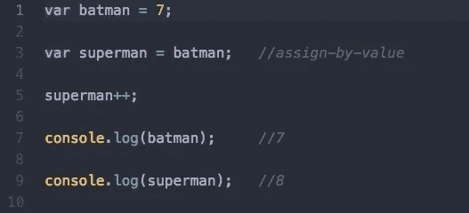
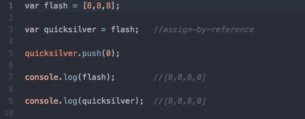
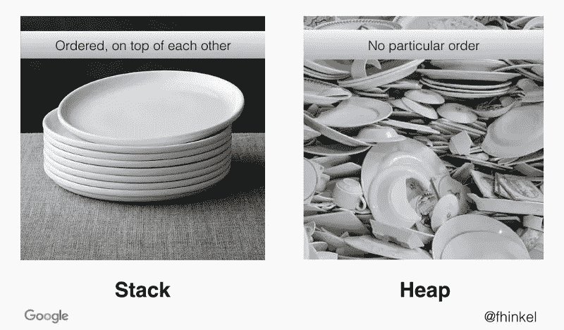

# 解析中断

> 原文：<https://medium.datadriveninvestor.com/parsin-the-interruption-3b620ae9a275?source=collection_archive---------27----------------------->

## JavaScript 如何在解析阶段组织不同大小的变量？

众所周知，JavaScript 是分开解析和执行代码的。扫描代码时，会为遇到的每个对象留出内存。

但是每个对象分配多少内存呢？是当场决定的吗？是否为每个元素预留了预定的内存量？

这些都是我自己也在想的问题。当我四处询问时，我大多听说为每件事都留出了相同数量的内存——这令人困惑。一个带有字符串赋值的变量怎么能和一个带有五个或十个变量的函数分配相同数量的内存呢？**不可能。事实并非如此。但是，在我继续之前，我想说:记忆这个术语可以在不同的范围内理解，并且根据这些范围有不同的应用和意义。例如，您可以根据存储一个值需要多少字节来谈论内存，可以根据堆栈和堆等功能性内存来谈论内存，或者可以根据程序从其操作系统或服务器借用的内存量来谈论内存。还有各种各样的其他环境，改变着记忆的意义，与你正在探索的语言相关。所以当你在讨论记忆的时候，很容易和别人不一致。**

至少对我的问题来说，底线是这样的。JavaScript 有两种类型的内存，静态和动态。每一个都适合它自己的空间——堆栈和堆。让我来解决这个问题。

## 静态= >堆栈

## 动态= >堆

堆栈是保存标量原始值(数字、字符串、布尔、未定义、空、符号)的地方。标量原始值是“按值”传递和赋值的值。

堆是复合值(对象、数组、需要用户输入的函数)的大得多的区域。复合值是通过“引用”传递和赋值的值。

在 JavaScript 中，标量原始值的原型是不可变的，而复合值是可变的。不可变意味着你不能改变值，当你把相同的值重新赋值给一个新的变量并改变它的值时，你改变的是在重新赋值时得到的值的副本。

让我再说一遍…

你可以给一个变量分配一个数字，给第一个变量分配另一个变量，改变一个变量的值而不影响另一个变量的赋值。

这是因为当您将第二个变量赋给第一个变量时，您实际上是将它赋给变量所指向的值的副本，而不是变量本身或值本身。它创建该值的新副本并存储它。所以每个变量指向不同的值。这是堆栈中按值赋值和传递的变量的主要特征。

另一方面，使用按引用赋值，如果你给一个数组赋值，一个引用被创建，被任何指向它的变量共享。

当变量中的复合值被重新赋值时，会创建一个新的引用。与大多数其他流行的编程语言不同，在 JavaScript 中，引用是指向存储在变量中的值的指针，而不是指向其他变量或引用的指针。

> 这种通过值和引用进行分配的差异就是 Dan Abramov 在他著名的 tweet 中所谈论的，它最终通过解析阶段内存分配的较低级别的差异来反映。

所以，这回答了我关于变量解析方式不同的问题。静态变量或按值传递的变量保存在堆栈中，这是一种临时的、后进先出的数据结构。就像一堆盘子一样，每次调用一个函数，它都会被放到堆栈上，称为“堆栈框架”。

然后每当一个函数退出时，**该函数放在堆栈上的所有**声明都被“释放”。**堆栈帧的释放或删除意味着内存区域现在可供其他堆栈变量使用。但更重要的是，这是作用域的物理表示。**堆栈决定了你的局部作用域，并负责在函数退出时关闭它。

堆是独立于堆栈的额外存储，没有特定的布局。它负责复合变量和未知大小的变量。堆上的对象在我们退出函数后仍然存在，主要由 JavaScript 的垃圾收集器处理。

如果你从这篇文章中学到了什么，那就是 Javascript 有两种不同类型的内存:静态和动态。每个都有自己的内存空间:堆栈和堆。变量的行为在解析期间由它们是通过值赋值还是通过引用赋值来确定的。并且程序的范围反映在堆栈帧中。

参考资料:

 [## 对栈和堆感到困惑？

### 坦白说，我总是很难把堆栈和堆分开。是的，我读过内存管理，然后…

medium.com](https://medium.com/fhinkel/confused-about-stack-and-heap-2cf3e6adb771)  [## 7.内存:堆栈与堆

### 使用堆栈存储变量的好处是内存是为你管理的。你不必分配…

www.gribblelab.org](https://www.gribblelab.org/CBootCamp/7_Memory_Stack_vs_Heap.html)  [## 二进制堆——雄辩的 JavaScript

### 这个文件是雄辩 JavaScript 第一版的一部分。考虑改读第三版。在第…章

eloquentjavascript.net](http://eloquentjavascript.net/1st_edition/appendix2.html)  [## JavaScript 的堆集合

### 堆是一棵二叉树，其中每个节点都大于它的两个叶子。树本身是完整的或接近完整的…

www.collectionsjs.com](http://www.collectionsjs.com/heap) 

【http://net-informations.com/faq/net/stack-heap.htm 