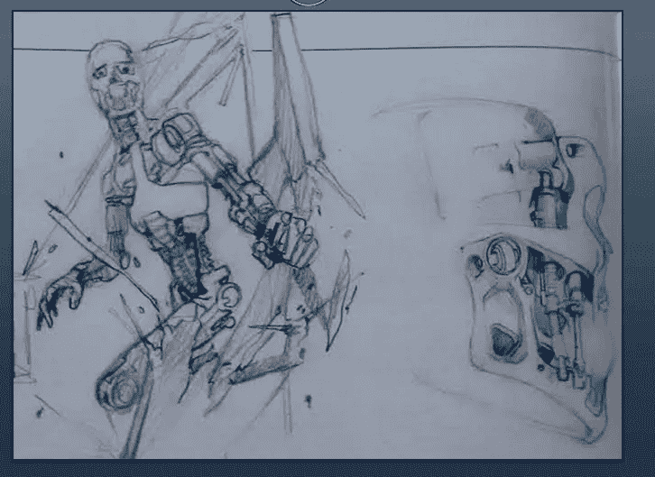
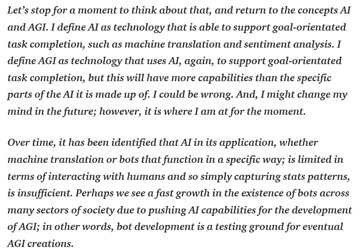
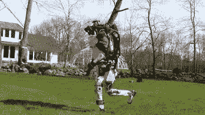
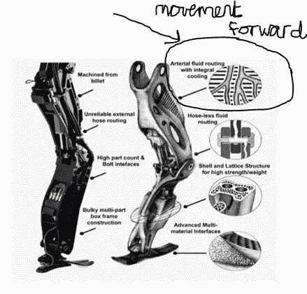
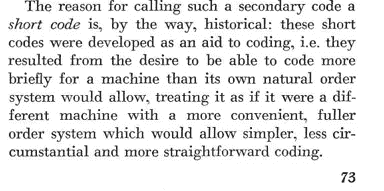
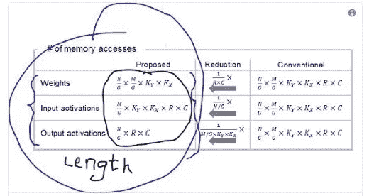
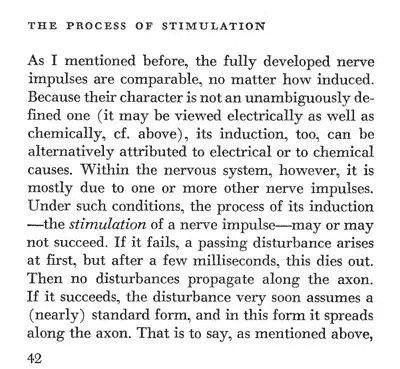
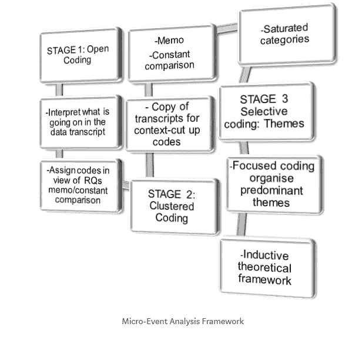
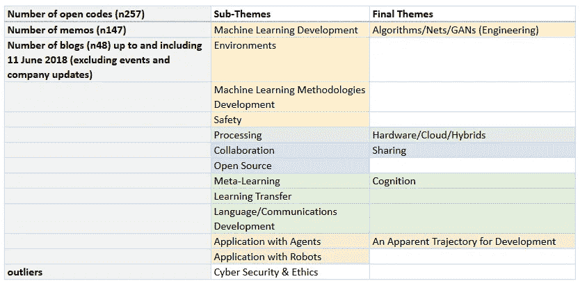
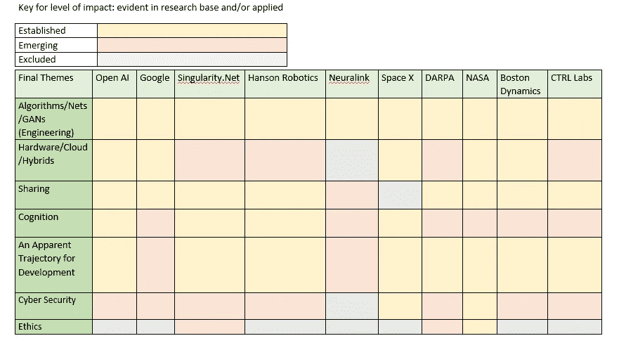

# 第 1 部分:人工智能和人工通用智能:推进研究基础。

> 原文：<https://medium.datadriveninvestor.com/part-1-artificial-intelligence-artificial-general-intelligence-moving-the-research-base-40508d9ceb60?source=collection_archive---------21----------------------->

[Jim Cameron’s](http://www.jamescamerononline.com/endoskeleton.htm) initial sketch for the endoskeleton (left) and his first take on the endoskull (right)

试图勾勒出人工智能(AI)和普通智能(AGI)的研究基础可能如何向前发展；我将首先概述当前的挑战。接下来我会参考 AI/AGI 更专科的应用；为了强调一些支持高级开发的基本概念和实践，通过比较。

对于那些刚接触这个话题的人来说，为了找出人工智能和 AGI 之间的区别，我试图在这里提供一个容易理解的解释:

除了你今天可能熟悉的常规软件机器人之外，与人工智能/AGI 的专业应用相关的是上面的终结者草图(1984)。从那些电影开始，我们在时间和发展方面已经走了很长的路；虽然人工智能研究已经存在了比大多数人知道的时间更长的时间(例如，[跨越了几十年](https://papers.nips.cc/book/neural-information-processing-systems-1987)，人工智能的发展步伐与机器人技术一起以高产的速度前进，特别是在过去的二十年里。从卡梅隆为《终结者》所做的草图到应用开发，这一过程达到了高潮；正如我们看到的[波士顿动力公司的 Atlas 机器人，它现在显然可以追着你穿过树林，2018 年 5 月 11 日:](https://newatlas.com/boston-dynamics-atlas-running/54573/)

此外，关于 pace，模拟和数字混合计算(架构/设计/硬件)的融合也加快了速度；从约翰·冯·诺依曼 (1958)提供的暗示转变过来，模拟可以被概念化为非二进制的，我们知道数字处理依赖的坐标。与此相结合，现在可以通过为定制硬件和相关联的对齐神经形态芯片编码的人工深度学习神经网络来应用水力学-化学-物理工程/理论/原理。水力学的一个很好的例子是波士顿动力公司的创始人[的工作，他描述了他的团队如何建造了有史以来最先进的人形机器人之一](https://spectrum.ieee.org/automaton/robotics/humanoids/boston-dynamics-marc-raibert-on-nextgen-atlas):

简单地说，有必要强调与人工神经网络的发展和与冯·诺依曼的工作相联系的硬件发展有关的两个需要注意的要点。首先，与计算和短代码的功能有关:

我们在神经形态芯片的开发过程中看到了这种需求，简称为代码，[一种针对深度学习和 CMOS 技术进行优化的神经形态芯片，具有时域模拟和数字混合信号处理](https://www.semanticscholar.org/paper/A-Neuromorphic-Chip-Optimized-for-Deep-Learning-and-Miyashita-Kousai/14096de8ec536281f50802eb858f9d97344b9bd8):

值得注意的是，这与互联网/Web 上使用的脚本语言形成对比，后者的成功主要是因为依赖于库。

第二，比较计算机和大脑；冯·诺依曼写了关于涉及电学和化学属性的归纳处理:

在 2018 年 7 月，我记下了这些主题(表。1)转自共'*定性分析'* : [OpenAI 博客:一个微事件分析](https://medium.com/coinmonks/openai-blogs-a-micro-event-analysis-e15e98cfbca1)

我利用基于建构主义的理论和定性分析框架，以归纳和演绎的方式处理数据:

在建构主义范式中，*现实是多元的，相对的，因此在个人的头脑中被创造*；真理是基于共识的。因此，扎根理论的核心原则是，意义可以通过自己的行为和与他人的互动(如他人的活动/工作/产出)来创造和修改。其他应用示例，请参见[此处](https://medium.com/@stuartmacdonald79/student-engagement-characteristics-and-pedagogical-features-using-twitter-during-undergraduate-fa3487607aa3)。最终，这是我对微观事件/记录证据的重建。

以下(表。1)显示，总的来说，开放编码产生了 257 个代码和 147 个相应的备忘录；你也可以看到子主题，最终主题和离群值；重申一下，本文的结果来自于一个定性的、基于建构主义理论的微观事件分析: [OpenAI 博客:一个微观事件分析。](https://medium.com/coinmonks/openai-blogs-a-micro-event-analysis-e15e98cfbca1)

Table 1

这项研究的主题将会形成这篇论文。下面的键和相应的(表。2)显示那些根据研究、文献和/或应用似乎正在取得进展的地方；与贯穿最终主题的工作质量保持一致(表。1).尽管网络安全和道德是离群值，但我已经将二者都包括在表格中。为清晰起见，最终主题来自对 2015 年 12 月 11 日至 2018 年 6 月 11 日期间 OpenAI 产出的深入研究分析。

Table 2

其他大赦国际/AGI 利益攸关方未被列入(表中，原因各不相同。2).总的来说，一个主要原因是缺乏明显的产出，即研究/文献和应用在数据可用性方面不符合基准标准(如亚马逊)和/或不在同一水平上(如微软)。

接下来，在 [**第二部分**](https://medium.com/datadriveninvestor/part-2-artificial-intelligence-artificial-general-intelligence-moving-the-research-base-52fff601c3fb) **、** [**第三部分**](https://medium.com/datadriveninvestor/part-3-artificial-intelligence-artificial-general-intelligence-moving-the-research-base-893078d04ee0) 和 [**第四部分**](https://medium.com/@dawnalderson/part-4-artificial-intelligence-artificial-general-intelligence-moving-the-research-base-150b9e3aa17f) 中，是关于(表中最后主题的讨论。2);作为一个基准，与那些命名的组织/公司以及关键标记进行综合:*已建立的*、*新兴的*和*被排除的*详细说明相关的人工智能/AGI 发展和影响。目的主要是概述当前的挑战，以及参考人工智能/AGI 的更多专业应用；为了强调范式转换的一些基础概念、实践和方法——通过比较，可以实现高级开发的启示。

