# 第 2 部分:人工智能和人工通用智能:推进研究基础。

> 原文：<https://medium.datadriveninvestor.com/part-2-artificial-intelligence-artificial-general-intelligence-moving-the-research-base-52fff601c3fb?source=collection_archive---------30----------------------->

更新于 2019 年 3 月 23 日

再次重申，本文的目的是概述当前主要的挑战，与主流的发展相关——关注@ scale、人工智能(AI)和人工通用智能(AGI)。此外，包括人工智能/AGI 的专家应用的参考，以解决基础概念、实践和方法的例子，用于考虑范式转变——能够实现高级开发的启示；反过来，告知研究基地如何向前发展。

下表显示了来自早期 OpenAI、输出分析的[的最终主题，这些主题作为与那些命名的组织/公司以及关键标记进行综合的基准:*成立*、*新兴*和*排除*以阐述相关的 AI/AGI 发展和影响。关于具体说明为什么包括这些公司/组织的理由，请](https://medium.com/coinmonks/openai-blogs-a-micro-event-analysis-e15e98cfbca1)[参见第 1 部分。](https://medium.com/datadriveninvestor/part-1-artificial-intelligence-artificial-general-intelligence-moving-the-research-base-40508d9ceb60)

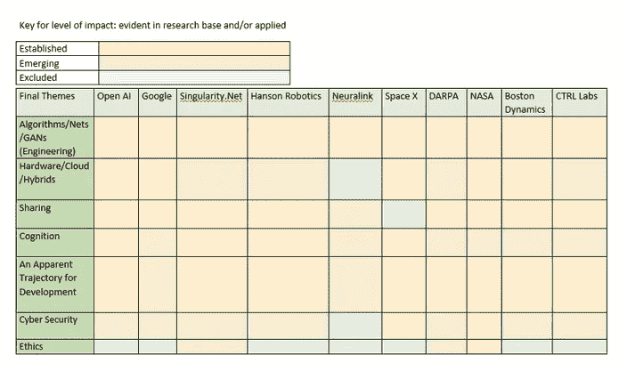

为了证实这一点，本文(第二部分)的重点涉及两个主题:网络安全和伦理。

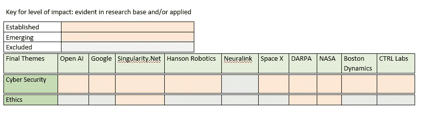

更新于 2019 年 3 月 23 日

这篇第二部分论文最后一段中用来证实道德立场的 [NASA 链接](https://ntrs.nasa.gov/archive/nasa/casi.ntrs.nasa.gov/20170011156.pdf)在网上已经不存在了。因此，就现状而言，**上述公司中没有一家拥有既定的、透明的人工智能/AGI 在线发展道德行为准则。**

**网络安全**

2018 年 10 月 22 日，OpenAI 分享了他们关于[用迭代放大](https://blog.openai.com/amplifying-ai-training/)学习复杂目标的博客，研究论文在这里[这里](https://arxiv.org/abs/1810.08575)。首先，这是一个很好的符合**网络安全的例子。**博客上写道:

“我们正在提出一种叫做迭代放大的人工智能安全技术，通过演示如何将一项任务分解为更简单的子任务，而不是通过提供标记数据或奖励函数，让我们指定超出人类规模的复杂行为和目标。”

经过仔细观察，很明显这篇论文和博客指的是软件开发。结论是，由于依赖软件，该套件可能容易受到导致人工智能/AGI 的错误的影响— [错位行为:](https://arxiv.org/abs/1810.08575)

*“许多现实世界的学习任务涉及复杂或难以指定的目标，使用更容易指定的代理可能会导致表现不佳或行为偏差。”*

此外，在依赖任何性质的软件开发时，体系结构需要特定的术语(语言/代码)，如果使用数字处理，这主要意味着演绎推理。例如，数字处理涉及规则；构建时需要遵守的代码；目标导向的议程是数字处理的固有特征，因此根据定义，这样的特征是软件开发的嵌入特征。反过来，这对网络安全也有影响。

一种将软件设计的依赖问题整合在一起的方法；其相关的语言/代码和方法，以及网络安全的含义，是在考虑软件应用的位置。一般来说，这个软件位于互联网上——一个非常古老的系统，非常容易受到攻击。更深入地了解互联网；信息在网上的自由流动&用户的隐私、对他们自己的数据和应用程序的控制，请参见下面的链接:

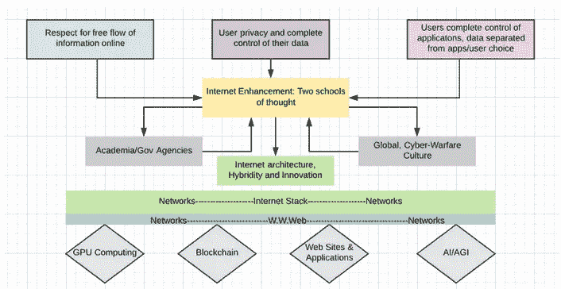

Taken from: [*How can the free flow of information online & users’ privacy be respected in which people have complete control of their own data; applications & data are separated from each other, & a user’s choice for each are separate?*](https://medium.com/@dawnalderson/how-can-the-free-flow-of-information-online-users-privacy-be-respected-in-which-people-have-fbfba7feefb7)

类似地，白皮书《天网之前的[黑客机器人:技术附录](https://ioactive.com/pdfs/Hacking-Robots-Before-Skynet-Technical-Appendix.pdf)提到了术语/代码/语言与 TCP/IP 启示的结合，如果机器人为潜在的 AGI 设计了人工智能，并在脚本级别(软件)编程，则会出现安全问题:

*URControl 是运行在 UR 控制器柜中的迷你 ITX PC 上的低级机器人控制器。通过编写客户端应用程序并使用 TCP/IP 套接字连接到 URControl，可以在脚本级别 1 对机器人进行编程……当机器人连接到内部网络时，服务就会公开。由于这些服务都不提供身份验证，网络上的任何用户都可以向这些服务发出命令来执行许多不同的操作…可以使用 URScript 编程语言来远程控制机器人'*

事实上，白皮书还指出:

*如果机器人是基于云的生态系统的一部分，敏感信息可以被发送到其他机器*

这份白皮书对波士顿动力公司(Boston Dynamics)有影响，因为它们显示了网络安全的新兴趋势；迄今为止，应用程序尚未被黑客攻击/破坏，这将是因为缺乏扩展机器人的目标，然而，超越定制的硬件来运行软件是昂贵的，如果天网确实是绝对安全的，云计算等更便宜的选择是一种选择。

重申一下，到目前为止，我提到软件开发是网络安全的问题；我还概述了 2017 年白皮书中已知的记录在案的安全问题，涉及机器人和云计算。而且，鉴于 OpenAI 对安全的关注，公平地说，他们正在把网络安全作为一个需要发展的问题来关注。

很明显，谷歌在人工智能方面的工作表明了网络安全方面的一种新兴姿态。同样，所有定制的非规模工作都是安全的，正如 Deepmind 的 AlphaGo 项目等所证明的那样。虽然，说到一个想要扩大规模的问题；跨目的，通过其提供的套件，仍然存在依赖互联网和网络的问题。一个很好的例子，可以突出在项目[流为国民保健服务医院](https://deepmind.com/applied/deepmind-health/working-partners/how-were-helping-today/)。[最新消息](https://deepmind.com/blog/scaling-streams-google/)是:

*“我们很兴奋地宣布，*[*Streams*](https://deepmind.com/applied/deepmind-health/working-partners/how-were-helping-today/)*——我们支持医生和护士为患者提供更快、更好护理的移动应用——背后的团队将加入谷歌。”*

最明显的问题似乎出现在应用程序的开放 API 中，其中包括:

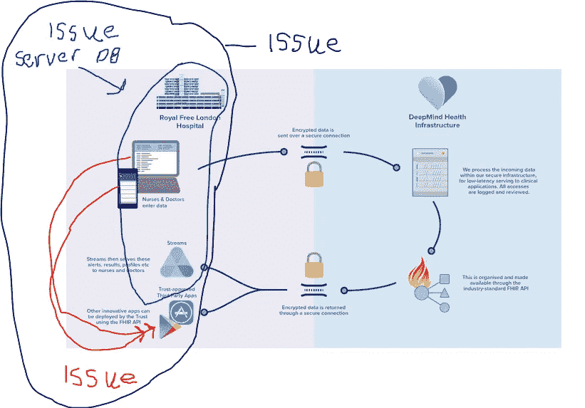

在上图中，可以清楚地看到 DeepMind 在后端提出的架构，突出了保护数据的安全性。此外，如果 DeepMind 进行研究，鉴于他们迄今为止在文献中的历史足迹，他们会对数据进行匿名处理。

从黑圈开始，需要说明的是，所有的数据库/服务器总是容易受到攻击；这是一种既定的策略，通过多种方式进入，以及关闭服务器——重定向数据/路由/同时搜索数据库。简而言之。黑客只会在他们从一个漏洞收集的商品有价值的情况下进行攻击，有时黑客可能只是进去嗅一嗅然后离开。我说建立，进入总是依赖于互联网已经被设计的方式；在这种情况改变之前，一切都会保持原样。因此，这个等式可能听起来像下面这样:

=互联网易受攻击=如果依赖互联网/web 服务，硬件/服务器/数据库同样易受攻击；请记住，我们谈论的是可伸缩性——如果不是通过网络/web 进行可伸缩性，那就不同了，安全性可以用不同的方式处理。

回到关于超越谷歌的问题，这里有必要提供一个简短的历史。DeepMind 是一家被谷歌/Alphabet 收购的新公司；创建该公司的最初成员仍然存在。DeepMind 一直希望开发人工智能/AGI，我们现在看到了一个提议，即 DeepMind 的工作不能在没有谷歌的情况下扩展到 NHS——Alphabet suite 中最差的装备，一个缺乏领导力的公司失去的灵魂，以及越来越低质量输出的声誉。此外，值得注意的是， [Android 加入了这个派对，](https://deepmind.com/blog/deepmind-meet-android/)作为 Goolge 套件的一部分的操作系统，这带来了更多的问题，见上图中的红圈。

红圈表示前端；用户界面，特别是手机，尽管如果 NHS 使用桌面和微软，我们只是从 [Wannacry 黑客、](https://medium.com/@dawnalderson/the-hack-may-2017-38db1ab594c)新的进入方式——通过微软工具包不断发展，这些原因归结于 NSA 四处游荡和扮演上帝。

接下来，上图中的蓝色圆圈包括“Streams 是临床医生的安全移动应用程序”这一概念它很可能是一个安全的应用程序，但 [SS7](https://www.forbes.com/sites/thomasbrewster/2017/09/18/ss7-google-coinbase-bitcoin-hack/#6554749941a4) 是一个可以进入电话界面并收集“实时”数据的黑客。

最后，回到应用程序问题:

2018 年 2 月 25 日，我写了[一篇对英国政府文章的系统回应](https://medium.com/@dawnalderson/social-media-probe-6957e2e68547):[心理健康可能是社交媒体公司的‘深水地平线’，](https://www.huffingtonpost.co.uk/entry/mental-health-online_uk_5a7ad86be4b0d0ef3c0b0dd0?guccounter=1&guce_referrer_us=aHR0cHM6Ly9tZWRpdW0uY29tL0BkYXduYWxkZXJzb24vc29jaWFsLW1lZGlhLXByb2JlLTY5NTdlMmU2ODU0Nw&guce_referrer_cs=KTFKdFRE01MpLe-hsLlsyA)由英国大学、科学、研究部长撰写&英国政府创新:

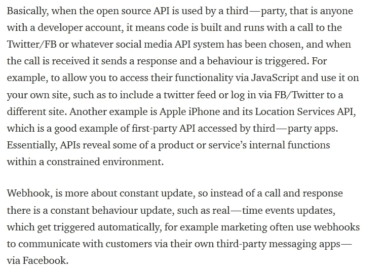

换句话说，谷歌作为一个平台的既定架构；这意味着它旨在收集数据，不仅以最基本的方式收集数据，而且有许多方式，包括通过安卓手机[根据范德比尔特大学计算机科学教授 Douglas C. Schmidt 的说法](https://digitalcontentnext.org/wp-content/uploads/2018/08/DCN-Google-Data-Collection-Paper.pdf):

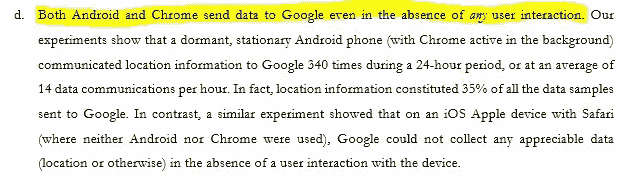

继续，[Singularity.Net 与汉森机器人](https://public.singularitynet.io/whitepaper.pdf)合作，提出使用机器学习的网络安全功能代理援助；涉及同态加密来处理存储在云中的数据集，“通过区块链机制和核心人工智能算法的大规模分布”来通知机器人索菲亚的开发。然而，关于网络安全；一个来自中国的团队发表了关于对全同态加密的攻击的研究。

本质上，不管这篇文章有多旧(没有过时)，基本原理仍然适用——如果攻击者可以通过根工具包访问内核。关键的一点是，关于云计算经常会有误解，因为攻击可以通过云-内核连接发生，而不仅仅是“哦，让我们进入云并拿走货物”。

纵观与 DARPA 相关的文献，似乎人工智能/AGI 开发和网络安全也正在兴起。当然，研究的主体是两层的，因为研究/产出既关注系统的规模开发，也关注更多定制工程的开发；然而，后者不是那么容易得到的。事实上，DARPA 的传播策略相当混乱；在尽可能多的情况下，输出要么保留信息，要么太快付印。比如 DARPA 想从机器常识造出类似人类的[AI；将对物体、代理和地点的核心认知构建到称为里程碑的机器中。这项工作旨在通过儿童发展心理学研究/理论，使用评估方法，最终意味着是/否成绩分数。目的是从人工智能的狭义应用转移到 AGI，但同样，正如我们与其他人一起看到的那样，坚持以规模为目标进行抵消:](https://www.darpa.mil/news-events/2018-10-11)

*‘机器常识的探索并不是一个新领域。自人工智能早期以来，研究人员一直在进行各种努力，以开发基于逻辑的常识知识和推理方法，以及从网络中提取和收集常识知识的方法。虽然这些努力产生了有用的结果，但它们的脆弱性和缺乏语义理解阻碍了广泛适用的常识能力的创建。*

由此推论，常识是很难定义的，因此，DARPA 建议把重点放在语义学上才是解决之道。常识一词指的是感官；人类的感觉意味着五种能力。子宫中的婴儿会感觉，然后出生后的早期依赖于所有的感觉在他们的记忆/暗示系统中建立一套连接，以实现早期交流，例如，指指点点、哭泣等等。

最终，DARPA 希望通过开源，使任何人都能使用使用容器(Docker/Kubernetes)的并行处理，为人类“常识”属性的发展做出贡献。从而存在一个标准，可以对工作进行评估；这里值得注意的是，就在 2018 年 11 月 9 日，头像@hackerfantastic 在 twitter 上发布了:

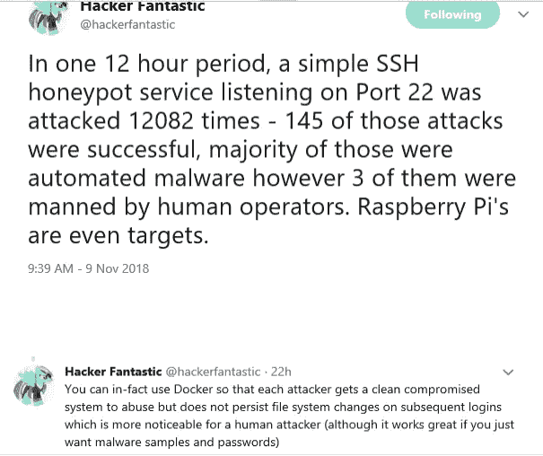

这意味着 Docker 是不安全的。然而，我们看到 DARPA 启动了一个专注于规模的项目，因此安全性受到了损害，即使安全措施被认为是到位的。此外，早在 1958 年，约翰·冯·诺依曼的《计算机和大脑》出版了。当时就成立了；DARPA 试图实现的目标需要串行和并行处理的结合，换句话说，仅仅使用数字技术是无法实现的。然而,“常识”输出中缺少支持本项目所需模拟和数字应用的硬件。为什么？

来自 DARPA 的更多定制项目之一，由[Phillip Avelda](https://www.youtube.com/watch?time_continue=378&v=vjac3RBoK1c)博士展示。这项工作的重点是向大规模开发神经系统接口*过渡。鉴于演示文稿中没有任何关于互联网改革的内容，该项目依赖于互联网的架构。事实上，阿韦尔达博士将这项技术的发展与第一个可以连接计算机的调制解调器相提并论；根据阿维达博士的说法，以太网调制解调器的出现，以及开启互联网指数增长的工业时代是:*

*“我们想要为大脑接口构建什么……你想要与大脑的哪一部分进行接口，我们相信就像具有提取通信功能的调制解调器的计算机一样，无论你想从大脑中获取什么信息，我们都可以构建一个具有高精度神经接口的通用部件……以及其中的一些通用部件...仍然会有一个蓝牙数据 io 系统的等价物…通用调制解调器组件…我们相信它是可以构建和扩展的'*

此外，Avelda 博士提到了商业，他说，

*“我们正处于这个行业一切可能的开端……所以在 DARPA，我们谈论了很多关于寻找技术杠杆的点，不仅仅是开发我们认为很酷的东西，而是找到那个点，如果我们开发了那个东西，你就可以创造一个行业”*

该项目的主要内容是扩大规模的目标和理由/基本原理:

*“我们可以超越恢复医学……并带来一个非常重要的变化……我们可以用我们的思想决定我们的命运”*

有两点值得注意。最直接的一点是，DARPA 不会改变/改革/增强/创新互联网，但在这里，我们被要求考虑改变，用我们的思想来决定我们的命运，以带来非常重要的变化。结论是，互联网需要保持其相同的架构，因为这是科技行业规模化运作的方式。支持这一观点的是 [CTRL labs](https://www.ctrl-labs.com/) 所做的工作，尽管迄今为止没有已知的数据泄露，显示了一种新兴的网络安全立场；由于网络安全漏洞的同时存在，这仍然是一个悖论。

因此，第二点涉及网络安全。在他的介绍中，Avelda 博士提到了新设计的神经接口中存在的常见组件，如蓝牙数据 io 系统。这意味着该系统可以通过收集仪器跟踪，事实上，信号情报是一个全球性的业务。来自【2016 年 ni.com 信号情报航空航天和国防论坛的幻灯片概述了如何通过通信和其他方式收集信号情报:

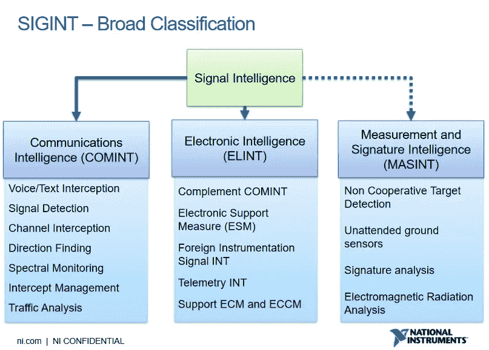

从本质上讲，流量拦截以下列方式发生:

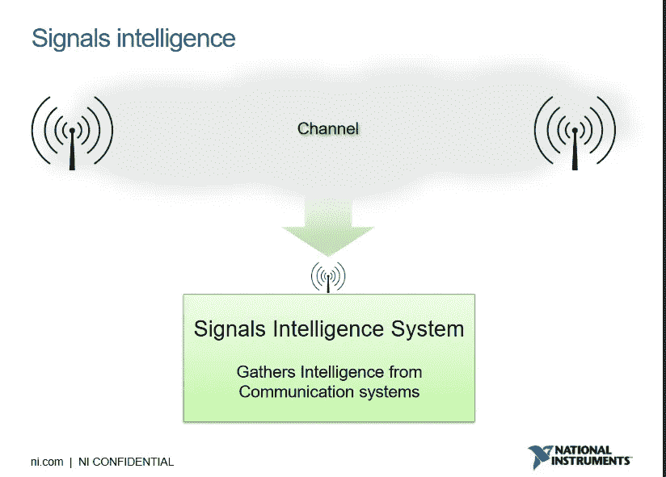

例如，链接到移动电话的蓝牙、WIFI 和 LTE 可以被跟踪，这意味着如果神经接口是通过在相同系统上运行的蓝牙开发的，那么它也可以被跟踪:

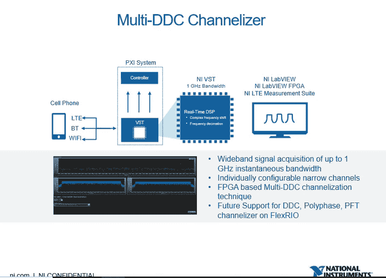

没有明显的关于 Neuralink 的网络安全方法的文献。然而，Tim Urban 对 Neuralink 和大脑神奇未来的实质性详细描述可以在[这里](https://waitbutwhy.com/2017/04/neuralink.html)找到。在这一点上，这是一个很好的机会来考虑 Space X 网络安全与 Neuralink 的一致性，因为完全缺乏关于任何数据泄露的文献，顺便提一下，这也适用于 NASA 的应用程序。因此，随着空间 X 的出现，网络安全似乎建立起来了；因为两者似乎都不依赖于规模，这是对软件的依赖与大众的规模之间的根本区别

软件→开源→GitHub→云=依赖互联网

与可以利用硬件的定制工程相比，创新性地内置了网络安全。接下来，我将概述一个来自 Falcon Heavy 应用实践的例子；然后，我将从 Neuralink 和网络安全的角度强调概念转移。

关于运行中的猎鹰重型火箭，我们所看到的最明显的成就是这样一个事实，即整体的三个部分返回地球，以期在尽可能短的时间内开发可重复使用的火箭。本质上，如前所述，猎鹰重型依赖于硬件混合；具体来说，一个定制的系统/硬件与对齐的芯片开发，可以位于移动的机器。

到目前为止，您已经注意到了一种通过互联网进行扩展的通用方法，以及通过互联网创建一个行业所带来的安全问题。Neuralink 公司在神经界面开发的细节方面发布信息的速度很慢；然而，鉴于猎鹰重型的属性，我们知道埃隆·马斯克在定制人工智能/AGI 的工程方面具有专业知识。

换句话说，测试和推进科学；从小处着手以满足确定的需求，而不是在互联网上推动规模，这与常规的技术行业范式形成了对比。这一切对 Neuralink 意味着什么？我想从网络安全的角度提出几点来结束这一部分。

第一，2018 年 11 月 17 日；埃隆·马斯克在推特上写道:

顺便说一句，SpaceX 不再计划为可重复使用性升级猎鹰 9 号第二级。反而加速了 BFR。新设计非常令人兴奋！令人愉快的反直觉。

我认为，他所谓的反直觉是指量子计算的含义。这种范式的转变，超越了二元论，就像我们在二进制计算中发现的那样，不是我们所知道的计算，它是非直觉的，也不一定是迭代的。相反，我们可能会概念化触发器而不是模式识别，模式识别本质上是演绎的，因此是迭代的；以及包括与线性处理相反的自发性的提示系统。此外，一个常数是能量分布驱动物质的流动，触发器产生撞击效应；结合方差/变量作为物质的流动/方向性。

目前的担忧是对高精度操纵难以想象的大量变量的依赖。启用在数字计算中是约束的启示；通过使用模拟信号，可以使用并行/串行处理、时域模拟和数字混合信号处理来连接两者之间的空间，从而实现更高的实时性，[自发安全选项:](https://spectrum.ieee.org/computing/hardware/the-case-against-quantum-computing)

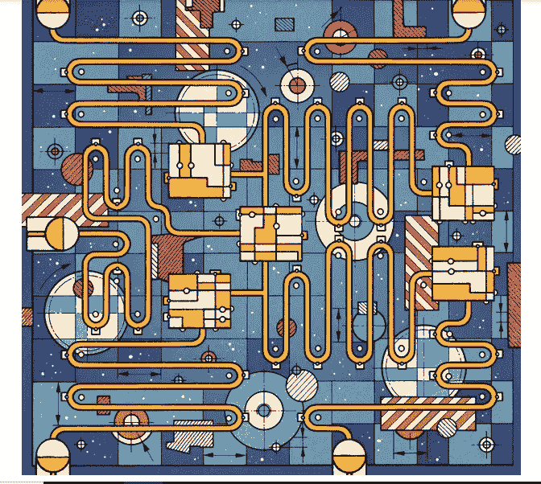

因此，Neuralink 的发展鸿沟将是关于在人类和机器之间获得默认的带宽/速度，如果量子计算在定制、小规模、满足需求的应用方法中进行试验的话。

**伦理道德**

虽然，在人工智能/AGI 发展的文献中，普遍缺乏伦理政策；这里明显提到了目标和原则，例如谷歌承诺的目标和原则，我们看到 [OpenAI 越来越关注安全性。](https://openai.com/blog/openai-lp/)此外，SingularityNET 在[白皮书](https://public.singularitynet.io/whitepaper.pdf)中展示了一种新兴的姿态，例如，在处理数据方面:

“奇点网”允许网络节点合作建立非常大的、分散的数据集，每个节点以约定的格式加入一点数据。然后，贡献者可以从代理那里获得报酬，代理使用这些数据来训练他们的人工智能模型。数据生产者可以对其数据的访问和使用规定隐私约束和其他限制。“通过分散所有权和对巨大数据集的访问，SingularityNET 迈出了另一个重要的步骤，使人工智能技术及其好处的访问民主化。”

NASA 经历了一个一般的赤字模型:“哦，天哪，发生了什么？”意思是事后关注。例如，我们可以读到[挑战者号灾难(1986 年)](https://thegrcbluebook.com/wp-content/uploads/2013/01/Ethics-Challenger-Disaster.pdf)，其中最重要的信息是关于安全的终极赤字模型，提供经验教训。也就是说，开始时的赤字模型对人工智能/AGI、生物计算机接口等来说不够好，特别是考虑到一些讨论的工作旨在以抵消为目的进行缩放(例如 CTRL labs)。在第 3 部分的[中，我将从本系列的第 4 部分](https://medium.com/datadriveninvestor/part-3-artificial-intelligence-artificial-general-intelligence-moving-the-research-base-893078d04ee0)的[结束的表格中提出几个主题，最终考虑到范式转换——可提供性，它可以实现高级开发；反过来，告知研究基地如何向前发展。](https://medium.com/datadriveninvestor/part-4-artificial-intelligence-artificial-general-intelligence-moving-the-research-base-150b9e3aa17f)

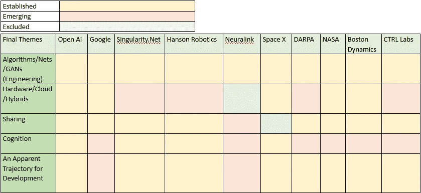