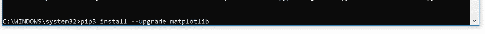
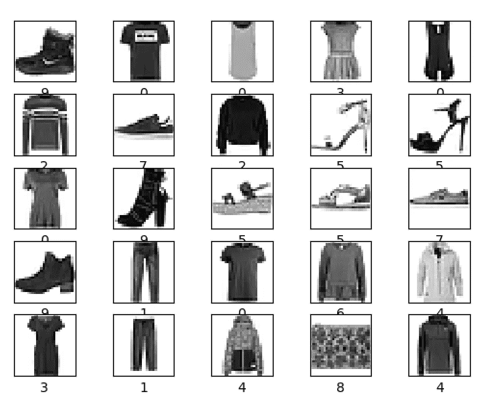
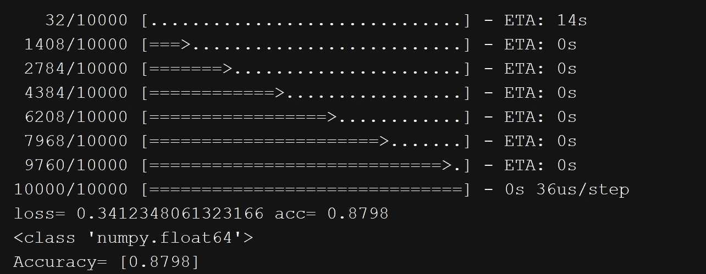

# 第 2 部分:使用 Tensorflow 构建神经网络

> 原文：<https://medium.datadriveninvestor.com/part-2-basic-classification-neural-network-6d68d32fa4b2?source=collection_archive---------2----------------------->

# 介绍

本材料是在[https://www . tensor flow . org/tutorials/keras/basic _ classification](https://www.tensorflow.org/tutorials/keras/basic_classification)中找到的材料的重写/重复。如果您开始将网络放在一起，在样本数据集上进行训练/测试，那么这是一个很好的起点。在这篇文章中，不要期望分类算法的理论描述，而是期望能够使用 Tensorflow 和 Python 库设计和运行反向传播(或反向传播)神经网络。

# 预赛

1.  确保您已经按照[第 1 部分](https://medium.com/@FreeOfConfines/install-python-3-6-and-tensorflow-92eeff0ad4f5)所示检查并设置了您的环境。
2.  对于这个练习，我们需要一个重要的 Python 库: [Matplotlib](https://matplotlib.org/) 。该库将用于绘制从本次练习和将来的其他练习中收集的结果。
3.  在 Windows 命令提示符下运行以下命令(使用以管理员身份运行选项):`pip3 install — upgrade matplotlib`



Run `pip3 install — upgrade matplotlib`

# 代码片段

下面的代码片段是 Google 在[https://www . tensor flow . org/tutorials/keras/basic _ classification](https://www.tensorflow.org/tutorials/keras/basic_classification)中分享的一个例子。我添加了一些额外的评论，希望有助于理解流程和结果。

想法如下:

*   用反向传播神经网络学习和识别时尚 _MNIST 中的图像。
*   数据库分为训练集和测试集。训练集有 60000 个图像，每个图像的大小为 28 x 28。训练集中的每个图像属于 10 个可能的类别之一。与训练集(`trImages`)相关联的是一组标签(`trLabels`)，其将训练集中的图像分类为 10 个类别或标签之一。下图是列车图像及其下方相应标签的示例。

```
*# Download training and test sets of images from a dataset* fashion_mnist = keras.datasets.fashion_mnist
(trImages, trLabels), (tImages, tLabels) = fashion_mnist.load_data()
```



*   在训练集和训练标签上设计和训练神经网络。将训练标签视为正确答案，通过将训练集中的各个图像与训练标签中的相应标签相关联来调整神经网络的权重(作为训练的一部分)。
*   神经网络有三层(在本例中):第一层(`layer0`)是以线性阵列形式接收图像的输入层，第二层(`layer1`)有 128 个神经元或单元，最后一层(`layer2`)有 10 个单元。总共有(28*28*128)+(128*10)个重量要训练。输出层的每个单元输出输入图像属于图像类别之一的概率。
*   像任何优化问题一样，训练需要:a)损失函数或度量函数，在这个例子中是交叉熵 b)优化器，这里是 Adam 优化器，它调整网络的权重。

```
*# Define and build NN model
#layer0 = tf.keras.layers.Flatten(input_shape=np.shape(trImages[0])[1:]) # input layer* layer0 = tf.keras.layers.Flatten(input_shape=np.shape(trImages[0])) *# input layer* layer1 = tf.keras.layers.Dense(128,activation=tf.nn.relu) *# Dense or fully connected layer* layer2 = tf.keras.layers.Dense(len(np.unique(trLabels)),activation=tf.nn.softmax) *# output layer with 10* model = tf.keras.Sequential([layer0, layer1, layer2])
model.compile(optimizer=tf.train.AdamOptimizer(),loss='sparse_categorical_crossentropy',metrics=['accuracy'])

*# Train the model* model.fit(trImages,trLabels, epochs=5)
loss, acc = model.evaluate(x=tImages,y=tLabels)
print("loss=", loss, "acc=", acc)
```

*   训练完权重后，在测试集中的图像上测试网络(`tImages`)。

```
predictedLabels = model.predict(x=tImages, verbose=1)
```

*   网络对来自测试集(`model.evaluate`)的图像进行分类的准确率约为 88%(见下文)，即测试集中 10000 幅图像中的 8800 幅被我们构建和训练的神经网络准确标记。



# 整个代码

以下是完整的代码:

```
import tensorflow as tf
from tensorflow import keras
import numpy as np
import matplotlib.pyplot as plt

print(tf.__version__)

*# Download training and test sets of images from a dataset* fashion_mnist = keras.datasets.fashion_mnist
(trImages, trLabels), (tImages, tLabels) = fashion_mnist.load_data()

*# Understand the dataset* print("Statistics of Training Set")
print("shape(trImages)=", trImages.shape)
print("len(trLabels)=", len(trLabels))
print("Unique trLabels=", np.unique(trLabels))

print("Statistics of Test Set")
print("shape(tImages)=", tImages.shape)
print("len(tLabels)=",len(tLabels))
print("Unique tLabels=", np.unique(tLabels))

plt.figure(1)
plt.imshow(trImages[0]) *# plotting an image* plt.colorbar()
plt.grid(False)
plt.draw()
*#plt.show() # needed to use this for the plot to appear

# Pre-processing images* trImages = trImages / 255
tImages = tImages / 255

plt.figure(2)
for i in range(25):
    plt.subplot(5,5,i+1) *# I guess index goes from 1-25* plt.imshow(trImages[i], cmap=plt.cm.binary)
    plt.xlabel(trLabels[i])
    plt.xticks([])
    plt.yticks([])
plt.draw()

*# Define and build NN model
#layer0 = tf.keras.layers.Flatten(input_shape=np.shape(trImages[0])[1:]) # input layer* layer0 = tf.keras.layers.Flatten(input_shape=np.shape(trImages[0])) *# input layer* layer1 = tf.keras.layers.Dense(128,activation=tf.nn.relu) *# Dense or fully connected layer* layer2 = tf.keras.layers.Dense(len(np.unique(trLabels)),activation=tf.nn.softmax) *# output layer with 10* model = tf.keras.Sequential([layer0, layer1, layer2])
model.compile(optimizer=tf.train.AdamOptimizer(),loss='sparse_categorical_crossentropy',metrics=['accuracy'])

*# Train the model* model.fit(trImages,trLabels, epochs=5)
loss, acc = model.evaluate(x=tImages,y=tLabels)
print("loss=", loss, "acc=", acc)

predictedLabels = model.predict(x=tImages, verbose=1)

plt.show(1)
plt.show(2)
```

# 摘要

这里我们使用 Tensorflow 来设计和训练一个简单的神经网络。在下一部分中，我们将对参数进行实验，并更详细地分析结果。