# 货币革命:将商品、证券和货币融为一体:“超级载体”币安加密货币(BNB)(下)

> 原文：<https://medium.datadriveninvestor.com/part-2-of-2-currency-revolution-combining-commodities-securities-and-currency-in-one-super-97753e1bfbe3?source=collection_archive---------5----------------------->

作者 Robin Gu 是 X-Order 的研究员，我们投资于区块链、数据科学开发和理论研究，以推动一种新的网络自然金融基础设施的出现。

在[第一部分](https://medium.com/datadriveninvestor/currency-revolution-combining-commodities-securities-and-currency-in-one-super-carrier-4d11bcef7db2)中，我们澄清了商品、证券和货币的定义，以及“劳动报酬”的概念。我们可以认为这三个概念本质上都是劳动报酬，它们随着时间的推移表现出不同的行为。

# 引入“空间”维度，重新审视“劳动报酬”

在 2 的第 2 部分中，除了时间的维度，我们还可以考虑引入“空间”的维度来理解可以看到的劳动报酬的特征。空间维度代表劳动报酬流动可以无摩擦的网络空间，是个人网络拓扑结构中流动程度的一种表现。空间维度越大，机动性越强。

换句话说，如果交易所代表了一个完整的空间，那么在这个空间中，对于每一个相同的证券，特别是一只股票，每只股票都可以与任何其他股票完全互换。

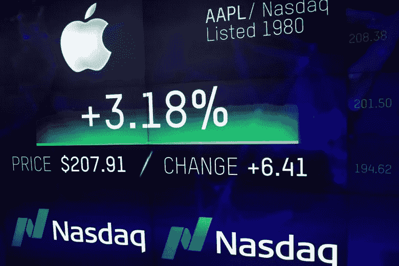

例如，你和我在纳斯达克交易所各自持有的苹果股票是完全等价的，可以不受影响地进行交换。这里的“等价”是指劳动报酬的隐含价值处于均衡状态(不考虑股票收购价格)。

回到商品，我们来看看有什么商业产品。以富士康产品为例，即使是其工厂加工的标准产品，每个产品背后的劳动报酬都是独立的，不能轻易互换。因为同一时间和地点生产的同一产品可能会导致不同的劳动报酬。

 [## ieo 聚集动力，币安 Launchpad 上的 3 个代币售罄-数据驱动的投资者

### 在无情的熊市之前，ICOs 在 2017-18 年期间为加密/区块链项目创造了第一次融资热潮…

www.datadriveninvestor.com](https://www.datadriveninvestor.com/2019/03/26/ieos-gather-momentum-with-3-token-sell-outs-on-binance-launchpad/) 

**例子:**同一家工厂生产的两部苹果 iPhones 第一部手机的螺丝可能会松动，不够坚固，第二部手机的屏幕可能会更亮。这意味着这些产品的劳动报酬是不同的。

进入这种实物商品的劳动报酬不可能没有摩擦地自由流动或交换。因此，这种劳动报酬所占据的无摩擦空间仅仅是一个点——移动任何距离都会引起摩擦。

货币是一种特殊的商品。它的出现是因为任何货币对的交换空间都太有限。为了促进商品的流通，货币演变成了交换的媒介。它将所有可交易货币对的孤立交换空间集合在一起，将任何商品的交换空间扩大了一百万倍。

目前，各国发行自己的货币。可以说，一个人的货币充当交换媒介的空间，可以看作是那个国家统治权的一部分。

> 现在有可能将商品、证券和货币纳入同一框架之下:这三者都可以被视为不同时空维度的劳动报酬形式。

具体来说，它们有时代表劳动报酬的先前状态；其他时候，它们代表了劳动报酬的未来状态。有时它们在有限的空间里反映劳动报酬，有时则在更广阔的空间里代表劳动报酬。我们可以用下面两个图来总结:

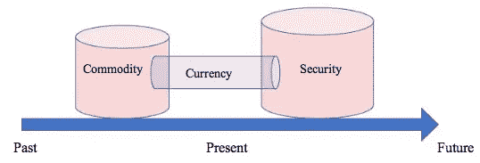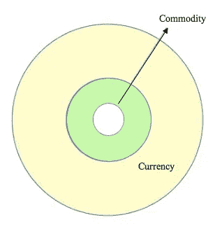

Representations of Labour Rewards Throughout Time and Space Respectively

似乎加密货币或区块链代币也符合这一框架。也是不同时空维度下劳动报酬的表征。总有一种观念认为代币和区块链提供了更多的自由和自主权。

> **自由和自主是如何体现的？**
> 一种可能是代币可以同时拥有商品、证券和货币的品质。

# **为什么我们说 BNB 同时展现了商品、证券和货币的特质？**

首先，BNB 有效地结合了劳动报酬在时间和空间维度上的表现。BNB 框架可以说有三个组成部分:(1)公用事业(2)安全和(3)货币。

**概述**

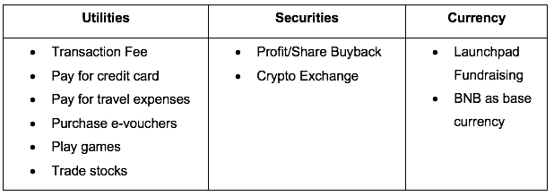

**公用事业分公司**

BNB 有多种现有的公用事业用途，如下图所示:

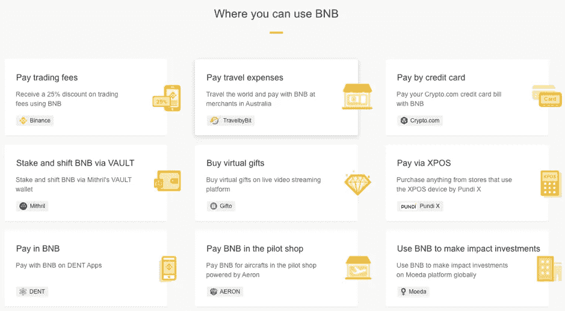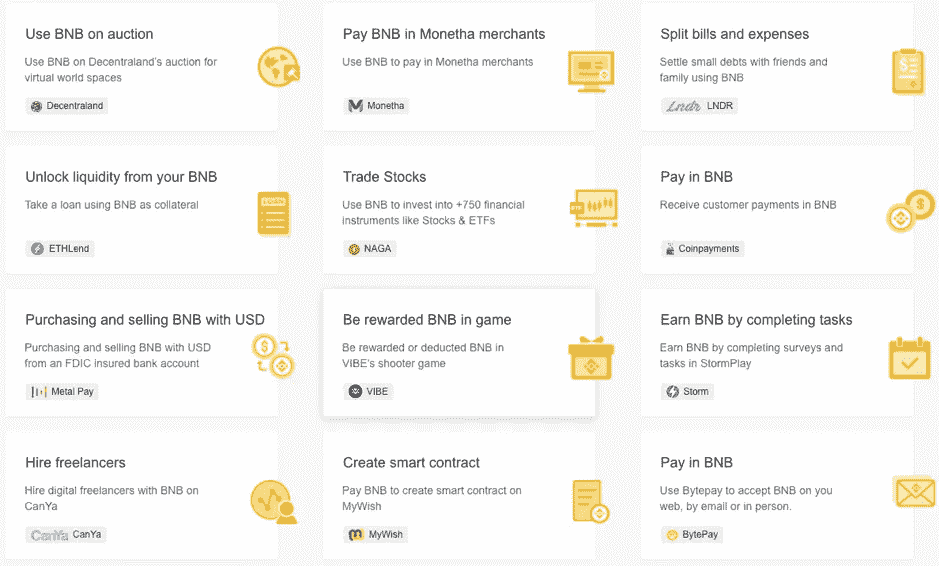

Source: BNB Use Cases

> 效用部分包含了 BNB 创始人赵昌鹏和整个 BNB 团队创造的劳动回报。这些劳动报酬的价值会随着使用而逐渐下降。因此，当人们购买 BNB 时，他们得到的一部分就是这些劳动报酬。

**证券分公司**

BNB 拥有安全属性，因为币安承诺用季度利润的 20%回购并摧毁 BNB。这类似于传统上通过股份回购的利润分配。

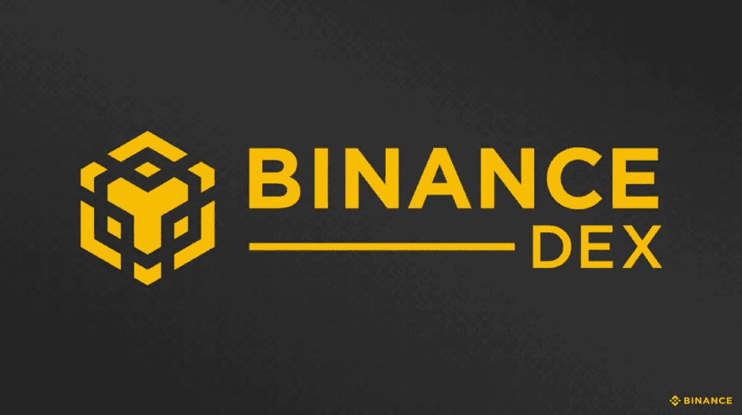

人们也习惯于将 BNB 视为币安交易所的一种股权要求，只是没有投票权。最近，币安宣布推出分散式交易所(DEX)。虽然没有具体的细节，但 BNB 持有者很可能在 DEX 上拥有投票权。

此外，我们观察到，许多区块链项目，尤其是委托的利益相关证明组下的各种项目，投票权是令牌价值不可或缺的一部分。例如，EOS 社区的治理和超级节点的选举。任何拥有代币的人都可以享有投票权。基于此，就很容易理解代币为什么也能充当证券了。在这种情况下，通过购买代币，您正在购买特定项目的未来劳动报酬。

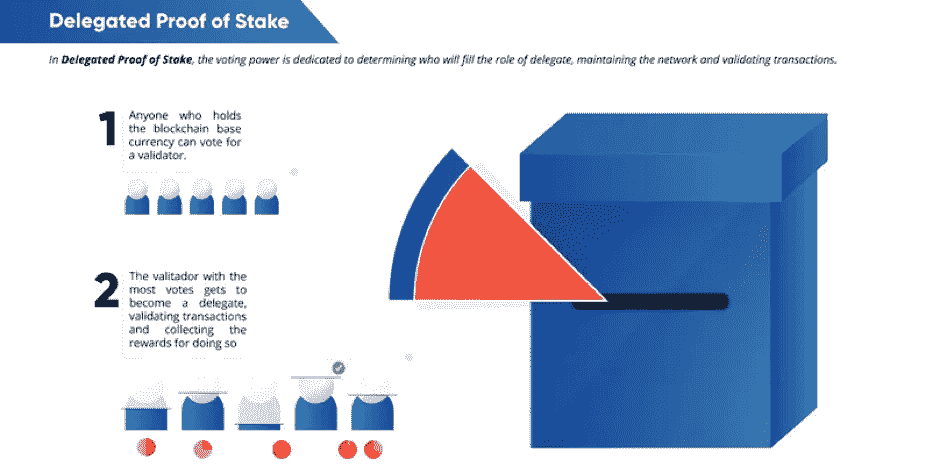

Source: Lisk Academy

**货币分支**

自从币安交易所上线以来，我们已经将 BNB 视为一种交易媒介，就像 BTC、瑞士联邦理工学院或其他替代货币一样。币安排名前两位的是 BNB 和 BTC，但令人惊讶的是排在第三位的是一个名为 ALT 而不是 ETH 的硬币。BNB 代币的未来角色是*充当交换媒介，像 BTC 一样具有同样多的流动性，导致更高的效用*，同时*也将自己*与其他替代硬币和稳定硬币(USDT、USDC、TUSD)明显区分开来。

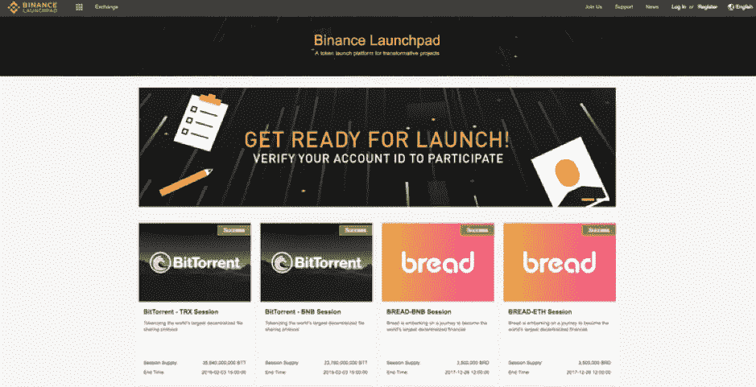

最近，币安 Launchpad 的重新点燃也证实了币安正在大力推动 BNB 令牌作为加密货币市场的通用交易媒介。

# ***商品、证券和货币的“超级载体”***

之所以选择 BNB 作为案例研究，是因为它具有商品、证券和货币的所有特征。传统上，使用商品、证券和货币作为劳动报酬的载体，在时间和空间维度上对劳动报酬的形成产生了许多限制。一个恰当的比喻是用锁链锁住一名运动员，不让他发挥出最佳水平。

除了法律法规上的争议，代币还没有被定义为像传统的商品/证券/货币分类那样截然不同。

> 代币作为劳动报酬的载体，有很大的无摩擦活动空间，有能力释放劳动报酬的最大潜能。它可以把劳动报酬塑造成任何形式的价值，以适应任何时间和空间维度的要求。

它可以导致劳动报酬在某个时空区作为商品出现，而在另一个时空区具有货币的特征，就像《x 战警》中的 Mystique 是如何根据环境的需要改变自己的外貌。

***这样一个劳动报酬的超级载体有什么意义？我们为什么需要它？***

人类社会的不断进步和发展，其实就是劳动报酬向劳动力的积累。我们敦促每个人创造尽可能高的劳动报酬，并通过某种交换媒介最大限度地传播和使用劳动报酬。

> 这样可以大大加快社会的发展，超级航母的重要性也就显而易见了。

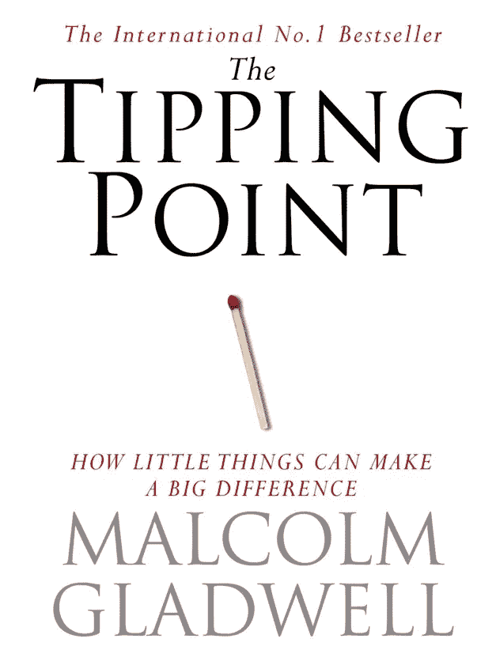

在*马尔孔·格拉德威尔*的**《引爆点】**中，作者讲述了粘性信息如何比逻辑上令人信服的信息更有说服力。

信息媒介的“粘性”(迫使人们密切而持续地关注一个产品或概念的品质)将对信息传播的广度和深度产生重大影响。

如果以代币为媒介，它的粘性会非常强，可以让它转化为任何形式的劳动报酬。利用代币作为信息媒介，会以极小的摩擦促进劳动报酬的传播和交换。这将是推动社会进入下一阶段的动力。

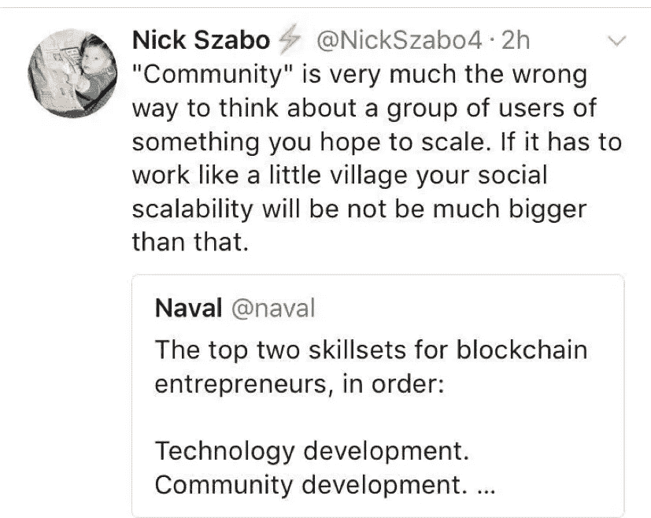

智能合约之父尼克·萨伯在**“金钱、区块链和社会可伸缩性”**中提出了类似的观点。 **社会伸缩性**是社会自我延伸的能力，用来描述区块链给社会带来的变化。区块链提高了社会进一步自我延伸的能力。这与我们对劳动报酬通过代币传播和影响的理解一致。

***那么，钱的定义是什么？***

货币的出现是对没有重大摩擦就无法交换劳动报酬这一需求的回应。我们无法立即转换劳动报酬。

> 古往今来，金钱通常承担传播劳动报酬的责任，并促进社会发展，在我们生活的各个方面促进人类社会的进步和发展。

当我们最终意识到代币是超级载体时，在可预见的未来，随着代币作为当今证券和货币的替代品变得越来越有吸引力，一场货币战争将会开始。

请查看下面的第 1 部分！

## [货币革命:集商品、证券、货币于一身:“超级航母”币安加密货币(BNB)(上)](https://medium.com/datadriveninvestor/currency-revolution-combining-commodities-securities-and-currency-in-one-super-carrier-4d11bcef7db2)