# 第 3 部分:人工智能和人工通用智能:推进研究基础。

> 原文：<https://medium.datadriveninvestor.com/part-3-artificial-intelligence-artificial-general-intelligence-moving-the-research-base-893078d04ee0?source=collection_archive---------14----------------------->

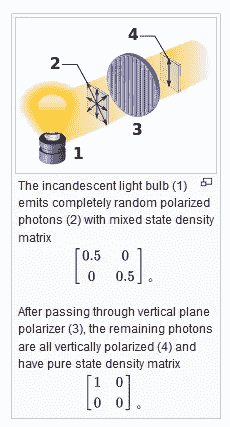

[Taken from Density Matrix Detail](https://en.wikipedia.org/wiki/Density_matrix)

欢迎学习第 3 部分。这个系列是关于移动人工智能和 AGI 的研究基地。目的是考虑范式转换——可提供性，它可以实现高级开发。首先，让我们简单地提醒自己，我们从第一部分的[开始；以及利用](https://medium.com/datadriveninvestor/part-1-artificial-intelligence-artificial-general-intelligence-moving-the-research-base-40508d9ceb60)[第二部的势头。](https://medium.com/@dawnalderson/part-2-artificial-intelligence-artificial-general-intelligence-moving-the-research-base-52fff601c3fb)

在第一部分中，已经确立了人工智能开发的常规范式是有限的，例如，过度依赖运行在非常旧的互联网系统上的软件；这不仅限制了人工智能与人类的互动，因为没有足够的方法来处理数据，例如分析统计模式等，而且还限制了在开始时的规模，因为这限制了创新。因此，从包括大数据收集在内的标准化工作方式转变至关重要，这些工作方式侧重于为人工智能提供“即时规模——结果”；比如机器人，它们的交流能力有限，缺乏提问的系统。

第一部分也证明了这种转变，是人工智能/AGI 的专家应用，例如在[波士顿动力公司的工作中；](https://spectrum.ieee.org/automaton/robotics/humanoids/what-boston-dynamics-is-working-on-next)采用“额外制造的腿，其所有液压组件都直接印刷在其结构中，具有动脉流体路径和看起来非常像骨头的网格结构”。类似地， [OpenAI](https://blog.openai.com/learning-dexterity/) 已经显示出从基于互联网的开发转变的需要，通过在项目的最开始就采用 [MoJoCo](https://github.com/openai/mujoco-py) 物理引擎，开发涉及在物理和视觉属性随机选择的模拟环境分布上的策略培训。此外，OpenAI 的这个相同的特定项目表明，使用真实数据来训练视觉策略与模拟数据相比没有什么区别；换句话说，这里的飞跃是向没有真实数据训练的视觉模型的转变。

在第 1 部分中，还提到了[约翰·冯·诺依曼关于比较计算机和大脑的工作](https://archive.org/details/TheComputerAndTheBrain/page/n19)，特别考虑了他工作中的两个项目。首先，联系模拟过程，在第 1 部分中他强调了模拟和数字计算的混合以及对短代码的需求。并且，[我们在最新的神经形态芯片技术发展中看到了这一点。第二，冯·诺依曼强调归纳处理的作用。](https://www.semanticscholar.org/paper/A-Neuromorphic-Chip-Optimized-for-Deep-Learning-and-Miyashita-Kousai/14096de8ec536281f50802eb858f9d97344b9bd8)

结合起来，这两项提供了输入和输出关系，可以与白炽灯泡示例中存在的纯状态和混合状态的类比进行比较:

在第一种情况下，秘密代码很短，包括四个阶段的系统。第一阶段是关于一个光的实体，第二阶段涉及随机的、偏振光子在不同方向传播(混合态密度)，这类似于**感应处理**。穿过垂直平面偏振器，类似于**演绎处理**，剩余的光子全部垂直偏振(纯态密度)，这些剩余的光子在处理后显示，它们仅仅是在方向顺序的潜在变化中幸存，拒绝被吸入该过程的前面部分——它们不适合在第一和第二阶段被完全遮蔽。因此，纯态密度。

这个过程与诺依曼关于神经系统中神经冲动的解释相比较:

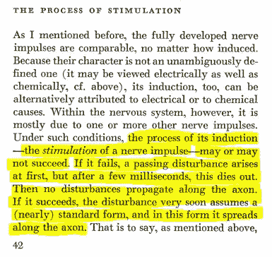

因此，对于量子计算来说，神经形态芯片的使用也需要归纳和演绎处理；不仅跨越多个量子位的活动，而且在量子位内。[布洛赫球](https://en.wikipedia.org/wiki/Bloch_sphere)是[量子位](https://en.wikipedia.org/wiki/Qubit)的代表，是量子计算的基本构件:

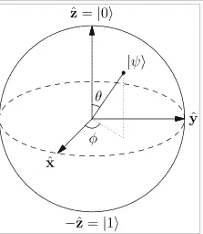

从数学上来说，如上图所示的轴将显示自由度，有些人可能会将此实体标记为独立变量，或者导致变化的中间值，这些都是可以测量的。我喜欢把它想象成一个有意义的空间。因此，这与我用来通知[第 1 部分](https://medium.com/datadriveninvestor/part-1-artificial-intelligence-artificial-general-intelligence-moving-the-research-base-40508d9ceb60)的方法相关联；并涉及一个三阶段归纳/演绎模型进行分析，应用于 [OpenAI 数据](https://medium.com/coinmonks/openai-blogs-a-micro-event-analysis-e15e98cfbca1)，这反过来为这一系列论文提供了基准。

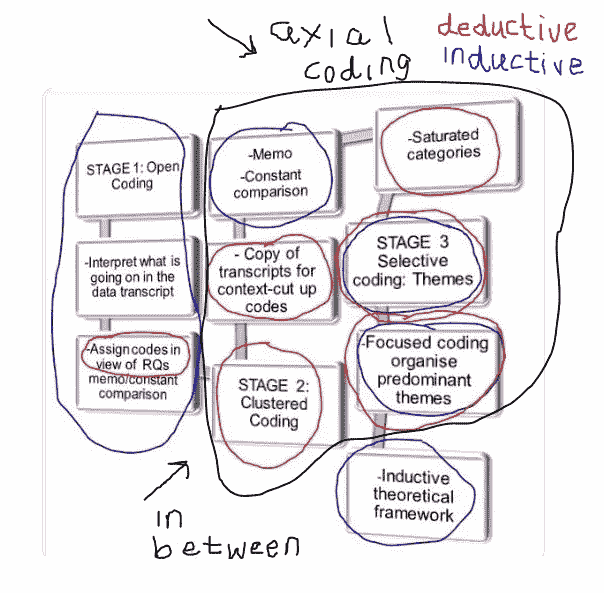

该模型的应用，用于处理 [OpenAI 数据](https://medium.com/coinmonks/openai-blogs-a-micro-event-analysis-e15e98cfbca1)涉及的归纳分析；蓝圈项目意味着问这样一个问题:到底发生了什么？这就像寻找与数据相关的任何紧急边界内外的东西。相反，演绎分析从最初的归纳代码中寻找模式。黑色的圆圈表示中间状态；当变量在轴向编码期间根据备忘录活动和最佳拟合进行处理时，创建聚类/类别。分析中间阶段的一些变量不适合，因此仍然是异常值；类似于白炽灯泡输出的“最佳匹配”处理，以及诺依曼的神经脉冲处理活动以达到标准形式，以及量子位内部工作的潜力。

将我的归纳/演绎模型应用于 OpenAI 数据的结果如下:

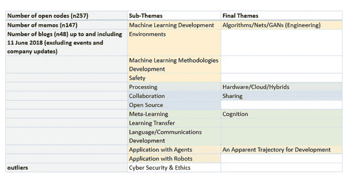

贯穿本系列论文的基准如下:

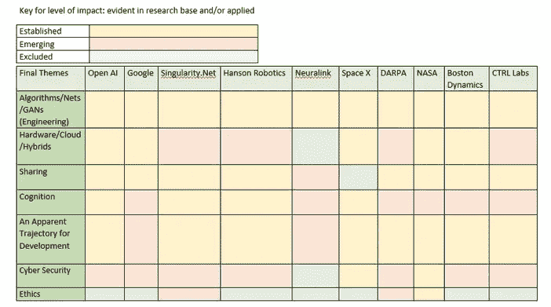

因此，在第 2 部分[，](https://medium.com/datadriveninvestor/part-2-artificial-intelligence-artificial-general-intelligence-moving-the-research-base-52fff601c3fb)中，重点是网络安全和伦理，离群值似乎是一个很好的起点。有人指出，就记录在案的安全问题而言，软件开发对网络安全是有问题的。总之，推论是，在互联网上构建的旧方法确保了既定的安全风险仍然存在，特别是通过移植(例如，RAT 干预)、使用 root kits、路由器攻击、不安全的 API——相关的应用程序事件、调用和行为、淫秽的数据收集滥用、云内核攻击、信号拦截是可能的——意味着在错误的人手中也是可能的，开源分支——如 Docker-security 等等。在第 2 部分中，所有这些都与更安全的网络进行了对比，后者使用更复杂的计算/量子混合技术来确保安全性是重中之重。

接下来，我们可以转到本系列的这一部分，第 3 部分，其中将讨论以下基准。似乎，阐述硬件/云/混合以及跨工作主体共享的概念是一个自然的进展——在开发人工智能/AGI 的研究基础/应用中显而易见。

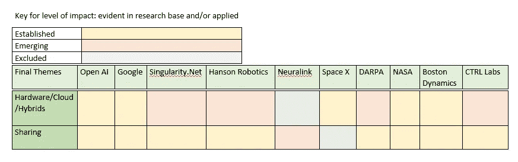

**硬件/云/混合**

在 OpenAI 分析中，就处理的考虑事项而言，数据之间存在移动。这些数据涉及 CPU 计算/计算限制以及向 GPU 渲染的转变。有证据表明，在应用[域随机化](https://blog.openai.com/faster-robot-simulation-in-python/)(2018 年 5 月 16 日)来训练模拟图像上的模型时，可能会影响用于训练单个模型的计算量，根据 OpenAI，这最有可能将[与最佳模型的强大程度相关联。为了达成一致，博客文章《人工智能和计算》归纳了推动人工智能进步的三个因素:](https://blog.openai.com/ai-and-compute/)

*“三个因素推动了人工智能的进步:算法创新、数据(可以是监督数据或交互环境)以及可用于训练的计算量……我们认为相关的数字不是单个 GPU 的速度，也不是最大数据中心的容量，而是用于训练单个模型的计算量——这是最有可能与我们最好的模型有多强大相关的数字。”*

鉴于此，2018 年 5 月 16 日[发布的 OpenAI 博客中的详细信息](https://blog.openai.com/faster-robot-simulation-in-python/)open ai 工作的连续性，例如[Glow 2018 年 7 月 9 日](https://blog.openai.com/glow/)，显示了对训练单个模型的计算量的关注，这在实践中是一个阶跃变化；[使用扩展的 GPU 加快计算速度:](https://github.com/uber/horovod)

*‘在多台机器集群上轻松训练我们的模型；我们演示中使用的模型在 5 台机器上进行训练，每台机器有 8 个 GPU。使用这种设置，我们用超过一亿个参数训练模型。*

谷歌 DeepMind 也使用深度神经网络进行模拟，并在他们的最新研究中:

*“聚集了来自结构生物学、物理学和机器学习领域的专家，应用尖端技术，仅根据其基因序列预测蛋白质的三维结构。”*

考虑人体内的蛋白质折叠，包括错误折叠的蛋白质，这些蛋白质会导致阿尔茨海默氏症、帕金森氏症、亨廷顿舞蹈症和囊性纤维化等疾病。推论是，蛋白质形状的准确预测可以使诊断和治疗干预更早。DeepMind 补充道,**他们的目标是将深度学习应用于**,“掌握基本的科学问题”,就像人工智能如何通过 [AlphaGo](https://deepmind.com/research/alphago/) 和 [AlphaZero](https://deepmind.com/blog/alphago-zero-learning-scratch/) 这样的系统帮助人们掌握复杂的游戏一样。

继续那些被确定为已经**建立了**硬件研究/应用的项目；显然在文献中，接下来我指的是太空 X，波士顿动力和美国宇航局。简而言之，由于在第 1 部分和第 2 部分中广泛参考了为 Space X 和波士顿动力公司确定的定制硬件，可以认为这些公司已经建立了研究和应用实践。

关于 Space X，虽然没有[研究基地；公司关于人工智能/AGI 开发的具体文献，](https://www.spacex.com/)Space X 的[工程师](http://www.larsblackmore.com/) [L .布莱克摩尔等人(2010)](https://pdfs.semanticscholar.org/57e7/77afe2a6efbf9e7728ed565c0271581b4800.pdf) 的这篇研究论文同意我建议的机器技术开发的迭代立场。该论文提出了该技术潜力的可能发展，支持了一个创新的立场。

同样，近期应用创新的一个很好的例子是长短期记忆(LSTM)， [OpenAI](https://blog.openai.com/learning-dexterity/) 发布了关于使用 LSTM 进行机器人开发的工作细节:

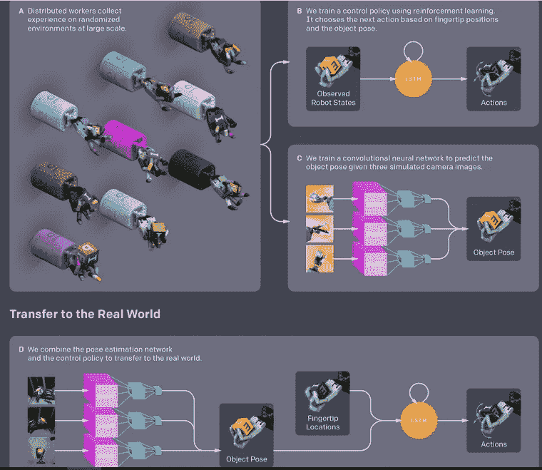

关于 LSTM 网络的解释，请看克里斯·奥拉的博客。上图摘自 OpenAI 的作品，本质上，该过程中的 LSTM 循环系统可以描述为类似于[皮亚杰认知发展的图式/图式活动](https://www.amazon.co.uk/Psychology-Intelligence-Routledge-Classics/dp/0415254019)。活动的标志包括:

*   同化(当大脑接收到信息并触发短期和/或长期记忆时，在神经科学中这被称为神经元尖峰)；
*   适应(由记忆活动搭起的架子——找到并放置合适的东西——链接到相关的信息)；
*   达到平衡(因为接收的信息被嵌入，意义/意义产生)；这将生成现有模式的扩展。

另一方面，如果接收的信息是新的，它不能被过去的图式吸收和适应；这涉及到一种不平衡的状态，同化和适应的驱动力可能意味着个人会寻求更多的信息/背景/经验等，以达到平衡，有意义。

这与人工智能/AGI 的硬件开发有什么联系？是个好问题。Christoper Olah 的博客提到了网格 LSTMs，在 [GoogleDeepmind，工作显示:](https://arxiv.org/pdf/1507.01526v1.pdf)

*‘网格长短期记忆，LSTM 细胞排列成多维网格的网络，可应用于向量、序列或图像等更高维度的数据。该网络不同于现有的深度 LSTM 架构，因为单元在网络层之间以及沿着数据的时空维度连接。因此，它为深度计算和顺序计算提供了一种使用 LSTM 的统一方式*

因此，网格应用表明，细胞可以包含越来越多的数据类别(接收到的信息)，并以不同的方式(向量、序列等)处理这些信息，这类似于人类认知发展中涉及的处理，根据皮亚杰的神经元同化和调节概念。然而，在网格 LSTM 中，包含了作为过滤器的门，允许相关/不相关的信息进入/离开/停止。如果我们用 spike/spiking 这个词来表示细胞/神经元触发活动/网络通信，那么这就为我们的 AI/AGI 硬件问题提供了一个可能的答案。

最近在 2018 年 11 月，来自奥地利格拉茨理工大学[理论计算机科学研究所](https://arxiv.org/pdf/1803.09574.pdf)的一个团队及其对脉冲神经元(RSNNs)的循环网络的研究表明:

*“除了对计算神经科学的这些影响，我们发现 RSNNs 可以通过非常* ***节能的*** *稀疏触发活动获得强大的计算和学习能力，这为通过非触发的基于尖峰的计算硬件* *提供了新的应用* ***范例。”***

从上面的引文中可以得出两点结论。首先，提到节能意味着更好的计算。其次，从表面上看，基于 spike 的计算硬件的范式转变似乎正在进行中，这是通过英特尔关于神经形态研究进展的最新公告实现的，该公告不仅强调了基于 Loihi 神经形态研究芯片系统的 USB 外形；但更重要的是，也指他们的[英特尔神经形态研究社区的参与者，](https://newsroom.intel.com/editorials/intel-creates-neuromorphic-research-community/)包括关于脉冲神经网络和神经形态算法的研究:

***‘康乃尔大学的 Thomas Cleland****教授基于哺乳动物嗅觉系统启发的计算原理，讨论了一套用于脉冲神经网络中信号恢复和识别的神经形态算法。在与英特尔实验室合作发表的工作中，这些在 Loihi 上运行的算法已经在化学传感器数据集上显示了最先进的学习和分类性能。“这些算法来自对哺乳动物大脑嗅觉回路的机械研究，但我预计，在广义上，它们将适用于一系列类似的计算问题，如空气和水质量评估，癌症筛查和基因组表达谱，”克莱兰德说*

我们需要放慢速度，因为英特尔没有为这一系列论文制定基准，主要问题是由于传播问题。仔细看看心理学家托马斯·克莱兰教授的大学简介，你会注意到没有这项研究，事实上也没有关于这个主题的相关研究论文。英特尔主要以博客或重大公告的形式发布零星消息，但很少在工作进展/开发和相关细节模式中发布。

我想考虑下一个，Space X Falcon 9/Dragon 最新任务(2018 年 12 月 5 日)，尽管有效载荷成功交付，但发生了一个关键事件，这是值得分析的，就硬件而言，对波士顿动力公司的工作也有影响。

是否，Space X 使用神经形态芯片技术，以 LSTM 网络搭建；、或机器中的其他硬件，也可以有链接到硬件的软件。如果火箭使用了网格 LSTM，那么它很可能是一个自然的轨迹，在无人驾驶飞机的协助下降落在水中的着陆台上，但旋转和其中一个网格的失衡表明，网格 LSTM 的高级使用可能会出错。OpenAI states 的 Greg Brockman:

在设计深度学习模型时，无论何时必须做出决定，答案都很简单:将你的数据乘以一个权重矩阵。例如，在 LSTM，需要忘记一些数据吗？只要乘以一个权重矩阵就可以得到遗忘门。该系统将学习你的意思… 这是值得注意的，这么多的权力来自字面上只是乘以一个矩阵。*’*

格雷格指的是数学——简化论效应；在使用乘法时，这会影响计算并有意义，因为使用新技术/硬件时，需要减少输入和输出之间的空间以影响处理速度。根据 Elon Musk 的说法，12 月 5 日的关键事件是由于:

*‘网格鳍’液压泵熄火了，所以猎鹰就在出海时着陆了。似乎没有损坏&正在传输数据。回收船已派出。*

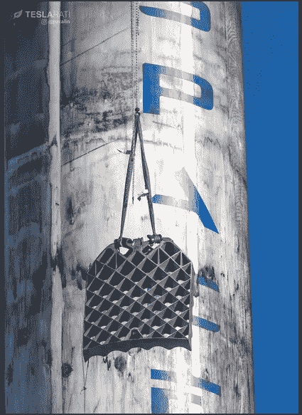

Image taken from Elon Musk’s Twitter feed

在第 1 部分中，我提到了与波士顿动力公司工作相关的水力学:

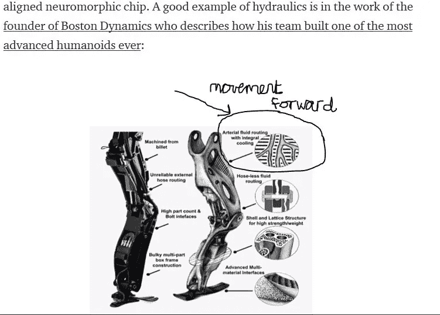

因此，猎鹰 9 号重大事故的影响，以及波士顿动力公司的工作，强化了放弃评估的赤字模型的需要，并在达到输出问题之前，更深入地关注“假设”情景的模拟工作:

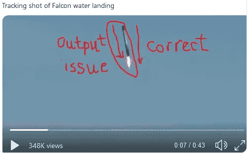

Taken from Elon Musk’s Twitter Feed, My Annotation

当然，也就是说，语用学在事件中也占有一席之地。美国宇航局，正如我们看到的最新的洞察火星登陆；对于机器人上/经由机器人的应用，存在各种技术硬件支持。例如，硬件包括[太阳能电池板和摄像头](https://eyes.jpl.nasa.gov/apps/experience-insight/InSight.html)，其他技术的启示包括[录音传感器](https://mars.nasa.gov/resources/22205/nasas-insight-hears-the-sound-of-mars/?site=insight)。鉴于[火星好奇号火星车的应用记录，由于一致性，这些功能显示了成功的应用](https://www.space.com/40683-nasa-mars-rover-curiosity-drill-success.html)、**，尽管同时评估似乎仍然是成功的关键支持者，为未来的成功提供模拟迭代信息。**

考虑到上述情况，可以建议，虽然 Neuralink 没有传播关于神经接口将在设计和功能中表现的方式的确切硬件信息；基本上，硬件/混合开发最好考虑 NASA 采用的应用模型:

在模拟中测试→“如果”在模拟中→“迭代”→避免赤字模型

继续前进，DARPA 和 CTRL 实验室在硬件开发的传播方面都显示出一种新兴的姿态。一个很好的例子是 DARPA 的比尔·沙佩尔所传达的知识，他专注于开发 T2 计算和传感的基础技术，以支持军事技术，这将影响整个社会:

*“确保电磁频谱的自由使用，建立一个替代的商业模式来获得先进的国防部电子产品，具有内在的信任，并为下一代机器学习开发电路架构。MTO 创造了微机电系统、光子和电子元件，这些元件可以很好地弥合我们生活的物理世界和信息所在的数字世界之间的鸿沟。*

关于硬件开发的 CTRL 实验室的信息很少。因此，由于可用的[细节非常少，该公司陷入了一种新兴的姿态:](https://www.ctrl-labs.com/ctrl-kit/)

[CTRL-Labs 首席执行官 Thomas rear don](https://www.youtube.com/watch?time_continue=18&v=5Z5aZK2C3ew)介绍了与具有神经接口潜力的**意图捕捉**相比，通用硬件/动作捕捉设备的详细信息。这个 15 分钟的视频带我们快速浏览了意图捕捉是如何采用神经生物学原理的。描述性叙述指的是传感器和表面肌电图，以解码手臂肌肉运动的活动，为设计提供信息，使公众能够访问计算机，例如，无需鼠标或键盘。接下来，叙述转向“如果”,未来的工作是挖掘与脊髓相连的肌肉活动，使用肌电信号来计算神经信号的代码。这门科学是关于开发机器学习来连接生物神经元和人工神经元。意图捕捉与适应循环进行:

*“通过使用合成网络的输出来驱动活动回到你的神经系统，并允许你进行在线适应，我们称之为共同适应”*

据称，意图捕捉使用数字(人工)神经元解码真实神经元。里尔登继续说道:

*‘在神经控制下，你可以开始做新的事情，比如拥有八只手臂’*

在具有离散自由度的连续连接中，通过手臂上的硬件设备，人们可以控制活动，例如小行星游戏，而无需任何肌肉运动-与游戏设备进行物理连接。有人声称，通过硬件创新的新技术也可以混合意图捕捉的功能，比如通过你的苹果手表发短信。该套件于 2018 年开始发货，包括硬件、SDK & API 和意图捕获软件。虽然提供了技术和科学的概述，但没有提供细节。此外，该套件可以通过蓝牙连接，我们知道，正如第 2 部分所详述的那样，信号情报收集存在问题，这意味着[它不安全。](https://medium.com/datadriveninvestor/part-2-artificial-intelligence-artificial-general-intelligence-moving-the-research-base-52fff601c3fb)

## **云&混血儿**

介绍了 OpenAI、Google DeepMind 和其他公司在输出方面的例子，并重点介绍了定制计算硬件；正是在这里，我想提到云计算和混合。

GoogleAI 的机器学习硬件张量处理单元——TPU 芯片，提供高性能的数值计算。该架构还支持在各种 CPU 和 GPU 平台上部署计算，从台式机到服务器集群，再到移动和边缘设备。 [Tensorflow，](https://www.tensorflow.org/)是一个面向包括图书馆在内的所有人的开源机器学习框架，可以与[谷歌云服务](https://cloud.google.com/ml-engine/docs/tensorflow/)一起使用:

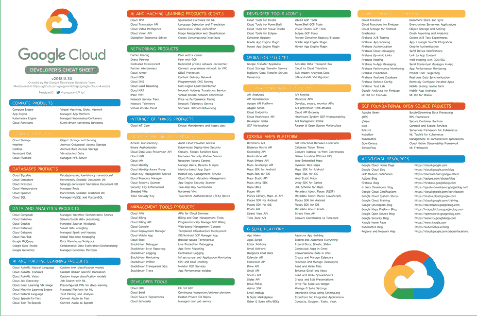

[link from Github](https://github.com/gregsramblings/google-cloud-4-words)

它是一个混合系统，将机器学习工具与云的服务组合在一起；重点放在架构解决方案和数据操作的双重系统上。Google kit 的主要成就在于，它可以跨网络扩展(许多人都可以访问它)，整合了云及其定制的硬件；借助分层的安全系统，这些实践意味着他们的服务属于本次研究中已确立的硬件、云和混合类别。

通过阅读[singularity net/Hanson Robotics](https://singularitynet.io/platform-roadmap/?utm_content=buffer0b519&utm_medium=social&utm_source=twitter.com&utm_campaign=buffer)路线图，并追溯 Ben Goertzel 博士跨越数十年的研究/工作，这一点显而易见；由分散协议支持的全栈 AI 解决方案的 beta 开发，SingularityNET 平台的核心基础设施使网络能够运行；是由 [Novamente 和分布式综合智能(DINI)混合架构(Goertzel 和 Pennachin，2007)提供的。](https://pdfs.semanticscholar.org/782a/ceec18dd97923ea8d1eb93c326133ba980c2.pdf)

根据下图，DINI 体系结构仍然需要互联网，

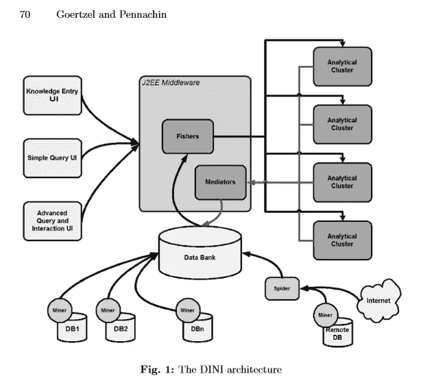

如果我们设想 Novamente 软件运行，在我看来，将需要一种 BitTorrent 协议；据我从文献中了解，这意味着区块链/加密货币建设将监督这一点，因为人类将需要彼此/代理安全地互动。根据[goertz El 博士的说法](http://www.goertzel.org/dynapsyc/2003/mindplex.htm)

“Novamente 软件系统是一个雄心勃勃的尝试，旨在实现人工智能研究的圣杯:通过整合多个相互作用的认知过程，实现真正自主、创造性的计算智能。”

此外，Arif Khan 最近在 SingularityNET 发表的一篇文章指出:

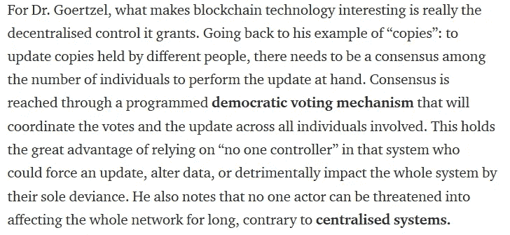

关于安全性，Khan 写道:

最重要的是，你有加密技术。Ben 解释说，基本上，它允许在网络中参与(投票)的人的身份匿名，同时确认他们的真实性。换句话说，它允许通过用一串数字替换她的/他的 ID 来匿名化个人，同时总是能够验证不同的投票背后是同一个个人——或一串数字。”

最终，根据 SingularityNET 路线图，beta 模式的开发仍在进行中。这意味着硬件和软件的含义属于这项研究的紧急范畴。不用说，鉴于上面关于 Neuralink 的讨论，这是一个及时的发展阶段，可以考虑是否需要一种类似于 NASA 应用模型的质量保证方法:

在模拟中测试→“如果”在模拟中→“迭代”→避免赤字模型

**分享**

最初研究的主题之一 [OpenAI 博客:一个微事件分析](https://medium.com/coinmonks/openai-blogs-a-micro-event-analysis-e15e98cfbca1)，由子主题:协作和开源提供信息，即共享。

OpenAI 数据包含与私营部门、大学、公共政策智库和国际非营利数字权利组织的合作参考。

重申一下，80%的公司都有既定的共享方法，无论是通过协作活动，如与美国主要大学和研究机构的研发实验室的 [DARPA](https://www.linux.com/blog/2018/7/darpa-drops-35-million-posh-open-source-hardware-project) ，还是像 Cadence、IBM、Intel、Nvidia 和高通这样的公司。 [GoogleDeepmind](https://deepmind.com/research/open-source/) 与学术界合作[发表研究论文](https://deepmind.com/research/publications/)。

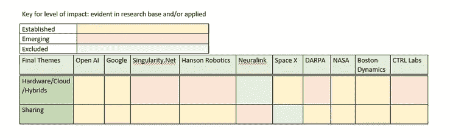

[波士顿动力](https://cbmm.mit.edu/about/partners)与大学、行业、医院和国际合作伙伴合作。美国宇航局在伙伴关系方面有广泛的影响力，例如，与[国际空间站和国际合作，](https://www.nasa.gov/mission_pages/station/cooperation/index.html)以及最新任务的合作活动和伙伴关系的及时例子:[火星上的洞察号着陆器](https://mars.nasa.gov/news/8395/mars-new-home-a-large-sandbox/?site=insight)(2018 年 11 月 26 日):

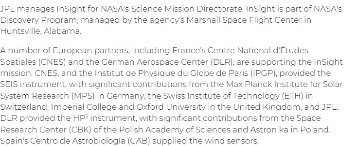

关于通过开源分享， [Google](https://opensource.google.com/) ， [Google Deepmind](https://github.com/deepmind) ， [OpenAI，](https://github.com/openai) [SingularityNET](https://github.com/singnet) ，[Hanson Robotics](https://github.com/hansonrobotics)[CTRL Labs](https://github.com/ctrl-labs)和 [NASA](https://code.nasa.gov/) 都是通过 Github 平台分享。

至于 Neuralink，我们知道有一个新兴的“细节”传播立场，这是由 [Wait But Why](https://waitbutwhy.com/2017/04/neuralink.html) 的 extsensive blog 提出的。而且，虽然 Space X 有一个 github 页面，但它是为一个 [REST API](https://github.com/r-spacex/SpaceX-API) 设计的，任何了解该 API 架构的人都能猜到这一点。这不是一致的分享，也不是突发的。另外， [Teslarati](https://www.teslarati.com/) 新闻条目报告结束结果；关于 Space X 的花絮，但不是开发“细节”——它主要是关于悬挂一根胡萝卜，以保持观众足够的参与度，从而猜测网站上所有商品/产品的下一步可能是什么。类似地，Space X 网站也不传播研究成果；对于协作活动和合作伙伴关系细节，路标是不存在的。因此，排除类别被分配到主题为“共享”的空间 X。

在本系列的第 4 部分中，将讨论最终主题:算法/网络/GANs(工程)、认知和发展的明显轨迹。

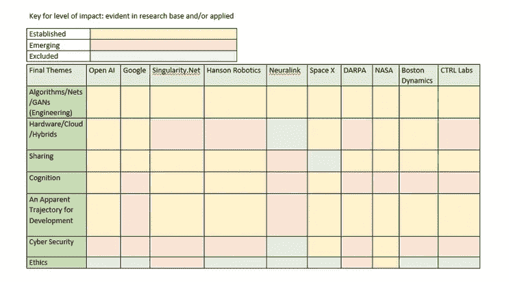