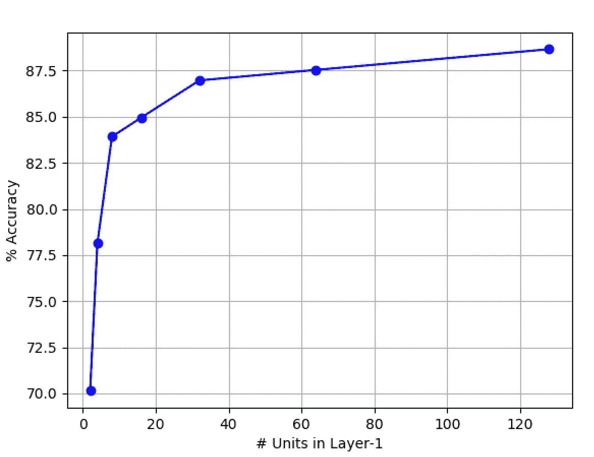
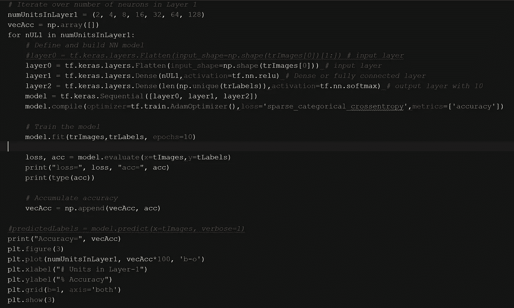
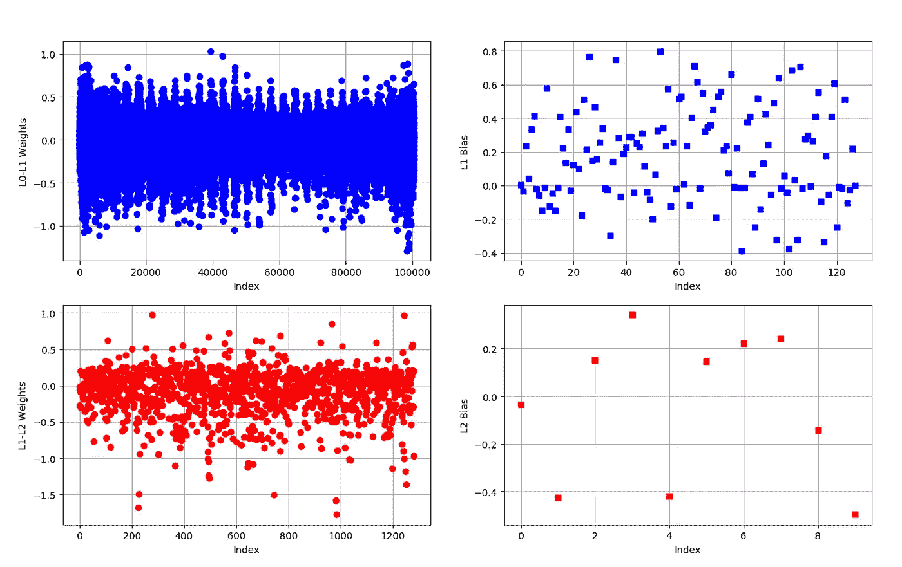
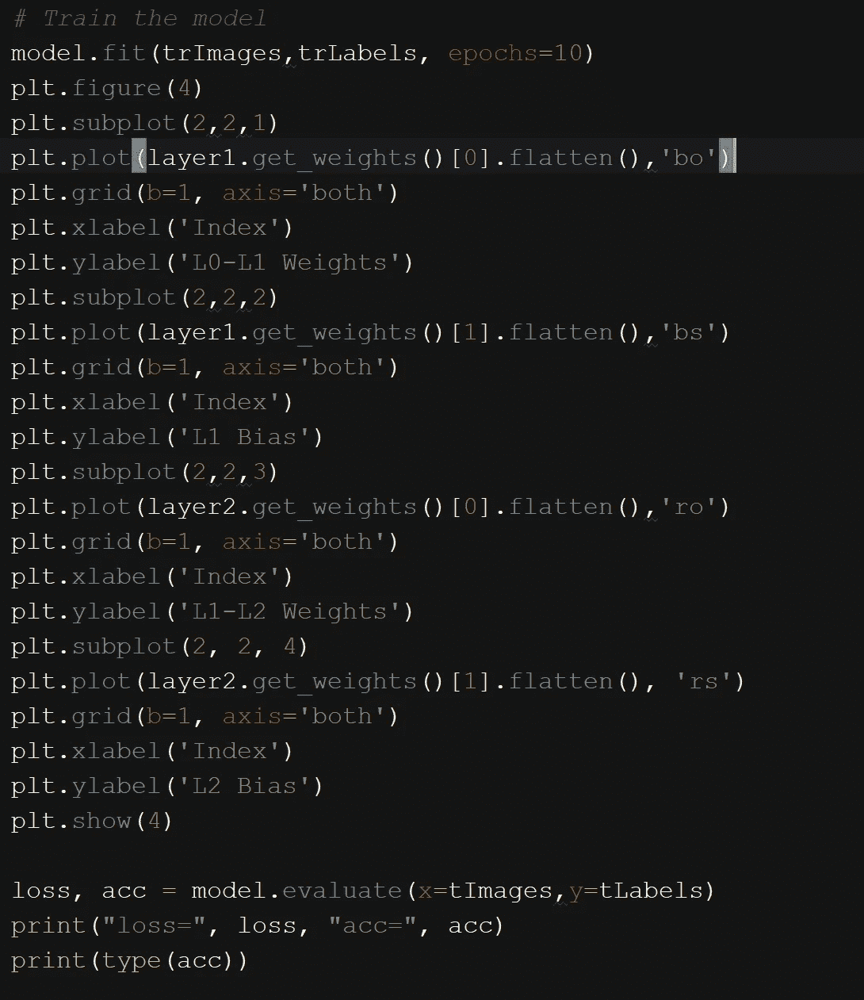

# 第 3 部分:理解神经网络的结果

> 原文：<https://medium.datadriveninvestor.com/part-3-understanding-results-from-the-neural-network-21022acf53a5?source=collection_archive---------15----------------------->

对新术语和新工具的涌入感到不知所措是很自然的。让我们总结一下我们迄今所做的工作。

# 迄今为止

简而言之，到目前为止，我们一直遵循谷歌提供的[配方](https://medium.com/@FreeOfConfines/part-2-basic-classification-neural-network-6d68d32fa4b2)，来建立一个神经网络，在一组图像上训练它，并在另一组图像上测试它。一路走来，我们听到了很多工具/库的名字，比如 Python、Tensorflow、Numpy、Matplotlib 等等。以及诸如反向传播神经网络、层(或单元)、损失函数(或度量)、优化器等术语。抛开名称/术语，我们观察到神经网络能够以大约 88%的准确度对测试集中的图像进行分类。

# 让实验开始吧

*   在[第 2 部分](https://medium.com/@FreeOfConfines/part-2-basic-classification-neural-network-6d68d32fa4b2)中，我们在第二层(`layer1`)中使用了 128 个单元，这产生了一个具有(28*28)*128*10 个单元和 101，632 个权重参数的神经网络。在实际应用中，需要训练、存储和访问 101，632 个砝码。如果我可以减少权重的数量，并且仍然保持 88%的*邻域*中的分类精度，会怎么样？下面的图是这样一个研究的结果，我在第二层放置了不同数量的单元；在本例中，我将单位数固定为 2、4、8、16、32、64 和 128(见 x 轴)。y 轴是网络的分类精度。如您所见，在第二层中超过 32 个单位时，分类精度并没有显著提高。请注意，在第二层中使用 2 个单元产生的分类准确率仅为 70%。

Fig. 1: Classification accuracy improves with increasing number of units in Layer-1

*   在第 2 部分中，我们构建了一个网络，第一层有(28*28)个单元，第二层有 128 个单元，第三层有 10 个单元。这里我们绘制了神经网络的权重和偏差；这些权重和偏差是作为训练过程的一部分来估计的。查看最下面一行的图，在`layer1`和`layer2`之间有 128*10 个权重，并且有 10 个偏差值。；使用`layer2.get_weights()[0]`和`layer2.get_weights()[1]`访问重量和偏差值。

Fig. 2: Weights and bias of second and third layers

Code snippet that allows you to plot weights and bias(es)

# 最后

在下一篇文章中，我们将进一步探索反向传播神经网络的各个组成部分。