# 第 4 部分:人工智能和人工通用智能:推进研究基础。

> 原文：<https://medium.datadriveninvestor.com/part-4-artificial-intelligence-artificial-general-intelligence-moving-the-research-base-150b9e3aa17f?source=collection_archive---------5----------------------->

欢迎来到本系列的第 4 部分，我的目标是讨论最后的主题:算法/网络/GANs(工程)，认知和发展的明显轨迹。这些主题源于对 OpenAI 所做工作的原始研究；从 2015 年 12 月 11 日到 2018 年 6 月 11 日，在我的研究报告 [OpenAI 博客:微事件分析](https://medium.com/coinmonks/openai-blogs-a-micro-event-analysis-e15e98cfbca1)中有所体现。

进一步阐述该项研究的成果；在本文系列([第 1 部分](https://medium.com/datadriveninvestor/part-1-artificial-intelligence-artificial-general-intelligence-moving-the-research-base-40508d9ceb60)、[第 2 部分](https://medium.com/datadriveninvestor/part-2-artificial-intelligence-artificial-general-intelligence-moving-the-research-base-52fff601c3fb)和[第 3 部分](https://medium.com/datadriveninvestor/part-3-artificial-intelligence-artificial-general-intelligence-moving-the-research-base-893078d04ee0))中，介绍了如何推进人工智能(AI)和普通智能(AGI)的研究基础。重点是概述当前的主要挑战，与主流的发展有关——重点是@ scale AI 和 AGI。这一系列论文的总体目的是考虑范式转变——可启示性，它可以实现高级开发；反过来，告知研究基地如何向前发展。

下表提醒了最初 OpenAI 研究的最终主题；根据文献/研究基础和/或与五个或更多项目一致的应用，衡量组织包容性的基准(见绿色栏)。

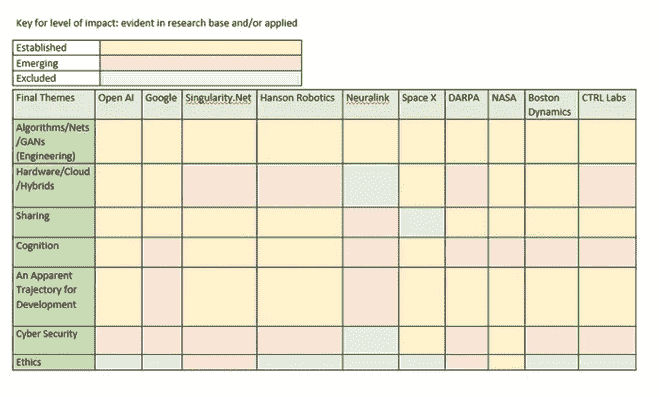

所有公司/组织都显示出对主题的既定或新兴立场:算法/网络/GANs(工程)、认知和明显的发展轨迹；在研究基础和/或应用中明显。重申一下，像微软、亚马逊和 IBM 这样的公司没有。

**算法/网络/GANs(工程)**

*既定算法开发*

基于一个非常简单的前提。计算机只能做它们被告知要做的事情，我们可以推测这是因为编码员告诉了它们该做什么。机器学习模型由数据组成，算法的作用是对数据做出决策。为此目的嵌入算法中的代码可能类似于下面的决策树算法的 [C++实现:](https://github.com/bowbowbow/DecisionTree)

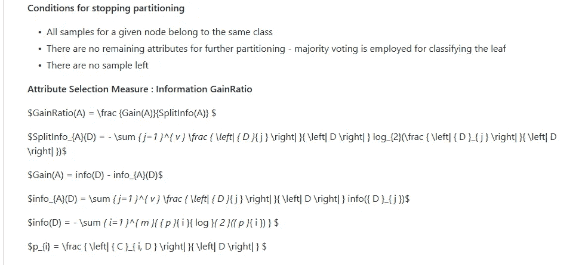

在下一部分，你会看到一个关于算法开发运动的“星形”图(姑且称之为星形，听起来像星星一样)。更重要的是，算法是如何随着计算发展的(我在本系列的第 3 部分提到了计算)。

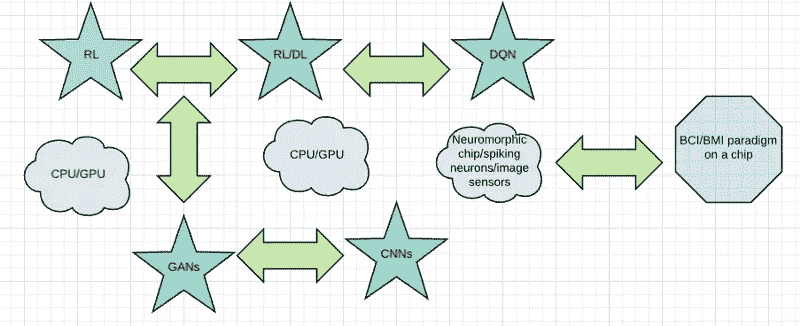

鉴于所有公司/组织都被评定为已建立的命名主题:工程链、认知和明显的发展轨迹，我将从强化学习(RL)开始。然后，我将通过与每个公司/组织相关的示例的综合来切换图表中的项目，旨在强调告知明显范式转变的启示；目的是考虑研究基地如何向前发展。

RL 是一种机器学习，包括内置奖励和惩罚的算法。它与社会学习理论具有相同的原理(如[班杜拉](http://www.asecib.ase.ro/mps/Bandura_SocialLearningTheory.pdf)，1971)；OpenAI 发展的第一个基石是[体育馆的引入:](https://gym.openai.com/)

Gym 是一个开发和比较强化学习算法的工具包。它支持教导代理从 [*行走*](https://gym.openai.com/envs/Humanoid-v1) *到玩游戏如*[*Pong*](https://gym.openai.com/envs/Pong-ram-v0)*或* [*弹球*](https://gym.openai.com/envs/VideoPinball-ram-v0) *。”*

在此基础上，2016 年 4 月， [OpenAI Gym Beta](https://blog.openai.com/openai-gym-beta/) 成为公共领域的第一个产品:

*开发和比较* [*强化学习*](https://blog.openai.com/openai-gym-beta/#rl) *(RL)算法的工具包。它包括一个不断增长的* [*环境*](https://gym.openai.com/envs) *(从* [*模拟机器人*](https://gym.openai.com/envs/Humanoid-v0) *到* [*雅达利*](https://gym.openai.com/envs/MsPacman-v0) *游戏)，以及一个用于* [*比较和复制*](https://gym.openai.com/envs/CartPole-v0#feed) *结果的站点…兼容任何框架中编写的算法，如*[*tensor*](https://www.tensorflow.org/)

*【Google ai】“tensor flow”是一个用于高性能数值计算的开源软件库。其灵活的架构允许跨各种平台(CPU、GPU、TPU)轻松部署计算，从台式机到服务器集群，再到移动和边缘设备。”*

的确，是谷歌 DeepMind 推出了一种[通用强化学习算法，通过自我游戏掌握国际象棋和 shogi。](https://arxiv.org/pdf/1712.01815.pdf)使用卷积神经网络(CNN ),通过强化学习进行训练。

玩是让机器学习的一种流行方式，无论是结构化的(因为游戏规则是给定的，并作为活动的边界)，正如我们在 DeepMind 的工作中看到的，还是在 [DARPA:](https://www.darpa.mil/news-events/2019-03-12) 的工作中的非结构化

南加州大学研究人员的机器人肢体背后是一种受生物启发的算法，它可以在仅仅五分钟的“非结构化游戏”后自行学习行走任务——或者进行随机移动，使机器人能够学习自身的结构以及周围的环境。机器人边做边学的能力是机器向终身学习迈进的重要一步。

这里有两点可以发扬光大。

首先，关于“玩”的定义。儿童发展理论强调儿童剧目中不同的游戏模式，以帮助身体和认知发展。皮亚杰概述了阶段/里程碑，并声称儿童发展心理图式/图式以支持发展(见本系列的第三部分)。他把注意力集中在可识别的行为特征和特性上，为他的理论提供信息。例如，[在身体发育的开始，孩子花时间模仿他们所看到的，这可以帮助精细和粗大运动技能的发展(让·皮亚杰:童年时的玩耍、梦想和模仿，1951)。](https://books.google.co.uk/books?id=FsdMQfpw9z0C&printsec=frontcover&source=gbs_ge_summary_r&cad=0#v=onepage&q&f=false)此外，有规则的游戏是开始学习策略的起点，尽管根据皮亚杰的发展理论，儿童在参与这种游戏的最初阶段将依赖于(结构)线索，如社会互动、遵守规则与否；学习由直觉和经验驱动的公平感。随着时间的推移，不同年龄的成熟儿童将能够在逻辑、策略和竞争层面上参与进来。因此，技能发展是在一个结构化的游戏中发展的。当我们将这与 DeepMind 的工作进行比较时，可以认为非结构化将需要机器路线——首先找到规则。

第二点，我想说的是关于生物启发算法(DARPA 使用)和皮亚杰如何构建他的理论的联系。皮亚杰依靠对儿童的观察来充实他的理论；根据学术文献基础，生物启发的算法也是通过观察来了解的，这种观察受到了动物的社会行为的启发:[生物启发的计算:算法回顾、深度分析和应用范围](https://www.sciencedirect.com/science/article/pii/S2314728818300631) (Ashraf Darwish，2018):

*’…介绍了九种受生物启发的优化算法…遗传蜂群算法(GBC)、鱼群算法(FSA)、猫群算法(CSO)、鲸鱼优化算法(WOA)、人工藻类算法(AAA)、大象搜索算法(ESA)、鸡群优化算法(CSOA)、蛾焰优化(MFO)和灰狼优化(GWO)算法，这些算法都是受动物的社会行为启发的。在这些算法的开发过程中涉及几个模拟阶段，即(I)观察自然界中动物的行为和反应，(ii)设计一个代表这些动物行为的模型，(iii)转换成带有一些假设的数学模块并设置初始参数，(iv)开发伪代码以模拟这些动物的社会行为(v)从理论和实验上测试所提出的算法，并重新定义参数设置以实现所提出算法的更好性能。*

从上面的分析中得到的一个可能的建议是，当游戏的概念被用于机器的强化学习时，是否值得考虑什么类型的游戏被表征以及为什么？

此外，我们可能会问,**动物行为**的观察结果如何转化为人类行为方面的算法设计？让我们简单地考虑一下一般对抗网络(GANs)、卷积神经网络(CNN)的作用，并结合深度学习(DL)和 Q 学习算法(DQN)更详细地考虑从 RL 到 RL 的转变。我已经圈出了我们在星图上的位置，一旦我覆盖了所有的恒星，我将继续计算。

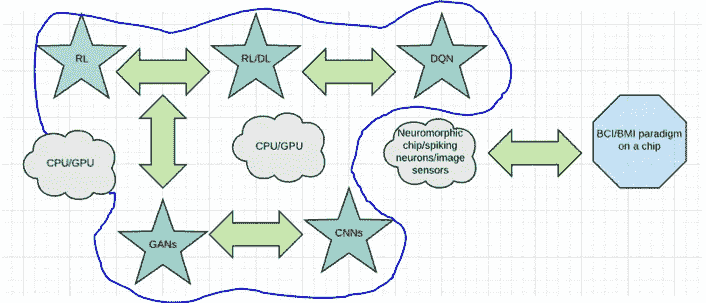

卷积神经网络(CNN)用于视觉成像，基于模拟的生物过程，如类似于动物/人类视觉皮层的神经元连接模式，这为算法设计提供了信息。诸如 GANs 之类的机器学习技术使用对抗网络来使机器能够基于给定的图像输入来生成图像。例如，电动汽车和 Space X 的 Crew Dragon 等车辆在导航的算法设计中使用了这种机器学习图像。

简而言之，上表中的公司，无论他们是出于既定的还是紧急的目的使用这些网络，都是 GANs ( [Goodfellow 等人，2014)](http://papers.nips.cc/paper/5423-generative-adversarial-nets.pdf) 学会了区分图像，是 CNN 可以协调图像的排序，就像视觉皮层中的神经元连接模式。

自 2014 年以来，GAN 研究继续前进。尽管如此，2019 年仍然存在明显的复杂性，Rich Sutton 在这里建议:

*‘我们应该停止试图寻找简单的方法来思考头脑的内容，比如简单的方法来思考空间、物体、多重代理或对称性。所有这些都是任意的、内在复杂的外部世界的一部分。它们不是应该内置的，因为它们的复杂性是无穷无尽的；相反，我们应该只构建能够发现和捕获这种任意复杂性的元方法。这些方法的本质是它们能找到好的近似值，但是寻找它们应该用我们的方法，而不是我们。我们希望人工智能代理能够像我们一样发现，而不是包含我们已经发现的东西。将我们的发现融入其中只会让发现过程变得更加困难。*

星图以 DQN 的形式显示了进展。[2015 年，(论文链接在此)，谷歌的 DeepMind 开发了“一种新型人工智能，被称为深度 Q 网络”](https://storage.googleapis.com/deepmind-media/dqn/DQNNaturePaper.pdf)。同样，基于相同的前提，上面讨论的“行为”和以下摘录摘自研究论文:

“强化学习理论提供了一个规范性的解释，深深植根于心理学和神经科学对动物行为的观点，关于代理人如何优化他们对环境的控制。”

[相关博客](https://deepmind.com/research/dqn/)声称，*这项工作首次展示了一种通用智能体，它能够在没有任何人类干预的情况下不断调整自己的行为，这是在寻求通用人工智能的过程中向前迈出的一大步。*

这意味着通过机器中的 DQN 实现的智能体适应，通过再现性范例，可以转移到机器人开发中。然而，人们认识到，适应性是关于从主要关注依赖心理特征的算法到包括行为特征的转变。

在 2017 年 5 月期间，OpenAI 发布了博客:[开放 AI 基线 DQN](https://openai.com/blog/openai-baselines-dqn/#dqn) 和[相关代码。](https://github.com/openai/baselines)很明显，OpenAI 在 2017 年推进了对 DQN 发展的研究:

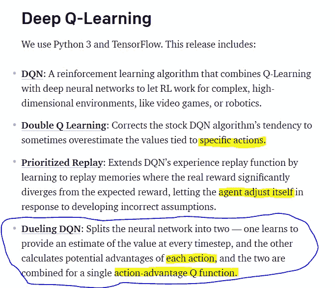

就像皮亚杰(*同上*)对儿童行为/动作的观察，这些观察为他的认知发展理论提供了信息；正如你在上面看到的，OpenAI 包括分裂神经网络，以专注于“行为/动作”。这反过来又为发展贡献了一个巨大的飞跃，就一个链做另一个链的行为观察/评估/元，以通知行动而言。

下面的例子显示了 open ai Gym/Universe training Deep Q Learning(DQN)在 iMac 上使用 CPU 模拟月球着陆器:

最近，[Google brain](http://www.marcgbellemare.info/blog/eighteen-months-of-rl-research-at-google-brain-in-montreal/)(2019 年 3 月)展示了分布式学习对于 RL & DL 链接的重要性。这项工作持续了 18 个月的研究，重点是分布式算法。一种算法

*‘显式地对分布损失执行梯度下降(C51 和 QR-DQN 都不这样做)。结果是一个我们命名为 S51 (* [*Bellemare 等人，AISTATS 2019*](https://arxiv.org/abs/1902.03149)*)’*

本质上，这项工作是特别重要的，因为认识到分布式学习的价值；此外:

*’能够表明 S51 在与线性函数逼近结合时具有收敛保证。在此过程中，我们还收集了一些证据，证明在一些病理性的例子中，预测提取法是一种比直接预测期望值更差的近似方法，这是一位评论者所说的“更容易出现模型设定错误”的自然结果。*

和

*’…分布式 RL 确实学习了更丰富的表示。下面是使用 C51(左)或 QR-DQN(右)预测随机策略的值分布时所学特征的可视化。”*

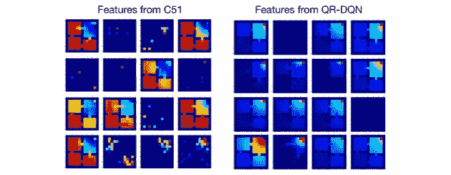

这项研究最终表明，分布式系统会对学习的深度/丰富性/质量产生影响。同样，开创性的教育——文献强调了认知是如何为最佳的学习机会而发展的。例如，[我和大学生一起进行的研究，我参考了](https://medium.com/@stuartmacdonald79/student-engagement-characteristics-and-pedagogical-features-using-twitter-during-undergraduate-fa3487607aa3)大卫·佩尔金斯(哈佛研究生院&理查德·皮阿，斯坦福):

发展方法扩展了这一理论，认为认知不仅仅依赖于一个人以某种方式思考的能力；认知不仅涉及思维，还涉及其他人、象征性媒介以及利用环境和人工制品(Pea，1993)。换句话说，t **概念化为“分布式认知，主要发生在真实和扩展探究的情况下”(Perkins，1993 年，第 93 页)。**

回到星图，我想指的是中央处理器(CPU)和图形处理器(GPU)。在本文系列的[原始研究](https://medium.com/coinmonks/openai-blogs-a-micro-event-analysis-e15e98cfbca1)中，主题:处理包含了对计算的关注:

*’…延迟是信息通过网络传播/处理的速度。如果我们将这两者结合起来，低效的算法和高延迟导致了糟糕的计算机处理…在 OpenAI 博客中:* [*更快的物理在 Python 中*](https://blog.openai.com/faster-robot-simulation-in-python/) *，这表明 GPU 渲染比 CPU 具有更快的处理速度，因此根据定义，用户可以预期更低的延迟。此外，依赖于 GPU 硬件的开发工作的其他示例可以在博客中找到:* [*【近似策略优化】，*](https://blog.openai.com/openai-baselines-ppo/) *其中陈述:*

我们还发布了一个支持 GPU 的 PPO 实现，名为 PPO2。这比 Atari 上当前的 PPO 基线快了大约 3 倍。

正如你所看到的，CPU/GPU 计算有助于机器学习算法运行的速度和规模。然而，有些人可能会说，关于 gan，研究基地提供的内容与在公共领域应用的影响/附加值之间存在不匹配，推断是 gan 本身作为一个实体表现出有限的应用可转让性。同样，根据[里奇·萨顿:](http://www.incompleteideas.net/IncIdeas/BitterLesson.html)

寻求在短期内产生影响的改进，研究人员寻求利用他们在该领域的人类知识，但从长远来看，唯一重要的是利用计算。这两者不一定相互矛盾，但在实践中，它们往往会相互矛盾。

最近的研究被 [OpenAI](https://openai.com/blog/energy-based-models/) 引用，集中在基于能量的模型(EBM)上，这里的论文是；EBM 功能的实际主要启示是隐藏变量可以包含在设计中。与空气动力学中应用的控制理论算法中使用的自由度概念没有太大不同，[例如，参见 1996 年提交给 NASA 的博士论文，](https://ntrs.nasa.gov/archive/nasa/casi.ntrs.nasa.gov/19960029105.pdf)例如，从第 14 页开始:

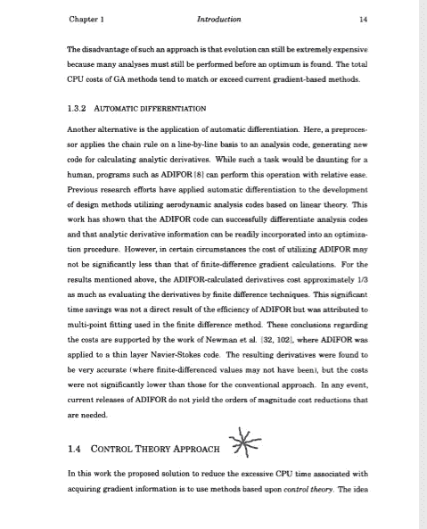

此外，我还在[第 3 部分](https://medium.com/datadriveninvestor/part-3-artificial-intelligence-artificial-general-intelligence-moving-the-research-base-893078d04ee0)中写了关于量子计算的自由度:

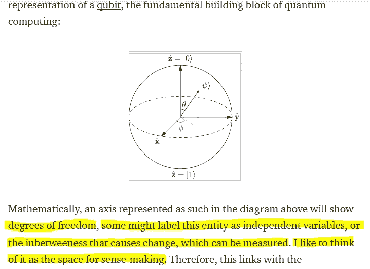

然而，就高效计算而言；而 EBM 模型可以结合自适应计算时间+自适应生成，将研究基础向前移动到 GAN 约束之外；计算效率的自我调节仍然缺乏，由于需要同时记录的内容不同，标签可能会不同步(感谢 Twitter 上的@ Calvinn _ Hobbes):

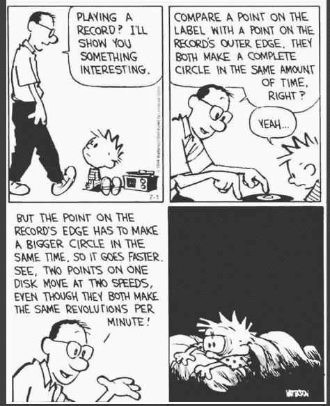

星图显示了神经形态芯片的进展。让我们先从那一项开始，然后我将讨论尖峰神经元。

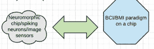

CPU 如何发展的一个很好的例子是它在电动汽车上的应用。本文简介:[green box 中提供的混合动力/电动汽车软件](https://www.electronicdesign.com/automotive/hybridelectric-vehicle-software-delivered-greenbox)’*green box 包含一个 64 位四核 ARM Cortex-A 系统，带有接口和模拟支持:*

ARM 架构也可以支持神经形态芯片。本质上，这种类型的混合系统可以在 CPU 上运行计算；通过包含在神经形态芯片上的短代码设计的大量信息，能力、能力和功能的指令可以成为一个四路管道:通用软件的 CPU 处理、卷积神经网络、具有时域模拟和数字混合信号处理的二进制神经网络，正如我在本系列的[第 1 部分](https://medium.com/datadriveninvestor/part-1-artificial-intelligence-artificial-general-intelligence-moving-the-research-base-40508d9ceb60)中概述的。相关论文参考号为[此处](https://www.semanticscholar.org/paper/A-Neuromorphic-Chip-Optimized-for-Deep-Learning-and-Miyashita-Kousai/14096de8ec536281f50802eb858f9d97344b9bd8):

推论是，计算可以用一个芯片上的短代码来操纵，这个芯片可以并行或不并行地在 CPU 上运行，这取决于 TDNN 协处理器。

没有任何理由说明为什么不能开发这种相同/相似的架构；基于使用肌电信号来计算神经信号的代码并将算法/网络信息放置在芯片上，以及用于[波士顿动力公司大狗:](https://www.bostondynamics.com/bigdog)的附加液压技术

重申一下，假设我们知道 CPU/GPU 计算有助于机器学习算法运行的速度和规模；并且组合处理可以在 CPU 上运行，例如，芯片上的短代码也可以尽可能高效地运行。星形图显示了芯片开发中的“峰值”。2013 年，Navaridas 等人发表了论文: [SpiNNaker:功率和面积受限的大规模神经模拟架构中的容错](https://www.sciencedirect.com/science/article/pii/S0167819113001051):

*‘SpiNNaker’是一个应用* [*专用设计*](https://www.sciencedirect.com/topics/computer-science/specific-design) *意在模拟大型生物* [*神经网络*](https://www.sciencedirect.com/topics/computer-science/neural-networks)*—“SpiNNaker”这个名字来源于 Spiking 神经网络架构’。它由一个环形排列的***处理节点组成，每个节点都包含一个专门构建的多核* [*片上系统*](https://www.sciencedirect.com/topics/engineering/system-on-chip) *(SoC)和一个 SDRAM 存储器(* [*图 1*](https://www.sciencedirect.com/science/article/pii/S0167819113001051#f0005) *)。* [*神经元*](https://www.sciencedirect.com/topics/engineering/neurons) *是仿照在嵌入式 ARM968 处理器上运行* *的* [*软件；每个核心旨在模拟名义上的 1000 个神经元。*](https://www.sciencedirect.com/topics/computer-science/running-software)**小型 SpiNNaker 系统已成功用作* [*嵌入式应用*](https://www.sciencedirect.com/topics/computer-science/embedded-application)*[*【1】*](https://www.sciencedirect.com/science/article/pii/S0167819113001051#b0005)*中的控制系统，为机器人提供了***中描述的实时刺激-反应行为。然而，该项目的最终目标是建造一台能够实时模拟多达 109 个神经元的机器。将这个数字放在上下文中，一些小型灵长类动物的大脑神经元数量略低，而人类大脑的神经元数量大约是这个数字的 86 倍*[*【3】*](https://www.sciencedirect.com/science/article/pii/S0167819113001051#b0015)*。为了达到这个神经元数量，将需要超过十万个* [*集成电路*](https://www.sciencedirect.com/topics/computer-science/integrated-circuit) *(其中一半是 SpiNNaker 芯片，另一半是 SDRAMs)。”*****

**Navaridas 等人在 SpiNNaker 的总体视图中示出了处理节点的环形布置；如何处理“流量”。**

**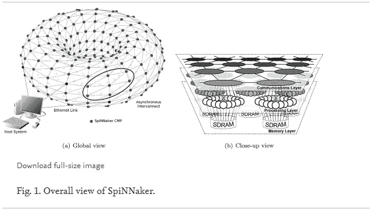**

**为了更深入地了解环面的基本原理，Minhyong Kim 在他的作品中探索了:[纯数学和物理之间的联系，以考虑空间和相关空隙:](https://www.quantamagazine.org/secret-link-uncovered-between-pure-math-and-physics-20171201/?utm_content=buffer0c4d2&utm_medium=social&utm_source=twitter.com&utm_campaign=buffer)**

**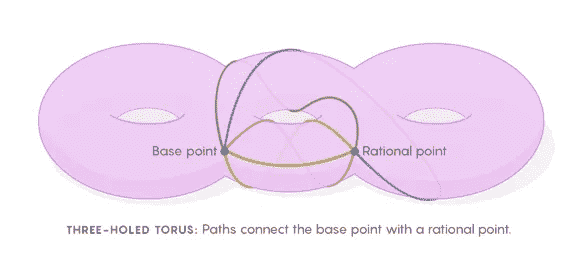**

**因此，这是一种片上架构，(记住 SpiNNaker 是在 2013 年开发的)**

**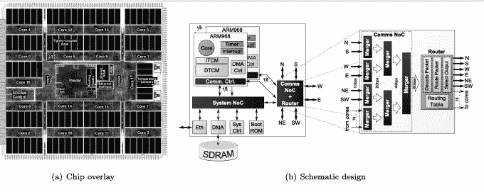**

**也可以和我前面说的四通管道集成。逻辑是这么说的。**

**继续前进，我们现在到达了最后的发展阶段:芯片上的脑计算接口(BCI)/脑机接口(身体质量指数)范例。这种范式的转变与我用 [OpenAI 数据进行的最初研究的主题有关，即认知。](https://medium.com/coinmonks/openai-blogs-a-micro-event-analysis-e15e98cfbca1)在我深入研究 BCI/身体质量指数芯片功能之前；我将简要参考其他关于机器中认知的相关工作。**

**OpenAI 数据分析揭示了对语言/交流发展、元学习和学习迁移的关注。同样，[SingularityN](https://singularitynet.io/)ET/Hanson Robotics，开发了自己的开源、人工通用智能项目:[OpenCog](https://wiki.opencog.org/w/The_Open_Cognition_Project)；关于算法框架的一个很好的例子是关于 [RelEx](https://wiki.opencog.org/w/RelEx_Dependency_Relationship_Extractor) 的这个页面，它说:**

***‘非常适合问答和语义理解/推理系统’。***

**奇点网的目标是在 OpenCog 中开发；理论驱动的机器人应用算法。我们看到，作为这个目标的结果，Hanson Robotics 创造了 Sophia，例如，问题回答，尽管目前是预先编写的，但目标是超越。**

****转变范式****

**回到芯片上的脑计算接口(BCI)/脑机接口(身体质量指数)范例。根据[费茨(2007):](https://www.ncbi.nlm.nih.gov/pmc/articles/PMC2151376/)**

***脑-机接口(BCI)和脑-机接口(身体质量指数)的成功运行在很大程度上取决于神经活动可以被意志控制的程度***

**费茨说，“意志控制”；鉴于我们在 2019 年发现自己，并鉴于我们迄今为止处理的文献，建议我们可以重新表述为:芯片上的意志控制。我们也可以将意志定义为包括人类代理/代理活动的人类行为。Fetz，发表于 2007 年(12 年前):**

**感觉关联区的神经元也与认知想象一起被有意识地激活…因此，刺激和运动的内部表征经常使用许多与明显的感觉或运动行为有关的相同神经元。除了感官和运动事件的表征，像“思考”这样的内部认知活动也必须有神经关联，这些也代表 ***【意志可控过程……****因此，常规实验已经揭示了一系列神经活动的中央控制是明显的情况。意志输入可以被认为反映了除了更好地研究的感觉和运动模态之外存在的激活模态。它可用于 BCI/身体质量指数控制信号的程度仍需凭经验确定。传统的实验，如那些描述的，通常是围绕一个特定的行为设计的，并间接揭示了相关神经活动的意志成分。“与这种范式相反，生物反馈实验直接引发了对神经活动的意志控制，并允许相关行为出现。”***

**从本质上讲，费茨认为意志思维/认知可以被控制，从而在强化活动的帮助下决定行为。**

**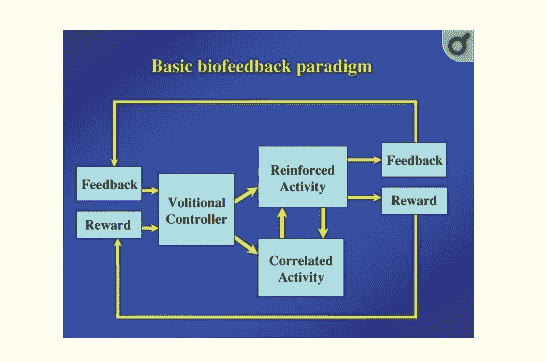**

****明显的发展轨迹****

**本系列论文的最后一个主题是一个明显的发展轨迹。OpenAI 数据显示了在机器中寻找最终适应/自适应能力的方向。这在表中各公司的工作中也已确立或出现:**

****

****NASA，Space X，Neuralink & DARPA****

**为了思考基本生物反馈范式的应用，接下来将考虑 NASA。**

**一个很好的例子是计划在 2021 年初向红色星球发送一辆[火星 2020 漫游车](https://mars.nasa.gov/mars2020/)，它将携带一架[小型直升机。](https://www.nasa.gov/feature/nasa-is-with-you-when-you-fly-even-on-mars)根据[发现](http://blogs.discovermagazine.com/d-brief/2019/03/22/nasa-is-sending-a-helicopter-to-mars/?utm_source=dlvr.it&utm_medium=twitter#.XJVWJ3d2vIU):**

**如果直升机遇到任何错误，它必须有内置系统来安全着陆。因此，火星直升机将是自主的，自己进行短途飞行。它将通过火星车接收命令和通信，但它有自己的太阳能电池供电，并有一个加热器在火星寒冷的夜晚保持温暖**

**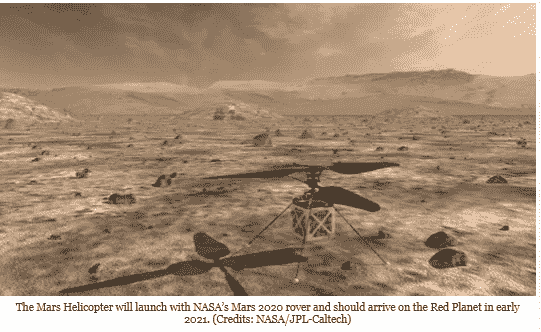**

**这种自主性可以通过生物反馈范例来实现，在这种范例中，人脑、神经活动被模拟，意志被控制；这反过来可以被放置在一个尖峰芯片上，类似于 Space X 的 Crew Dragon-2 的自主导航过程。**

**在考虑 Crew Dragon-2 飞行器时，可以考虑珩磨 in，Space X 的一个很好的算法示例。在下面的视频延时镜头中，可以看到船员龙与国际空间站(ISS)对接。为了做到这一点，部署了许多算法，类似于我在[第一部分中解释的方式，当时我提到了冯诺依曼关于计算和短码功能的工作。](https://medium.com/datadriveninvestor/part-1-artificial-intelligence-artificial-general-intelligence-moving-the-research-base-40508d9ceb60)**

**当 Crew Dragon 离开国际空间站时， [Max Fagin](https://medium.com/u/3006050f9276?source=post_page-----150b9e3aa17f--------------------------------) 在推特上发文([2019 年 3 月 7 日](https://twitter.com/MaxFagin/status/1103924577267118082)，下面的细节有图片)解释了为什么车辆爬升到略高的轨道，以通过空间站上方；至于数学(包括，例如，如果你仔细看，正弦/余弦函数)你可以看到，会以变换算法的形式出现。**

***‘轨道力学不可避免的神器’。“龙”号停靠在空间站的前进港口。离开空间站意味着增加几米/秒的轨道速度，这意味着它将爬升到一个稍高的轨道，并在空间站上方通过。***

**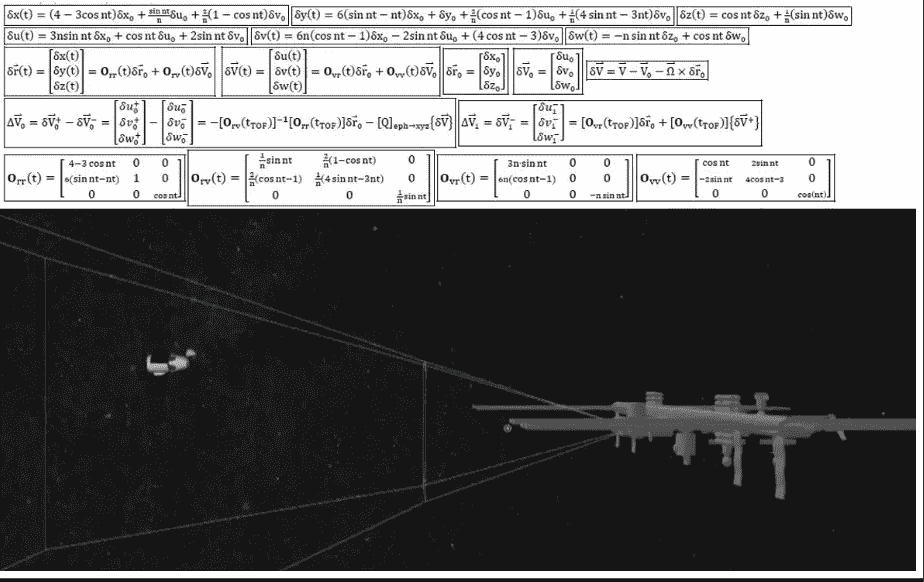**

**更具体地说，变换算法使得数学能够使用矩阵进行变换；对计算进行聚类，使其更短且处理更快，例如参见[矩阵 Kronecker 乘积及其性质](https://www.sciencedirect.com/topics/computer-science/transform-algorithm)(Ali n . akan su，Richard A. Haddad，在[多分辨率信号分解](https://www.sciencedirect.com/science/book/9780120471416)，2001)例如:**

**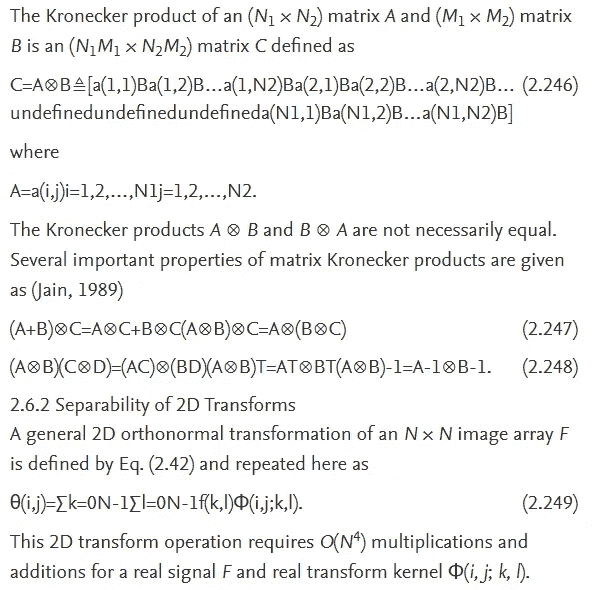**

**值得注意的是，在上面的例子中，图像阵列；基于关系矩阵，可以是 2D 变换的计算结果，并且可以影响内核如何操作。**

**因此，可以说逆向工程起了一定的作用；因为一旦我们知道飞行器已经成功停靠在国际空间站，那么它的离开和返回地球的轨道上遵循的标准操作程序就是问题。**

**请记住，逆向工程的概念，并给我们一个关于其成功的想法；雷·库兹韦尔说，逆向工程和重新设计的过程也将包括大脑。因此，如果大脑的所有区域都可以被逆向工程改造，就像对载人龙飞船的工程一样；模型和模拟可以提供软件、硬件和算法方法，例如微代码/处理，以通过芯片模拟大脑活动，例如生物反馈范例芯片以及网格。**

**简单来说，当我们考虑 Neuralink 时。尽管算法细节在文献或研究基础中并不明确，但科学源于理论；在可预见的未来，当 Elon Musk 宣布开发里程碑时，应用。这对奇点网/汉森机器人学来说可能意味着什么？**

**与逆向工程大脑所有区域的可能性相关，有人建议[算法可以模拟情商](https://interestingengineering.com/neuralink-how-the-human-brain-will-download-directly-from-a-computer)。情商使人类能够适应他们的环境，并适应与他人的关系。**

**[DARPA 的工作](https://www.darpa.mil/news-events/2019-03-12)包括，已建立的，受生物启发的 AI 算法；今年的工作重点是[下一代人工智能算法和应用，例如可解释性和常识推理，目的是进一步提高适应能力。](https://www.darpa.mil/work-with-us/ai-next-campaign)**

**总之，总结这一系列论文；很明显，在机器学习的帮助下，人工智能的开发和应用的范式转变是关于实现机器的适应。迄今为止所取得的进展，包括用于太空探索的可重复使用的车辆，表明芯片开发可以增强工程技术，以至于可重复使用性可以被定义为适应性。为了达到最终的应用，人工通用智能(AGI)的适应性是一个要求。因此，如果机器能够适应改变方向并自主完成绕行路线，那么这种适应就可以发生在机器人身上。范式已经改变，它如何在人类中映射，而不仅仅是在太空/火星上，还有待观察。虽然，在 2019 年 3 月 26 日[纽约时报](https://www.nytimes.com/2019/03/26/technology/google-robotics-lab.html?smid=tw-nytimes&smtyp=cur)在 [@GoogleAI](https://twitter.com/GoogleAI) 分享了机器人技术的概述:使用机器学习让机器人开始做实际的事情，从导航房间到处理日常物品，以一种与人一起工作的方式(有关 GoogleBrain/AI research 机器人研究的最新进展，请参见下面的[链接)。](https://ai.google/research/pubs/?area=Robotics)因此，研究基地将如何发展？首先也是最重要的，坚定地关注道德。**