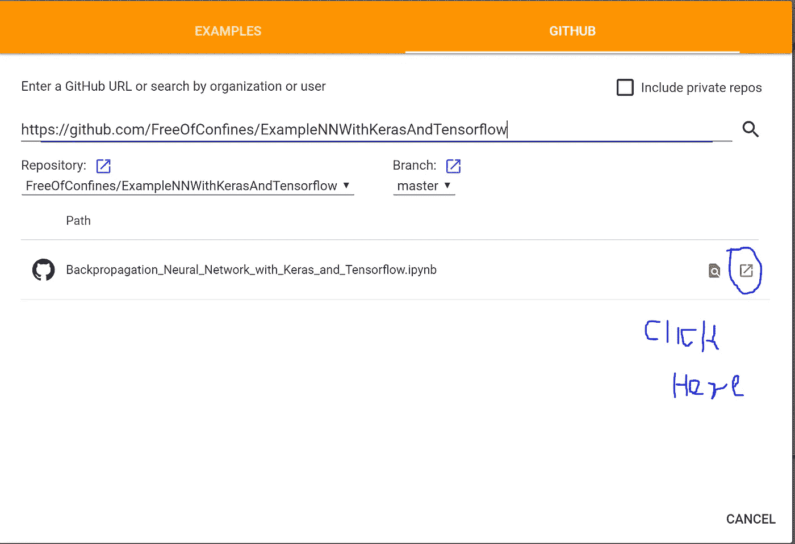
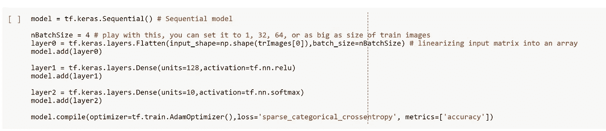
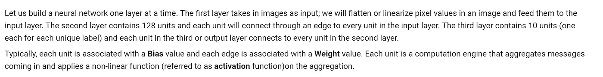

# 第 4 部分:构建神经网络的回顾

> 原文：<https://medium.datadriveninvestor.com/part-4-review-of-building-a-neural-network-b633faead104?source=collection_archive---------31----------------------->

# 迄今为止

在[第 1 部分](https://medium.com/@FreeOfConfines/install-python-3-6-and-tensorflow-92eeff0ad4f5)、[第 2 部分](https://medium.com/@FreeOfConfines/part-2-basic-classification-neural-network-6d68d32fa4b2)和[第 3 部分](https://medium.com/@FreeOfConfines/part-3-understanding-results-from-the-neural-network-21022acf53a5)中，我们使用 Keras 和 Tensorflow 构建、训练和预测了一个反向传播神经网络。尽管我在这三个部分中都包含了代码片段，但是读者仍然需要将部分代码复制到他们的 Python 环境中，以便能够使用这些代码。

在这篇文章中，我将向你介绍一个叫做 [Jupyter Notebook](https://jupyter.org/install.html) 的漂亮的学习/记录工具。为了保持连续性，我将使用我们在[第 2 部分](https://medium.com/@FreeOfConfines/part-2-basic-classification-neural-network-6d68d32fa4b2)和[第 3 部分](https://medium.com/@FreeOfConfines/part-3-understanding-results-from-the-neural-network-21022acf53a5)中使用的示例。

# 与谷歌的合作实验室

如果你有一个谷歌(Gmail)账户，我描述的方法应该行得通。但是如果你有一个，那么你也许可以和[合作实验室](https://colab.research.google.com/notebooks/welcome.ipynb)一起做更多的事情。

*   转到[https://colab.research.google.com/notebooks/welcome.ipynb](https://colab.research.google.com/notebooks/welcome.ipynb)
*   你会看到一本名为《欢迎来到合作实验室》的笔记本。笔记本将代码和文本块(通常称为单元格)交错，这允许用文本和代码单元格记录您的项目；简洁的特性是代码单元可以在笔记本中执行(寻找代码单元左上角的 Play 符号)。
*   我制作了一个笔记本，记录了我们迄今为止一直在做的例子。在这本笔记本中，你会发现一些我们以前没有涉及到的新材料。
*   要访问该笔记本，从*文件*选项卡中选择*打开笔记本*选项。在弹出的窗口中选择 *GITHUB* 选项，输入以下网址:[https://GITHUB . com/FreeOfConfines/ExampleNNWithKerasAndTensorflow](https://github.com/FreeOfConfines/ExampleNNWithKerasAndTensorflow)。现在按下*键进入*。*点击* *这里的*(见下图)是你点击弹出窗口的地方。

Screenshot of What you Should See

*   代码单元中的 Python / Tensorflow 代码应该很熟悉，见下文。

Example of a Code Cell

*   文本单元格有助于添加关于代码的有用细节。举个例子，

Example of a Text Cell

*   为了充分利用此笔记本，请从笔记本顶部开始，一路向下。通读文本单元格后，可以执行它下面的代码单元格。如果您希望对代码单元中的代码进行更改，只需这样做并重新执行即可。注意要执行，只需按下出现在每个代码单元左上角的*播放*按钮。
*   请随意对代码/文本进行修改，以帮助您理解示例。完成后，您可以在 Google Drive 上保存一份包含您所做更改的笔记本副本。

最后，如果你在执行一个单元时遇到麻烦，那么检查一下笔记本右上角的*连接*。如果它没有说连接，那么选择*连接到托管运行时*。

# 怎么样

批量大小的概念，其中一次向网络呈现 4 个输入图像，并且每批仅更新一次权重/偏差。在您将所有训练图像呈现给网络一次之后，一个时期就完成了。批次大小和历元数改变了神经网络学习和收敛的方式。尝试将代码单元格中的`nBatchSize`设置为不同的值。

我们不使用 Evaluate 方法，而是使用 Predict 方法来收集我们呈现给网络的每个测试图像的网络输出。注预测精度是通过检查每个图像的网络输出来计算的。

当你在笔记本上工作时，你会注意到一些其他的小细节。

# 摘要

如果您觉得笔记本工具对学习和记录有用，请告诉我。我计划在整个系列中使用这个工具。如果你不是谷歌合作实验室的粉丝，有很多其他的方法来使用笔记本。