# 第 7 部分:回顾梯度、Hessians 和牛顿法，以及在 Tensorflow 中实现的例子

> 原文：<https://medium.datadriveninvestor.com/part-7-review-of-gradients-hessians-and-newtons-method-with-examples-implemented-in-tensorflow-9a1798a4c33b?source=collection_archive---------1----------------------->

# 迄今为止

在第 5 部分中，我们已经复习了函数、导数和优化算法，如梯度下降和牛顿法。我们考虑了一元函数，即一维输入变量，并研究了一阶导数、二阶导数和泰勒级数展开的思想。这些概念可以扩展到具有一个以上输入变量的函数，即多维输入变量。

在这一节中，我们将用三维空间中的具体例子来回顾这些扩展。示例用 Tensorflow 编码并绘制，以帮助可视化梯度和 Hessians 的概念。此外，我们将使用梯度下降和牛顿法完成函数最小化练习。这些概念是许多作为机器学习训练一部分的学习算法的基础。

 [## DDI 编辑推荐:5 本机器学习书籍，让你从新手变成数据驱动专家…

### 机器学习行业的蓬勃发展重新引起了人们对人工智能的兴趣

www.datadriveninvestor.com](https://www.datadriveninvestor.com/2019/03/03/editors-pick-5-machine-learning-books/) 

# 阅读指南

阅读这篇文章的最好方法是跟随 Google 协作笔记本，里面有所有的代码和注释。为此，请单击下面的链接；请记住，您不需要安装任何软件，笔记本中的代码可以在您的手机或台式机上运行(您可能需要一个 gmail 帐户)。笔记本中的注释将包含比本文更多的细节。

 [## 谷歌联合实验室

colab.research.google.com](https://colab.research.google.com/gist/FreeOfConfines/f2f41acad26988b348ed447368a30801/review-of-gradients-hessians-and-newton-s-method-with-examples-implemented-in-tensorflow.ipynb#scrollTo=EFlU8rNVy0NE&forceEdit=true&offline=true&sandboxMode=true) 

如果你时间紧迫，那么你可以通读这篇文章，这篇文章会给你一个很好的概念概述，并附有图解。

# 二维函数的梯度和 Hessian 矩阵

## 参考

*   K.彼得森，“黑客帝国食谱”，链接:【http://matrixcookbook.com 

## 定义

让我们首先选择一个 f(x)来进行这种处理:为了简单起见，我们将假设 f(x)在任何 x 处的值都是一个数，但是 x 不是一个数，而是一个 2×1 的向量，即二维的。注:我们将讨论的概念不局限于二维，而是自然延伸到多维。

f()的梯度是相对于 x_1 的偏导数的 2×1 向量，x_2 定义为

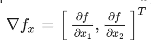

Gradient of f(x)

Hessian 矩阵是二维二阶导数的扩展，定义如下:

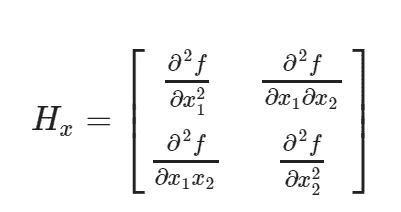

Hessian Matrix of f(x)

## 例子

让我们计算函数 f(x)的梯度和 Hessian，定义如下:

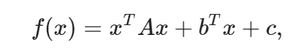

其中 A 是一个 2 x 2 的矩阵，b 是一个 2 x 1 的向量，c 是一个数字。注 f(x)将计算出一个数。a、b 和 c 是方程的参数，即用户定义的或由给定问题定义的。向量 x 有两个条目或两个维度<x_1 x_2="">。注意 T 是变换操作符。那么，我们为什么选择这个等式呢？该方程是二次的，即，x 的元素被提高到 2 的幂，但不会更多，并且这种方程在许多优化问题中表现为成本函数。</x_1>

按照上面的定义，函数的梯度可以被计算出来，并且已经被计算出来了(感谢[拉法·诺瓦克](https://medium.com/u/c1c0ac04f940?source=post_page-----9a1798a4c33b--------------------------------)发现了这个错误——现在已经修复)

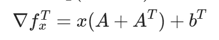

Gradient of the example

再次按照上述定义，可以计算函数的 Hessian，它是

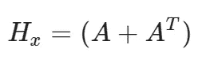

# 用张量流计算梯度和 Hessians

在本节中，我们将计算三个选择函数的梯度并分析它们的轮廓。在下面的代码中，我们使用 Tensorflow 中的内置函数计算 gradient 和 Hessian。

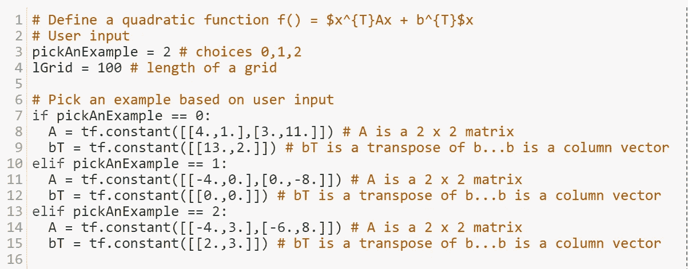

Define parameters A and b for three f(x) examples

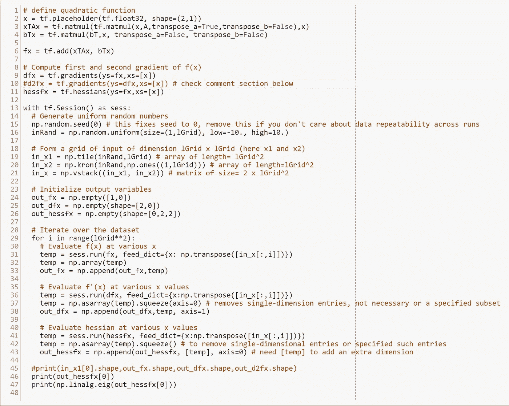

Compute Gradient and Hessian

让我们检查每个示例函数 f(x)的曲面；下面的代码将让您绘制三维表面。

Code to plot 3D figures

在这个例子中，函数的表面是碗状的(即凸起的)，并且具有唯一的最小值，即杯子的底部。在最低限度，函数的梯度将消失，即评估为零，Hessian 的特征值将全部为负(更多信息见[谷歌合作者笔记本](https://colab.research.google.com/gist/FreeOfConfines/f2f41acad26988b348ed447368a30801/review-of-gradients-hessians-and-newton-s-method-with-examples-implemented-in-tensorflow.ipynb#scrollTo=UvngSutlwAw2&forceEdit=true&offline=true&sandboxMode=true))。

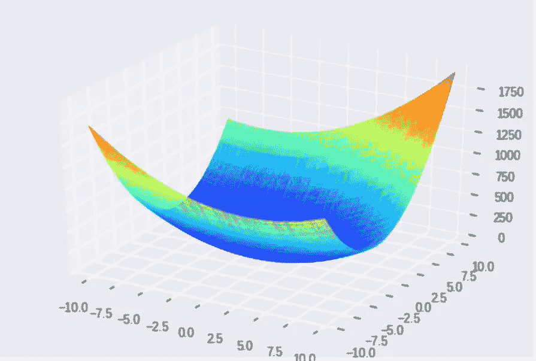

Example 0: f(x) with A = [[4,1][3,11]], b= [13,2], and c= 0

在这个例子中，函数的表面就像一个倒置的碗(即凹面)，并且具有唯一的最大值。在最大值处，函数的梯度消失，I..e 的值等于零，Hessian 的特征值将全部为正(更多信息见 [Google Collaborator 笔记本](https://colab.research.google.com/gist/FreeOfConfines/f2f41acad26988b348ed447368a30801/review-of-gradients-hessians-and-newton-s-method-with-examples-implemented-in-tensorflow.ipynb#scrollTo=UvngSutlwAw2&forceEdit=true&offline=true&sandboxMode=true))。

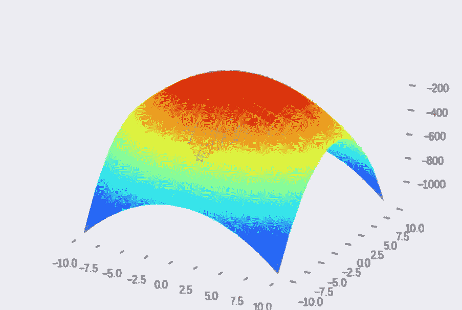

Example 1: f(x) with A = [[-4,0][0, -8]], b= [0,0], and c=0

这个例子中的函数曲面特别有趣:函数没有唯一的最小值或最大值。注意，函数的最小值出现在其中一个轴的任一侧，而函数的最大值出现在其他轴的任一侧。该函数应该让您想起中间的一个鞍点(图中用画得不好的箭头表示)，在该处梯度消失，但 Hessian 的特征值为正和负。您可以通过运行 [Google Collaborator 笔记本](https://colab.research.google.com/gist/FreeOfConfines/f2f41acad26988b348ed447368a30801/review-of-gradients-hessians-and-newton-s-method-with-examples-implemented-in-tensorflow.ipynb#scrollTo=UvngSutlwAw2&forceEdit=true&offline=true&sandboxMode=true)中的代码来检查这些特征值。

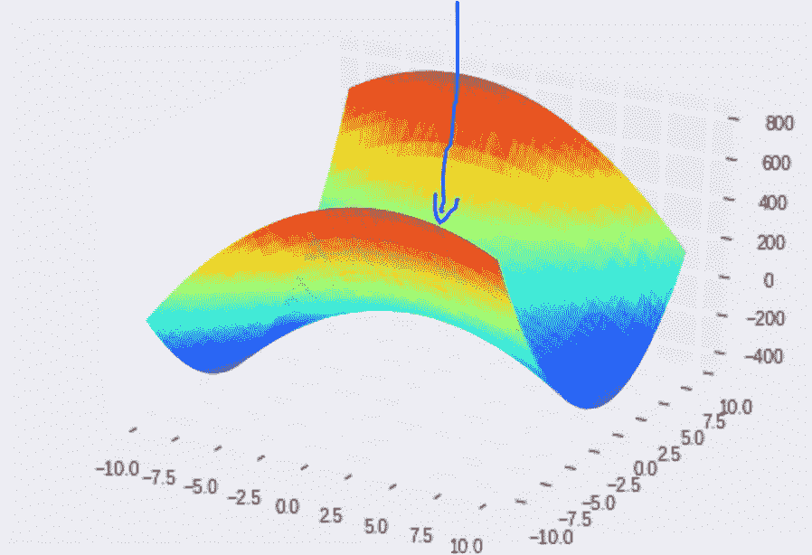

总之，简单地寻找消失梯度是不够的，我们需要检查二阶导数(或 Hessian ),以确定一个点是否最大化或最小化函数，或者它只是一个鞍点。

## 函数最小化/最大化

一般来说，优化问题涉及确定最小化或最大化成本函数的参数集。像 f(x)一样，成本函数是针对你试图解决的问题而设计的。我们将描述两种基本方法来搜索和达到一个给定的成本函数的最小值或最大值。

## 方法 1:用张量流方法进行梯度优化

在[以前的一篇文章](https://colab.research.google.com/gist/FreeOfConfines/63644a6bac784d7133c66228673b18a7/review-of-functions-derivatives-and-gradient-descent-algorithm.ipynb#scrollTo=sFgIKGldCEbE)中，我们已经详细描述了梯度下降算法。函数的梯度指向函数最大化的方向，因此，算法选择向与梯度相反的方向移动。多维空间中的梯度下降算法类似于一维空间中的梯度下降算法，更新方程如下:

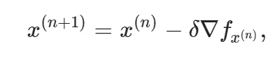

Gradient Descent Update Equation

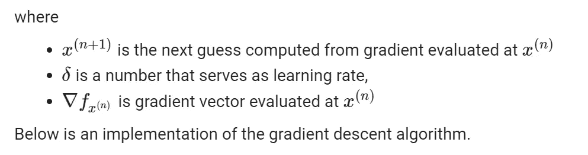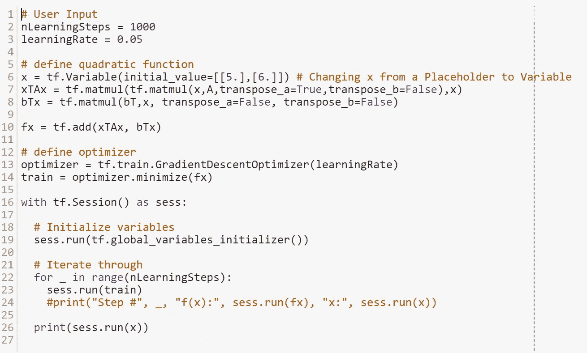

Gradient Optimization Algorithm Implemented with Tensorflow

## 方法二:牛顿法

在[以前的一篇文章](https://colab.research.google.com/gist/FreeOfConfines/63644a6bac784d7133c66228673b18a7/review-of-functions-derivatives-and-gradient-descent-algorithm.ipynb#scrollTo=sFgIKGldCEbE)中，我们已经详细描述了牛顿法。与一维情况一样，函数 f(x)可以用泰勒级数的前三项来近似:

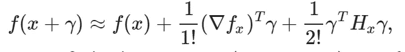

Taylor Series Approximation of f(x)

通过将上述近似值设置为零来求解伽马，这又导致以下更新等式:

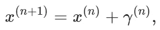

Newton’s Method Update Equation

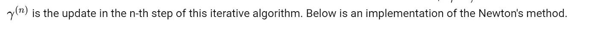

要了解更多信息，请阅读我的 [Google Collaboratory 笔记本](https://colab.research.google.com/gist/FreeOfConfines/f2f41acad26988b348ed447368a30801/review-of-gradients-hessians-and-newton-s-method-with-examples-implemented-in-tensorflow.ipynb#scrollTo=7X9Aq6Qbj28F&forceEdit=true&offline=true&sandboxMode=true)中的笔记。下面是牛顿方法的一个实现:

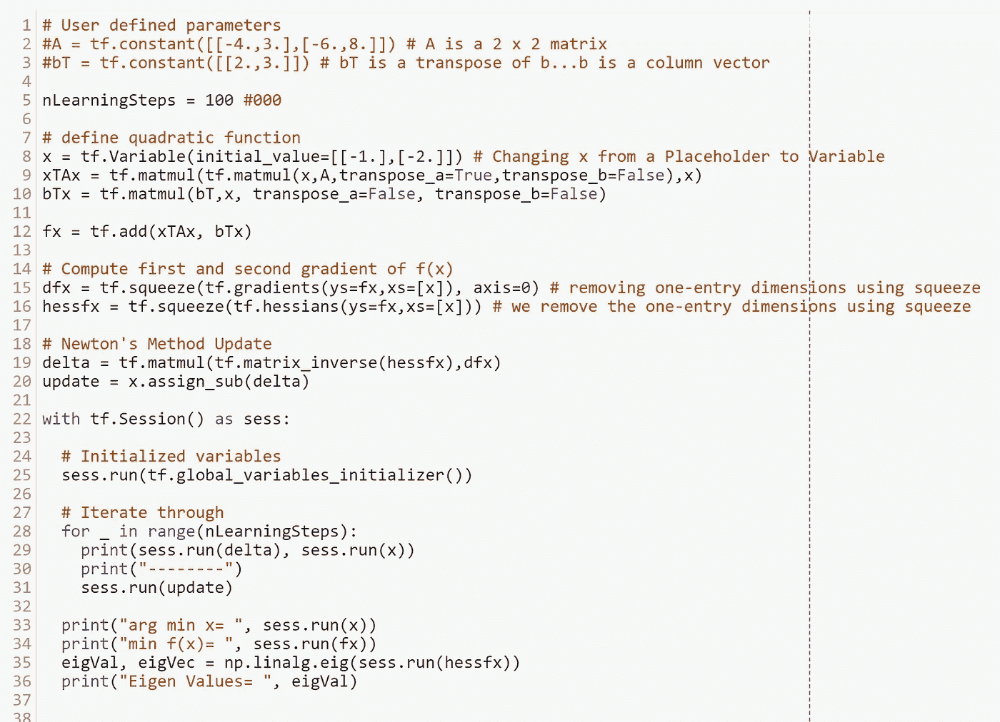

## 摘要

本文中讨论的思想被用于初级到高级的优化问题，并出现在许多流行的机器学习算法中。理解误差表面以及我们如何使用梯度下降和牛顿法导航它们是学习更高级算法的基础。成本函数可能会有所不同，它们的复杂性可能会因您处理的问题而有所不同，但这些优化方法或这些方法的变体将会被重复使用。

您可能对本系列的其他文章感兴趣:

[*第六部分:时尚 MNIST 数据集上 NumPy / Tensorflow 的 K 近邻分类*](https://medium.com/datadriveninvestor/k-nearest-neighbor-classification-with-python-numpy-tensorflow-on-fashion-mnist-dataset-d8361187c09c)

[*第五部分:张量流的梯度下降和牛顿算法介绍*](https://medium.com/@FreeOfConfines/part-5-introduction-to-gradient-descent-and-newtons-algorithms-with-tensorflow-769c61616dad)

[*第四部分:构建神经网络的回顾*](https://medium.com/datadriveninvestor/part-4-review-of-building-a-neural-network-b633faead104)

[*第三部分:理解来自神经网络的结果*](https://medium.com/datadriveninvestor/part-3-understanding-results-from-the-neural-network-21022acf53a5)

[*第二部分:用 Tensorflow 构建神经网络*](https://medium.com/datadriveninvestor/part-2-basic-classification-neural-network-6d68d32fa4b2)

[*第一部分:安装 Python 3.6 和 Tensorflow*](https://medium.com/datadriveninvestor/install-python-3-6-and-tensorflow-92eeff0ad4f5)