# 第 8 部分:回顾逻辑回归及其在 Tensorflow / Keras 中的实现

> 原文：<https://medium.datadriveninvestor.com/part-8-review-of-logistic-regression-and-its-implementation-in-tensorflow-keras-1b4a2ea49268?source=collection_archive---------2----------------------->

[Source](https://medium.com/tensorflow)

# 参考

1.  [http://www . stat . CMU . edu/~ ryantibs/adv methods/notes/logreg . pdf](http://www.stat.cmu.edu/~ryantibs/advmethods/notes/logreg.pdf)
2.  [http://www . hole house . org/ml class/06 _ Logistic _ regression . html](http://www.holehouse.org/mlclass/06_Logistic_Regression.html)

# 入门指南

在这篇关于逻辑回归的文章中，我们将探讨以下内容:

1.  应用于两类和多类分类问题的逻辑回归算法背后的数学。
2.  用 TF/Keras 库实现逻辑回归，并应用于时尚 MNIST 数据库。在实现部分，我们将探索实现该算法的两种方法。
3.  最后，我们将总结实施的结果。

数学描述应该易于理解，并有助于理解逻辑回归的基本原理。如果您对数学不感兴趣，那么您可以直接进入实施和结论部分。下面显示的练习代码可以在下面的 Github 链接中找到:

 [## FreeOfConfines/ExampleNNWithKerasAndTensorflow

### 物流的

github.com 回归](https://github.com/FreeOfConfines/ExampleNNWithKerasAndTensorflow/blob/master/Logistic_Regression.ipynb) 

# 分类问题和逻辑回归

分类问题涉及将输入分类或分配到许多离散的类别或标签中的一个。例如，将输入图像分类为一件衣服的图片，如裤子、裙子、夹克等。分类问题不同于典型的回归问题，因为它们的输出类是离散的，即不是连续的。换句话说，标签裤子，标签裙子，标签夹克，等等。是离散的类。通常，我们将每个类与一个数字 ID 相关联。

逻辑回归是一种应用于分类问题的简单算法。给定一个观察值，逻辑回归分类器将计算一个**概率**度量，并将该观察值标记为具有最高概率的类别。

稍后，我们将与时尚 MNIST 数据库，这是一个图像的集合。因此，假设每个观察都是一个图像是合理的。让我们将这种方法正式化。

# 两类分类问题

在两类分类问题中，有两个输出类，比如类 0 和类 1。给定一个观察值，如果度量值大于 0.5，逻辑回归将该观察值标记为 1 类，否则标记为 0 类。

给我们一组图像及其正确的类别标签；该组形成了**训练数据**。设 x_i 为训练集的第 I 个图像，y_i 为第 I 个图像的类别标签。每个图像是一个 p×p 矩阵，这意味着 x_i 是一个具有 p*p 个条目的平坦向量。第 I 个图像的类标签取两个值之一，即 0 或 1。

第 I 幅图像属于类别 1 的**概率**度量被定义为:

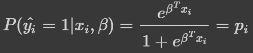

Probability Metric for Class-1

因为只有两个类别，所以图像属于类别 0 的概率度量是:

Probability Metric for Class-0

让我们更好地理解上面的公式:

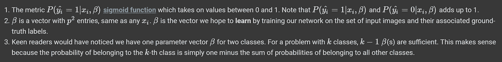

如前所述，如果概率度量为 0.5 或更大，则图像被标记为类别 1。在空间意义上，分类器(在训练之后)将达到β，该β将把属于类 1 的所有图像放在 p=0.5 边界的一侧，而把其余的放在另一侧。因此，p=0.5 定义了一个**决定**的边界。

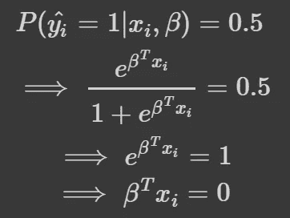

Decision Boundary of the Classifier

方程(β^T)x_i=0，其中 t 是转置算子)是划分两类图像的超平面(在二维空间中，是简单的直线)；在该超平面一侧的图像属于 0 类，而在该超平面另一侧的图像属于 1 类。换句话说，逻辑回归试图在 p*p 维空间中创建**线性**边界。我们将在后面的讨论中再次讨论决策边界。

## 估计β系数(训练阶段)

在训练阶段，我们使用 n 幅图像及其对应的类别标签来训练或估计*好的* β系数。因为我们正在使用概率度量，所以很自然地使用**可能性**目标函数(L(β)):

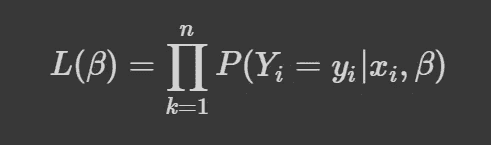

让我们更好地理解上面的公式:

1.  上面的产品中有 n 个术语，每个术语对应于训练集中的一个图像。
2.  对于训练集中的每个图像，我们知道基本事实或类别标签——注意，我们得到了这些信息。如果第 I 个图像属于第 1 类(根据地面实况)，则使用 p 表示上面乘积中的第 I 个条目。这样形成的目标函数是**可能性**目标函数。
3.  直觉上，我们想要估计最大化似然目标函数的β。

可以使用迭代优化算法来实现这种最大化，例如，**加权最小二乘回归**就是这样一种算法。

## 实施细节

我们将继续探索两类问题的 L(β)公式，以进一步熟悉一些漂亮的实现细节。如果你读过其他关于逻辑回归的资料，你可能会遇到交叉熵和逻辑回归。我将尝试解释这如何适应逻辑回归:

在两类问题中，yi(s)取值为 1 或 0，因此我们可以改写上面的等式:

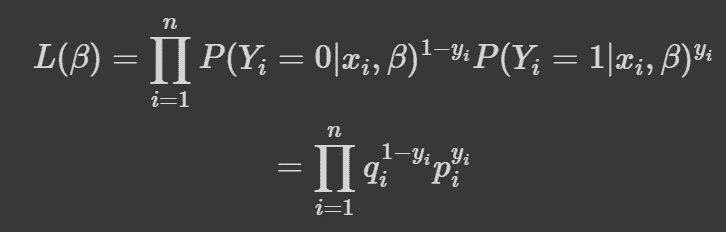

Likelihood Objective Function

重写的巧妙之处在于，如果 y_i=0，则乘积的第 I 项为 q_i，否则为 p_i。为方便起见，我们将使用成本函数的**对数**，通常称为**对数似然**目标函数:

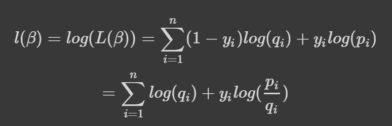

Log-Likelihood Objective Function

让我们更好地理解这个公式:

1.  术语 log(p_i/q_i)通常被称为 p_i 的 **logit** 。
2.  求和中的第 I 项被称为具有 logit 的**交叉熵**，具有 logit 的交叉熵指的是如何基于第 I 项的类别标签挑选适当的 p 或 q。

## 讨论

我们已经表明，逻辑回归创建了线性边界来分隔(在这种情况下)这两个类别。但是，并不是所有的分类问题都表现得如此良好，也就是说，线性边界可能不足以将两个类别分开。

设想一个分类问题，其中 Class-0 是单位圆(或球面)内的每个例子，Class-1 是单位圆(或球面)外的每个例子。自然地，使用线性边界的分类**在这个例子中**不会起作用。当面临这样的分类问题时，变换输入元素 xi 可以帮助将复杂的决策边界变换为那些可以用线性边界分类的决策边界。顺便说一句，不能保证我们能找到实现这一点的转变。

# 多类分类问题

在多类分类问题中，有 K 个可能的类标签，形式化是两类分类问题的扩展。第 I 幅图像属于 K 类的**概率**度量，其中 0≤K<k1，定义为:

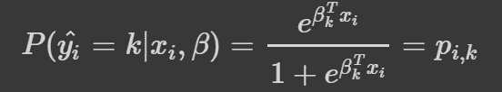

Probability of Class-k

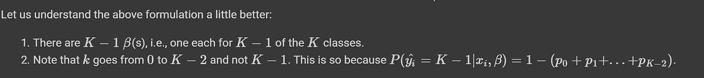

Understand above formulation

跳过两类分类问题中详述的一些步骤，让我们回顾一下 l(β)的公式:

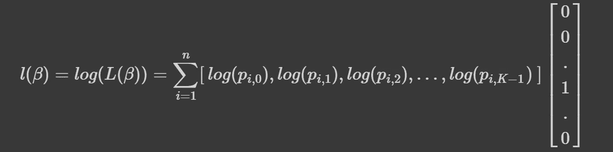

Log-Likelihood Objective Function

1.  求和是针对训练集中的所有图像，在这种情况下，是 n 个这样的图像。
2.  对于第 I 幅图像，即求和中的一项，计算概率向量和**独热**向量之间的点积。
3.  第 I 幅图像的**独热码**向量仅在第 k 个条目处为 1，即第 I 幅图像属于类别 k。
4.  概率向量是基于上述概率公式为每个类别计算的概率向量。
5.  点积只是从概率向量中选取一个元素。同上，这被称为与 logits 的**交叉熵。**

最后，作为训练阶段的一部分，通过优化(即最小化或最大化)目标函数来估计所有β_k。

# 用 TF/Keras 库进行逻辑回归

在这一部分中，我们将实现逻辑回归并应用于时尚 MNIST 数据库。该数据库包含衣服的图像，任务是将这些图像分类为选定数量的标签之一。训练集包含 60000 幅图像，测试集包含 10000 幅图像。总共有 10 个类别标签。每个图像是一个 28×28 的像素值矩阵。

## 单层实现

逻辑回归的单层实现遵循上面的讨论。有一个输入层，其中每个图像被展平为 28×28=784 个元素的向量，并被馈送到 **Softmax** 层。softmax 层的输出是图像属于可能的 10 个类别标签之一的概率。

有人可能想知道为什么我们使用 **Softmax** 而不是上面形式化中使用的 **Sigmoid** 公式。我们将在后面的讨论中再次讨论这个问题。

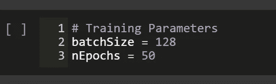

Input Batch Size and Number of Epochs

在下面的代码片段中，我们执行了以下操作:

1.  使用 Keras 库定义时序网络模型
2.  输入图像在输入层中被展平，并被馈送到后续层
3.  层 1 有 10 个单位，它们的激活功能是 **Softmax**
4.  损失函数是稀疏分类交叉熵
5.  Adam 优化器用于在训练阶段最小化上述损失函数

网络框图显示了各层的规模。

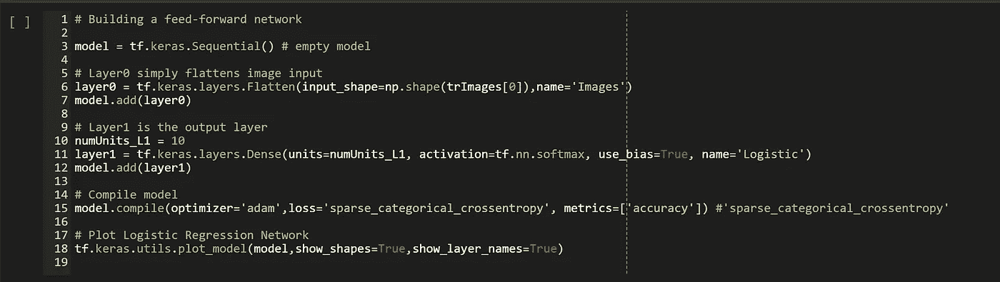

Describe network layers and compile a model

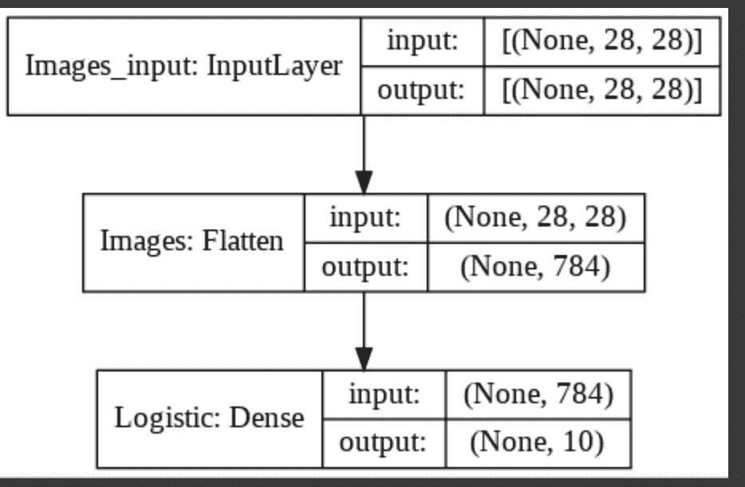

Neural Network Model with a Single Layer

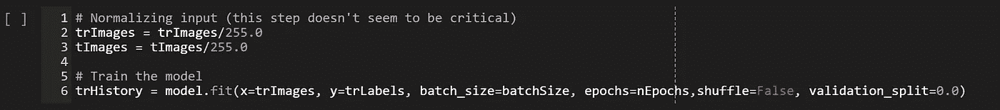

Train parameters of the network

代码片段将有助于在培训阶段绘制损失和准确性度量的进度。

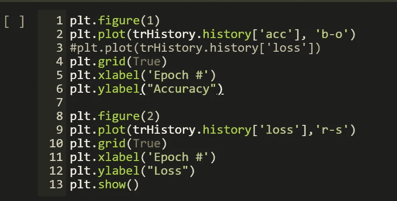

Plot Training Progression

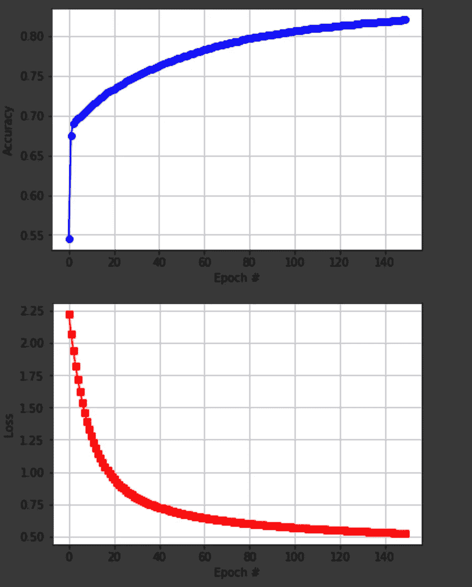

Loss drops as number of training epochs increase

现在将训练好的权重应用于测试图像，并基于网络的输出对它们进行标记。对照地面实况验证标签，并确定分类错误率。

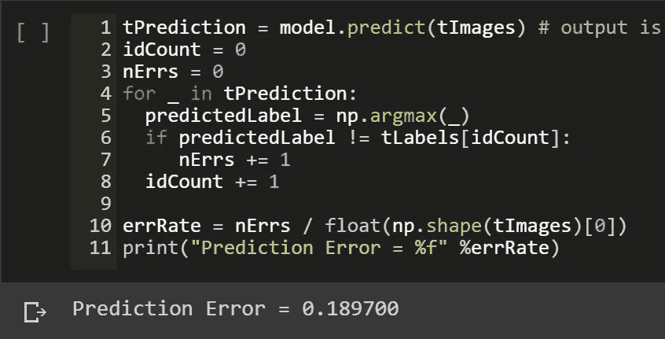

Estimate Prediction Error on Test Images (tImages)

# 多层实现

在逻辑回归的多层实现中，我们通过附加的 ReLu 层处理输入层，然后将它提供给逻辑层。在该实现中，输入图像的像素在生成概率之前被预处理。

在本例中，我们添加了两个附加层:第 1 层有 128 个 ReLu 激活单元，第 2 层也有 32 个 ReLu 激活单元。后勤层(或第 3 层)和以前一样，有 10 个激活了 Softmax 的单位。

这样的实现显示了更好的分类性能。

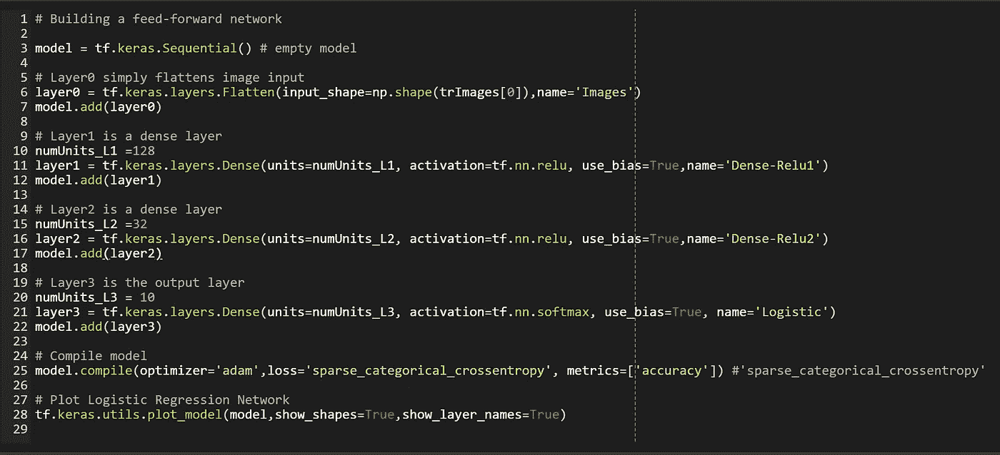

Build a network with 3 Layers

上面代码中构建的网络模型如下所示:

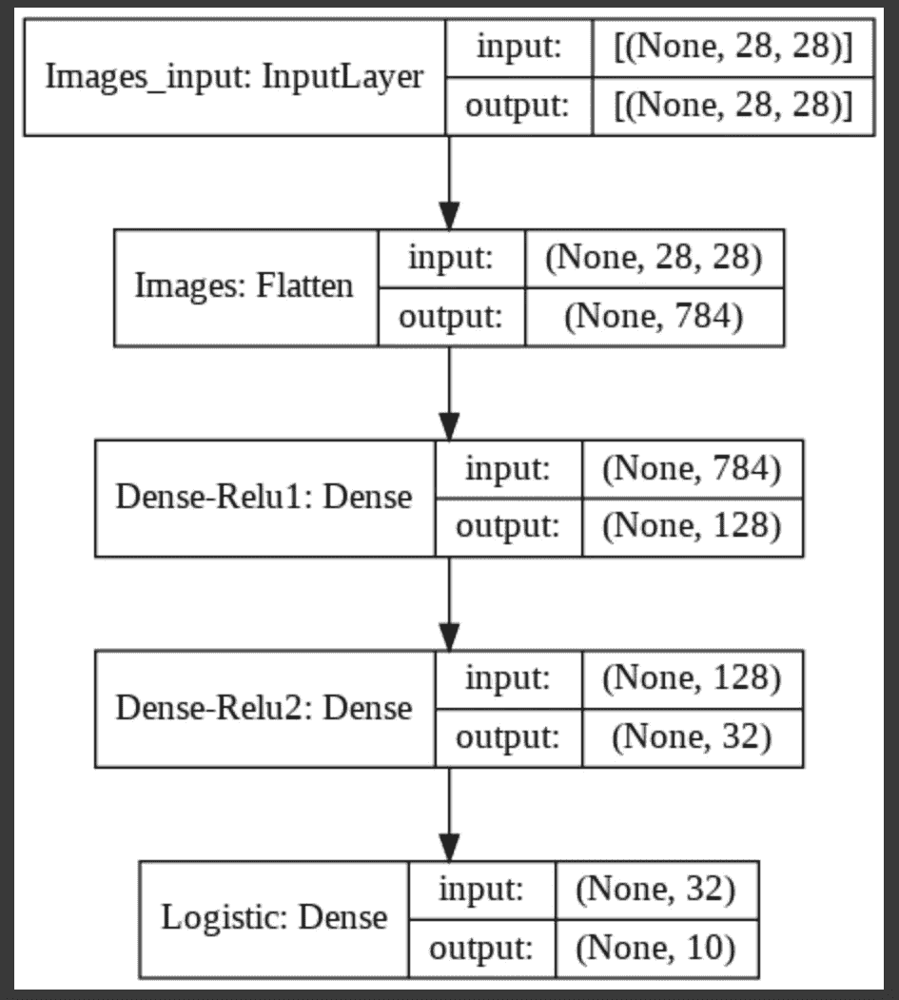

Block Diagram of the Network

训练并绘制多层网络的准确度和损耗指标:

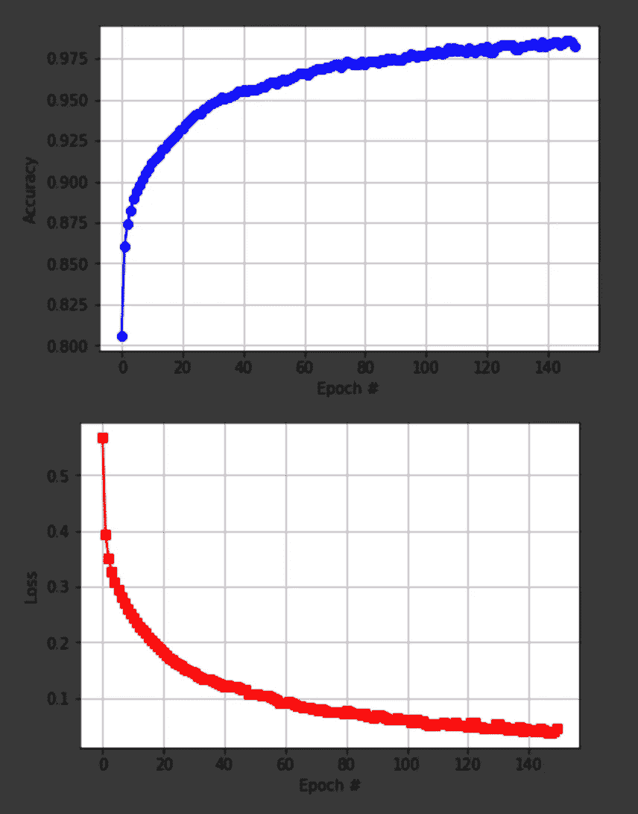

注意，在训练数据的训练结束时，该网络能够达到大约 98%的准确度。这个准确率水平远远高于上面单层网络达到的 82%。

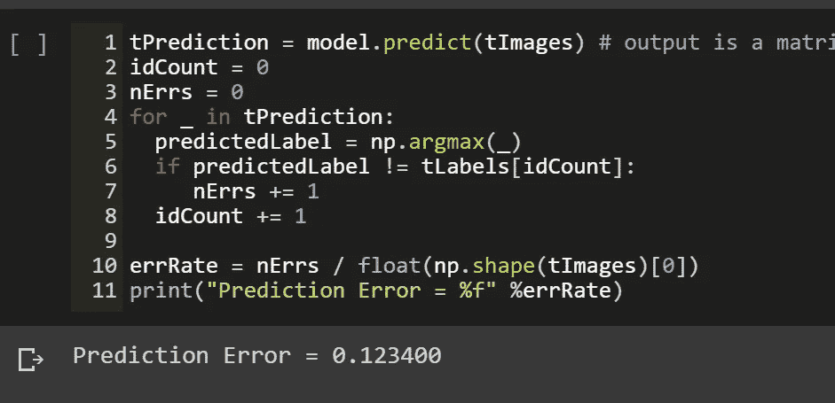

Prediction Accuracy

使用训练的模型来标记测试集中的图像导致 12%的分类错误率。

# 摘要

在单层实现中，我们直接对输入图像的像素应用逻辑回归。利用这个网络，我们实现了大约 19%的分类误差。在多层实现中，在应用逻辑回归之前，我们在输入图像的像素上应用两个 ReLu 层。利用这个网络，我们实现了大约 12%的分类误差。

单层实现使用 784 权重矩阵，而多层实现使用 784×128×32×10 权重矩阵，即总共超过 3200 万个权重。由于权重增加了 40000 倍，分类错误率提高了 6 倍。

您可能对本系列的其他文章感兴趣:

*第七部分:* [*回顾梯度、黑森和牛顿法，并举例在 Tensorflow 中实现*](/part-7-review-of-gradients-hessians-and-newtons-method-with-examples-implemented-in-tensorflow-9a1798a4c33b)

[*第六部分:时尚 MNIST 数据集上基于 NumPy / Tensorflow 的 K 近邻分类*](https://medium.com/datadriveninvestor/k-nearest-neighbor-classification-with-python-numpy-tensorflow-on-fashion-mnist-dataset-d8361187c09c)

[*第五部分:梯度下降和牛顿算法与张量流的介绍*](https://medium.com/@FreeOfConfines/part-5-introduction-to-gradient-descent-and-newtons-algorithms-with-tensorflow-769c61616dad)

[*第四部分:构建神经网络的回顾*](https://medium.com/datadriveninvestor/part-4-review-of-building-a-neural-network-b633faead104)

[*第三部分:理解来自神经网络的结果*](https://medium.com/datadriveninvestor/part-3-understanding-results-from-the-neural-network-21022acf53a5)

[*第二部分:用 Tensorflow 构建神经网络*](https://medium.com/datadriveninvestor/part-2-basic-classification-neural-network-6d68d32fa4b2)

[*第一部分:安装 Python 3.6 和 Tensorflow*](https://medium.com/datadriveninvestor/install-python-3-6-and-tensorflow-92eeff0ad4f5)