# 第 9 部分:回顾卷积神经网络及其在 Tensorflow / Keras 中的实现

> 原文：<https://medium.datadriveninvestor.com/part-9-review-of-convolutional-neural-network-and-its-implementation-with-tensorflow-keras-5e0b06b3806?source=collection_archive---------3----------------------->

# 参考

*   [cs 231n 2016 年冬季，第七讲:卷积神经网络](https://www.youtube.com/watch?v=LxfUGhug-iQ)
*   [加布里埃尔·皮耶罗邦](https://medium.com/u/309b950a9e7?source=post_page-----5e0b06b3806--------------------------------)，[用 Keras](https://towardsdatascience.com/visualizing-intermediate-activation-in-convolutional-neural-networks-with-keras-260b36d60d0) 可视化卷积神经网络中的中间激活
*   MiniQuark，深度/通道上的最大池，[https://stack overflow . com/questions/36817868/tensor flow-how-to-Pool-Over-depth](https://stackoverflow.com/questions/36817868/tensorflow-how-to-pool-over-depth)

# 入门指南

在这篇关于卷积网络的文章中，我们将探讨以下内容:

1.  建立一个分类网络来处理带有卷积层的时尚 MNIST 数据。我们将使用 Tensorflow / Keras 库。
2.  回顾添加卷积层和卷积层参数背后的想法。
3.  比较各种网络架构的分类准确性。
4.  如果您对网络的实现和可视化感兴趣，那么您应该阅读附录中的资料。

 [## 金融中的机器学习|数据驱动的投资者

### 在我们讲述一些机器学习金融应用之前，我们先来了解一下什么是机器学习。机器…

www.datadriveninvestor.com](https://www.datadriveninvestor.com/2019/02/08/machine-learning-in-finance/) 

本文分享的所有代码的链接可以在 Github 中找到:[https://Github . com/FreeOfConfines/ExampleNNWithKerasAndTensorflow/blob/master/convolatile _ network . ipynb](https://github.com/FreeOfConfines/ExampleNNWithKerasAndTensorflow/blob/master/Convolutional_Network.ipynb)

# 具有卷积层的分类网络

我们将建立一个简单的网络来执行分类任务。

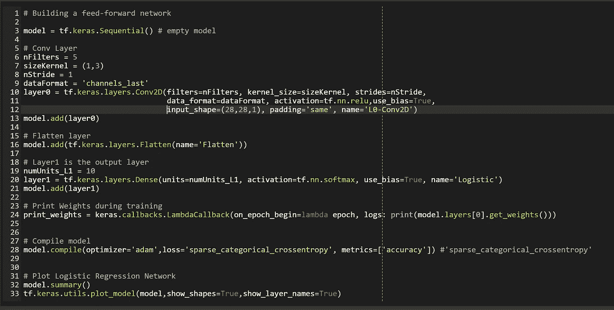

Classification Network with a Convolutional Layer

网络的第一层是卷积层，具有 5 个内核滤波器，每个滤波器的大小为<1,3>，由 3 个参数或数字组成。内核的跨距被设置为 1。注意，内核过滤器的数量、内核的大小和步幅是可调参数，通常称为*超参数*。所以，可以随意使用它们，直到你找到一套适合你的应用的价值观。该层被标记为 *layer0* ，并在上面的代码片段中使用 Keras 的 Conv2D 方法定义。

在上面的代码片段中，卷积层的输出，即 *layer0* ，被展平并馈入 Softmax 或逻辑层。逻辑层预期对卷积层提供的特征进行处理，以将输入图像标记为属于 10 个可能类别之一。更多细节，请参考我在这个话题上的[评论文章](https://medium.com/datadriveninvestor/part-8-review-of-logistic-regression-and-its-implementation-in-tensorflow-keras-1b4a2ea49268)。

使用 **summary()** 和 **plot_model()** ，我们可以可视化模型的结构和复杂性:

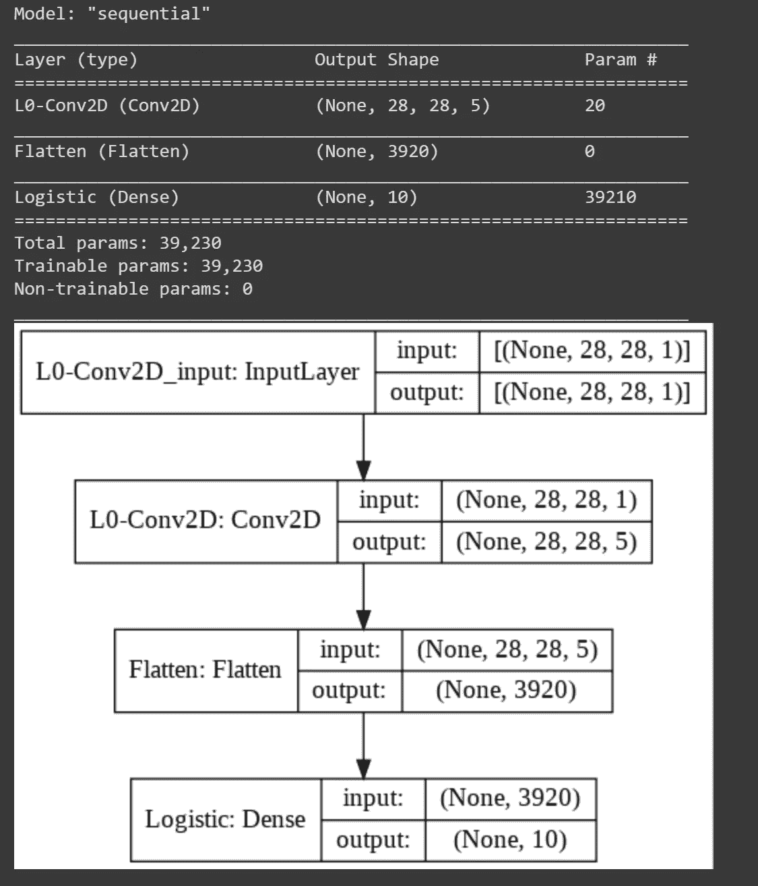

Structure and Complexity of the Classification Network with a Convolutional Layer

## 为什么我们需要卷积层？

在这个例子中，卷积层接收一组图像作为输入。卷积层对这些图像应用核过滤器来训练权重和偏差参数。卷积层从呈现的图像中提取空间特征，即，滤波器作用于图像中的像素集合，提取关于像素邻域的信息。卷积层不是一个分类器，而是一个提取特征并提供给分类层的层，如[逻辑层](https://medium.com/datadriveninvestor/part-8-review-of-logistic-regression-and-its-implementation-in-tensorflow-keras-1b4a2ea49268)。

## 为什么不能用密集层代替卷积层？

密集层是指每个输入单元都输入到每个输出单元中。在我们的[上一篇文章](https://medium.com/datadriveninvestor/part-8-review-of-logistic-regression-and-its-implementation-in-tensorflow-keras-1b4a2ea49268)中，一个 28 x 28 的图像，即 784 像素值，被输入到 10 个输出单元中的每一个，总共产生 7840 个参数。

卷积层将我们示例中的参数数量限制为总共 5*1*3= 15 个参数，这仍然是设计者的选择。尽管每个内核或滤波器都应用于每个输入图像，但我们将可调参数的数量限制为 1*3=3。这种*共享* *权重*的思想降低了网络的内存需求。

因此，可以想象使用密集层，但最终需要训练的参数数量要比使用卷积层多得多。

## 卷积网络的细节

为了简洁起见，我将跳过许多基本和实用的细节。我推荐听安德烈·卡帕西关于卷积网络的讲座。我喜欢这次演讲中清晰的细节。

## 训练分类网络

训练这个网络与我们在以前的文章中看到的没有什么不同。

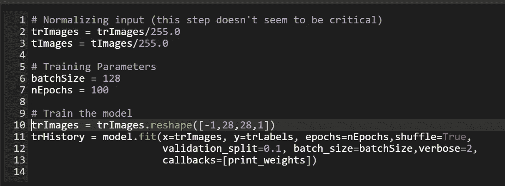

Train Classification Network

训练导致 96%的训练准确度和 89%的验证准确度。请注意，我们分配 10%的图像进行验证，即 10%的图像被搁置，不进行训练，而是使用这些图像来测试每个时期的准确性或损失。

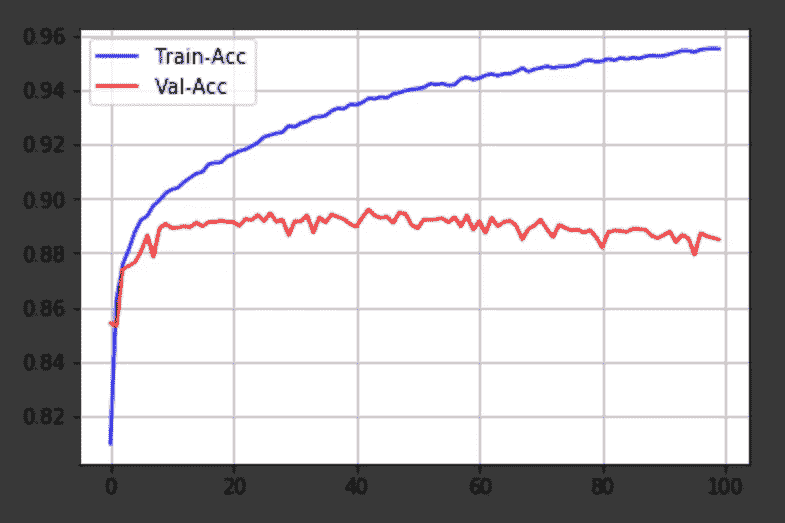

## 网络的分类误差

用训练过的网络上的测试图像(不同于训练图像的集合)进行预测的结果是 88%的准确度。在关于逻辑回归的上一篇文章中，我们用大约 3200 万个参数实现了类似的准确性。当前网络在大约 40K 的参数下实现了类似的精度。

# 探索架构和超参数

我研究了分类问题的多种网络架构，并将结果列表如下。表中的每一行对应一种网络架构:Conv。指卷积层，最大。Pool 指的是最大池层，而 Logistic 指的是 Softmax-with-Logits 层。可训练参数的数量在倒数第二列中捕获，最后一列捕获各种架构的分类精度。

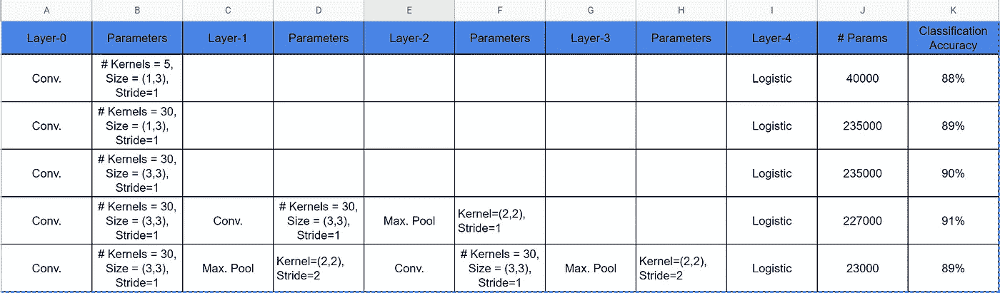

Different Architecture and Number of Hyper-Parameter Choices

两个卷积层后接 Max 的架构。Pool 层和 Logistic 层的分类准确率最高，约为 91%。最后一行表示的体系结构使用两个最大值。池层，它有助于显著减少(数量级)参数的总数，而分类精度损失很小。

# 分析测试错误的实例

让我们回顾几个测试错误的例子，即被网络错误分类的测试图像。在第一个例子中，脚踝书(真实标签)被网络错误地标记为凉鞋。有趣的是，网络 99%确定测试图像应该被标记为凉鞋。

Instance # 1 of Incorrect Classification

在第二种情况下，分类器对标记图像涂层不太确定；注:外套标签的可信度为 54%。

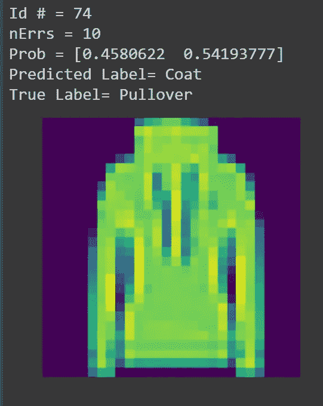

Instance # 2 of Incorrect Classification

第一个例子让我想得出结论，网络没有做好学习踝靴特征的工作。

# 附录

以下是使用 Keras / Tensorflow 了解网络行为的一些有用提示:

## 获取和设置层的权重

在下面的代码中，我们用 *get_weights()* 方法得到 *layer0* 的权重和偏差。在下面的步骤中，我们用 *set_weights()* 方法改变*层 0* 的权重初始化。注意，*weights 10[0]*指的是 *layer0* 的权重(不是偏差)，我们将它们都设置为 2。

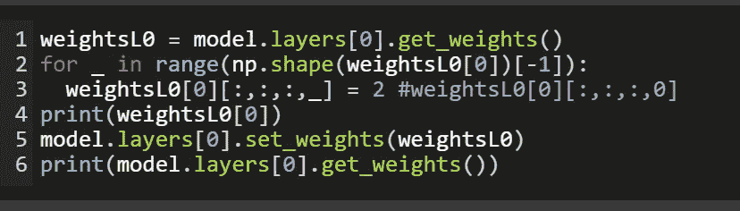

## 通过训练打印层权重

通过训练网络，使用 LambdaCallback 打印或存储权重。要在每次训练后打印重量，请按如下所示设置 LambdaCallback:

Callback is set up to print Bias and a Line Separator

回调设置为在每个时段开始时打印*层 0* 的偏差值，并在时段结束时打印一个行分隔符。输出如下所示:

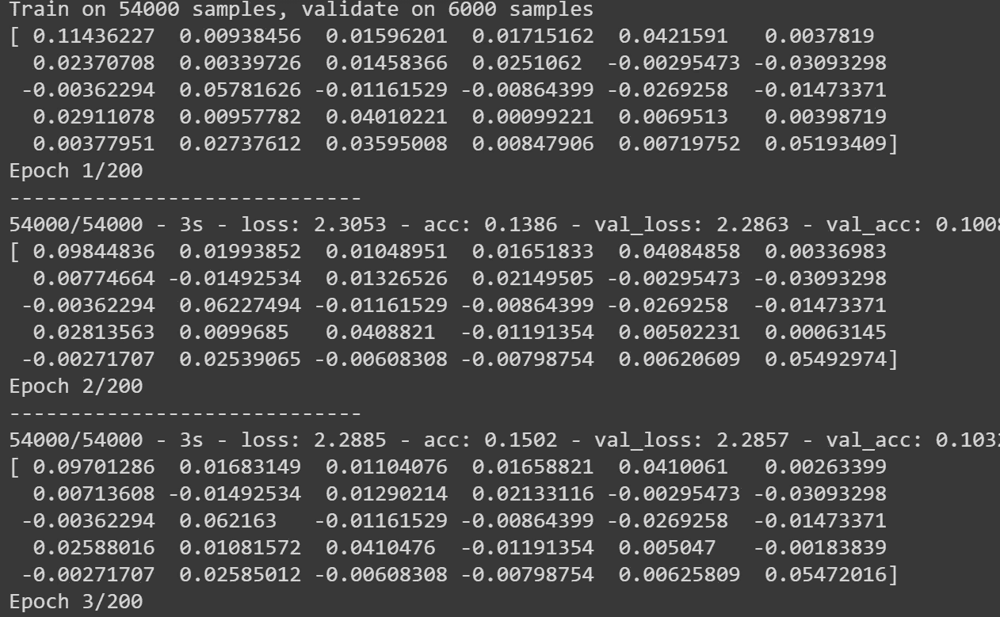

点击阅读更多关于 LambdaCallback [的内容。](https://www.tensorflow.org/api_docs/python/tf/keras/callbacks/LambdaCallback)

## 可视化卷积层的输出

可视化隐藏图层的输出可能有助于理解网络是如何解析和转换输入影像以提取要素的。在某些情况下，我发现某些激活是空的，即一些过滤器没有添加到特征提取中。当我观察到这种行为时，我尝试减少过滤器的数量，在某些情况下，减少隐藏层的数量。

下面显示的可视化脚本基于[加布里埃尔·皮耶罗邦](https://medium.com/u/309b950a9e7?source=post_page-----5e0b06b3806--------------------------------)的一篇文章；参考他的文章可以在上面找到。输入到网络中的给定图像的层输出分两步实现:

*   首先，实例化分类网络，在我们的例子中，将其称为 *instModel* 。
*   其次，通过这个实例化传递一个输入图像，并在一个变量中捕获网络的输出，比如说*激活*。此变量允许您访问网络许多隐藏层的输出。

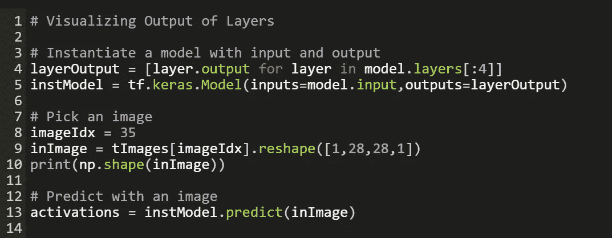

Instantiate a Model to Run Forward Pass of the Network

下面的代码片段有助于将隐藏层的输出可视化为图像。

Visualization Script

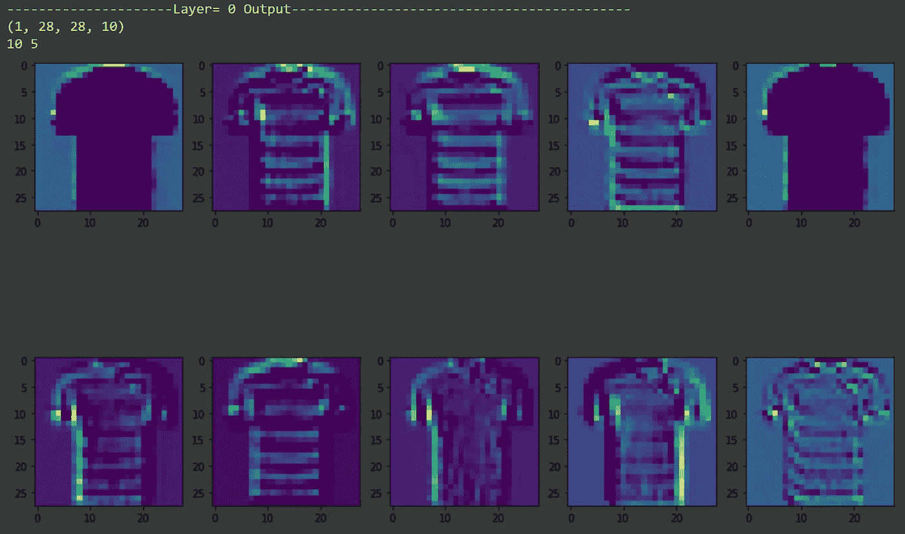

Visualizing Output of Layer-0 (Convolutional Layer)

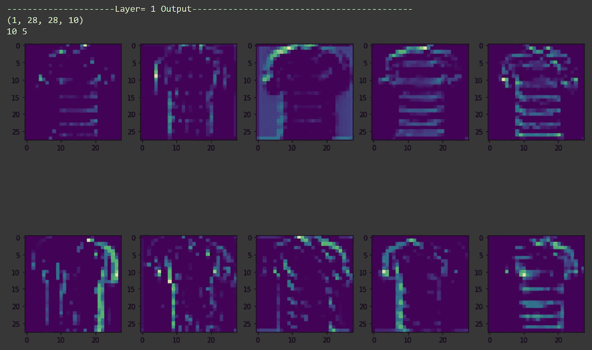

Visualizing Output of Layer-1 (Convolutional Layer)

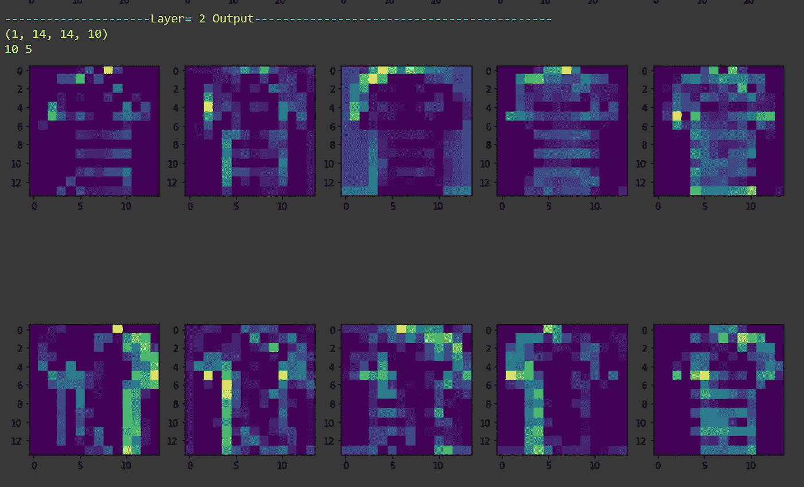

Visualizing Output of Layer-2 (Max. Pool Layer)

第 0 层中的过滤器似乎在跟踪图像中衬衫的边缘；在某些情况下，我们发现过滤器正在跟踪衬衫图像中的条纹。在这种情况下，不清楚第 1 层和第 2 层给分类过程增加了什么值。这可能反映在上表中，其中额外的图层并没有提高分类精度很多，只有大约 2%。

## 如何在网络中添加自定义图层？

当我在做这个练习的时候，我想添加一个最大的池层，它将池应用于激活的深度(图像),而不是激活的长度和高度。Keras 不支持深度池，因此，我在 Keras 中使用了 *Lambda* 来创建一个层，它的激活是自定义的。该实现基于 StackOverflow 中一个名为 **MiniQuark** 的用户的回答；在参考资料部分找到所有与交换有关的链接。

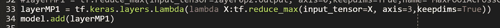

Use Lambda to define a custom layer

使用 *tf.reduce_max()* 函数将自定义层定义为跨通道池。在输出层，我们希望深度=1，图像大小为 28 x 28。

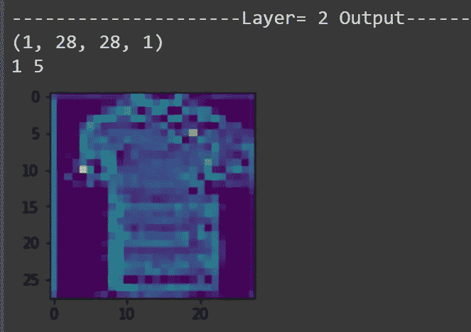

Output of the custom pool layer

您可能对本系列的其他文章感兴趣:

[*第八部分:逻辑回归综述及其在 Tensorflow / Keras 中的实现*](/part-8-review-of-logistic-regression-and-its-implementation-in-tensorflow-keras-1b4a2ea49268)

*第七部分:* [*回顾梯度、黑森和牛顿法，并举例在 Tensorflow 中实现*](/part-7-review-of-gradients-hessians-and-newtons-method-with-examples-implemented-in-tensorflow-9a1798a4c33b)

[*第六部分:时尚 MNIST 数据集上基于 NumPy / Tensorflow 的 K 近邻分类*](https://medium.com/datadriveninvestor/k-nearest-neighbor-classification-with-python-numpy-tensorflow-on-fashion-mnist-dataset-d8361187c09c)

[*第五部分:梯度下降和牛顿算法与张量流的介绍*](https://medium.com/@FreeOfConfines/part-5-introduction-to-gradient-descent-and-newtons-algorithms-with-tensorflow-769c61616dad)

[*第四部分:构建神经网络的回顾*](https://medium.com/datadriveninvestor/part-4-review-of-building-a-neural-network-b633faead104)

[*第三部分:理解来自神经网络的结果*](https://medium.com/datadriveninvestor/part-3-understanding-results-from-the-neural-network-21022acf53a5)

[*第二部分:用 Tensorflow 构建神经网络*](https://medium.com/datadriveninvestor/part-2-basic-classification-neural-network-6d68d32fa4b2)

[*第一部分:安装 Python 3.6 和 Tensorflow*](https://medium.com/datadriveninvestor/install-python-3-6-and-tensorflow-92eeff0ad4f5)