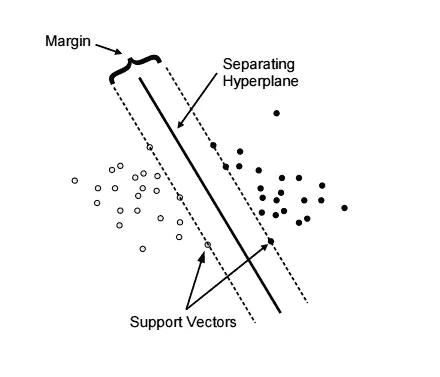
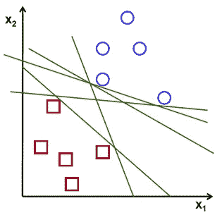

# 第一部分——支持向量机:概述

> 原文：<https://medium.datadriveninvestor.com/part-i-a-high-level-overview-of-support-vector-machines-9d5c8122100a?source=collection_archive---------0----------------------->

这篇文章是关于支持向量机(SVM)系列文章的第一部分，它将使你对支持向量机及其工作原理有一个总体的了解。

# 什么是支持向量机？

SVM 是一种机器学习技术，可用于回归和分类问题。它在多维空间中构建了一个**超平面**，以尽可能最好的方式将数据集分成不同的类。以下是在学习支持向量机时经常会遇到的一些术语:

 [## DDI 编辑推荐:5 本机器学习书籍，让你从新手变成数据驱动专家…

### 机器学习行业的蓬勃发展重新引起了人们对人工智能的兴趣

www.datadriveninvestor.com](https://www.datadriveninvestor.com/2019/03/03/editors-pick-5-machine-learning-books/) 

*   **超平面** —对一组数据进行分离和分类的决策平面
*   **支持向量** —最接近超平面的数据点
*   **Margin** —超平面和任一集合中最近的数据点之间的距离

Figure 1

# 它们是如何工作的？

我们举个例子。假设您有两种类型的数据。为了将这些数据分成两类，可以使用许多不同的超平面(图 2)。SVM 的任务是找到将数据集分成两个类的最佳平面，也就是边数最大的超平面。

Figure 2

SVM 识别最佳超平面的方式如下，

*   计算平面和支持向量之间的距离(边距)
*   最佳超平面是与两边最近的数据点距离最大的平面

# **内核绝招是什么？**

有时给出的数据可能不是线性可分的。这样的问题不能用线性超平面来解决。在这种情况下，SVM 使用**内核**将输入空间转换到更高维度的空间。

Figure 3

**内核**是将低维平面放置到高维空间的函数。这允许将数据投影到一个更高维度的空间，在那里可以使用一个平面将数据分开(图 3)。简单地说，它通过增加更多的维度将线性不可分的数据转换成可分的数据。

SVM 使用 3 种主要类型的内核，

*   **线性核** —两个给定观察值之间的点积
*   **多项式内核** —允许输入空间中的曲线
*   **径向基函数(RBF)内核**——可在特征空间内创建复杂区域

如果你想知道更多关于内核类型和它们背后的数学知识，我在参考资料部分提供了一些精彩的文章。这就把我们带到了这篇文章的结尾。希望这有助于您对支持向量机及其工作原理有一个高层次的理解。这个系列的第二部分可以在[这里](https://medium.com/datadriveninvestor/part-ii-support-vector-machines-regression-b4d4559ba2c)找到。

下次见，再见…

更多与机器学习相关的文章:

*   [机器学习入门实用指南](https://medium.com/datadriveninvestor/a-practical-guide-to-getting-started-with-machine-learning-3a6fcc0f95aa)
*   [随机森林回归初学者指南](https://medium.com/datadriveninvestor/random-forest-regression-9871bc9a25eb)

**参考文献**

 [## 用于机器学习的支持向量机

### 支持向量机可能是最受欢迎和谈论最多的机器学习算法之一。他们是…

machinelearningmastery.com](https://machinelearningmastery.com/support-vector-machines-for-machine-learning/)  [## 什么是支持向量机？-包装中心

### 支持向量机是帮助解决棘手分类问题的机器学习算法。他们训练一个…

hub.packtpub.com](https://hub.packtpub.com/what-is-a-support-vector-machine/)  [## 核

### 在过去的几周里，我介绍了两种分类方法——支持向量机(SVM)和逻辑…

shapeofdata.wordpress.com](https://shapeofdata.wordpress.com/2013/05/27/kernels/)