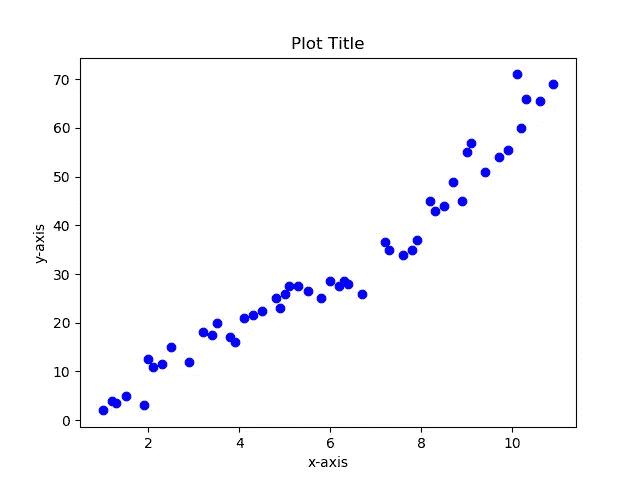
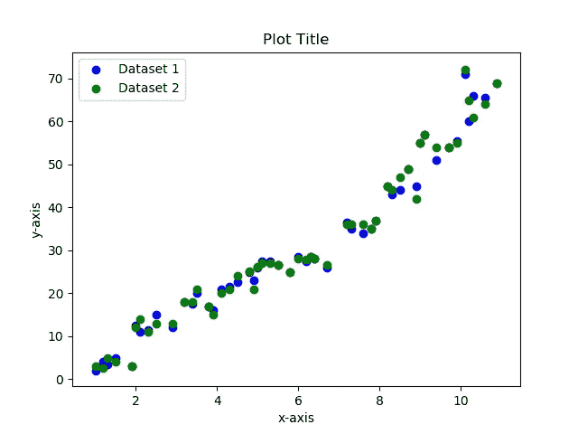
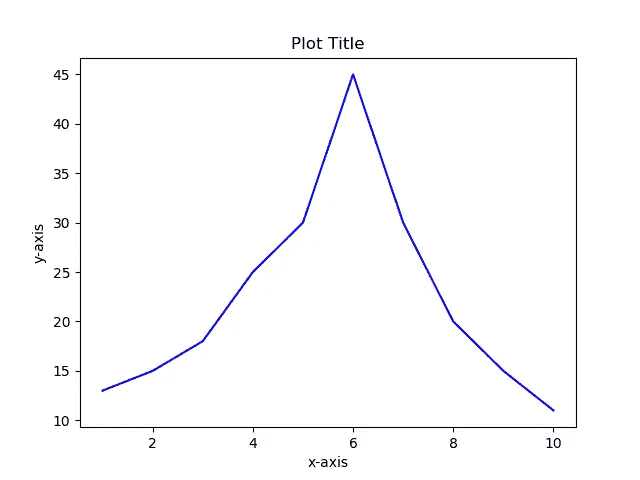
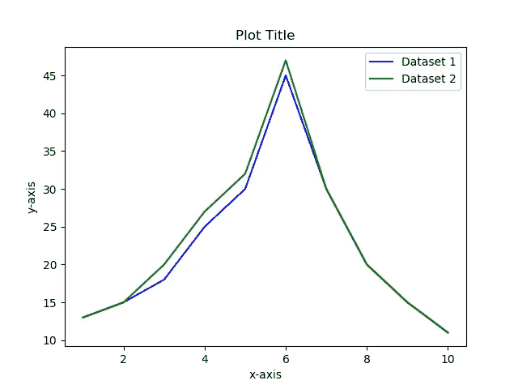
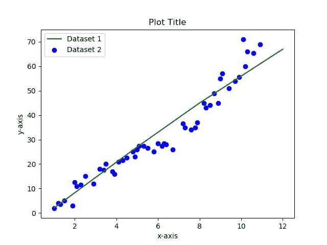
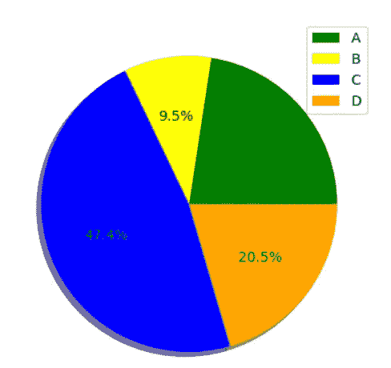
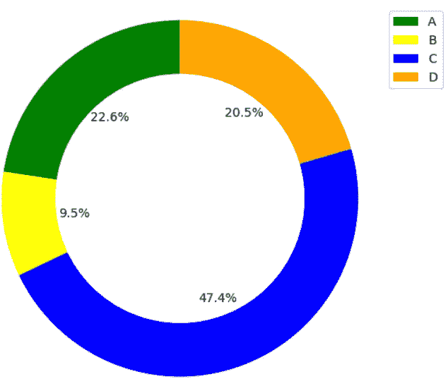

# 使用 Python 实现数据可视化

> 原文：<https://medium.datadriveninvestor.com/part-i-data-visualization-using-python-7b08799f820c?source=collection_archive---------3----------------------->

[](http://www.track.datadriveninvestor.com/1B9E)

数据可视化是指给定的数据集以图形格式呈现。它有助于发现基于文本的数据中可能无法发现的模式、趋势和相关性。这是数据可视化教程系列的第一部分，我们将向您展示如何开始使用 python 图形。

*让我们开始吧！*

首先你需要在 python 中导入`matplotlib`库的`pyplot`(文档可以在这里[找到](https://matplotlib.org/api/_as_gen/matplotlib.pyplot.html))。

```
**import** matplotlib.pyplot **as** plt
```

`matplotlib`库是一个 Python 2D 绘图库，允许你生成图表、散点图、直方图、条形图等。只需要几行代码。`matplotlib.pyplot`是一个命令风格函数的集合，它使得`matplotlib`的功能类似于 MATLAB。在本文中，我们将关注散点图和折线图。

在深入研究代码之前，让我们先看看绘图时将使用的一些基本属性。

*   xlabel:设置 x 轴的标签
*   ylabel:设置 y 轴的标签
*   标题:设置轴的标题
*   图例:在轴上放置图例

# **散点图**

散点图单独显示每个数据点。当您想要显示两个变量之间的关系时，可以使用它们。

```
plt.scatter(X, y, color=**'blue'**)
plt.xlabel(**'x-axis'**)
plt.ylabel(**'y-axis'**)
plt.title(**'Plot Title'**)
plt.show()
```

`plt.scatter`允许生成散点图。`X`代表用于图表 x 轴的数据，而`y`代表用于 y 轴的数据。这些图可以定制，以改变颜色，形状，大小，不透明度等。数据点的大小，绘图的大小等等。这将在本系列教程的下一篇教程中讨论。



Scatter plot using one data set

也可以使用单个散点图呈现多个数据集。这可以通过简单地添加另一个`plt.scatter`语句来完成。

```
plt.scatter(X, y, color=**'blue'**, label=**"Dataset 1"**)
plt.scatter(X, y_pred, color=**'green'**, label=**"Dataset 2"**)
plt.xlabel(**'x-axis'**)
plt.ylabel(**'y-axis'**)
plt.title(**'Plot Title'**)
plt.legend()
plt.show()
```



Scatter plot using multiple data sets

# **线图**

折线图使用一条连接所有数据点的直线来显示数据。它们通常用于可视化时间序列数据，以检测一段时间内的数据趋势。

```
plt.plot(X, y, color=**'blue'**)
plt.xlabel(**'x-axis'**)
plt.ylabel(**'y-axis'**)
plt.title(**'Plot Title'**)
plt.show()
```



`plt.plot`用于生成线图，根据需要添加`plt.plot`语句，可以在同一个图中呈现多个数据集。

```
plt.plot(X, y, color=**'blue'**, label=**"Dataset 1"**)
plt.plot(X, y_pred, color=**'green'**, label=**"Dataset 2"**)
plt.xlabel(**'x-axis'**)
plt.ylabel(**'y-axis'**)
plt.title(**'Plot Title'**)
plt.legend()
plt.show()
```



我们还可以创建结合不同类型的图的图表。下面显示的代码生成一个图形，其中一个数据集显示为散点图，另一个显示为折线图。

```
plt.plot(X, y, color=**'green'**, label=**"Dataset 1"**)
plt.scatter(X, y_pred, color=**'blue'**, label=**"Dataset 2"**)
plt.xlabel(**'x-axis'**)
plt.ylabel(**'y-axis'**)
plt.title(**'Plot Title'**)
plt.legend()
plt.show()
```



Graph combining scatter plot and line graph

# 圆形分格统计图表

饼图用于显示百分比或比例数据。当试图比较整体的各个部分时，会用到它。

```
sizes = [22.6, 9.5, 47.4, 20.5]
labels = [**'A'**, **'B'**, **'C'**, **'D'**]
colors = [**'green'**, **'yellow'**, **'blue'**, **'orange'**]
plt.pie(sizes, colors=colors,autopct=**'%1.1f%%'**, shadow=True)
plt.legend(labels,loc=**'best'**)
plt.show()
```

在上面的代码中，`sizes`和`labels` 是饼状图中表示的数据及其对应的标签。`colors`指定饼图各部分的颜色。例如， ***段 A*** 为*22.6%，呈现在 ***绿色*** 中。*

**

# *圆环图*

*这个图表和饼状图的作用是一样的。但是，圆环图可以包含多个数据系列，而饼图只能包含一个数据系列。*

```
*labels = [**'A'**, **'B'**, **'C'**, **'D'**]
sizes = [22.6, 9.5, 47.4, 20.5]
colors = [**'green'**, **'yellow'**, **'blue'**, **'orange'**]
fig1, ax1 = plt.subplots()
ax1.pie(sizes, colors= colors, autopct=**'%1.1f%%'**, startangle=90)
centre_circle = plt.Circle((0,0),0.70,fc=**'white'**)
fig = plt.gcf()
fig.gca().add_artist(centre_circle)
ax1.axis(**'equal'**)
plt.legend(labels)
plt.tight_layout()
plt.show()*
```

*我们可以通过在圆形图的原点添加一个圆来将圆形图更改为环形图，如*第 6 行*所示。*

**

*这就把我们带到了本文的结尾。希望这篇文章能帮助您对如何开始使用 python 进行数据可视化有一个基本的了解。*

**直到下次……..再见！**