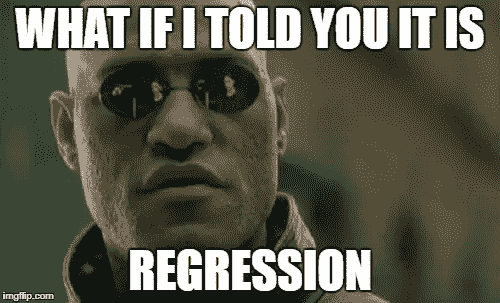
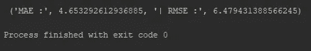
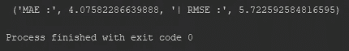
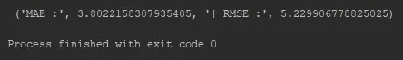
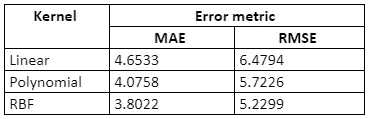

# 第二部分——支持向量机:回归

> 原文：<https://medium.datadriveninvestor.com/part-ii-support-vector-machines-regression-b4d4559ba2c?source=collection_archive---------0----------------------->

[](http://www.track.datadriveninvestor.com/1B9E)

这篇文章是支持向量机(SVM)系列文章的第二部分，它将让你对支持向量机及其工作原理有一个总体的了解(这个系列的第一部分可以在这里找到)。这将为你提供如何使用支持向量机解决回归问题的实际例子。回归问题涉及从输入变量到连续输出变量的映射函数的近似任务。使用支持向量机解决回归问题的方法称为支持向量回归(SVR)。

[](https://www.datadriveninvestor.com/2019/03/03/editors-pick-5-machine-learning-books/) [## DDI 编辑推荐:5 本机器学习书籍，让你从新手变成数据驱动专家…

### 机器学习行业的蓬勃发展重新引起了人们对人工智能的兴趣

www.datadriveninvestor.com](https://www.datadriveninvestor.com/2019/03/03/editors-pick-5-machine-learning-books/) 

现在，让我们尝试用这种方法解决一个回归问题。对于这个例子，我们将使用[波士顿房价数据集](https://raw.githubusercontent.com/jbrownlee/Datasets/master/housing.data)，它有 506 条记录、13 个特征和一个输出(关于这个数据集的更多信息可以在[这里](https://machinelearningmastery.com/standard-machine-learning-datasets/)找到)。

1.  **进口**

首先，我们需要导入一些库。

```
import math
import pandas
from sklearn.preprocessing import MinMaxScaler
from sklearn.svm import SVR
from sklearn.model_selection import GridSearchCV, cross_validate
from sklearn.utils import shuffle
```

让我们看看我们进口了什么，

*   数学——让我们轻松地执行数学函数
*   熊猫——允许我们更容易地操作数据结构
*   sk learn——python 的机器学习库

**2。加载数据**

现在，让我们加载数据集，并指定特性和因变量。

```
dataset = pandas.read_csv('Dataset.csv')
X = dataset.iloc[:, [0, 12]]
y = dataset.iloc[:, 13]
```

**3。预处理数据**

在预处理我们的数据时，我们使用**最小最大缩放**，以便标准化数据集。

```
scaler = MinMaxScaler(feature_range=(0, 1))
X = scaler.fit_transform(X)
```

在将数据输入模型之前，会对数据进行洗牌。有关这些技术的更多信息，请参考[这篇](https://medium.com/datadriveninvestor/a-practical-guide-to-getting-started-with-machine-learning-3a6fcc0f95aa)文章。

**4。实施模式**

我们将向您展示如何使用 SVR 模型的所有 3 个内核。关于内核的更多信息包含在本系列的第一部分中。

***线性内核***

```
def svr_model(X, y):
    gsc = GridSearchCV(
        estimator=SVR(kernel='linear'),
        param_grid={
            'C': [0.1, 1, 100, 1000],
            'epsilon': [0.0001, 0.0005, 0.001, 0.005, 0.01, 0.05, 0.1, 0.5, 1, 5, 10],
        },
        cv=5, scoring='neg_mean_squared_error', verbose=0, n_jobs=-1)

    grid_result = gsc.fit(X, y)
    best_params = grid_result.best_params_best_svr = SVR(kernel='linear', C=best_params["C"], epsilon=best_params["epsilon"], coef0=0.1, shrinking=True,
                   tol=0.001, cache_size=200, verbose=False, max_iter=-1)

    scoring = {
               'abs_error': 'neg_mean_absolute_error',
               'squared_error': 'neg_mean_squared_error'}

    scores = cross_validate(best_svr, X, y, cv=10, scoring=scoring, return_train_score=True)return "MAE :", abs(scores['test_abs_error'].mean()), "| RMSE :", math.sqrt(abs(scores['test_squared_error'].mean())) # Run 
print(svr_model(X,y))
```

这是我们使用线性核的 SVR 模型的误差度量结果。



***多项式内核***

```
def svr_model(X, y):
    gsc = GridSearchCV(
        estimator=SVR(kernel='poly'),
        param_grid={
            'C': [0.1, 1, 100, 1000],
            'epsilon': [0.0001, 0.0005, 0.001, 0.005, 0.01, 0.05, 0.1, 0.5, 1, 5, 10], 'degree': [2, 3, 4],            
            'coef0': [0.1, 0.01, 0.001, 0.0001]},
        cv=5, scoring='neg_mean_squared_error', verbose=0, n_jobs=-1)

    grid_result = gsc.fit(X, y)
    best_params = grid_result.best_params_best_svr = SVR(kernel='poly', C=best_params["C"], epsilon=best_params["epsilon"], coef0=best_params["coef0"],                   degree=best_params["degree"], shrinking=True,
                   tol=0.001, cache_size=200, verbose=False, max_iter=-1)

    scoring = {
               'abs_error': 'neg_mean_absolute_error',
               'squared_error': 'neg_mean_squared_error'}

    scores = cross_validate(best_svr, X, y, cv=10, scoring=scoring, return_train_score=True)return "MAE :", abs(scores['test_abs_error'].mean()), "| RMSE :", math.sqrt(abs(scores['test_squared_error'].mean())) # Run 
print(svr_model(X,y))
```

这是我们得到的使用多项式核的 SVR 模型的误差度量结果。



***RBF 内核***

```
def svr_model(X, y):
    gsc = GridSearchCV(
        estimator=SVR(kernel='rbf'),
        param_grid={
            'C': [0.1, 1, 100, 1000],
            'epsilon': [0.0001, 0.0005, 0.001, 0.005, 0.01, 0.05, 0.1, 0.5, 1, 5, 10],
            'gamma': [0.0001, 0.001, 0.005, 0.1, 1, 3, 5]
        },
        cv=5, scoring='neg_mean_squared_error', verbose=0, n_jobs=-1)

    grid_result = gsc.fit(X, y)
    best_params = grid_result.best_params_best_svr = SVR(kernel='rbf', C=best_params["C"], epsilon=best_params["epsilon"], gamma=best_params["gamma"],
                   coef0=0.1, shrinking=True,
                   tol=0.001, cache_size=200, verbose=False, max_iter=-1)

    scoring = {
               'abs_error': 'neg_mean_absolute_error',
               'squared_error': 'neg_mean_squared_error'}

    scores = cross_validate(best_svr, X, y, cv=10, scoring=scoring, return_train_score=True)return "MAE :", abs(scores['test_abs_error'].mean()), "| RMSE :", math.sqrt(abs(scores['test_squared_error'].mean())) # Run 
print(svr_model(X,y))
```

下面是我们使用 RBF 核的 SVR 模型的误差度量结果。



下表包含使用 SVR 模型获得的三个内核的所有误差度量结果的总结。



Table 1 Error metric results for SVR kernels

基于这些结果，我们可以说 SVR-RBF 模型对于给定的数据集表现最好，而 SVR-线性模型表现最差。通过观察这些模型的性能，我们可以说所使用的数据集遵循非线性模式，因为它在非线性核的情况下表现最佳。

这就把我们带到了这篇文章的结尾。希望这篇文章让您很好地理解了如何使用支持向量机来解决回归问题。下次见，再见…

更多与机器学习相关的文章:

*   [第一部分——支持向量机:概述](https://medium.com/datadriveninvestor/part-i-a-high-level-overview-of-support-vector-machines-9d5c8122100a)
*   [机器学习入门实用指南](https://medium.com/datadriveninvestor/a-practical-guide-to-getting-started-with-machine-learning-3a6fcc0f95aa)
*   [随机森林回归初学者指南](https://medium.com/datadriveninvestor/random-forest-regression-9871bc9a25eb)

**参考文献**

[](https://machinelearningmastery.com/classification-versus-regression-in-machine-learning/) [## 机器学习中分类和回归的区别

### 分类问题和回归问题有一个重要的区别。从根本上说，分类是关于…

machinelearningmastery.com](https://machinelearningmastery.com/classification-versus-regression-in-machine-learning/)  [## 支持向量回归

### 编辑描述

www.saedsayad.com](https://www.saedsayad.com/support_vector_machine_reg.htm)