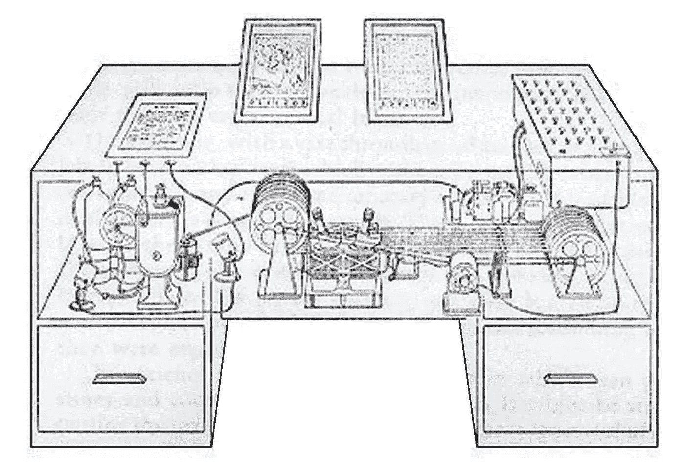

# 第二部分:世界建筑实验

> 原文：<https://medium.datadriveninvestor.com/part-ii-the-world-building-experiment-7a1175463af9?source=collection_archive---------9----------------------->

为了认识世界，你必须建构它—铺路

在本系列的[第一部分](https://augmentedintelligencesummit.com/experiments-in-intelligence-augmentation/)中，我们提出了以下问题:

> 1.“有没有可能开发一个积极的人工智能未来的集体、具体、现实的愿景，可以为政策、行业发展和学术研究提供信息？”
> 
> 2.“能做到包容吗？”

这篇文章将描述 [***增强智能峰会***](http://augmentedintelligencesummit.com/) ，这是一个*思想和行动*实验，旨在回答这些问题，与[生命未来研究所](https://futureoflife.org/)合作组织。

我们将用来进行这个实验的主要工具被称为“世界建筑”，这是一种源于讲故事和叙事媒体的创造性方法。一些最著名的世界建造者有着像华特·迪士尼、J.R.R .托尔金和 J.K .罗琳这样的名字:他们和许多其他科幻小说和幻想作家和艺术家都创造了巨大而详细的虚构世界，这些世界感觉像是真实的、可居住的地方，有着内在连贯的规则、错综复杂的文化、特殊的物理定律和令人难忘的基础设施。然而，正如科学的发现往往比小说更令人惊奇一样，当被带到虚构媒体的领域之外，并被用于预测、模拟、理解甚至操纵我们自己的非常真实的世界的未来时，世界建设本身可能会更加令人着迷。

 [## 世界建筑概论

### 主制作设计师亚历克斯·麦克道尔探索如何从虚构的世界建设中学到的经验教训可以应用到…

futureofstorytelling.org](https://futureofstorytelling.org/video/alex-mcdowell-world-building) 

在过去十年中，世界建筑作为一种设计实践已经开始进入公共政策、学术界和财富 500 强公司的领域，在那里它被多学科团队成功地用于开发共同的愿景，并加速现实世界的结果。通过这些早期的尝试，它被认为是一个有价值的合作设计过程，在医学研究、公共政策、产品和品牌战略[【1】](#_ftn1)和社区发展等不同领域加强了长期思考和集体想象的能力。[【2】](#_ftn2)在这些类型的环境中，世界构建过程可以描述如下:

1.  一个世界构建者团队就要开发的世界的大小、范围和目的达成一致。例如，一个世界可以包含在一个细胞或城市街区中，或者跨越几个大陆或星系。
2.  该小组收集并共享基于科学、研究和多学科领域专业知识的相关知识基础。不同种类的知识可能是相关的，这取决于世界的哪些特征将被聚焦:技术和科学、社会和经济体系、政治和历史等等。
3.  在共享知识的基础上，该小组预测了一套适合世界规模和范围的相互关联的社会、自然和基础设施系统将如何演变。世界建造者想象这些系统在未来某个特定时刻的状态，以使他们的世界尽可能具体。小型分组会议是一种常见的做法，使参与者能够通过各种“镜头”来观察和进一步发展世界。
4.  在不同的成熟度水平上，世界构建者以其丰富性和复杂性捕捉他们世界的状态，以各种媒体形式描述关于它的所有知识，如书面文档、概念框架、图表、音频和视频数据，甚至可能是软件表示。
5.  由此产生的世界以人工制品系统的形式存在，可以用作场景模拟和叙事发展的平台。在这种状态下，它让人们直观地了解居住在这个世界上是什么感觉，它可以作为一种强有力的工具来改善长期的决策和协调。

对于深入的项目，这一过程可以在几天或几年内完成，通过这一过程，world building 利用科学研究和一群知识渊博的参与者的领域专业知识来促进未来模拟模型的开发，这是一个可信的未来世界，其中包括一系列主要相互关联的系统的详细描述:经济、教育、工作、基础设施和政治结构。它有能力获取关于未来的抽象想法，并利用想象力、创造力、讨论和辩论来捕捉它们，使它们成为现实、具体、直观和可居住的。它可以用来克服集体想象力的障碍，制定新的概念、计划和产品，并开发新的政策解决方案。汽车公司、学术研究实验室、市政当局、经济开发商、主要品牌和基金会都参与了世界建筑过程。

在[增强智能峰会](https://augmentedintelligencesummit.com/)上，这一工具将首次在人工智能安全和研究社区的参与下使用，以非常详细的方式想象未来全面的人工智能服务[【3】](#_ftn3)会是什么样子。

这将有双重目的:I)将注意力转向成功的*转向*所需的长期思考，以及 ii)为具体的、集体的*积极*愿景的出现提供必要的实际框架和过程。这将帮助我们回答关于人工智能的最基本的问题:它将走向何方，我们希望它走向何方，它对社会意味着什么？如果没有一个能产生广泛参与和一致的共同愿景和对话，我们肯定无法实现这一目标。

— -

世界建筑利用了我们的创造性、联想性、系统 1[【4】](#_ftn4)能力，但它的效用在很大程度上取决于(系统 2)输入的质量，这些输入为世界建筑者提供了知识基础。换句话说，科学和理性的纪律在这个过程中提供了更大的创作自由。

鉴于这些问题的性质，我们希望考察人工智能的未来(例如，“如果先进的人工智能为所有人创造了足够的财富，我们将如何重新分配财富？”)我们需要确保我们在合作构建的世界中对人工智能技术的约束是现实的。而且，正如我和 Ariel Conn 在最近的一次关于生存希望的 FLI 播客中所讨论的，技术远不是我们在建设未来世界时需要考虑的唯一维度。特别是，社会科学、经济学、伦理学和哲学发挥着重要作用。在本系列的下一期文章中，我们将探讨如何将这些领域的见解和工具融入实验中。

*敬请关注本系列的第三部分，在那里我们将继续探索构建积极的人工智能未来的世界，并发现基于智能体的空间和经济模型及模拟如何增加价值。*

***关于增强智能峰会:***

为了加深我们对先进人工智能未来的理解，并加快开发所需解决方案的前进道路，增强智能峰会 将于 2019 年 3 月 28 日至 31 日在加利福尼亚州斯科茨谷举行。

一部分是沉浸式教育计划，一部分是协作式设计流程，增强智能峰会旨在为深度驱动的人工智能专家、政策领导者、创造者、企业家和变革者提供一个平台，这些人致力于开放对话、协作创作、开发人工智能积极未来的愿景，以及加速有意义地实现人工智能技术的安全和道德使用的解决方案。通过产生一系列相互关联的系统和想法——我们的参与者在活动期间构建的未来“世界”——人工智能将产生一个有价值的研究平台和集体指导机制，可以为未来人工智能的发展、部署和治理工作提供方向。

要了解更多有关参与 AIS 的信息，请访问[https://augmentedintelligencesummit.com/](https://augmentedintelligencesummit.com/)

— —

[【1】](#_ftnref1)拉姆齐，莎拉。世界建筑作为品牌战略，[https://www . craft your content . com/world-branding-Brand-Strategy/](https://www.craftyourcontent.com/world-branding-brand-strategy/)。2018 年 3 月 5 日。

[【2】](#_ftnref2)谢迪格，朱莉。在未来的拐角处，[https://www . kauf fman . org/currents/2018/07/at-the-Corner of-the-Future](https://www.kauffman.org/currents/2018/07/at-the-corner-of-the-future)。考夫曼基金会，2018 年 7 月 26 日。

[【3】](#_ftnref3)德雷克斯勒，埃里克。将超级智能综合人工智能服务重新定义为通用智能。FHI 技术报告，# 2019–1。

[【4】](#_ftnref4)卡尼曼，丹尼尔。思考，忽快忽慢。纽约:法勒、斯特劳斯和吉鲁，2011 年。