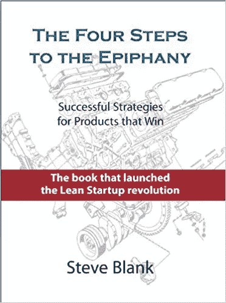

# “推卸责任——一种现代瘟疫”

> 原文：<https://medium.datadriveninvestor.com/passing-the-buck-a-modern-day-plague-96cafb34465f?source=collection_archive---------9----------------------->

Skywell Software LLC 的首席执行官谢尔盖·邦达伦科分享了他的最佳建议，并讨论了给他留下深刻印象的最新书籍，这是 [*Novoe Vremya Business 特别项目的一部分。*](https://biz.nv.ua/)

**1。10 年前，你会给自己哪三条建议？**

*   不要只学习英语，还要不断提高我的谈判技巧，仔细研究世界各地的主要文化特点和国际心态差异。对于年轻的专家来说，更重要的是充分利用每一个机会，例如，参加几个国际教育项目。
*   不要犹豫，去结识你感兴趣或专业参与的行业中的 5 位终极影响者或思想领袖。还记得史蒂夫·乔布斯如何通过一个电话会见惠普公司总裁威廉·休利特的故事吗？
*   获得国际教育。世界已经发生了翻天覆地的变化——现在所有人都有受教育的机会，你不一定要非常富有才能出国留学。

**2。你心目中最成功的商人的典范是谁？你认为最值得效仿的品质是什么？**

如果我提到，比如说，埃隆·马斯克或杰夫·贝索斯，这种情况将是绝对微不足道的，不是吗？尽管马斯克本人就是一个拥有坚强个性和钢铁般意志的典范。他不怕处理巨额投资，也不怕为广泛的长期金融资产承担责任。虽然马斯克是一个冒险家，但他只是不断将不可思议的东西带入生活。他以前的大部分科幻项目现在已经变成了现实。

关于最有价值的商业见解，让我们回到菲利普·莫里斯公司前首席执行官约瑟夫·卡尔曼身上。在他的大力推动下，该公司已经成功发展成为美国最大的公司之一。以下是卡尔曼的核心建议:“让你最优秀的人在最有机会而不是最有挑战的领域工作。”

当卡尔曼在 20 世纪 60 年代初来到菲利普莫里斯公司时，该公司只专注于美国国内市场，国际销售的净份额仅为 1%。但卡尔曼设法发现了一个巨大的全球商业机会，所以他任命了他的一个最优秀的人，乔治韦斯曼，来领导这个方向。我认为结果相当不错。乔治·韦斯曼看到他最初的部门成功地发展成为领先的部门，在整个公司中发展最快。他的产品系列是世界上最畅销的产品之一。20 年过去了，福布斯指出:“卡尔曼任命韦斯曼的决定是明智的。”

就乌克兰的商业思想领袖而言，我相信尤金·切尔尼亚克(Eugene Chernyak，全球烈酒(Global Spirits，当地称为 TM Khortitsa 的酒精饮料品牌——编者注)的所有者和联合创始人)。这位企业家在这里当然值得一提。然而，与此同时，也有许多其他雄心勃勃的乌克兰人建立了成功的国际企业。

**3。一名员工在工作一年后，怎样才能让你觉得他们被录用了？**

当被要求对 Skywell Software LLC 的每个团队成员的整体资格表现进行评估时，我会问自己两件事:

*   如果员工告诉我:“我不干了”，我会感到如释重负，或者，可能，强烈希望不惜一切代价留住他/她吗？那得看情况。
*   想象一下，你将要雇佣一个已经知道未来最终结果的新员工。无论如何，我还会想再次聘请这样的专家吗？或者，也许，我最好忘记这一点。

就核心个人品质而言，有两样东西我觉得最有价值。首先，一切都取决于员工为自己的行为负责的能力，这是最相关的，因为推卸责任是现代的瘟疫。第二，以结果为导向和驱动的方法。

**4。可以概述一下最近给你印象最深的几本书或者电影吗？请告诉我们到底是什么特征或性格决定了你的选择？**

目前，我正在阅读关于企业创新和创业发展的书籍。其中，史蒂夫·布兰克(Steve Blank)的《顿悟的四个步骤》(The Four Steps to the Epiphany)可以被视为初创企业的“圣经”。令人兴奋但清晰简洁的叙述提供了简单易懂的分步指导，从 A 到 z 开始扩展业务。作为一名成功的企业家，作者拥有丰富的经验，现在在斯坦福大学和哥伦比亚大学任教，他也被一些学生称为“硅谷教父”。因此，我相信，对于每一个处于初创阶段的活跃企业家来说，钻研这本书，并辅以史蒂夫·布兰克的支持性博客页面是绝对必要的。

《成功创新的法则:如何说服客户使用你的产品》将是我推荐的第二本书，也是我最喜欢的见解来源之一。以一种冷静实用的创新方法为特色，作者清楚地展示了将大部分创新转化为有保证的成功所要采取的行动。没有必要强调这个话题的最大相关性——根据最近麦肯锡的调查，全球 84%的高管承认创新的极端重要性。然而，据估计，超过 90%的高管或利益相关者对创新最终交付的实际成果完全不满意。不幸的是，唯一的关键障碍是缺乏密切的沟通和相互的客户互动。我在这里的意思是，仅仅收集与项目相关的大量数据永远不会给你带来期望的进展。通过用现实生活中的案例研究来说明这一过程，作者强调了强调合作的最大优先性，为读者提供了掌握客户决策的所有细节所需的广泛知识。

关于最近的电影，我想不出任何真正有意义或至少吸引人的东西。

**5。如何才能恰当地保持工作生活平衡，让我们在不过度驱动的情况下保持效率？**

提前计划好每个工作日是很重要的。积极的运动和冥想被证明是我最适合的选择。拥有良好的积极思维，伴随着合理的乐观情绪——可以说是平衡效率和持续灵感的最佳方法。

**6。最好的灵感来源是什么？**

与合适的人进行有意义的交流应该永远放在第一位。关于与比你成就大得多的人交流的重要性，已经写了很多，所以我们就不深究细节了。其次，

持续的学习和自学通过主题讲座、行业研讨会、不同的教育项目、全球培训等激发了我的积极动机。仅仅是我提到的两件事——沟通和自我学习——就阻止了我停止发展，哪怕是一秒钟。

最诚挚的问候，

[Skywell 软件团队](https://skywell.software/?utm_source=medium&utm_medium=CEOarticle)