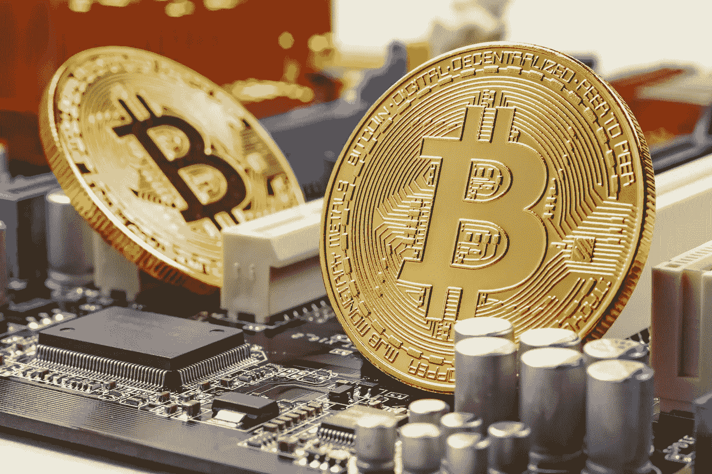
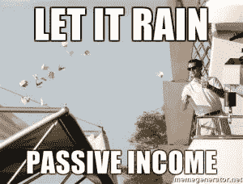
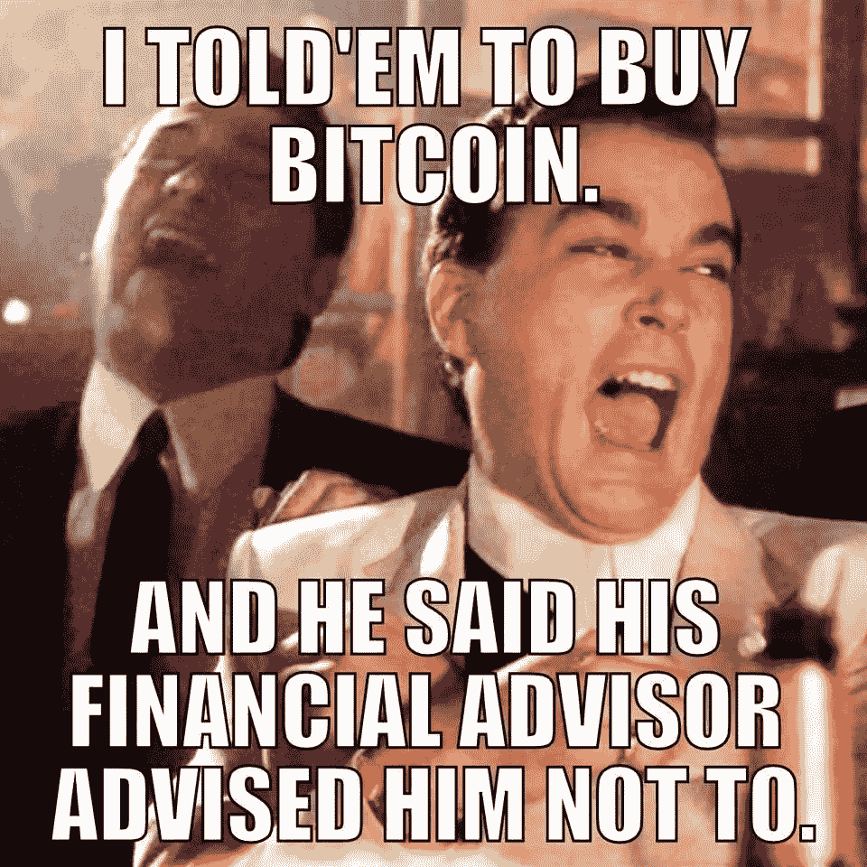

# 加密的被动收入

> 原文：<https://medium.datadriveninvestor.com/passive-income-with-crypto-89a212c2b306?source=collection_archive---------2----------------------->

subscribe-[iTunes](https://itunes.apple.com/us/podcast/bit-better-have-my-money/id1374764732)[Google Play](https://playmusic.app.goo.gl/?ibi=com.google.PlayMusic&isi=691797987&ius=googleplaymusic&apn=com.google.android.music&link=https://play.google.com/music/m/Ikoddu7nd3g5ijjnhnedvdpgzo4?t%3DBit_Better_Have_My_Money!%26pcampaignid%3DMKT-na-all-co-pr-mu-pod-16)[Stitcher](http://www.stitcher.com/s?fid=183129&refid=stpr)[iHeartRadio](https://www.iheart.com/podcast/269-Bit-Better-Have-My-29238100)

我喜欢赚钱。当我什么都不用做的时候，我更喜欢这样做。

这就是我喜欢被动收入的原因。

有办法从主节点，赌注硬币和股息的加密被动收入。

如果你不知道这些是什么，我接下来会解释。如果你这样做了，去底部看看我喜欢的被动收入硬币清单。

**主节点**是当你购买一定数量的硬币并为它们运行一个节点。你会因为运行节点而得到报酬。运行一个主节点，每个硬币都有不同的投资回报率。例如，你必须有 1000 zcoin 来运行一个节点，现在的投资回报率是 30%。

赌一枚硬币就是你把硬币放进他们的钱包里，然后赌上一把。他们中的一些允许你选择一个时间框架来下注，你会得到预定的回报。在另一些游戏中，你下注的硬币越多，你的钱包解决下一个问题为你赢得更多硬币的机会就越大。

红利是你把硬币放进他们的钱包里。然后根据你拥有的代币数量给你分红。这使得人们不想交易他们，希望导致稳定和价格上涨。

**所以我喜欢什么币被动收益。这个列表并不是从最好到最差。**

*   到目前为止，Zcoin 是我最喜欢的。我在一个节点上合作，已经看到了不错的回报。我们在价格为 30 美元时买入，现在涨到了 150 美元。如果我们不经营 node，我们早就卖出去了。这是硬币像这样有被动收入的一个原因。它导致人们不卖而继续持有。
*   NEO。抱着尼奥可以产生气体(这个名字让我发笑)。天然气本身就是一种货币，所以你可以交易它。现在交易所允许你通过在交易所持有 NEO 来产生气体。
*   **果柄。我没有任何 Phore，但在 zcoin 节点上和我合作的那个家伙有。它一直在外面表演 zcoin 节点。**
*   **库币股份。**你可以从库币交易所买到这个。然后，持有人每天将获得 KuCoin 交易费收入的 50%。金额可能很小，但可以累加。
*   **维查因托尔。要赢得雷神，你可以把你的兽医押在钱包里，或者经营一个 Masternode。**
*   **恒星流明。**我喜欢这枚硬币的功能。我认为从长远来看，这可能是一个伟大的硬币，这就是为什么我把它添加到列表中。对大多数人来说，利用它来获得被动收入可能不是一个选择。原因是你需要投票的最低金额是现有所有流明的 0.05%。这将使许多人不得不加入一个池，以接收支付。有些泳池你必须支付一定的费用才能参加，有些则不需要。
*   **图标。**您投下您的代表票，然后通过代表获得一笔支出，作为为他们投票的奖励。

还有许多其他硬币，让你获得被动收入。我鼓励你去看看，看看你投资的硬币有没有东西。

根据硬币的不同，主节点的费用可能会很高。你可以利用自己的资金买入某个节点的股票。只要做你的研究，以确保它是合法的。

https://masternodes.online/是一个查找信息的好地方。

为了结束这一切……

