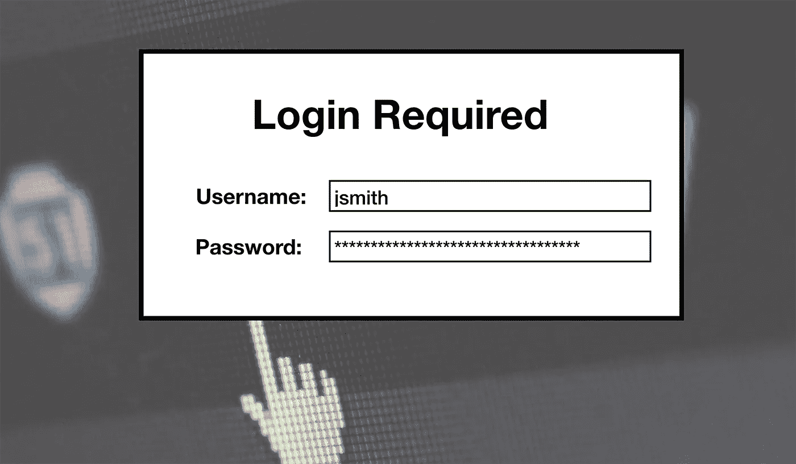

# 密码安全及对认证方法的思考

> 原文：<https://medium.datadriveninvestor.com/password-security-and-thoughts-on-authentication-methods-c5ff45864e78?source=collection_archive---------3----------------------->



我们使用密码来访问个人信息和用户帐户。由于有如此多的应用程序需要密码(例如网上银行、购物和社交媒体，仅举几例)，很难跟踪密码，最糟糕的情况是很难记住。一些应用程序要求用户经常更改他们的密码，这可能会导致用户忘记密码或不小心将密码写在一张纸上。那张纸以后可能会被放错地方，从而导致更糟糕的事情。要求频繁更改密码和对密码应用复杂性的问题是，这对用户来说会变得更加复杂。

密码由一串字符组成，可以包括字母、数字和特殊字符。

[](https://www.datadriveninvestor.com/2019/02/22/cybersecurity-non-profit-to-help-smes-fight-against-cybercrime/) [## 网络安全非营利组织帮助中小企业打击网络犯罪|数据驱动的投资者

### 一个名为全球网络联盟(GCA)的非营利组织发誓要改善…

www.datadriveninvestor.com](https://www.datadriveninvestor.com/2019/02/22/cybersecurity-non-profit-to-help-smes-fight-against-cybercrime/) 

下面的分析分解了有效密码的数据结构。

1.  欧洲语言的大写字母(通过，带有音调符号，希腊和西里尔字符)
2.  欧洲语言的小写字母(直通，尖 s，带音调符号，希腊和西里尔字符)
3.  非字母数字字符(特殊字符):()。对于此策略设置，欧元或英镑的货币符号不被视为特殊字符。
4.  任何 Unicode 字符都被归类为字母字符，但不是大写或小写。这包括亚洲语言(中文、日文、韩文等)中的 Unicode 字符。).

到目前为止，这是对什么可以用作密码的理解。例如，名为**‘jsmith**’的用户可以创建一个密码**‘one 4 all&all for 1’**。

## 到处都是密码

在互联的网络世界里，密码是为了安全。互联网使人们可以相互联系，进行交流、交易和共享信息，但不幸的是，互联网没有内置的安全层。

这需要第三方实现，在第三方实现中，没有统一的方法可以从一个位置登录并访问任何网站而无需输入另一个密码。这在谷歌或微软等特定公司的生态系统中是可能的，但当你想访问另一家公司的服务时，没有允许访问的互操作性或安全信息共享。

尽管有一些方法允许像 Oauth 协议这样的访问授权标准，但仍然没有“一次登录，永远访问一切”的通用系统。

作为用户，您可能有多个在线帐户。一个或多个用于银行、社交媒体、支付、电子邮件和团队协作。您可能对每一个都有不同的密码，这是推荐的。其他人对他们所有的在线账户只使用一个密码。

但是他们都有一个问题。当你需要记住这么多密码时，除非你写下来或者使用密码管理器，否则很容易忘记。不幸的是，并不是每个人都使用密码管理器，所以他们可能经常需要从网站上找回他们的密码。当你对所有账户只使用一个密码时，如果这个密码被破解了，那么它就可以访问你所有的在线信息。

## **加密频道和哈希**

IT 部门的安全分析师意识到明文密码并不安全。还需要更安全地存储密码，以防止篡改。在数据网络的早期，密码在传输过程中也不安全。这将允许黑客轻松使用所谓的*数据包嗅探器*来分析包含明文密码的数据包。这是一个需要解决的关键问题。

解决方案是使用加密和散列的加密方法。用户和服务器之间的通信信道将使用 HTTPS/TLS/SSL 协议进行加密，以实现安全通信。

这将使黑客更难通过网络窃听数据，因为现在数据将被加密。密码也不会以明文形式出现。现在，它经过哈希函数来创建原始密码的摘要。

这只是一个单向函数，所以黑客很难破解密码。这将需要代价高昂的字典攻击，但哈希值本身可能需要数年时间来破解被哈希的原始密码。

例如，如果我们使用示例密码“One4all&AllFOR1”并应用 SHA256 哈希函数，结果将是:

**27 ace 4452635 B4 afda 20 E3 a 89255832 cf 8 a 247 db 46 ea 72 a 24 B1 edcb 0 BD 8d 3 e 9d**

然后，它被存储在一个密码表中，不再是明文格式。如果黑客获得了密码表，他们就不容易破解密码。

这些措施增加了系统的安全性。然而，它仍然不能阻止对系统的攻击。原因与密码有关。

## 暴力攻击

尽管密码提供了一层安全保护，但并不能防止黑客入侵。它只需要一个人进行智能猜测就可以访问用户的个人电子邮件帐户。

该界面是公开的，任何人都可以登录，用户名和密码。这使得任何想要轻易入侵的人都可以使用一种叫做“暴力攻击”的技术猜出用户的密码，只要知道用户名。

这也被称为“字典攻击”，因为攻击者可以像在字典中查找单词一样使用密码列表。这是安全系统不太成熟时最早的攻击形式之一。为了防止这种情况，系统管理员针对一定数量的失败登录尝试实施了用户帐户锁定。

这防止了暴力的使用，但也影响了实际的用户，因为现在他们的帐户被锁定。这很不方便，因为需要联系系统管理员来解锁他们的帐户。

如果系统管理员不在，或者是在没有人值班的午夜，该怎么办？这会阻止用户登录并开始重要的工作。

IT 经理对这些问题的反应越来越积极。现在已经有了解决这些问题的安全合规性策略。应该始终有一名备份管理员值班，特别是对于全天候运行的企业运营。

通过这种设置，员工将始终获得重置密码或解锁帐户的技术支持。正如安全系统变得越来越先进以应对新的威胁一样，攻击类型也变得越来越复杂以挫败这些措施。密码需要变得更加复杂，不容易被猜到。这导致 IT 经理实施了密码策略。

## **密码复杂性**

现在，对于具有公共界面的站点和任何使用登录屏幕的应用程序的最佳实践来说，密码复杂性的实现变得很有必要。以前很多用户一时大意，把“password”当成了自己的密码。

这当然给许多黑客带来了天赋，甚至提高了想要成为黑客的人的自尊心，因为这很容易做到。这是一个简单的攻击，不需要破解一个真正困难的密码，这需要时间来完成。

系统管理员将这些策略作为操作系统自身功能(例如 Windows Server)的一部分来实施，开发人员也为他们的应用程序使用了类似的设计。由于密码的复杂性，用户将无法使用以下类型的密码:

*   名或姓
*   '密码'
*   以前的密码
*   仅所有数字或字符
*   全部小写或大写
*   常用词

密码复杂性的使用防止用户使用类似

或者

复杂性规则因公司而异，但这个示例可以展示如何定义一个策略。

*   8 个字符(至少)
*   大写和小写的混合
*   字母数字和非字母数字字符的混合

当管理员要求将更改密码作为一种策略强制措施时，情况变得更加复杂。也就是说，假设 3 个月后密码过期。这将要求用户创建一个新的登录密码，这可能会很忙乱，甚至是徒劳的，因为用户需要记住一个新密码(不允许重复旧密码)。

它没有成为解决方案的一部分，而是产生了一些新的问题。许多公司不使用这种类型的强制措施，但也有其他公司使用。

使用复杂性的密码策略很好，因为它们可以强制用户使用强密码而不是弱密码。即使有密码复杂性，它仍然不能使系统完全安全。它只是增加了另一层。

用户可以共享密码，甚至写下密码，以备日后被盗。侥幸的猜测仍然可以让黑客进入。问题似乎仍然是密码本身。

## **更强的密码**

据[微软 Technet 博客文章](https://blogs.technet.microsoft.com/msftcam/2015/05/19/password-complexity-versus-password-entropy/)称，有一种方法可以通过分析密码的熵或者破解密码的难度来增强密码。这个难度取决于密码长度的位数。

它可以用这个公式表示:

```
**log(C) / log(2) * L**
```

C =字符集的大小
L =密码的长度

公式陈述了这些观察结果(摘自博客):

1.从数学上讲，密码的长度比所用字符集的复杂性重要得多。
2。任何复杂性规则，包括定义所需数量的数字、字母、特殊字符等。，实际上增加了密码被破解的能力。

字符集是指可用于密码的字符总数。在美国，以下是可以使用的字母数字和非字母数字字符的全部可能类型:

-编号: **0 — 9**

-上层阿尔法: **A — Z**

-低级阿尔法: **a — z**

-特殊字符: **` ~！@ # $ % ^&*()_+—= { } |[]\:"；< >？, ./**

我们有 10 个数字字符，26 个大写和小写字母，32 个特殊字符。我们加起来有 10 + 26 + 26 + 32 = 94 个字符。因此，根据观察 1，密码长度比使用的字符集更难破解。

更强密码的关键是长度和复杂性的结合。密码仍然可以被破解，即使需要几天、几周或几个月，但这层安全措施给黑客增加了更多的时间。最终，安全专家也需要想出更智能的认证方法。

## **更智能的认证方法**

认证方法正在实施更好的安全技术来挫败黑客。通过结合不同的方法，它的目的是使系统更加安全，抵御攻击。除了要求用户输入密码之外，还会要求用户提供其他信息。

这导致了用于增加安全性的“多因素认证”(MFA)或双因素认证(2FA)的发展。这使得只有用户才拥有的附加信息(如他们的智能手机号码)能够用于身份验证。对于 MFA，它还包括使用生物信息，如指纹或视网膜扫描。

所有这些都增加了安全性，但如果密码丢失或忘记了，这些都于事无补。人们仍然需要记住密码来完成认证。

对于 MFA，有三种用于身份验证的方法。

1.**你所知道的** —这是你的密码。验证用户身份的第一层安全措施。

2.**你拥有的** —你的智能手机或电脑。使用智能手机号码，系统可以通过短信发回一个代码，供用户输入。在计算机上，可以创建安全令牌，该令牌使用生成用户可以输入的代码的认证器提供者(例如，Google 认证器)。

3.**你是谁** —用户的生物特征信息，如指纹、面部识别或视网膜扫描。如果有一个传感器可以获得关于用户的信息，则可以使用第三种方法。这是在智能手机指纹识别器上实现的(例如 Apple Pay 触控 ID)。

即使密码被猜到，使用不同的认证方法也可以挫败黑客。然后，黑客将不得不物理访问用户的智能手机或计算机，或者拥有实际用户的手指。

这仍然不是安全的顶峰。另一种方法可用于验证用户的真实身份。

## **区块链**

对于身份验证，即防篡改和安全，区块链可以结合 2FA 或 MFA 提供另一层安全保护。这是一个有争议的话题，因为区块链技术仍然是相当新的，并没有像其他系统一样有这么多的跟踪记录。

它的优势在于能够使用所谓的 Merkle Proofs 快速验证数据。这是一个不可否认的已验证信息的记录，它基于具有可追踪根的散列值。

这种系统的优点是身份验证。假设用户“jsmith”自称是“John Smith”。一个位于区块链的系统在数字账本上创建了一个加密的安全记录，可以证明这一点。

记录也是透明的，不能修改或删除。当作为验证系统的一部分实施时，可以使用共识机制来完成。例如，假设用户已经通过了 2FA，区块链现在验证用户的身份。

网络上的节点将基于比如说用户的面部或指纹来验证这些信息是否被正确输入。如果用户的信息与系统知道的不匹配，那么访问将被拒绝。

如果黑客通过了 MFA，区块链可以阻止他们的访问，因为身份需要验证。在区块链的情况下，您拥有执行验证的独立节点。

让独立节点执行验证的好处是，它不是在一个实体之下，可以被影响。这意味着在一个没有人做出绝对决定的不信任的环境中去中心化。这必须是一种集体努力，才能在大多数节点之间达成共识。

这样是否值得信赖，是否有效？这不容易用几句话来解释，但这里的想法是建立一个验证系统，作为身份验证的最后手段。这个话题我就不多说了，因为这都是理论上的，不是应用上的。

## 最后的想法

技术在发展，当需要使用不需要密码的不同认证方法时，我们仍然需要它们。密码最重要的一点是要保持复杂和长。

现在的汉字太简单了，因为黑客在学习新技术的同时，他们的方法变得更加复杂。下一次 IT 经理考虑安全性时，添加像 MFA 这样的附加层对于保护他们的用户是很有意义的。就目前而言，只要有系统需要，就将继续使用密码。

*原载于 2019 年 10 月 27 日*[*【https://hackernoon.com】*](https://hackernoon.com/password-security-and-thoughts-on-authentication-methods-dw6u3tuh)*。*