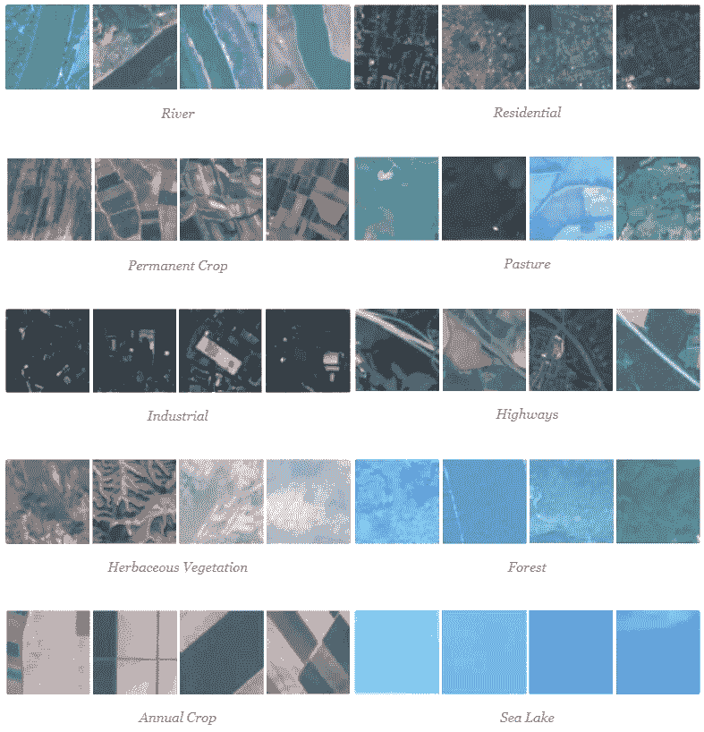
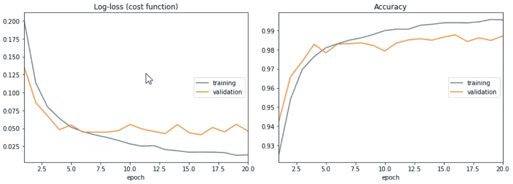
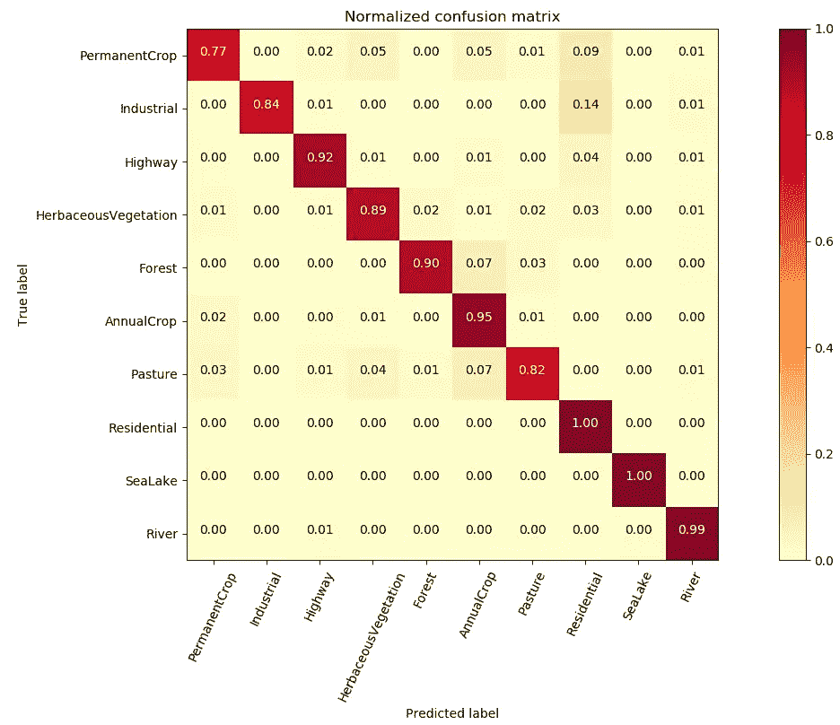
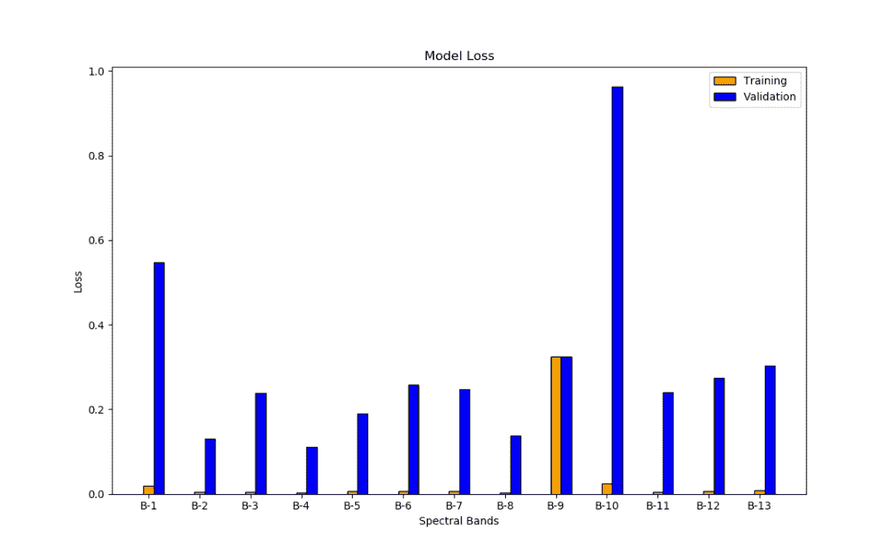
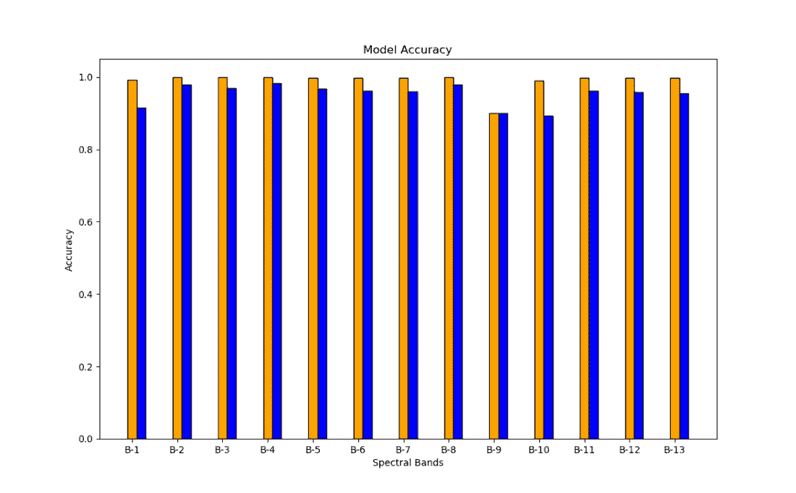

# 使用深度学习的卫星影像分类

> 原文：<https://medium.datadriveninvestor.com/patch-based-cover-type-classification-using-satellite-imagery-a67edeae7e24?source=collection_archive---------0----------------------->

[](http://www.track.datadriveninvestor.com/1B9E)

从卫星/航空图像中分类和提取覆盖类型在许多不同的领域都有有用的应用，包括国防、测绘、农业、监测自然灾害造成的损害等。然而，分析卫星影像可能是一项非常艰巨的任务，尤其是多光谱/超光谱影像。典型的机器学习方法需要从图像中预先选择特征，然后使用分类器来检测图像中不同的封面类型。

然而，对于任何分类问题，检测好的特征/属性可能是困难的。卷积神经网络(CNN)通过将特征提取和分类合并到单个框架中来规避先验特征选择的问题。这使得 CNN 非常有吸引力，因为特征选择被委托给网络，该网络最优地挑选出与分类任务最相关的特征。

[](https://www.datadriveninvestor.com/2019/01/23/deep-learning-explained-in-7-steps/) [## 深度学习用 7 个步骤解释-更新|数据驱动的投资者

### 在深度学习的帮助下，自动驾驶汽车、Alexa、医学成像-小工具正在我们周围变得超级智能…

www.datadriveninvestor.com](https://www.datadriveninvestor.com/2019/01/23/deep-learning-explained-in-7-steps/) 

Framework of a Convolutional Neural Network (Illustration by Mathworks)

作为研究合作的一部分，我最近检查了一些卫星图像，对不同的覆盖类型进行了基于补丁的分类。出于这个目的，我很幸运地获得了一个精心标记的哨兵-2 [数据集](http://madm.dfki.de/downloads)。数据集包含 27，000 幅 64×64 的图像，13 个光谱带，分为 10 个通用土地覆盖类型(公路、工业、住宅、牧场、森林、草本植被、海湖、河流、永久作物和一年生作物)。你可以在这里找到 Sentinel-2 传感器规格。



# **分类模型**

为了对不同的土地覆盖类型进行基于斑块的分类，我构建了一个卷积神经网络，该网络接收 64x64x13 的图像并输出不同类别分配的概率。CNN 由 11 个隐藏层组成，6 个卷积层和 3 个最大池层用于特征提取。卷积层之后是用于分类的全连接层和用于调整过拟合的丢弃层(你可以在这里阅读更多关于丢弃和其他正则化技术[)。](https://towardsdatascience.com/deep-learning-3-more-on-cnns-handling-overfitting-2bd5d99abe5d)

```
from tensorflow.keras.models import Sequential 
from tensorflow.keras.backend import set_image_data_format 
from tensorflow.keras.layers import Conv2D, MaxPool2D, BatchNormalization 
from tensorflow.keras.layers import Activation, Dropout, Flatten, Dense 
from tensorflow.keras import optimizers, losses, utils 
from livelossplot import keras_plot set_image_data_format(‘channels_first’) model = Sequential() model.add(Conv2D(28, (3, 3), padding=’same’,input_shape=(13, 64, 64))) 
model.add(Activation(‘relu’)) 
model.add(Conv2D(28, (3, 3), padding=’same’)) 
model.add(Activation(‘relu’)) 
model.add(MaxPool2D(2,2)) 
model.add(Conv2D(56, (3, 3),padding=’same’)) 
model.add(Activation(‘relu’)) 
model.add(Conv2D(56, (3, 3), padding=’same’)) 
model.add(Activation(‘relu’)) 
model.add(MaxPool2D(2,2)) 
model.add(Conv2D(112, (3, 3), padding=’same’)) 
model.add(Activation(‘relu’)) 
model.add(Conv2D(112, (3, 3), padding=’same’)) 
model.add(Activation(‘relu’)) 
model.add(MaxPool2D(2,2)) 
model.add(Flatten()) 
model.add(Dense(784)) 
model.add(Activation(‘relu’)) 
model.add(Dropout(0.6)) 
model.add(Dense(10)) model.add(Activation(‘sigmoid’)) 
adam = optimizers.Adam(lr=0.001) model.compile(optimizer=adam, loss=losses.binary_crossentropy, metrics=[‘accuracy’])
```

对于卷积层，我使用 ReLU 激活函数来加速训练(因为 ReLU 的梯度在反向传播过程中很容易快速计算)。在完全连接的输出层中，我使用 sigmoid 激活函数来缩放值，以表示类概率(我还对类标签进行了热编码)。我的网络的输出层包含 10 个神经元，其中每个神经元代表输入图像的类别分配的概率。

由于大量的光谱带，我不得不保持批量较小，因为我会经常耗尽内存。我最终不得不确定一批 50 张图片。数据集被 4:1 分割，分别用于训练和验证。我能够获得 99.7%和 98.4%的最终训练和验证准确率，训练和验证损失分别为 0.007 和 0.06。由于我能够在仅仅 20 个时期内获得相对较高的准确度，我觉得没有必要进一步训练网络。您可以在下图中看到结果。



Accuracy and Log-Loss

为了进一步了解网络的预测准确性，我计算了验证数据集的混淆矩阵。我发现牧场、永久作物和工业覆盖类型的分类误差相对较高。永久作物大多被错误地归类为住宅，一年生作物和草本植被。另一方面，牧场也被错误地归类为一年生作物和草本植被。这对我来说并不奇怪，因为大多数这些覆盖类型都有一些光谱重叠。在永久作物和住宅的情况下，我发现住宅的某些图像具有主要在永久作物中发现的显著的植被存在(因此永久作物的大多数假阴性是住宅覆盖类型的图像)。与工业类相似，大多数错误识别的图像属于住宅类，这是由于这两类之间的光谱相似性。



Confusion matrix for validation dataset

# **边缘数据集上的分类**

我还在边缘数据集(即每个单独的波段)上训练了相同的网络。初始训练表明，该模型在训练数据集上过度拟合，因此我在每个卷积层后添加了批量归一化层。获得的结果明显更好，因为模型能够概括得更多。因为我使用的是精简的数据集，所以我能够以更大的批量运行程序。我通过批量标准化获得了相同的上述网络的以下结果。



*Model loss for individual bands of Sentinel-2 dataset (Epochs: 100, Batch Size: 500)*

与在所有 13 个波段上训练的网络的确认损失相比，确认损失明显更糟(如预期的)。对于波段 1、9 和 10，验证损失特别高。经过仔细观察，我发现空间分辨率和精确度之间存在正相关关系。具有较低空间分辨率的通道显示出较差的精度度量(对于波段 1、9 和 10 尤其如此，因为它们具有比其他光谱通道低得多的空间分辨率)。我认为较低的分辨率对模型区分类别的能力有负面影响。



*Model accuracy for individual bands of Sentinel-2 dataset (Epochs: 100, Batch Size: 500)*

另一方面，模型精度表明边缘数据集的精度相对较高。虽然起初令人惊讶，但该模型能够用单个通道准确地分类这些通用类是有意义的。我认为，如果我们将这些类别进一步细分为更多的类别，我们将能够看到多光谱和单通道数据的准确性度量存在很大差异。

我在这里链接了介绍数据集[的原论文。作者使用 GoogLeNet 和 ResNet-50 进行训练，并与现有的卫星数据集进行了比较。他们还谈到了一些很酷的映射和变化检测应用程序，您可以进一步阅读。](https://arxiv.org/abs/1709.00029)